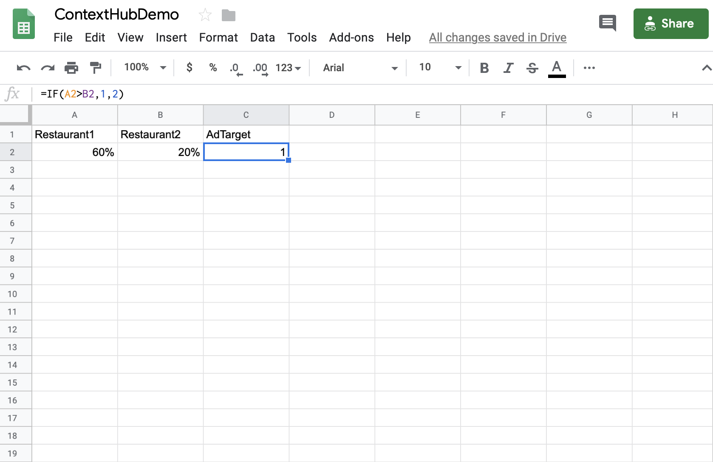
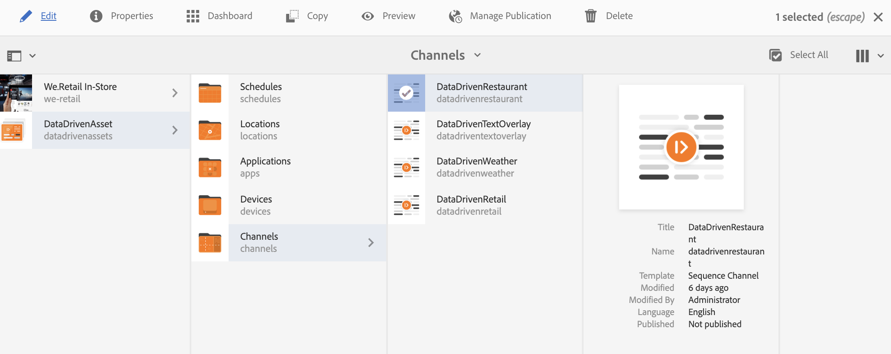
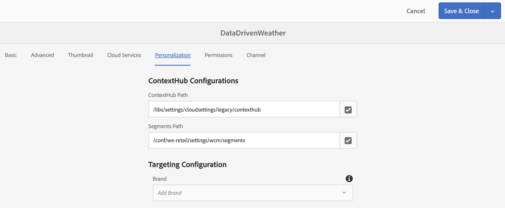
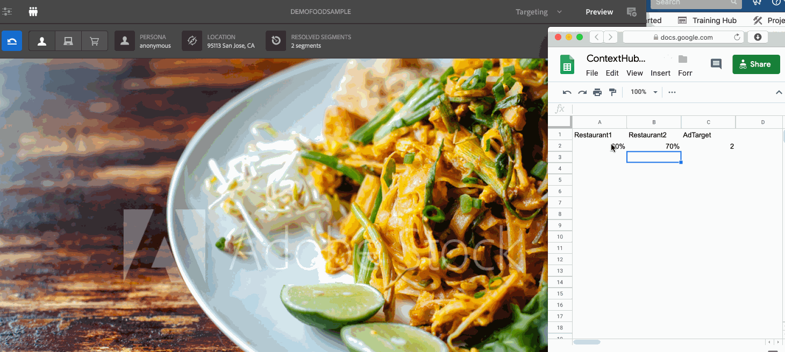

# 接客業向け予約状況に応じたアクティベーション {#hospitality-reservation-activation}

>[!IMPORTANT]
>このコンテンツは、AEM オンプレミス/AMS （AEM 6.5LTSおよびAEM 6.5）に対して有効です。 AEM as a Cloud Service Screensの内容については、[AEM as a Cloud Service ガイド &#x200B;](https://experienceleague.adobe.com/ja/docs/experience-manager-cloud-service/content/screens-as-cloud-service/overview/introduction)を参照してください。

以下の使用例では、Google シートに入力された値に基づく、接客業向けの予約状況に応じたアクティベーションを示しています。

## 説明 {#description}

この使用例では、**`Restaurant1`** および **`Restaurant2`** という 2 つのレストランの予約率が Google シートに入力されています。 `Restaurant1` と `Restaurant2` の値に基づいて数式が適用され、その数式に基づいて、値 1 または値 2 が **AdTarget** 列に割り当てられます。

**`Restaurant1`** の値が **`Restaurant2`** の値より大きい場合は、**AdTaget** に値 **1** が割り当てられ、それ以外の場合は、**AdTarget** に値 **2** が割り当てられます。 値 1 の場合はディスプレイの画面に&#x200B;*ステーキ料理*&#x200B;のオプション、値 2 の場合は&#x200B;*タイ料理*&#x200B;のオプションが表示されます。

## 前提条件 {#preconditions}

予約状況に応じたアクティベーションの実装を開始する前に、AEM Screens プロジェクトで&#x200B;***データストア***、***オーディエンスのセグメント化***、***チャネルのターゲティングの有効化***&#x200B;をセットアップする方法を把握します。

詳しくは、[AEM Screens での ContextHub の設定](configuring-context-hub.md)を参照してください。

## 基本フロー {#basic-flow}

AEM Screens プロジェクトに「接客業向けの予約状況に応じたアクティベーション」の使用例を実装するには、以下の手順に従います。

1. **Google シートにデータを入力し数式を追加する**

   例えば、3 列目の **AdTarget** に数式を適用します（下図を参照）。

   

1. **要件に従ってオーディエンスのセグメントを設定する**

   1. オーディエンスのセグメントに移動します（詳しくは、**[AEM Screens での ContextHub の設定](configuring-context-hub.md)**&#x200B;ページの&#x200B;***手順 2：オーディエンスのセグメント化のセットアップ***&#x200B;を参照してください）。
   1. 「**Sheets A1 1**」をクリックし、「**編集**」をクリックします。
   1. 比較プロパティをクリックし、**設定** アイコンをクリックします。
   1. **プロパティ名**&#x200B;のドロップダウンから「**googlesheets/value/1/2**」をクリックします。
   1. 「**演算子**」のドロップダウンメニューから「**次と等しい**」を選択します。
   1. 「**値**」に「**1**」を入力します。
   1. 同様に、「**Sheets A1 2**」をクリックし、「**編集**」をクリックします。
   1. 比較プロパティをクリックし、**設定** アイコンをクリックします。
   1. **プロパティ名**&#x200B;のドロップダウンから「**googlesheets/value/1/2**」をクリックします。
   1. 「**演算子**」として「**2**」を選択します。

1. チャネル（）に移動してクリックし、アクションバーの「**編集**」をクリックします。 次の例では、**DataDrivenRestaurant** というシーケンスチャネルを使用して機能を紹介しています。

   >[!NOTE]
   >
   >チャネルには既にデフォルトの画像が存在し、[AEM Screens プロジェクトでの ContextHub の設定](configuring-context-hub.md)で説明しているとおりにオーディエンスが事前設定されています。

   

   >[!CAUTION]
   >
   >この時点で、チャネルの&#x200B;**プロパティ**／**パーソナライゼーション**&#x200B;タブを使用した **ContextHub** **設定**&#x200B;が既に設定されているはずです。

   

1. エディターから「**ターゲティング**」をクリックし、「**ブランド**」をクリックしてドロップダウンメニューから「**アクティビティ**」をクリックします。次に、「**ターゲティングを開始**」をクリックします。
1. **プレビューを確認する**

   1. 「**プレビュー」をクリックします。** また、Google シートを開き、その値を更新します。
   1. **`Restaurant1`** 列と **`Restaurant2`** 列の値を更新します。 **`Restaurant1`** の値が **`Restaurant2`の値より大きい場合は、**&#x200B;スクリーンに&#x200B;*ステーキ*&#x200B;料理の画像が表示され、それ以外の場合は、*タイ料理*&#x200B;の画像が表示されます。

   

