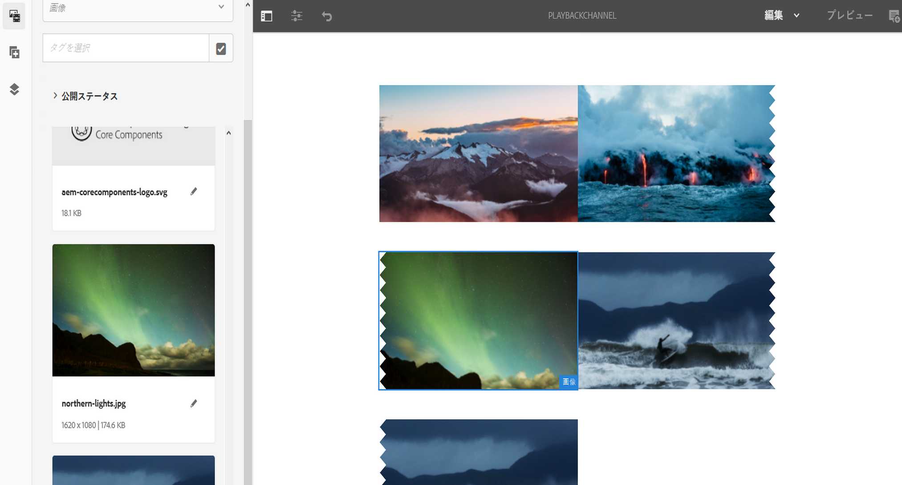

# 画像再生時間 {#image-playback-duration}

## 概要 {#overview}

シーケンスチャネルを作成し、そこに画像を追加すると、デフォルトでは、すべての画像はチャネルレベル設定で定義された再生時間を前提とします。個々の画像ではデフォルトを上書きでき、異なる再生時間を設定できます。この機能は、特定の画像コンポーネントの再生時間を編集することで実現されます。

### 前提条件 {#prerequisites}

この機能を実装する前に、この機能の実装を始める前提条件として、プロジェクトをセットアップしておく必要があります。次に例を示します。

1. AEM Screens プロジェクト（この例では **ChannelLevelPlayback**）を作成する
1. **Channels** フォルダーの下に **PlaybackChannel** というシーケンスチャネルを作成する
1. **PlaybackChannel** にコンテンツを追加する

## チャネルレベル画像再生時間の割り当ての編集 {#editing-channel-level-image-playback-duration-assignment}

以下の節では、AEM Screens チャネルのコンテンツの再生時間を編集する方法について説明します。

### チャネル内の画像の再生時間を更新する方法 {#updating-the-playback-duration-for-images-in-a-channel}

チャネルレベルの画像再生時間の割り当てを更新するには、以下の手順に従います。

1. シーケンスチャネル **PlaybackChannel** に移動します。

   

1. アクションバーの「**編集**」をクリックします。

   

1. チャネルエディターで画像を 2 つ以上追加します（次の図を参照）。

   

1. チャネル内のすべての画像をクリックし、左上のレンチアイコンをクリックします（下図を参照）。チャネルレベル設定ダイアログボックスが開きます。

   

1. **ページ**&#x200B;ダイアログボックスが開きます。

   >[!NOTE]
   >
   >デフォルトでは、チャネル内の画像は再生時間が 8 秒に設定されています。

   

   「**デュレーション**」を 8000 （ミリ秒）から 3000 （ミリ秒）、すなわち 3 秒へと編集します。**ページ**&#x200B;ダイアログボックスの右上にあるチェックマークをクリックすると、変更を保存できます。

   

### 結果の表示 {#viewing-the-result}

チャネルの再生時間（この例では 3 つの画像すべて）を更新すると、画像が 8 秒間（デフォルト値）ではなく 3 秒間再生されるようになります。

