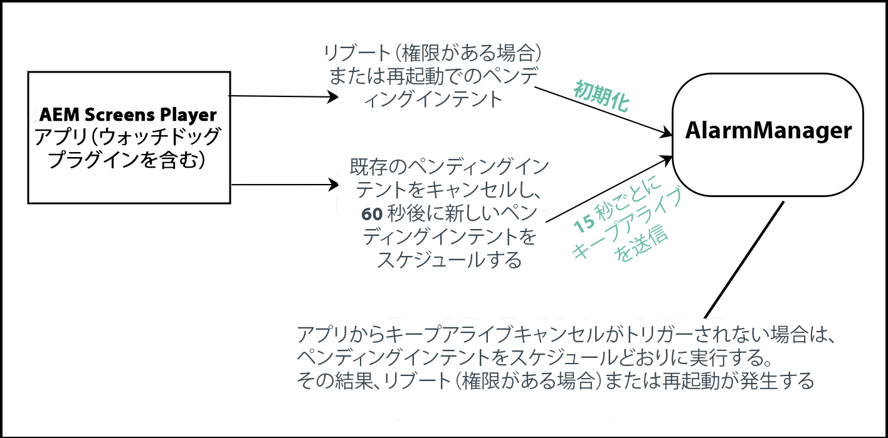

# Android プレーヤーの実装 {#implementing-android-player}

ここでは、Android プレーヤーの設定について説明します。使用可能な設定ファイルやオプションと、開発およびテストに使用する推奨設定について説明します。

さらに、プレーヤーをクラッシュから回復させるソリューションとして、**ウォッチドッグ**&#x200B;があります。アプリケーションは、ウォッチドッグサービスに登録し、アプリケーション自体がアライブであることを知らせるメッセージを定期的に送信する必要があります。ウォッチドッグサービスに、所定の時間内にキープアライブメッセージが届かないと、ウォッチドッグサービスは、デバイスをリブートしてクリーンリカバリを試みるか（ウォッチドッグサービスが十分な権限が持つ場合）、アプリケーションの再起動を試みます。

## Android プレーヤーのインストール {#installing-android-player}

AEM Screens 用の Android プレーヤーを実装するには、同プレーヤーをインストールしてください。

[**AEM 6.5 Player のダウンロード**](https://download.macromedia.com/screens/)ページにアクセスします。

### AEM Screens6.5.5 Service Pack の環境の設定 {#fp-environment-setup}

>[!NOTE]
>AEM Screens 6.5.5 Service Pack を使用している場合は、Android プレーヤー用の環境を設定する必要があります。

AEM オーサーおよびパブリッシュインスタンスの **Adobe Experience Manager Web コンソール設定**&#x200B;で、**login-token cookies の SameSite 属性**&#x200B;を **Lax** から **None** に設定します。

その場合は、次の手順に従います。

1. **を使用して、** Adobe Experience Manager Web コンソールの設定`http://localhost:4502/system/console/configMgr`に移動します。

1. *Adobe Granite トークン認証ハンドラー*&#x200B;を検索します。

1. **login-token cookie の SameSite 属性**&#x200B;を **Lax** から **None** に設定します。
   

1. 「**保存**」をクリックします。


### アドホック方式 {#ad-hoc-method}

アドホック方式を使用すると、最新の Android プレーヤー（**.exe）をインストールできます。[**AEM 6.5 Player のダウンロード**](https://download.macromedia.com/screens/)ページにアクセスします。

アプリケーションをダウンロードしたら、以下の手順に従ってプレーヤーのアドホックインストールを完了します。

1. 左上隅を長押しして、管理パネルを開きます。
1. 左のアクションメニューから「**設定**」に移動し、接続する AEM インスタンスの場所（アドレス）を入力して、「**保存**」をクリックします。

1. 左側のアクションメニューから「**デバイス**&#x200B;の&#x200B;**登録**」リンクに移動して、デバイス登録プロセスのステータスを確認します。

>[!NOTE]
>
>「**状態**」が「**登録済み**」の場合は、「**デバイス ID**」フィールドに値が入力されます。
>
>「**状態**」が「**未登録**」の場合は、**トークン**&#x200B;を使用してデバイスを登録できます。

## Android ウォッチドッグを実装する {#implementing-android-watchdog}

Android のアーキテクチャ上、デバイスをリブートするには、アプリケーションがシステム権限を持っている必要があります。そのためには、製造元の署名キーを使用して apk に署名する必要があります。この署名をおこなわないと、ウォッチドッグはデバイスをリブートするのではなく、プレーヤーアプリケーションを再起動します。

### 製造元のキーを使用した Android apk への署名  {#signage-of-android-apks-using-manufacturer-keys}

*PowerManager* や *HDMIControlServices* など、Android の特権付き API にアクセスするには、製造元のキーを使用して Android apk に署名する必要があります。

>[!CAUTION]
>
>前提条件：
>
>以下の手順を実行する前に、Android SDK をインストールしてください。

次の手順に従って、製造元のキーを使用して Android apk に署名します。

1. Google Play または [AEM Screens Player のダウンロード](https://download.macromedia.com/screens/)ページから apk をダウンロードします。
1. 製造元のプラットフォームキーを入手して、*pk8* ファイルと *pem* ファイルを取得します。

1. find ~/Library/Android/sdk/build-tools -name &quot;apksigner&quot; を使用して、Android SDK の apksigner ツールを見つけます。
1. &lt;pathto> /apksigner sign --key platform.pk8 --cert platform.x509.pem aemscreensplayer.apk
1. Android SDK の zip align ツールへのパスを見つけます。
1. &lt;pathto> /zipalign -fv 4 aemscreensplayer.apk aemscreensaligned.apk
1. adb install を使用して、デバイスに ***aemscreensaligned.apk*** をインストールします。

## Android ウォッチドッグの実装 {#android-watchdog-implementation}

Android ウォッチドッグサービスは、*AlarmManager* を使用した cordova プラグインとして実装されます。

次の図に、ウォッチドッグサービスの実装を示します。



**1.初期化**：cordova プラグインの初期化時、システム権限を持っているかどうか、さらに、リブート権限を持っているかどうかの確認がおこなわれます。これらの 2 つの条件を満たしている場合は、リブートのペンディングインテントが作成され、条件を満たしていない場合は、（Launch Activity に基づいて）アプリケーションを再起動するためのペンディングインテントが作成されます。

**2.キープアライブタイマー**：15 秒おきにイベントをトリガーするためにキープアライブタイマーが使用されます。このイベントの間に、（アプリケーションをリブートまたは再起動する）既存のペンディングインテントをキャンセルし、次の 60 秒の間に新しいペンディングインテントを登録する（最終的にリブートを延期する）必要があります。

>[!NOTE]
>
>Android では、*AlarmManager* は、アプリケーションがクラッシュして、そのアラーム配信が API 19（Kitkat）から正確におこなわれなくても実行可能な *pendingIntents* を登録するために使用されます。タイマーの間隔と *AlarmManager* の *pendingIntents* のアラームとの間にいくらかの時間を設けるようにしてください。

**3.アプリケーションのクラッシュ**：クラッシュした場合、AlarmManager に登録されているリブートのペンディングインテントはリセットされず、（cordova プラグインの初期化時に使用可能な権限に応じて）アプリケーションのリブートまたは再起動を実行します。

## Android Playerの一括プロビジョニング{#bulk-provision-android-player}

Androidプレーヤーを一括で展開する場合、管理者UIで手動で入力しなくても、AEMインスタンスを指すようにプレーヤーをプロビジョニングし、他のプロパティを設定する必要があります。

>[!NOTE]
>この機能はAndroid Player 42.0.372から利用できます。

次の手順に従って、Android Playerで一括プロビジョニングを許可します。

1. `player-config.default.json`という名前で設定JSONファイルを作成します。
[JSONポリシーの例](#example-json)と、様々な[ポリシー属性](#policy-attributes)の使い方を説明した表を参照してください。

1. MDM、ADB、またはAndroid Studioのファイルエクスプローラーを使用して、このポリシーJSONファイルをAndroidデバイスの&#x200B;*sdcard*&#x200B;フォルダーにドロップします。

1. ファイルをデプロイしたら、MDMを使用してプレイヤーアプリケーションをインストールします。

1. プレイヤーアプリケーションが起動すると、この設定ファイルが読み取られ、そのファイルを登録し、その後制御できる適切なAEMサーバーが参照されます。

   >[!NOTE]
   >このファイルは、アプリケーションの初回起動時は&#x200B;*読み取り専用*&#x200B;で、以降の設定には使用できません。 設定ファイルが削除される前にプレーヤーが起動した場合は、アプリケーションをアンインストールして、デバイスに再インストールします。

### ポリシー属性  {#policy-attributes}

次の表に、参照用のポリシー JSON の例と共にポリシー属性を示します。

| **ポリシー名** | **目的** |
|---|---|
| *server* | Adobe Experience ManagerサーバーへのURLです。 |
| *resolution* | デバイスの解像度。 |
| *rebootSchedule* | 再起動するスケジュールは、すべてのプラットフォームに適用されます。 |
| *enableAdminUI* | サイト上でデバイスを設定するための Admin UI を有効にします。完全に設定され、実稼働環境で使用される場合は、*false*&#x200B;に設定します。 |
| *enableOSD* | ユーザー用のチャネルスイッチャー UI を有効にし、デバイスのチャネルを切り替えます。完全に構成され実稼動環境に入ったら、*false*&#x200B;に設定することを検討します。 |
| *enableActivityUI* | 有効にすると、ダウンロードや同期などのアクティビティの進行状況を表示します。トラブルシューティング用に有効にし、完全に設定されて実稼動になったら無効にします。 |
| *enableNativeVideo* | ビデオ再生にネイティブのハードウェアアクセラレーションを使用できるようにします（Androidのみ）。 |

### JSONポリシーの例{#example-json}

```java
{
  "server": "https://author-screensdemo.adobecqms.net",
"device": "",
"user": "",
"password": "",
"resolution": "auto",
"rebootSchedule": "at 4:00 am",
"maxNumberOfLogFilesToKeep": 10,
"logLevel": 3,
"enableAdminUI": true,
"enableOSD": true,
"enableActivityUI": false,
"enableNativeVideo": false,
"enableAutoScreenshot": false,
"cloudMode": false,
"cloudUrl": "https://screens.adobeioruntime.net",
"cloudToken": "",
"enableDeveloperMode": true
}
```

>[!NOTE]
>すべてのAndroidデバイスには、実際の&#x200B;*sdcard*&#x200B;が挿入されているかどうかにかかわらず、*sdcard*&#x200B;フォルダーがあります。 デプロイ時のこのファイルは、Downloadsフォルダーと同じレベルになります。 Samsung Knoxなどの一部のMDMは、*sdcard*&#x200B;フォルダーの場所を&#x200B;*内部ストレージ*&#x200B;と呼ぶ場合があります。