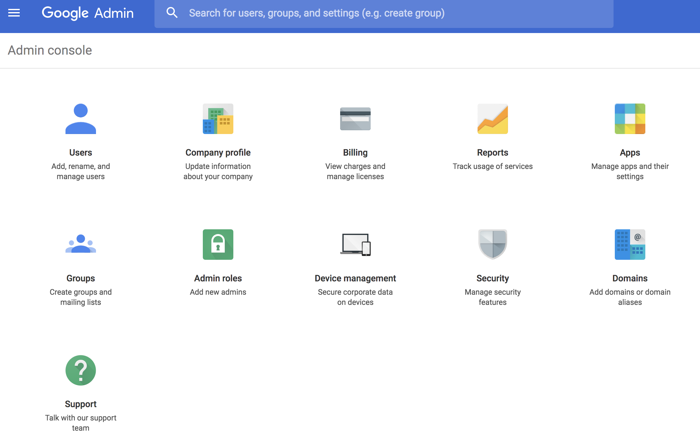

# Chrome OS プレーヤーの実装  {#implementing-chrome-os-player}

ここでは、Chrome 管理コンソールを使用した Chrome OS プレーヤーの実装方法を説明します。

## Chrome 管理コンソールの使用 {#using-chrome-management-console}

Chrome 管理コンソールを設定するには、次の手順を実行します。

1. Chrome 管理コンソールを登録します。Chrome 管理コンソールのライセンスを取得する必要があります。Contact [Google Support](https://support.google.com/chrome/a/answer/1375678?hl=en&ref_topic=2935995) to Manage Chrome device settings for more information.
1. Chrome OS デバイスをドメインに登録し、デバイスが Chrome 管理コンソールと同期するまで 15 分間待ちます。Chrome デバイスの登録について詳しくは、[ここ](https://support.google.com/chrome/a/answer/1360534?hl=en)をクリックしてください。
1. Chrome Web Store で Chrome プレーヤーが利用できるようになります。

>[!NOTE]
>
>Chrome OS デバイスのデプロイメントおよび管理には、Chrome 管理コンソールなどのデバイス管理ソリューションをお勧めします。このドキュメントでは Chrome 管理コンソールの実装を扱いますが、他のベンダーにも同様の機能を提供するものがあります。デバイス管理ソフトウェアのベンダーにお問い合わせください。

### キオスクモードの有効化 {#enabling-kiosk-mode}

キオスクモードを有効にするには、次の手順に従います。

1. Chrome Developer コンソールにログインします。

   

1. Browse to **Device management** &gt; **Chrome Management** &gt; **Device Settings**.
1. 「**Kiosk Settings**」にスクロールダウンして、「**Manage Kiosk Applications**」をクリックします。

   

1. Chrome Web Store から AEM Screens Player を選択します。

   >[!NOTE]
   >
   >最近公開されたアプリがこのリストに表示されるまで、約 15 分かかります。

1. Select **AEM Screens Player** from the **Auto Launch Kiosk App** dropdown.

   ネットワークによっては、変更が反映されるまで数分かかることがあります。再起動することをお勧めします。

#### リモートデバイスのステータスの確認 {#checking-remote-device-status}

1. Chrome Developer コンソールにログインします。
1. Browse to **Device management** &gt; **Chrome Devices** and select the device you wish to control.
1. 「**System Activity and troubleshooting**」をクリックします。
1. デバイスの **Reboot Device** および **Screen Capture** プロパティを確認します。また、デバイスステータスおよびヘルス情報も確認できます。

>[!NOTE]
>
>これらの設定は、デバイスが登録されてから数分後に有効になることがあります。各オプションは、時間が経過すると有効になることがあります。

### Chrome OS プレーヤーのリモート設定の設定 {#configuring-remote-configuration-of-chrome-os-players}

AEM Screens playerは、Chrome OS playerのリモートポリシー設定も有効にするKiosk対応のアプリケーションです。

プレーヤーの様々なオプションを設定するには、次の手順を実行します。

1. Chrome 管理コンソール.にログインします。
1. Click **Device management** &gt; **Chrome Management** &gt; **App Management**. リストにAEM Screens playerが表示されます。
1. **AEM Screens Player** アプリケーションをクリックします。
1. 「**Kiosk settings**」をクリックして、組織（*テスト環境を使用している場合*）を選択します。
1. Click on **upload configuration file** and upload the configuration policy (*Json file*).
1. 「**保存**」をクリックします。ポリシーを同期するには、デバイスを再起動する必要があります。

>[!NOTE]
>
>ポリシーの変更を同期するには、デバイスを再起動します。

#### ポリシー JSON ファイルの例 {#example-policy-json-file}

```java
{
  "server": {
    "Value": "https://aemscreensdemo.adobeitc.com"
  },
  "resolution": {
    "Value": "auto"
  },
  "rebootSchedule": {
    "Value": "at 4:00am"
  },
  "enableAdminUI": {
    "Value": true
  },
  "enableOSD": {
    "Value": true
  },
  "enableActivityUI": {
    "Value": true
  }
}
```

### ポリシーの属性と目的 {#policy-attributes-and-purpose}

次の表に、ポリシーとその機能の概要を示します。

| **ポリシー名** | **目的** |
|---|---|
| *server* | Adobe Experience Manager サーバーの URL  |
| *resolution* | Chrome OS デバイスの解像度 |
| *rebootSchedule* | Chrome プレーヤーを再起動するスケジュール |
| *enableAdminUI* | サイト上でデバイスを設定するための、技術者用の Admin UI を有効にします。完全に設定されて実稼動になったら、false に設定します。 |
| *enableOSD* | デバイスのチャネルを切り替えるための、ユーザー用のチャネルスイッチャー UI を有効にします。完全に設定されて実稼動になったら、false に設定することを検討します。 |
| *enableActivityUI* | 有効にすると、ダウンロードや同期などのアクティビティの進行状況を表示します。トラブルシューティング用に有効にし、完全に設定されて実稼動になったら無効にします。 |

>[!NOTE]
>
>ポリシー設定は厳格に適用されます。プレーヤーの Admin UI で、手動で上書きされることはありません。To allow manual player configuration for a particular policy, do not specify the policy in the ***policy configuration,*** for example, if you want to allow manual configuration for reboot schedule, do not specify the key ***rebootSchedule*** in the policy configuration.
