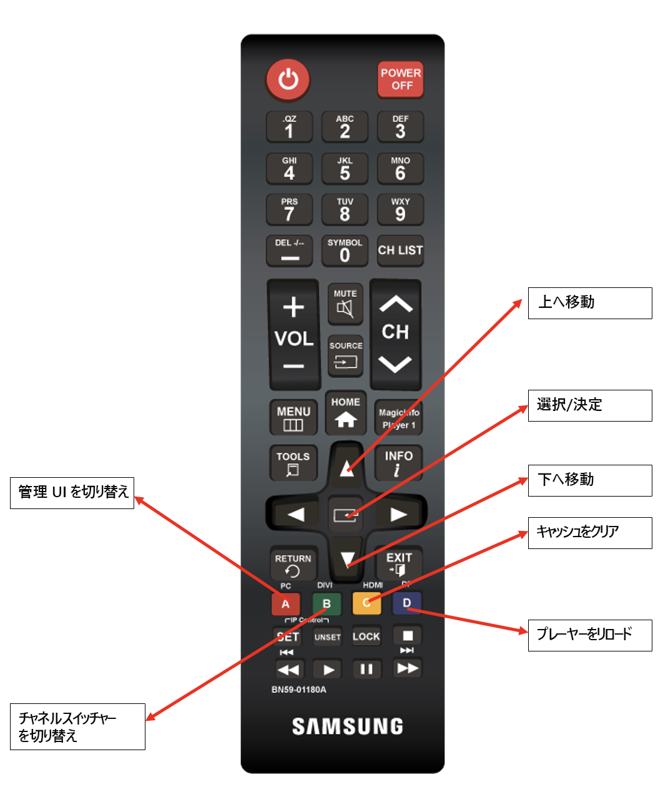

# Screens リモート制御の使用 {#implementing-remote-control}

リモート制御機能を使用すると、管理 UI、チャネルスイッチャーのほか、キャッシュのクリアやプレーヤーのリロードなどの機能にアクセスしやすくなります。また、プレーヤーのローカルファームウェアバージョンやシステム情報を確認する手段も提供します。この機能は、マウスを接続するのが難しい場合があるので、特に便利です。 または、手の届かない実稼働デバイスで動作させます。さらに、プレーヤーがAEMとの接続を失った場合にも動作します。 また、解像度の違いにより、管理 UI を見つけてマウスを使用して開くのが難しい場合があるので、Samsung RMS を使用する場合にも便利です。

## リモート制御キーの一般的な組み合わせ {#using-common-remote-control}

すべてのプレーヤーで、次のキーの組み合わせを Screens リモート制御で使用できます。

1. 管理 UI の切り替え - Ctrl + 1
1. チャネルスイッチャーの切り替え - Ctrl + 2
1. キャッシュのクリア - Ctrl + Alt + 3
1. プレーヤーのリロード - Ctrl + 4

## リモート制御キーの Tizen 固有の組み合わせ {#using-tizen-remote-control}

Tizen プレーヤーに限り、Samsung RMS で利用可能なハードウェアリモコンまたはソフトウェアリモコンのいずれかを使用して、次の機能にアクセスできます。

1. A - 管理 UI の切り替え
1. B - チャネルスイッチャーの切り替え
1. C - キャッシュのクリア
1. D - プレーヤーのリロード

## その他の使用上のメモ {#using-additional-remote-control}

1. 管理 UI が開いた状態で、上下の矢印キーを使用してタブを移動し、すべてのタブの情報を確認できます。
1. チャネルスイッチャーを開いた状態で、上下の矢印キーを使用してチャネルを移動できます。`Enter` キー（またはリモコンの矢印の中央にあるボタン）を押してチャネルを切り替えることもできます。

次の図は、Samsung リモコンでのキーの使用法を示しています。


>[!NOTE]
>enableAdminUI や enableOSD のデバイス設定値を false に設定した場合、リモコンでは管理 UI の切り替えとチャネルスイッチャーの切り替えはできません。 矢印キーを使用して管理 UI やチャネルを移動することはできません。 ただし、キャッシュのクリアとプレーヤーのリロードは引き続きできます。キーボードの組み合わせのいずれかがインタラクティブコンテンツと競合する場合は、次のコードを使用してリモート制御機能を無効にすることができます。

```
require(['util/ScreensDisplay'], function() {window.ScreensDisplay.ignoreRemoteControl = true;}); 
```
