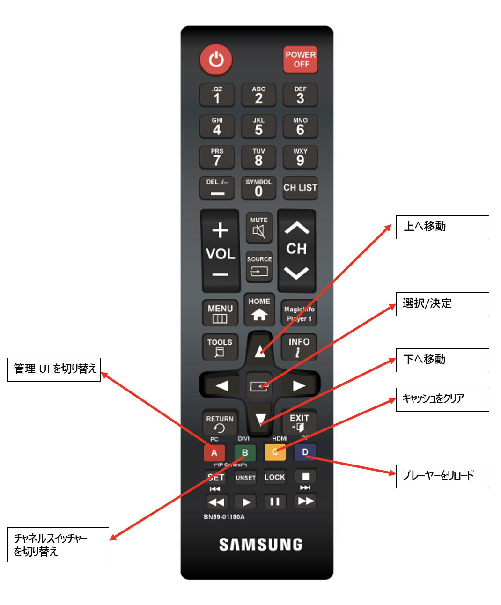

# Screens リモート制御の使用 {#implementing-remote-control}

>[!IMPORTANT]
>このコンテンツは、AEM オンプレミス/AMS （AEM 6.5LTSおよびAEM 6.5）に対して有効です。 AEM as a Cloud Service Screensの内容については、[AEM as a Cloud Service ガイド &#x200B;](https://experienceleague.adobe.com/en/docs/experience-manager-cloud-service/content/screens-as-cloud-service/overview/introduction)を参照してください。

リモートコントロール機能を使用すると、管理者UI、チャネルスイッチャー、またはキャッシュのクリアやリロードなどの機能に簡単にアクセスできます。 また、プレーヤーのローカルファームウェアバージョンやシステム情報を確認する手段も提供します。 マウスの接続が難しい場合には、この機能が特に役立ちます。 または、手の届かない実稼働デバイス上で動作させることもできます。さらに、プレーヤーが AEM との接続を失った場合にも動作可能です。 また、Samsung RMS を使用する場合にも便利です。解像度の違いにより、管理 UI を見つけてマウスを使用して開くことが難しい可能性があるからです。

## リモート制御キーの一般的な組み合わせ {#using-common-remote-control}

すべてのプレーヤーで、次のキーの組み合わせを Screens リモート制御で使用できます。

1. 管理 UI の切り替え - Ctrl + 1
1. チャネルスイッチャーの切り替え - Ctrl + 2
1. キャッシュのクリア - Ctrl + Alt + 3
1. プレーヤーのリロード - Ctrl + 4

## リモート制御キーの Tizen 固有の組み合わせ {#using-tizen-remote-control}

Tizen プレーヤーに限り、Samsung RMS で利用可能なハードウェアリモコンまたはソフトウェアリモコンのいずれかを使用して、次の機能にアクセスできます。

1. A - 管理 UI の切り替え
1. B - チャネルスイッチャーの切り替え
1. C - キャッシュのクリア
1. D - プレーヤーのリロード

## その他の使用上のメモ {#using-additional-remote-control}

1. 管理 UI が開いた状態で、上下の矢印キーを使用してタブを移動し、すべてのタブの情報を確認できます。
1. チャネルスイッチャーを開いた状態で、上下の矢印キーを使用してチャネルを移動できます。 `Enter` キー（またはリモコンの矢印の中央にあるボタン）を押してチャネルを切り替えることもできます。

次の図は、Samsung リモートでのキーの使用状況を示しています。


>[!NOTE]
>enableAdminUI や enableOSD のデバイス設定値を false に設定した場合、リモコンでは管理 UI の切り替えとチャネルスイッチャーの切り替えはできません。 矢印キーを使用して管理 UI やチャネルを移動することはできません。 ただし、キャッシュのクリアとプレーヤーのリロードは引き続きできます。 キーボードの組み合わせのいずれかがインタラクティブコンテンツと競合する場合は、次のコードを使用してリモート制御機能を無効にすることができます。

```
require(['util/ScreensDisplay'], function() {window.ScreensDisplay.ignoreRemoteControl = true;}); 
```
