# キックスタートガイド {#kickstart-guide}

このセクションは、AEM Screensでのキックスタートで、AEM Screensプロジェクトの設定および実行方法を示します。 基本的なデジタル署名エクスペリエンスの設定、各チャネルへのアセットやビデオなどのコンテンツの追加、さらにそのコンテンツのAEM Screensプレーヤーへの公開に関する手順を説明します。

>[!NOTE]
>プロジェクトの詳細を操作する際に開始が発生する前に、最新の機能パックがインストールされていることを確認してください。 Adobe ID を使用して、AEM Screens 6.5.5 リリースの最新の機能パックを[ソフトウェア配布ポータル](https://experience.adobe.com/#/downloads/content/software-distribution/en/aem.html)からダウンロードできます。

## 前提条件 {#prerequisites}

次の手順に従って、AEM Screens向けのサンプルプロジェクトを作成し、コンテンツを画面プレイヤーにさらに公開します。

>[!NOTE]
>次のチュートリアルは、Chrome OS Playerでチャネルーのコンテンツを再生する場合を示します。

>[!IMPORTANT]
>**OSGi 設定**
>デバイスからサーバーへのデータの投稿を許可するには、空のリファラーを有効にする必要があります。例えば、空のリファラーのプロパティが無効になっていると、デバイスからスクリーンショットを投稿できません。現在、これらの機能の一部は、OSGi設定で「Apache Sling転送者フィルター」「空白を許可」が有効になっている場合にのみ使用できます。 ダッシュボードには、セキュリティ設定がこれらの機能の一部の動作を妨げる可能性があることを示す警告が表示される場合があります。
>***Apache Sling Referrer Filter の「Allow Empty」設定***&#x200B;を有効にするには、次の手順に従います。

## 空のリファラー要求の許可 {#allow-empty-referrer-requests}

1. AEM インスタンスでハンマーアイコン／**操作**／**Web コンソール**&#x200B;をクリックして、「**Adobe Experience Manager Web コンソール設定**」に移動します。

   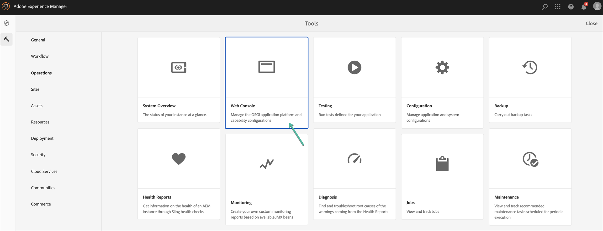

1. **Adobe Experience Manager Web コンソール設定**&#x200B;が開きます。「sling referrer」を検索します。

   「sling referrer」プロパティを検索するには、**Command + F** キー（**Mac**）または **Ctrl + F** キー（**Windows**）を押します。

1. 「**Allow Empty**」オプションをオンにします（下図を参照）。

   

1. 「**保存**」をクリックして、Apache Sling Referrer Filter の「Allow Empty」を有効にします。

## デジタルサイネージエクスペリエンスを 5 分で作成する {#creating-a-digital-signage-experience-in-minutes}

### AEM Screens プロジェクトの作成 {#creating-project}

最初のステップは、新しいAEM Screensプロジェクトを作ることです。

1. Adobe Experience Manager(AEM)インスタンスに移動し、「 **画面**」をクリックします。 Alternatively, you can navigate directly from `https://localhost:4502/screens.html/content/screens](https://localhost:4502/screens.html/content/screens`.

1. Click **Create Screens Project** to create a new Screens project. Enter the title as **DemoScreens** and click **Save**.

   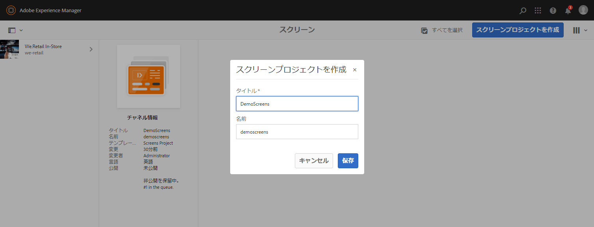

   >[!NOTE]
   >プロジェクトを作成すると、画面のプロジェクトホームページに戻ります。 これでプロジェクトを選択できます。プロジェクトには、 **Applications**、 **チャネル**、 **Devices**、Devices **、Locations、Locations、Schedulesという5つの異なるフォルダがあ******&#x200B;ります。

### チャネルの作成 {#creating-channel}

プロジェクトを作成したら、コンテンツを管理するための新しいチャネルを作成する必要があります。

以下の手順に従って、プロジェクトの新しいチャネルを作成します。

1. プロジェクトを作成したら、 **DemoScreens** プロジェクトを選択し、 **チャネルフォルダ**（下の図を参照）を選択します。 Click **+ Create** from the action bar.

   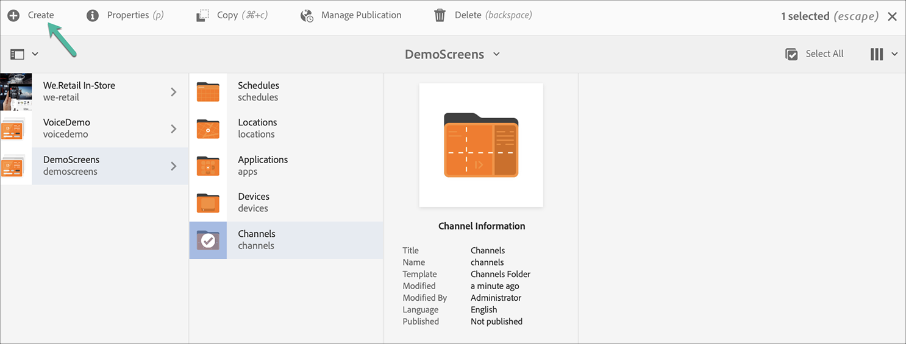

1. Choose the **Sequence Channel** from the wizard and click **Next**.
   

1. 「**タイトル**」に「*TestChannel*」と入力し、「**作成**」をクリックします。

   

   *TestChannel*&#x200B;が作成され、チャネルフォルダーに追加されます（下図を参照）。

   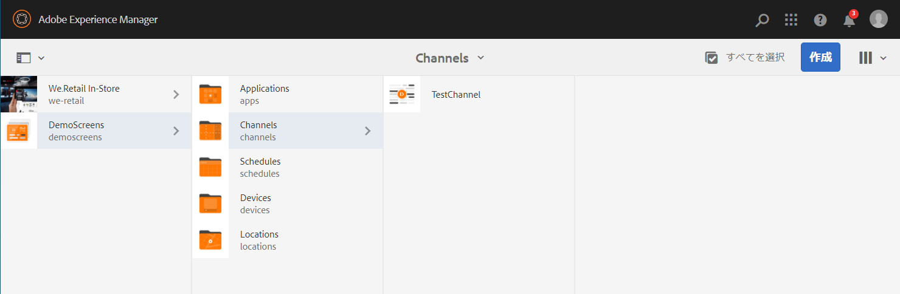

### チャネルへのコンテンツの追加 {#adding-content}

チャネルを作成したら、Screens Player に表示するコンテンツをチャネルに追加する必要があります。

以下の手順に従って、プロジェクトのチャネル（*TestChannel*）にコンテンツを追加します。

1. 作成した **DemoProject** プロジェクトに移動し、**チャネル**&#x200B;フォルダーを選択します。

1. アクションバーの「**編集**」をクリックします（下図を参照）。TestChannel **** のエディターが開きます。

   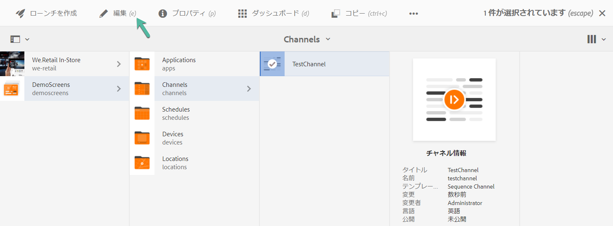

1. アクションバーの左側にあるサイドパネルを切り替えるアイコンをクリックし、アセットとコンポーネントを開きます。

1. チャネルに追加するコンポーネントをドラッグ＆ドロップします。

   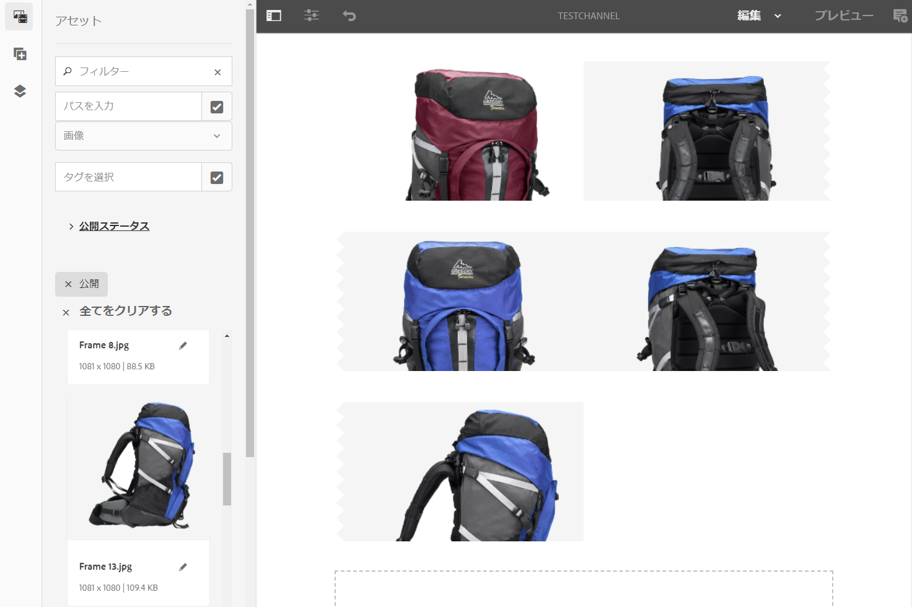

### ロケーションの作成 {#creating-location}

チャネルを設定したら、場所を作成する必要があります。

>[!NOTE]
>***Locations*** compartmentalize your various digital signage experiences and contains the configurations of the displays according to where the various screens are.

以下の手順に従って、プロジェクトの新しいロケーションを作成します。

1. Navigate to the **DemoProject** you created and select the **Locations** folder.

1. Click **+ Create** from the action bar.

1. ウィザードから「**ロケーション**」を選択し、「**次へ**」をクリックします。

1. Enter the **Name** for your location (enter the title as *TestLocation*) and click **Create**.

**TestLocation** が作成され、**ロケーション**&#x200B;フォルダーに追加されます。

### 場所の表示の作成 {#creating-display}

ロケーションを作成したら、ロケーションのための新しいディスプレイを作成する必要があります。

>[!NOTE]
>***ディスプレイ***&#x200B;は、1 つまたは複数のスクリーンで実行されるデジタルエクスペリエンスを表します。

1. Navigate to the **TestLocation** and select it.

1. アクションバーの「**作成**」をクリックします。

   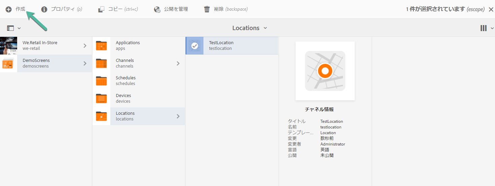

1. **作成**&#x200B;ウィザードから「**ディスプレイ**」を選択し、「**次へ**」をクリックします。

   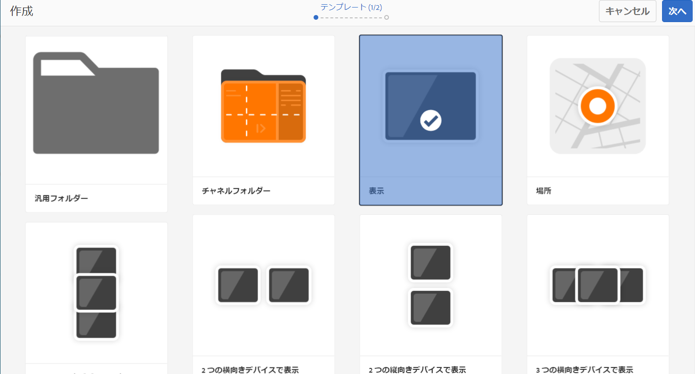

1. Enter the **Title** as **LobbyDisplay** and click **Create**.

   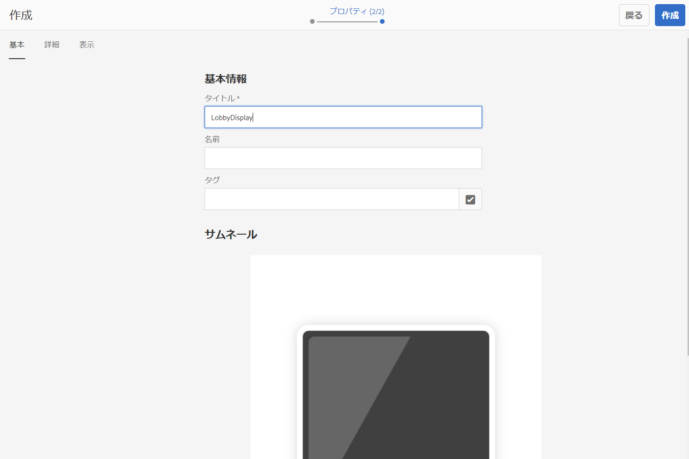

   A new display titled as **TestDisplay** is now added to your location **TestLocation**, as shown in the figure below.

   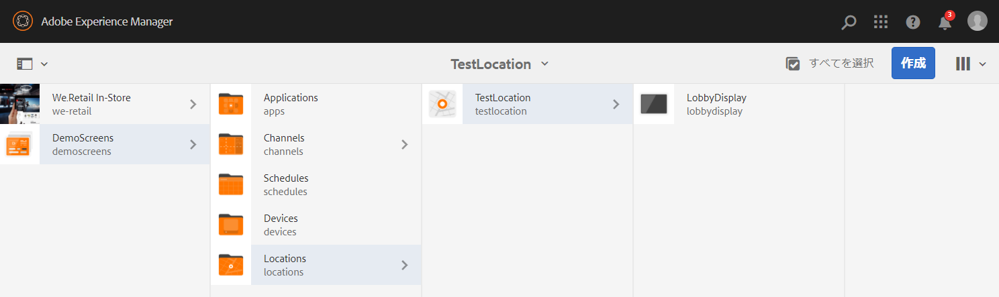

### チャネルの割り当て {#assigning-channel}

プロジェクトの設定が完了したら、チャネルをディスプレイに割り当てて、コンテンツを表示する必要があります。

1. DemoScreens **—>** Locations **—> TestLocation** —> LobbyDisplayDisplayから必要な表示に移動しま ********&#x200B;す。

1. アクションバーで「**チャネルの割り当て**」をタップまたはクリックします。

   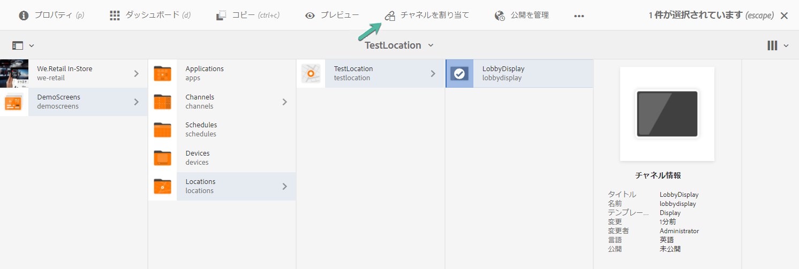

   または、

   アクションバーの「**ダッシュボード**」をタップまたはクリックし、「**割り当てられたチャネルとスケジュール**」パネルで「**チャネルの割り当て**」をクリックします。

   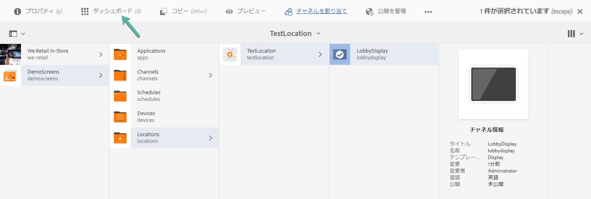

1. 「**チャネル割り当て**」ダイアログボックスが開きます。

1. 「 **設定** 」オプションから、 **チャネルをパス** とサポートされているイベント **(「初期ロード」、「**********&#x200B;アイドルスクリーン」)から選択します。

   >[!NOTE]
   >
   >「 **チャネルの役割****」、「**&#x200B;優先度 **」、「割り込みの方法** 」は、すべてデフォルトで設定されます。 See [Channel Properties](/help/user-guide/channel-assignment-latest-fp.md#channel-properties) section to learn more about channel assignment properties.

   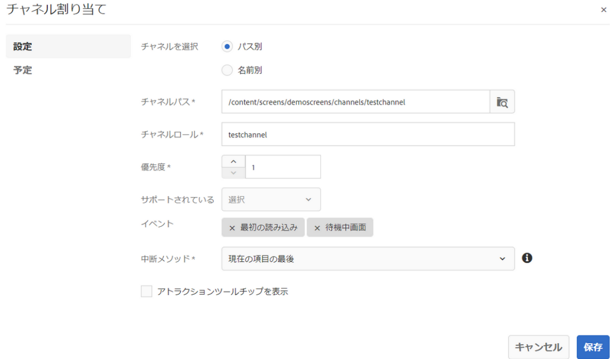

   また、[ **アクティベーション] [ウィンドウ** ]と[ **繰り返しスケジュール**]も選択できます。

   >[!NOTE]
   >The *Recurrence Schedule* allows you to set a recurring schedule for your channel. 1 つのチャネルに対して、複数の繰り返しスケジュールを設定します。
   >詳しくは、「[繰り返しスケジュール](/help/user-guide/channel-assignment-latest-fp.md#recurrence-schedule)」を参照してください。

1. 環境を設定したら、「**保存**」をクリックします。

### デバイスの登録とディスプレイへのデバイス割り当て {#registering-device}

AEM ダッシュボードを使用して、デバイスを登録する必要があります。

>[!IMPORTANT]
>Chrome OS プレーヤーは、実際の Chrome プレーヤーデバイスがなくても、開発者モードで Chrome ブラウザープラグインとしてインストールできます。インストールについては、次の手順に従います。
>
>1. [ここ](https://download.macromedia.com/screens/)をクリックして、最新の Chrome プレーヤーをダウンロードします。
>1. 解凍してディスクに保存します。
>1. Chrome ブラウザーを開き、メニューから「**拡張機能**」を選択するか、***chrome://extensions*** に直接移動します。
>1. 右上隅の「**デベロッパーモード**」をオンにします。
>1. 左上隅の「**パッケージ化されていない拡張機能を読み込む**」をクリックし、解凍した Chrome プレーヤーを読み込みます。
>1. **AEM Screens Chrome Player** プラグインが拡張機能の一覧にあれば、それをオンにします。
>1. 新しいタブを開き、左上隅の「**アプリ**」アイコンをクリックするか、***chrome://apps*** に直接移動します。
>1. 「**AEM Screens** プラグイン」をクリックして、Chrome プレーヤーを起動します。デフォルトでは、プレーヤーはフルスクリーンモードで起動します。**Esc** キーを押すと、フルスクリーンモードが終了します。

ChromeOSプレーヤーがオンになったら、次の手順に従ってChromeデバイスを登録します。

1. AEMインスタンスから、プロジェクトの **Devices** （デバイス）フォルダーに移動します。

1. Tap/click the **Device Manager** from the action bar.

   

1. Tap/click the **Device Registration** from the top right.

1. Select the required device and tap/click **Register Device**.

   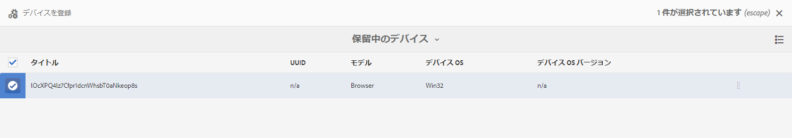

1. デバイスが登録コードを送信してから同時に登録コードが送信されるのを待ち、Chromeデバイスで **登録コード** (Registration Code)を確認します。
   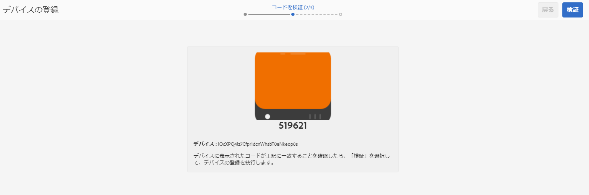

1. If the **Registration Code** is the same on both machines, tap/click **Validate** in AEM.

1. Set the desired name as **ChromeDeviceforDemo** for the device, and click **Register**.

   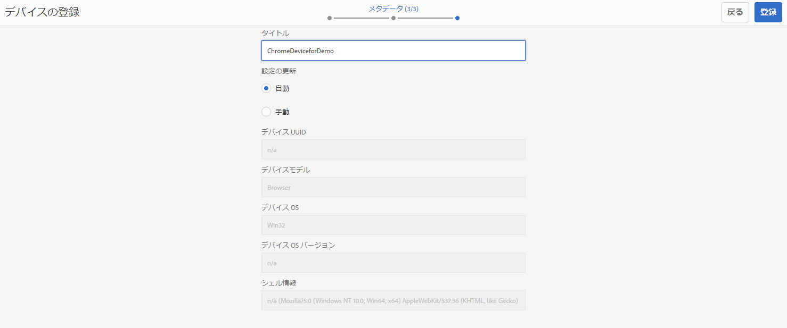

1. [ **Device Registration Successful** ]ダイアログ・ボックスで[Assign Display **** ]をクリックします。

   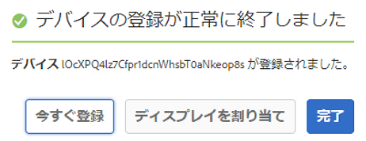

1. 表示するパスを、DemoScreens **—> TestLocation** —> DisplayDisplayDisplayLoby **クリックAssignDemoScreens** —> TestLocation **—> DisplayDisplayLobyクリック** AssignDemoScreensとして選択しま ********&#x200B;す。

   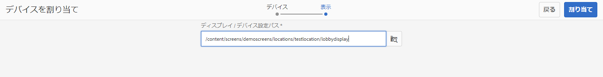

1. デバイスが正常に割り当てられると、次の確認が表示されます。

   

1. 「**完了**」をタップまたはクリックして、登録プロセスを完了します。

1. 登録済みのデバイスをディスプレイダッシュボードから表示できるはずです。

   

### Chrome Player でのコンテンツの表示 {#viewing-content-output}

チャネルー内のすべてのアセットがChromeデバイスで再生されるようになりました。

AEM Screensチャネルでコンテンツをプレイしています。

