# キックスタートガイド {#kickstart-guide}

>[!IMPORTANT]
>このコンテンツは、AEM オンプレミス/AMS （AEM 6.5LTSおよびAEM 6.5）に対して有効です。 AEM as a Cloud Service Screensの内容については、[AEM as a Cloud Service ガイド &#x200B;](https://experienceleague.adobe.com/ja/docs/experience-manager-cloud-service/content/screens-as-cloud-service/overview/introduction)を参照してください。

AEM Screens のキックスタートで、AEM Screens プロジェクトの設定および実行方法について説明します。 デジタルサイネージエクスペリエンスの基本的な設定、アセットやビデオなどのコンテンツの各チャネルへの追加、さらにそのコンテンツの AEM Screens Player への公開に関する手順を説明します。

>[!NOTE]
>プロジェクトの詳細に関する作業の前に、AEM Screens の最新の機能パックがインストールされていることを確認してください。 Adobe ID を使用して、最新の機能パックを[ソフトウェア配布ポータル](https://experience.adobe.com/#/downloads/content/software-distribution/ja/aem.html)からダウンロードできます。

## 前提条件 {#prerequisites}

次の手順に従って、AEM Screens のサンプルプロジェクトを作成し、さらにコンテンツを Screens Player に公開します。

>[!NOTE]
>次のチュートリアルは、Chrome OS プレーヤーでチャネルのコンテンツを再生する場合を示します。

>[!IMPORTANT]
>**OSGi構成設定**
>空のリファラーを有効にして、デバイスがサーバーにデータを投稿できるようにする必要があります。例えば、空のリファラープロパティが無効になっている場合、デバイスはスクリーンショットを再投稿できません。現在、これらの機能の一部は、OSGi設定で`Apache Sling` Referrer Filter Allow Emptyが有効になっている場合にのみ使用できます。ダッシュボードには、セキュリティ設定によって、これらの機能の一部が動作しない可能性があるという警告が表示されることがあります。
>次の手順に従って、***Apache Sling Referrer Filter Allow Empty***&#x200B;を有効にします。

## 空のリファラー要求の許可 {#allow-empty-referrer-requests}

1. AEM インスタンス／ハンマーアイコン／**操作**／**Web コンソール**&#x200B;を使用して、**Adobe Experience Manager Web コンソール設定**&#x200B;に移動します。

   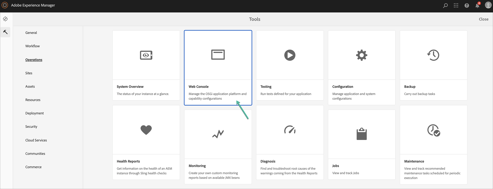

1. **Adobe Experience Manager Web コンソール設定**&#x200B;が開きます。 「sling referrer」を検索します。

   「sling referrer」プロパティを検索するには、**Command + F** キー（**Mac**）または **Ctrl + F** キー（**Windows**）を押します。

1. 「**Allow Empty**」オプションをオンにします（下図を参照）。

   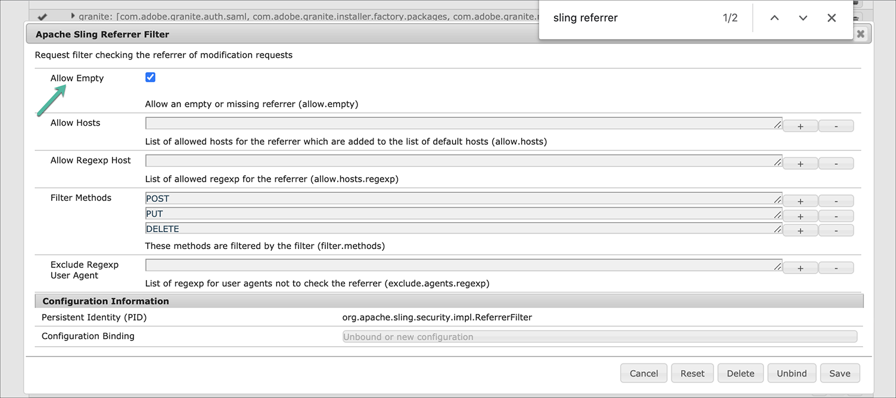

1. 「**保存**」をクリックして、Apache Sling Referrer Filter の「Allow Empty」を有効にします。

## デジタルサイネージエクスペリエンスを 5 分で作成する {#creating-a-digital-signage-experience-in-minutes}

### AEM Screens プロジェクトの作成 {#creating-project}

最初の手順は AEM Screens プロジェクトを作ることです。

1. Adobe Experience Manager（AEM）インスタンスに移動し、「**Screens**」をクリックします。 または、`https://localhost:4502/screens.html/content/screens](https://localhost:4502/screens.html/content/screens` から直接アクセスすることもできます。

1. 「**Screens プロジェクトの作成**」をクリックすると、Screens プロジェクトを作成できます。
1. タイトルに「**DemoScreens**」と入力し、「**保存**」をクリックします。

   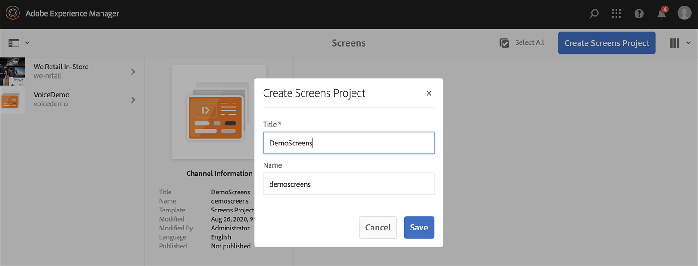

   >[!NOTE]
   >プロジェクトを作成すると、AEM Screens プロジェクトホームページに戻ります。 これでプロジェクトをクリックできるようになりました。 プロジェクトには、**Applications**、**Channels**、**Devices**、**Locations** および **Schedules** という 5 つの異なるフォルダーがあります。

### チャネルの作成 {#creating-channel}

AEM Screens プロジェクトを作成したら、コンテンツを管理するチャネルを作成します。

以下の手順に従って、プロジェクトのチャネルを作成します。

1. プロジェクトを作成したら、**DemoScreens** プロジェクトをクリックし、以下の図のように、**Channels** フォルダーをクリックします。 アクションバーの「**+ 作成**」をクリックします。

   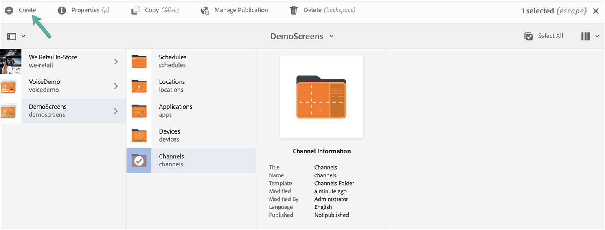

1. ウィザードで「**シーケンスチャネル**」を選択し、「**次へ**」をクリックします。
   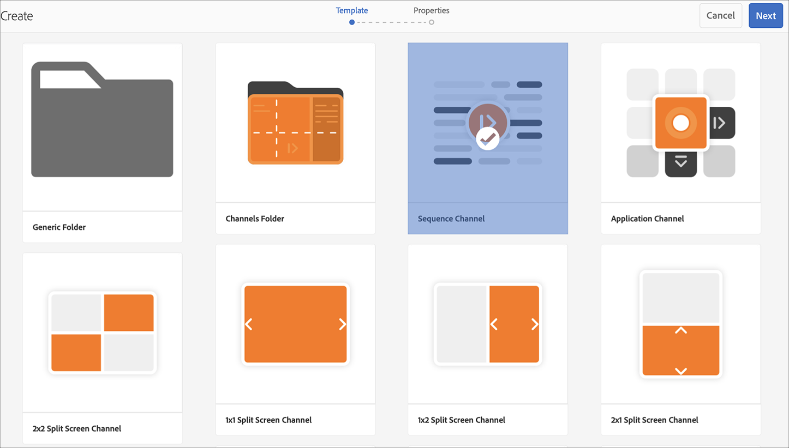

1. 「**タイトル**」に「**TestChannel**」と入力し、「**作成**」をクリックします。

   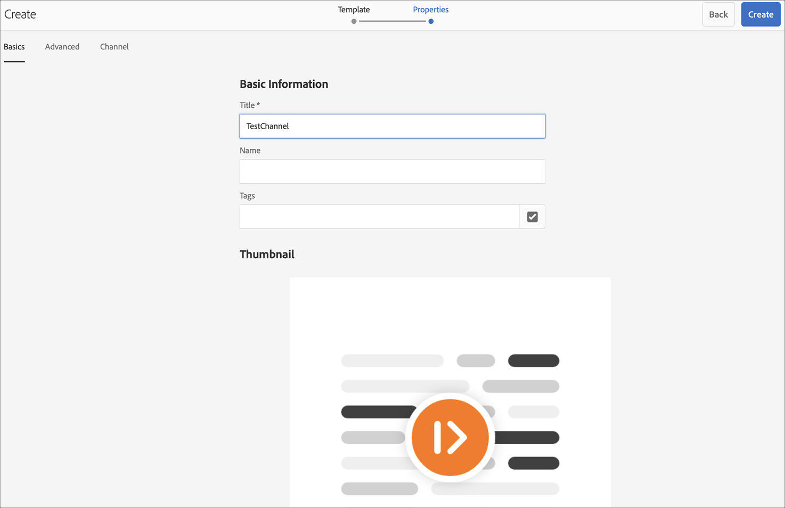

   **TestChannel** がチャネルフォルダーに追加されます（下図を参照）。

   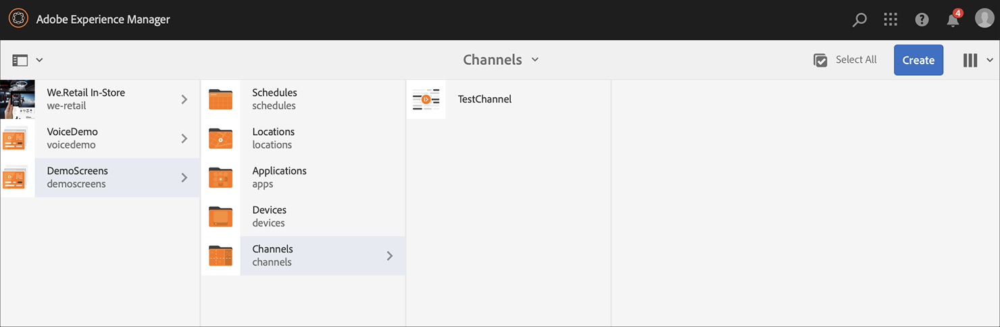

### チャネルへのコンテンツの追加 {#adding-content}

チャネルを作成したら、AEM Screens Player で表示できるコンテンツをチャネルに追加します。

以下の手順に従って、プロジェクトのチャネル（**TestChannel**）にコンテンツを追加します。

1. 作成した **DemoProject** に移動し、**チャネル**&#x200B;フォルダーから **TestChannel** をクリックします。

1. アクションバーの「**編集**」をクリックします（下図を参照）。 **TestChannel** のエディターが開きます。

   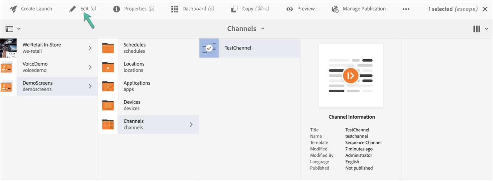

1. アクションバーの左側にあるサイドパネルを切り替えるアイコンをクリックし、アセットとコンポーネントを開きます。

1. チャネルに追加するコンポーネントをドラッグ＆ドロップします。

   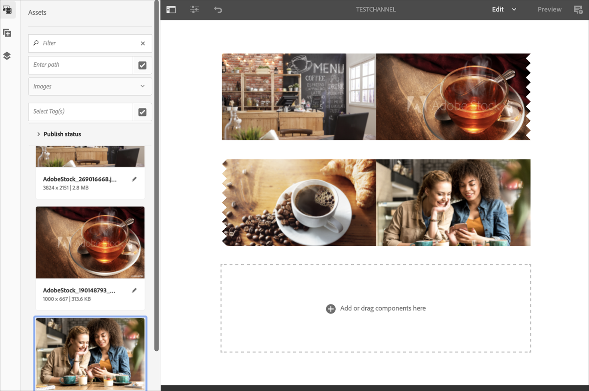

### ロケーションの作成 {#creating-location}

チャネルを作成したら、ロケーションを作成します。

>[!NOTE]
>***ロケーション***&#x200B;は、様々なデジタルサイネージエクスペリエンスを区分するもので、各種スクリーンの場所に応じたディスプレイ設定が含まれています。

以下の手順に従って、プロジェクトのロケーションを作成します。

1. 作成した **DemoProject** に移動し、**ロケーション**&#x200B;フォルダーをクリックします。
1. アクションバーの「**+ 作成**」をクリックします。
1. ウィザードから「**ロケーション**」、「**次へ**」の順にクリックします。
1. ロケーションの「**名前**」を入力し（タイトルには「**TestLocation**」と入力します）、「**作成**」をクリックします。

**TestLocation** が作成され、**ロケーション**&#x200B;フォルダーに追加されます。

### ロケーション用ディスプレイの作成 {#creating-display}

ロケーションを作成したら、ロケーションのためのディスプレイを作成します。

>[!NOTE]
>***ディスプレイ***&#x200B;は、1 つまたは複数のスクリーンで実行されるデジタルエクスペリエンスを表します。

1. **TestLocation** に移動してクリックします。
1. アクションバーの「**作成**」をクリックします。

   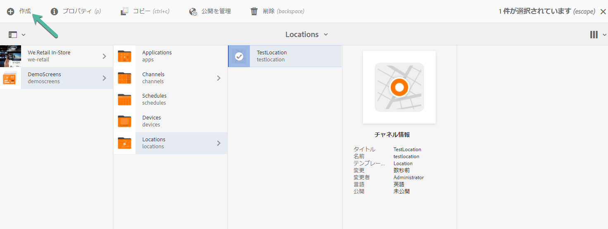

1. **作成**&#x200B;ウィザードから「**ディスプレイ**」をクリックし、「**次へ**」をクリックします。

   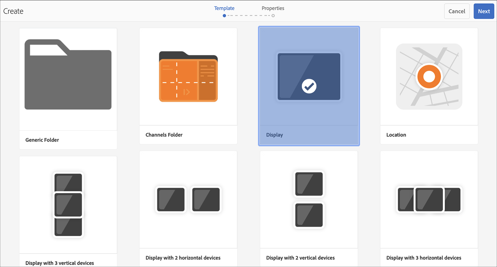

1. 「**タイトル**」に「**LobbyDisplay**」と入力し、「**作成**」をクリックします。

   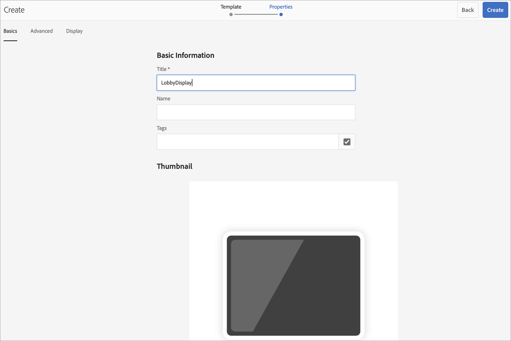

   以下の図に示すように、「**TestDisplay**」というタイトルの新しいディスプレイがロケーション「**TestLocation**」に追加されます。

   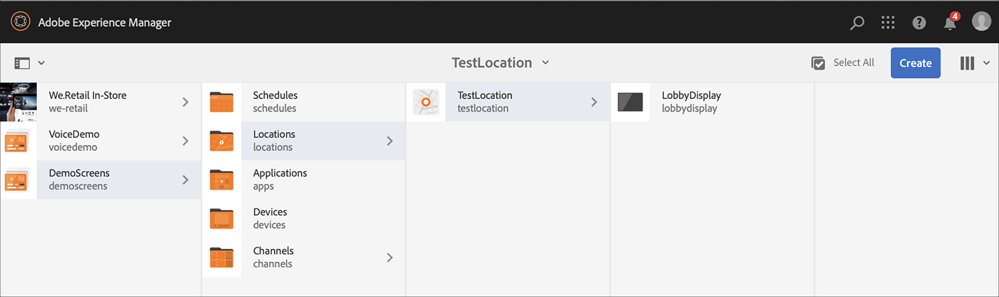

### チャネルの割り当て {#assigning-channel}

プロジェクトの設定が完了したら、チャネルをディスプレイに割り当てて、コンテンツを表示します。

1. **DemoScreens**／**ロケーション**／**TestLocation**／**LobbyDisplay** から、必要なディスプレイに移動します。

1. アクションバーの「**チャネルを割り当て**」をクリックします。

   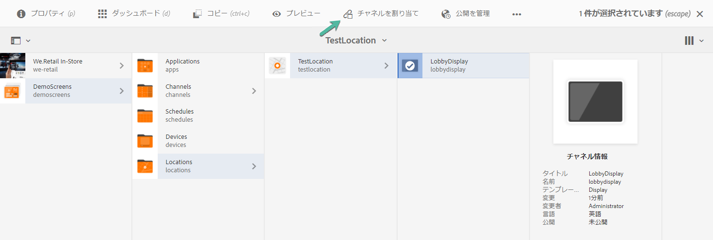

   または、

   アクションバーの「**ダッシュボード**」をクリックし、**割り当てられたチャネルとスケジュール**&#x200B;パネルで「**+ チャネルを割り当て**」をクリックします。

   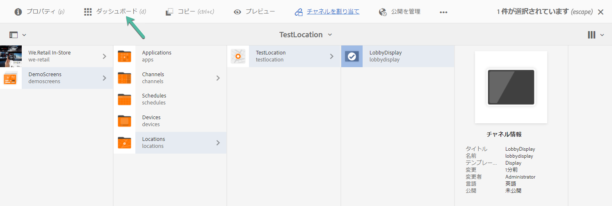

1. 「**チャネル割り当て**」ダイアログボックスが開きます。

1. **設定** オプションから、**初期読み込み**&#x200B;や&#x200B;**アイドル画面**&#x200B;など、**パス別**&#x200B;および&#x200B;**サポートされているイベント**&#x200B;のチャネルを選択します。

   >[!NOTE]
   >
   >「**チャネルロール**」、「**優先度**」、「**中断メソッド**」は、すべてデフォルトで設定されます。 チャネルの割り当てプロパティについて詳しくは、[チャネルプロパティ](/help/user-guide/channel-assignment-latest-fp.md#channel-properties)の節を参照してください。

   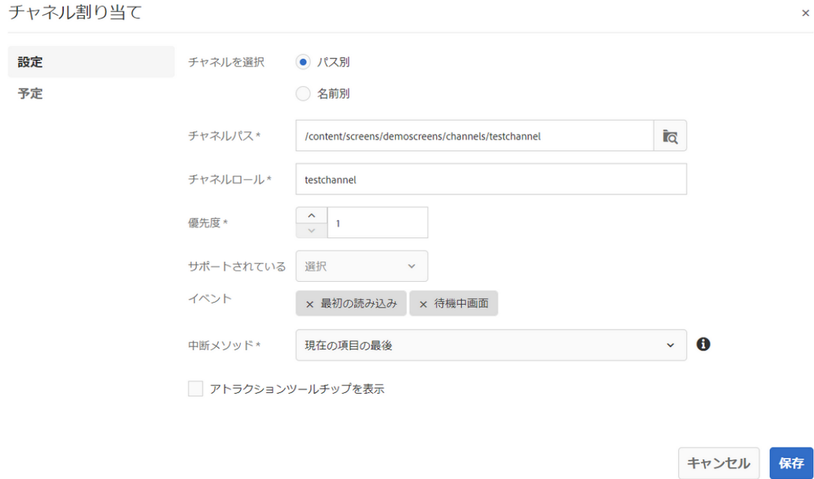

   また、「**アクティベーションウィンドウ**」と「**繰り返しスケジュール**」もクリックできます。

   >[!NOTE]
   >*繰り返しスケジュール*を使用すると、チャネルの繰り返しスケジュールを設定できます。1つのチャネルに対して複数の繰り返しスケジュールを設定できます。
   >詳しくは、「[繰り返しスケジュール](/help/user-guide/channel-assignment-latest-fp.md#recurrence-schedule)」を参照してください。

1. 環境を設定したら、「**保存**」をクリックします。

### デバイスの登録とディスプレイへのデバイスの割り当て {#registering-device}

AEM ダッシュボードを使用してデバイスを登録します。

>[!IMPORTANT]
>Chrome OS プレーヤーは、実際の Chrome プレーヤーデバイスがなくても、開発者モードで Chrome ブラウザープラグインとしてインストールできます。 インストールについては、次の手順に従います。
>
>1. [ここ](https://download.macromedia.com/screens/)をクリックして、最新の Chrome プレーヤーをダウンロードします。
>1. 解凍してディスクに保存します。
>1. Chrome ブラウザーを開き、メニューで「**拡張機能**」をクリックするか、***chrome://extensions*** に直接移動します。
>1. 右上隅の「**デベロッパーモード**」をオンにします。
>1. 左上隅の「**パッケージ化されていない拡張機能を読み込む**」をクリックし、解凍した Chrome プレーヤーを読み込みます。
>1. **AEM Screens Chrome Player** プラグインが拡張機能の一覧にあれば、それをオンにします。
>1. 新しいタブを開き、左上隅の「**アプリ**」アイコンをクリックするか、***chrome://apps*** に直接移動します。
>1. 「**AEM Screens**」プラグインをクリックすると、Chrome プレーヤーを起動できます。 デフォルトでは、プレーヤーはフルスクリーンモードで起動します。 **Esc** キーを押すと、フルスクリーンモードが終了します。

Chrome OS プレーヤーがオンになったら、次の手順に従って Chrome デバイスを登録します。

1. AEM インスタンスから、プロジェクトの&#x200B;**デバイス**&#x200B;フォルダーに移動します。

1. アクションバーの「**デバイスマネージャー**」をクリックします。

   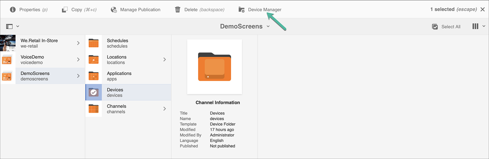

1. 右上にある「**デバイスの登録**」をクリックします。

1. 目的のデバイスをクリックし、「**デバイスを登録**」をクリックします。

   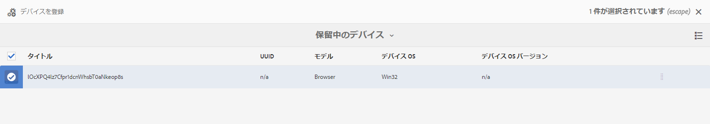

1. デバイスが登録コードを送信するのを待機し、同時に、Chrome デバイスで&#x200B;**登録コード**&#x200B;を確認します。
   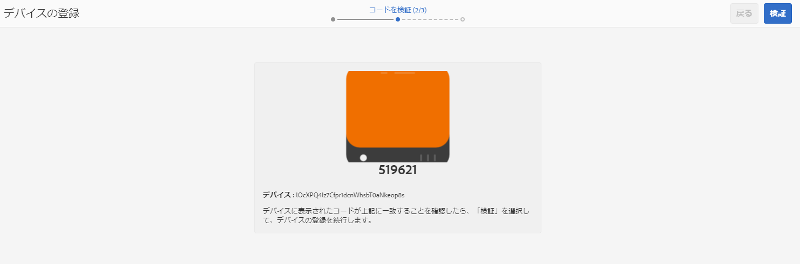

1. 両方のコンピューターの&#x200B;**登録コード**&#x200B;が同じである場合は、AEM の「**検証**」をクリックします。

1. デバイスの名前を「**ChromeDeviceforDemo**」に設定し、「**登録**」をクリックします。

   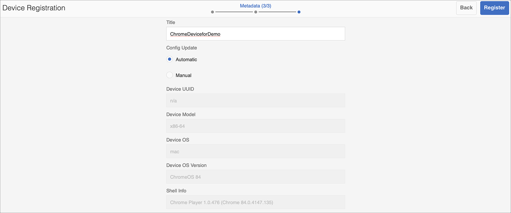

1. **デバイス登録成功**&#x200B;ダイアログボックスで、「**ディスプレイを割り当て**」をクリックします。

   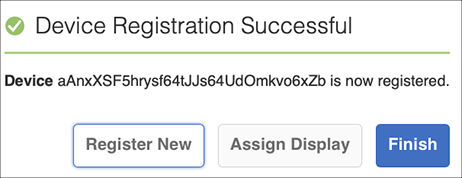

1. ディスプレイのパスとして **DemoScreens**／**ロケーション**／**TestLocation**／**LobbyDisplay** をクリックし、「**割り当て**」をクリックします。

   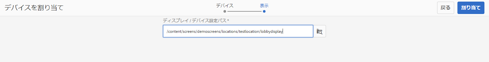

1. デバイスが正常に割り当てられると、次の確認が表示されます。

   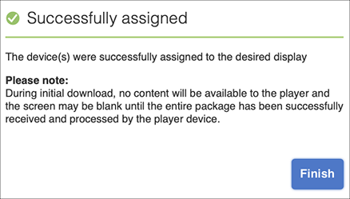

1. 「**完了**」をクリックして、登録プロセスを完了します。 登録済みのデバイスがディスプレイダッシュボードに表示されます。

   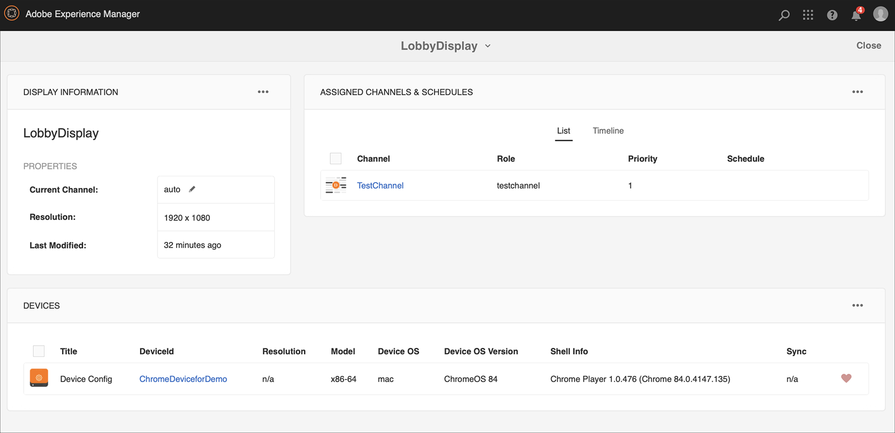

### Chrome Player でのコンテンツの表示 {#viewing-content-output}

チャネル内のすべてのアセットが Chrome OS プレーヤーで再生されるようになりました。

下図では、AEM Screens チャネルのコンテンツを再生しています。

