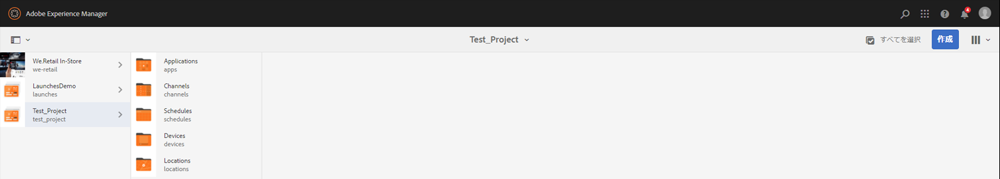

# キックスタートガイド {#kickstart-guide}

この節では、AEM Screens を使用しながら、基本的なアクションの実行方法を説明します。コンテンツやアセットを使用した基本的なデジタルサイネージエクスペリエンスをセットアップし、Screens Player に公開する方法を順を追って説明します。

## デジタルサイネージエクスペリエンスを 5 分で作成する {#creating-a-digital-signage-experience-in-minutes}

次の手順では、Screens のサンプルプロジェクトを作成して、Screens Player にコンテンツを公開できます。

**AEM Screens Player** をダウンロードするには、[ここ](https://download.macromedia.com/screens/)をクリックしてください。

Chrome OS Player の実装について詳しくは、[Chrome 管理コンソール](implementing-chrome-os-player.md)を参照してください。

お使いのデバイスに画面プレーヤーをインストールおよび設定する方法について詳しくは、「画面の [インストールと設定](configuring-screens-introduction.md) 」を参照してください。

>[!NOTE]
>**OSGi 設定**
>デバイスからサーバーへのデータの投稿を許可するには、空のリファラーを有効にする必要があります。例えば、空のリファラーのプロパティが無効になっていると、デバイスからスクリーンショットを投稿できません。現在、これらの機能の一部は、OSGI 設定で Apache Sling Referrer Filter の Allow Empty 設定が有効になっている場合にのみ使用できます。ダッシュボードには、セキュリティ設定がこれらの機能の一部の動作を妨げる可能性があることを示す警告が表示される場合があります。
>
>
>***Apache Sling Referrer Filter の「Allow Empty」設定***&#x200B;を有効にするには、次の手順に従います。

## 空のリファラー要求の許可 {#allow-empty-referrer-requests}

1. AEM インスタンスでハンマーアイコン／**操作**／**Web コンソール**&#x200B;をクリックして、「**Adobe Experience Manager Web コンソール設定**」に移動します。

   

1. **Adobe Experience Manager Web コンソール設定**&#x200B;が開きます。「sling referrer」を検索します。

   「sling referrer」プロパティを検索するには、**Command + F** キー（**Mac**）または **Ctrl + F** キー（**Windows**）を押します。

1. 「**Allow Empty**」オプションをオンにします（下図を参照）。

   

1. 「**保存**」をクリックして、Apache Sling Referrer Filter の「Allow Empty」を有効にします。

## チュートリアル {#tutorial}

1. **新しいプロジェクトの作成**

   1. Adobe Experience Manager リンク（左上）を選択し、「**Screens**」を選択します。または、`https://localhost:4502/screens.html/content/screens](https://localhost:4502/screens.html/content/screens` から直接アクセスすることもできます。

   1. 「**作成**」をクリックして、新しい Screens プロジェクトを作成します（以下の図を参照）。
   1. **Screens プロジェクトの作成**&#x200B;ウィザードで「**Screens**」を選択し、「**次へ**」をクリックします。

   1. タイトルに *Test_Project* と入力し、「**作成**」をクリックします。

   

   プロジェクトが作成されると、Screens プロジェクトコンソールに戻ります。これでプロジェクトを選択できます。プロジェクトには、**アプリケーション**（Applications）、**チャネル**（Channels）、**デバイス**（Devices）、**ロケーション**（Locations）、**スケジュール**（Schedules）という 5 種類のフォルダーがあります（下図を参照）。

   >[!NOTE]
   >
   >スケジュールは、AEM 6.3 Sites 機能パック 1 がインストールされている場合にのみ使用できます。この機能パックにアクセスするには、アドビサポートに連絡してアクセス権をリクエストする必要があります。アクセス権が付与されると、パッケージ共有から機能パックをダウンロードできるようになります。

   

   詳しくは、[Screens プロジェクトの作成と管理](creating-a-screens-project.md)を参照してください。

1. **新しいチャネルの作成**

   プロジェクトを作成したら、コンテンツを管理するための新しいチャネルを作成する必要があります。

   以下の手順に従って、プロジェクトの新しいチャネルを作成します。

   1. 作成した *Test_Project* に移動し、**チャネル**&#x200B;フォルダーを選択します。

   1. アクションバーの「**作成**」をクリックします（下図を参照）。ウィザードが開きます。
   1. 「**シーケンスチャネル**」を選択し、「**次へ**」をクリックします。

   1. 「**名前**」および「**タイトル**」に「*TestChannel*」と入力し、「**作成**」をクリックします。

   

   *TestChannel*&#x200B;が作成され、チャネルフォルダーに追加されます（下図を参照）。

   

   チャネルの作成と管理について詳しくは、[チャネル管理](managing-channels.md)を参照してください。

1. **チャネルへのコンテンツの追加**

   チャネルを作成したら、Screens Player に表示するコンテンツをチャネルに追加する必要があります。

   以下の手順に従って、プロジェクトのチャネル（TestChannel **）にコンテンツを追加します。

   1. 作成した *Test_Project* に移動し、**チャネル**&#x200B;フォルダーを選択します。

   1. アクションバーの「**編集**」をクリックします（下図を参照）。TestChannel ** のエディターが開きます。

   1. アクションバーの左側にあるサイドパネルを切り替えるアイコンをクリックし、アセットとコンポーネントを開きます。
   1. チャネルに追加するコンポーネントをドラッグ＆ドロップします。

   

   この例では、チャネルに追加された画像がエディターに表示されます。

   

1. **新しいロケーションの作成**

   チャネルを作成したら、ロケーションを作成する必要があります。

   ***ロケーション***&#x200B;は、様々なデジタルサイネージエクスペリエンスを区分するもので、各種スクリーンの場所に応じたディスプレイ設定が含まれています。

   以下の手順に従って、プロジェクトの新しいロケーションを作成します。

   1. 作成した *Test_Project* に移動し、**ロケーション**&#x200B;フォルダーを選択します。

   1. アクションバーで、プラスアイコンの隣にある「**作成**」をクリックします（下図を参照）。ウィザードが開きます。
   1. ウィザードから「**ロケーション**」を選択し、「**次へ**」をクリックします。

   1. ロケーションの「**名前**」と「**タイトル**」を入力し（タイトルには「*TestLocation*」と入力します）、「**作成**」をクリックします。

   

   *TestLocation* が作成され、**ロケーション**&#x200B;フォルダーに追加されます。

   

1. ***TestLocation***の新しいディスプレイの作成

   ロケーションを作成したら、ロケーションのための新しいディスプレイを作成する必要があります。

   ***ディスプレイ***&#x200B;は、1 つまたは複数のスクリーンで実行されるデジタルエクスペリエンスを表します。

   1. 上記の図に示すように、ディスプレイを作成するロケーションに移動し（** Test_Project／**Locations**／*TestLocation*）、「*TestLocation*」を選択します。

   1. アクションバーの「**作成**」をクリックします。
   1. **作成**&#x200B;ウィザードから「**ディスプレイ**」を選択し、「**次へ**」をクリックします。

   1. ディスプレイロケーションの「**名前**」および「**タイトル**」を入力します（タイトルには *TestDisplay* と入力します）。

   1. 「**ディスプレイ**」タブで、レイアウトの詳細を選択します。

      1. 「**解像度**」で「**フル HD**」を選択します。

      1. 「**デバイスの数 - 水平**」で「1」を選択します。
      1. 「**デバイスの数 - 垂直**」で「1」を選択します。
   1. 「**作成**」をクリックします。

   以下の図に示すように、新しいディスプレイ（*TestDisplay*）がロケーション（*TestLocation*）に追加されます。

   

1. **スケジュールの追加**

   AEM Screens で&#x200B;*スケジュール*&#x200B;を使用すると、複数のチャネルを再使用可能なグループに編成できるので、コンテンツを表示する各ディスプレイに個別に割り当てをおこなう必要がなくなります。

   >[!NOTE]
   >
   >この Screens 機能は、AEM 6.3 Sites 機能パック 1 がインストールされている場合にのみ使用できます。この機能パックにアクセスするには、アドビサポートに連絡してアクセス権をリクエストする必要があります。アクセス権が付与されると、パッケージ共有から機能パックをダウンロードできるようになります。

   1. Test_Project／**Schedules** から、**スケジュール**&#x200B;フォルダーに移動します。

   1. アクションバーの「**作成**」をクリックします。ウィザードが開きます。
   1. **作成**&#x200B;ウィザードページから「**スケジュール**」を選択します。

   1. プロパティページで、「**名前**」および「**タイトル**」に MorningSchedule ** と入力します。

   1. 「**作成**」をクリックすると、以下の図に示すように、**スケジュール**&#x200B;フォルダーにスケジュールが追加されます。

   

   さらに、スケジュール（*MorningSchedule*）を選択し、アクションバーから「**ダッシュボード**」をクリックすると、スケジュールダッシュボードが表示されます。このダッシュボードを使用して、スケジュールのプロパティを表示／変更したり、チャネルを割り当てたり、割り当てられたディスプレイを表示したりできます。

   

   スケジュールについて詳しくは、[スケジュールの作成と管理](managing-schedules.md)を参照してください。

1. **チャネルの割り当て**

   1. *Test_Project*／**Locations**／*TestLocation*／*TestDisplay* からディスプレイに移動します。

   1. 「*TestDisplay*」を選択して、アクションバーの「チャネルを割り当て」をタップ／クリックします。または、**

   1. 「**ダッシュボード**」をクリックし、**割り当てられたチャネルとスケジュール**&#x200B;パネルの右上にある「**+ チャネルを割り当て**」を選択します（下図を参照）。**チャネル割り当て**&#x200B;ダイアログボックスが開きます。

   1. 「**チャネルを参照...**」で「**パス別**」を選択します。

   1. 「**チャネルロール**」に「*LiveStream*」と入力します。

   1. 「**チャネル**」で、**チャネルパス**（*Test_Project*／*Channels*／*TestChannel*）を選択します。

   1. このチャネルの「**優先度**」として「*1*」を選択します。

   1. 「**サポートされているイベント**」として「**最初の読み込み**」および「**待機中画面**」を選択します。

   1. 「**スケジュール**」を入力し、「**次の日から有効**」および「**次の日まで有効**」で日付を選択します。

   1. 「**保存**」をクリックします。

   チャネルが作成されてパネルに追加されます。

   

   **チャネル割り当て**&#x200B;ダイアログボックスおよび関連付けられているプロパティについて詳しくは、[チャネルの割り当て](channel-assignment.md)を参照してください。

1. **チャネルへのスケジュールの追加**

   1. *Test_Project*／**Locations**／*TestLocation*／*TestDisplay* からディスプレイに移動します。

   1. 「**ダッシュボード**」をクリックし、**割り当てられたチャネルとスケジュール**&#x200B;パネル（下図を参照）の右上にある「**+ スケジュールを割り当て**」を選択します。**スケジュールの割り当て**&#x200B;ダイアログボックスが開きます。

   1. スケジュールを作成した場所のパスを選択します（この場合は、** Test_Project／**Schedules**／** MorningSchedule）。

   1. 「**保存**」をクリックしてチャネルにスケジュールを追加します。

   

1. **デバイスの登録**

   AEM ダッシュボードを使用して、デバイスを登録する必要があります。

   >[!NOTE]
   >
   >Screens Player を開くには、ダウンロードした AEM Screens アプリケーションまたは Web ブラウザーを使用します。

   保留中のデバイスを表示するには：

   1. 別のブラウザーウィンドウを起動します。
   1. *Web ブラウザー*&#x200B;を使用して Screens Player にアクセスするか、AEM Screens アプリケーションを起動します。`https://localhost:4502/content/mobileapps/cq-screens-player/firmware.html`デバイスを開くと、デバイスの状態が未登録であることがわかります。
   1. AEM ダッシュボードから、** Test_Project／**Devices** に移動します。

   1. アクションバーの「**デバイスマネージャー**」をクリックします。
   1. 「**デバイスの登録**」をクリックすると、以下の図のように保留中のデバイスが表示されます。

   

   登録するデバイスを選択して、「**デバイスを登録**」をクリックします。

   

   Web ブラウザーまたは AEM Screens Player からコードを確認して、コードを検証する必要があります。

   「**検証**」をクリックして、**デバイスの登録**&#x200B;画面に移動します。

   

   「**タイトル**」に入力し、「**登録**」をクリックすると、デバイスが登録されます。

   「**完了**」をクリックして、デバイス登録手順を完了します。

   

   「**完了**」をクリックすると、未割り当てのデバイスと割り当て済みのデバイスを表示するデバイスページに戻ります。

   

   >[!NOTE]
   >
   >追加したデバイスは、「**割り当て済み**」ステータスに「**割り当てなし**」として表示されます。

1. **ディスプレイへのデバイスの割り当て**

   デバイスを登録したら、そのデバイスをディスプレイに割り当てる必要があります。

   以下の手順に従って、デバイスを割り当てます。

   1. 割り当てるデバイスを選択します。
   1. アクションバーの「**デバイスを割り当て**」をクリックします。
   1. チャネルのディスプレイのパスとして、`/content/screens/Test_Project/***Locations***/TestLocation/TestDisplay.` を選択します。

   1. 「**割り当て**」をクリックします。
   1. 「**完了**」をクリックしてプロセスを完了すると、デバイスが割り当てられます。

   

   ディスプレイダッシュボードが開き、割り当てられたチャネルとスケジュールに関するすべての情報や、デバイス設定の詳細が表示されます。

   

### Screens Player でのコンテンツの表示 {#viewing-the-content-in-screens-player}

以上の設定を追加すると、デバイス上のディスプレイのデフォルトチャネル（画像など）がプレーヤーに自動的に表示されます（このシナリオでは、Web ブラウザー用の Screens Player にシーケンスチャネルおよびコンテンツが表示されます）。

AEM Screens Player について詳しくは、[AEM Screens Player](working-with-screens-player.md) を参照してください。
