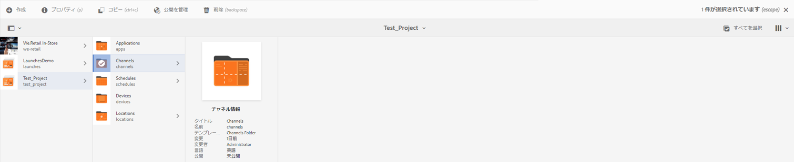

# キックスタートガイド {#kickstart-guide}

この節では、AEM Screens を使用しながら、基本的なアクションの実行方法を説明します。コンテンツやアセットを使用した基本的なデジタルサイネージエクスペリエンスをセットアップし、Screens Player に公開する方法を順を追って説明します。画面開発のすべてのコンポーネントについて詳しくは、ページの最後にあるリソースを参照してください。

## デジタルサイネージエクスペリエンスを 5 分で作成する {#creating-a-digital-signage-experience-in-minutes}

次の手順では、Screens のサンプルプロジェクトを作成して、Screens Player にコンテンツを公開できます。

1. To download **AEM Screens Player**, click [here](https://download.macromedia.com/screens/).

   AEM Screens is also available in **Google Play**.

   Chrome OS Player の導入について詳しくは、[Chrome 管理コンソール](implementing-chrome-os-player.md)を参照してください。

   詳しくは、[Screens のインストールおよび設定](configuring-screens-introduction.md)を参照してください。

   >[!NOTE]
   >
   >**OSGi 設定**
   >
   >
   >デバイスからサーバーへのデータの送信を許可するには、空のリファラーを有効にする必要があります。例えば、空のリファラーのプロパティが無効になっていると、デバイスからスクリーンショットを返送できません。現在、これらの機能の一部は、OSGI 設定で Apache Sling リファラーフィルターの Allow Empty 設定が有効になっている場合にのみ使用できます。ダッシュボードには、セキュリティ設定がこれらの機能の一部の動作を妨げる可能性があることを示す警告が表示される場合があります。
   >
   >
   >Follow the steps below to enable the ***Apache Sling Referrer Filter Allow Empty***:
   >
   >
   >
   >    1. Navigate to **Adobe Experience Manager Web Console Configuration**, that is `https://localhost:4502/system/console/configMgr/org.apache.sling.security.impl.ReferrerFilter`.
   >    1. Check the **allow.empty** option.
   >    1. 「**保存**」をクリックします。

1. **新しいプロジェクトの作成**

   1. Adobe Experience Manager リンク（左上）を選択し、**Screens** を選択します。または、に直接移動できます `https://localhost:4502/screens.html/content/screens](https://localhost:4502/screens.html/content/screens`。

   1. 「**作成**」をクリックして、新しい Screens プロジェクトを作成します（以下の図を参照）。
   1. **Screens プロジェクトの作成**&#x200B;ウィザードで「**スクリーン**」を選択し、「**次へ**」をクリックします。

   1. Enter the title as *Test_Project *and click **Create**.
   

   プロジェクトが作成されると、Screens プロジェクトコンソールに戻ります。これでプロジェクトを選択できます。In a project, there are five kind of folders namely **Applications**, **Channels**, **Devices**, **Locations**, and **Schedules**, as shown in the figure below.

   >[!NOTE]
   >
   >スケジュールは、AEM 6.3 Sites 機能パック 1 がインストールされている場合にのみ使用できます。この機能パックにアクセスするには、アドビサポートに連絡してアクセス権をリクエストする必要があります。アクセス権が付与されると、パッケージ共有から機能パックをダウンロードできるようになります。

   

   詳しくは [、Create and Manage Screens Project](creating-a-screens-project.md) （画面プロジェクトの作成と管理）を参照してください。

1. **新しいチャネルの作成**

   プロジェクトを作成したら、コンテンツを管理するための新しいチャネルを作成する必要があります。

   以下の手順に従って、プロジェクトの新しいチャネルを作成します。

   1. 作成した *Test_Project* に移動し、**チャネル**&#x200B;フォルダーを選択します。

   1. アクションバーから[**作成**]をクリックします（下図を参照）。 ウィザードが開きます。
   1. Choose the **Sequence Channel **and click **Next**.

   1. Enter the **Name** and **Title** as *TestChannel* and click **Create**.
   

   The *TestChannel* is created and added to your channels folder, as shown in the figure below.

   

   See [Channel Management](managing-channels.md) for more details on creating and managing channels.

1. **チャネルへのコンテンツの追加**

   チャネルを作成したら、Screens Player に表示するコンテンツをチャネルに追加する必要があります。

   以下の手順に従って、プロジェクトのチャネル（TestChannel **）にコンテンツを追加します。

   1. Navigate to the *Test_Project* you created and select the **Channels **folder.

   1. Click **Edit** from the action bar (see the figure below). * testChannel*用のエディターが開きます。

   1. アクションバーの左側にあるサイドパネルを切り替えるアイコンをクリックし、アセットとコンポーネントを開きます。
   1. チャネルに追加するコンポーネントをドラッグ＆ドロップします。
   

   この例では、チャネルに追加された画像がエディターに表示されます。

   

1. **新しいロケーションの作成**

   チャネルを作成したら、ロケーションを作成する必要があります。

   ***場所は*** 、様々なデジタルサイネージエクスペリエンスを区分けし、様々な画面の場所に従ってディスプレイの設定を含みます。

   以下の手順に従って、プロジェクトの新しいロケーションを作成します。

   1. Navigate to the *Test_Project* you created and select the **Locations **folder.

   1. Click **Create** next to the plus icon in the action bar (see the figure below). ウィザードが開きます。
   1. Select **Location** from the wizard and click **Next**.

   1. Enter the **Name** and **Title** for your location (enter the title as *TestLocation*) and click **Create**.
   

   The *TestLocation* is created and added to your **Locations** folder.

   

1. ***TestLocation*の新しいディスプレイの作成**

   ロケーションを作成したら、ロケーションのための新しいディスプレイを作成する必要があります。

   ***ディスプレイ***&#x200B;は、1 つまたは複数のスクリーンで実行されるデジタルエクスペリエンスを表します。

   1. Navigate to the location where you want to create your display (*Test_Projec* t --&gt; **Locations** --&gt; *TestLocation)* as shown in the figure above and selct *TestLocation*.

   1. 「**作成**」をクリックします。
   1. Select **Display **from the **Create** wizard and click **Next**.

   1. ディスプレイロケーションの「**名前**」および「**タイトル**」を入力します（タイトルには *TestDisplay* と入力します）。

   1. Under the **Display** tab, choose the details of the Layout.

      1. Choose the **Resolution** as **Full HD**.

      1. Choose the **Number of Devices Horizontally** as 1.
      1. Choose the **Number of Devices Vertically** as 1.
   1. 「**作成**」をクリックします。
   以下の図に示すように、新しいディスプレイ（*TestDisplay*）がロケーション（*TestLocation*）に追加されます。

   

1. **スケジュールの追加**

   AEM Screens で&#x200B;*スケジュール*&#x200B;を使用すると、複数のチャネルを再使用可能なグループに編成できるので、コンテンツを表示する各ディスプレイに個別に割り当てをおこなう必要がなくなります。

   >[!NOTE]
   >
   >この Screens 機能は、AEM 6.3 Sites 機能パック 1 がインストールされている場合にのみ使用できます。この機能パックにアクセスするには、アドビサポートに連絡してアクセス権をリクエストする必要があります。アクセス権が付与されると、パッケージ共有から機能パックをダウンロードできるようになります。

   1. Navigate to the **Schedules** folder from Test_Project --&gt; **Schedules**.

   1. 「**作成**」をクリックします。 ウィザードが開きます。
   1. **作成**&#x200B;ウィザードページから「**スケジュール**」を選択します。

   1. プロパティページで、「**名前**」および「**タイトル**」に MorningSchedule ** と入力します。

   1. 「**作成**」をクリックすると、以下の図に示すように、**スケジュール**&#x200B;フォルダーにスケジュールが追加されます。
   

   さらに、スケジュール（*MorningSchedule*）を選択し、アクションバーから「**ダッシュボード**」をクリックすると、スケジュールダッシュボードが表示されます。このダッシュボードを使用して、スケジュールのプロパティを表示／変更したり、チャネルを割り当てたり、割り当てられたディスプレイを表示したりできます。

   

   スケジュール [の詳細については、「スケジュールの作成と管理](managing-schedules.md) 」を参照してください。

1. **チャネルの割り当て**

   1. *Test_Project* —&gt; **Locations** —&gt; *TestLocation* —&gt; *TestDisplayDisplayから画面に移動し*&#x200B;ます。

   1. Select *TestDisplay* and tap/click **Assign Channel **from the action bar, *Or*,

   1. Click **Dashboard** and select **+Assign Channel** at the top right from **ASSIGNED CHANNELS &amp; SCHEDULES** panel, as shown in the figure below. **チャネル割り当て**&#x200B;ダイアログボックスが開きます。

   1. Select **Reference Channel** by **path**

   1. 「**チャネルロール**」に *LiveStream* と入力します。

   1. Select the** Channel Path** (*Test_Project* --&gt; *Channels* --&gt; *TestChannel* ) in the **Channel**.

   1. このチャネルの「**優先度**」として 1 ** を選択します。

   1. Choose the **Supported Events** as **Initial Load **and **Idle Screen**.

   1. Enter **Schedule **and select the dates in **active from** and **active until**.

   1. 「**保存**」をクリックします。
   チャネルが作成されてパネルに追加されます。

   

   To learn more about **Channel Assignment** dialog box and the properties associated with it, see [Assign Channels](channel-assignment.md).

1. **チャネルへのスケジュールの追加**

   1. *Test_Project* —&gt; **Locations** —&gt; *TestLocation* —&gt; *TestDisplayDisplayから画面に移動し*&#x200B;ます。

   1. Click **Dashboard** and select **+Assign Schedule** at the top right from **ASSIGNED CHANNELS &amp; SCHEDULES** panel, as shown in the figure above. **[割り当てのスケジュール** ]ダイアログボックスが開きます。

   1. Choose the path where you created your schedule (here, *Test_Project* --&gt; **Schedules** --&gt; *MorningSchedule*).

   1. 「**保存**」をクリックしてチャネルにスケジュールを追加します。
   

1. **デバイスの登録**

   AEM ダッシュボードを使用して、デバイスを登録する必要があります。

   >[!NOTE]
   >
   >Screens Player を開くには、ダウンロードした AEM Screens アプリケーションまたは Web ブラウザーを使用します。

   保留中のデバイスを表示するには：

   1. 別のブラウザーウィンドウを起動します。
   1. Go to Screens player using the *web browser* `https://localhost:4502/content/mobileapps/cq-screens-player/firmware.html` or launch the AEM Screens app. デバイスを開くと、デバイスの状態が未登録であることがわかります。
   1. From the AEM dashboard, navigate to *Test_Project* --&gt; **Devices**

   1. アクションバーから「**デバイスマネージャー**」をクリックします。
   1. Click **Device Registration** and you will see the pending devices, as shown in the figure below.
   

   登録するデバイスを選択して、「**デバイスを登録**」をクリックします。

   

   Web ブラウザーまたは AEM Screens Player からコードを確認して、コードを検証する必要があります。

   Click **Validate** to navigate to **Device Registration** screen.

   

   Enter **Title** and click **Register **and** **the device will be registered.

   Click **Finish** to complete the device registration step.

   

   Clicking **Finish** returns you to the device page that displays unassigned and assigned devices.

   

   >[!NOTE]
   >
   >追加したデバイスは、「**割り当て済み**」ステータスに「**割り当てなし**」として表示されます。

1. **ディスプレイへのデバイスの割り当て**

   デバイスを登録したら、そのデバイスをディスプレイに割り当てる必要があります。

   以下の手順に従って、デバイスを割り当てます。

   1. 割り当てるデバイスを選択します。
   1. Click **Assign Device** from the action bar.
   1. Select the display path for your channel as `/content/screens/Test_Project/***Locations***/TestLocation/TestDisplay.`

   1. 「**割り当て**」をクリックします。
   1. Click **Finish** to complete the process, and now the device is assigned.
   

   ディスプレイダッシュボードが開き、割り当てられたチャネルとスケジュールに関するすべての情報や、デバイス設定の詳細が表示されます。

   

### Screens Player でのコンテンツの表示 {#viewing-the-content-in-screens-player}

上記の設定を追加すると、プレーヤーは、画像など、デバイス上での表示に使用するデフォルトのチャネルを自動的に表示する必要があります（このシナリオでは、シーケンスチャネルとコンテンツはWebブラウザー用のScreens playerに表示されます）。

See [AEM Screens Player](working-with-screens-player.md) to get more detailed information on AEM Screens player.
