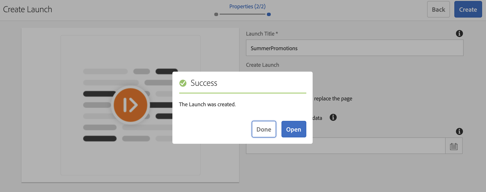

# Screens Launchを使用したコンテンツ更新 {#launches}

>[!IMPORTANT]
>このコンテンツは、AEM オンプレミス/AMS （AEM 6.5LTSおよびAEM 6.5）に対して有効です。 AEM as a Cloud Service Screensの内容については、[AEM as a Cloud Service ガイド &#x200B;](https://experienceleague.adobe.com/ja/docs/experience-manager-cloud-service/content/screens-as-cloud-service/overview/introduction)を参照してください。

コンテンツ作成者は、将来のチャネルバージョンを作成し、さらにこのローンチのライブ日付を設定できます。 この機能により、指定した日付にコンテンツをデバイスまたはプレーヤーで開始することができます。

***Screens ローンチ***&#x200B;を利用して、作成者はローンチの各チャネルをプレビューでき、レビューリクエストを開始できます。 承認者グループは通知を受け取り、リクエストを承認または却下できます。 ライブ日付に達すると、コンテンツがデバイスで再生されます。

例えば、作成者がc1、c2 （チャネル）の将来のバージョンを作成したい場合、ローンチが作成され、ライブ日が設定されます（例えば、11月10日8:00 A.M.）。 コンテンツがさらに更新されると、更新されたコンテンツが、レビューを受けるために送信されます。

承認後、ライブ日（11月10日、午前8:00）に、このローンチでは、デバイスまたはプレーヤー上のコンテンツが再生されます。

## 要件 {#requirements}

AEM Screens プロジェクトで *Screens ローンチ*&#x200B;の使用を開始する前に、猶予期間の概念とその関連性を理解しておく必要があります。

設定されたライブ日に対してプレーヤー上でエクスペリエンスを実行するには、次の操作を行います。

* ローンチの昇格（通常、数秒かかります）

* インスタンスを公開するためのリソースの公開（通常は数分かかり、公開する必要のあるチャネルまたはアセットのサイズによって異なります）。

* オフラインコンテンツの更新が完了するまでにかかる時間（通常は数分かかります）

* プレーヤーがパブリッシュインスタンスからコンテンツをダウンロードするのにかかる時間（通常は数分かかり、ダウンロードする必要のあるアセットの帯域幅とサイズによって異なります）。

* サーバーとプレーヤーの時間差

### 猶予時間について {#understanding-grace-period}

設定したライブ日付にプレーヤーがコンテンツの再生を開始できるようにするには、前述のアクティビティをライブ日付より前に開始します。

ライブ日が&#x200B;*11月24日、9:00 A.M.*&#x200B;および&#x200B;*24時間*&#x200B;の場合、上記のアクションのシーケンスは（ライブ日 – 猶予期間）、つまり11月23日、9:00 A.M. サーバー時間に開始されます。 この設定により、コンテンツがプレーヤーに届くまでに、上記のすべてのアクションを完了するのに 24 時間が与えられます。 プレーヤーは、この期間がローンチコンテンツであることを理解しています。 そのため、コンテンツはすぐに再生されませんが、プレーヤーはこのコンテンツを将来のバージョンとして保存し、プレーヤーのタイムゾーンで設定されたライブ日に正確に再生を開始することができます。

例えば、サーバーが PST にあり、デバイスが EST にあるとします。 最大時間差は 3 時間です。 昇格に 1 分、オーサーからパブリッシュへの公開に 10 分かかり、プレイヤーはリソースを通常 10～15 分でダウンロードできると想定しています。 次に、猶予期間=時間差（3 時間）の場合：

* ローンチを昇格するまでの追加時間（1 分）
* ローンチを公開するまでの追加時間（10 分）
* プレーヤーでダウンロードするまでの追加時間（10～15 分）
* 追加バッファー（30 分）

したがって、3 時間 56 分（14160 秒）になります。

そのため、ローンチのライブ日付をスケジュールすると、このオフセットを考慮して早めに昇格が開始されます。 上記の式では、ほとんどの項目は時間がかかりません。 サーバーと任意のプレーヤーの間の最大時間差を把握している場合、このオフセットに適切な推測を使用できます。

>[!NOTE]
>
>デフォルトでは、Screens ローンチの猶予期間は 24 時間に設定されています。 つまり、*/content/screens* の下のリソースにローンチのライブ日付を設定した場合、このオフセット分だけ早めに昇格が開始されます。

### 標準の猶予時間の更新 {#updating-out-of-the-box-grace-period}

この節では、標準の猶予期間を 10 分に更新する方法について説明します。

1. CRXDE Lite に移動してから `/libs/system/config.author/com.adobe.cq.wcm.launches.impl.LaunchesEventHandler.config` に移動します。
1. 右クリックし、ファイルをコピーします。
1. `/apps/system/config` に移動し、右クリックしてペーストします。
1. `/apps/system/config/com.adobe.cq.wcm.launches.impl.LaunchesEventHandler.config` をダブルクリックすると、CRXDE Lite のエディターでファイルを開くことができます。 パス */content/screens/* の猶予期間が **86400** として表示されます。 この値を **600** に変更します。

これで、テキストファイル内のコンテンツは次のようになります。

```java
launches.eventhandler.launch.promotion.graceperiod=[ \
   "/content/screens(/.*):600", \
   ]
```

前の例では、猶予期間を 10 分に設定しました。 そのため、*/content/screens* の下のリソースにローンチのライブ日付を設定した場合、このオフセット分だけ早めに昇格が開始されます。

例えば、ライブ日が午前9:00時の11月24日に設定され、猶予期間が600秒の場合、プロモーションジョブは午前8:50時に11月24日に開始されます。

## Screens ローンチの使用 {#using-launches}

この節では、AEM Screens プロジェクトに Screens ローンチを実装する方法を説明します。

### Screens ローンチの作成 {#creating-a-launch}

AEM Screens プロジェクトに Screens ローンチ機能を実装するには、以下の手順に従います。

1. AEM Screens プロジェクト内で、シーケンスチャネル（例：**LaunchesDemo**／**チャネル**／**FutureLaunch**）を作成します（下図を参照）。

   >[!CAUTION]
   >
   >AEM Screens プロジェクト内の既存のチャネルからローンチを作成します。

   

1. **FutureLaunch** チャネルをクリックし、アクションバーの「**ローンチを作成**」をクリックします。

   

1. **ローンチを作成**&#x200B;ウィザードが開きます。 ウィザードに既に表示されているチャネルをクリックするか、「**+ チャネルを追加**」をクリックしてローンチを作成するチャネルを追加します。

1. 「**ローンチを作成**」ウィザードで「**次へ**」をクリックします。 「**サブページを含める**」オプションはデフォルトで選択されています。

   

   >[!NOTE]
   >「**+ チャネルを追加**」オプションを使用して、ローンチを作成する別のチャネルを追加できます。

   「**チャネルを追加**」オプションを使用するには、ローンチを作成するチャネルに移動し、「**選択**」をクリックします。

   ローンチを追加するために複数のチャネルまたはフォルダーをクリックしようとすると、「**選択**」オプションは無効になります。

   

   1 つまたは複数のチャネルをクリックしたら、「**次へ**」をクリックします。


1. 「**ローンチタイトル**」に「**SummerPromotions**」と入力します。「**ローンチ日**」を設定する必要はありません（下図を参照）。 「**作成**」をクリックします。

   >[!NOTE]
   >
   >「**ソースページのライブデータを継承**」オプションを&#x200B;*オンにする*&#x200B;と、チャネルをライブコピーとしてローンチに作成できます。 元のチャネルで変更が行われた場合、その変更はローンチチャネルに自動的に適用されます。
   >
   >
   >「**ソースページのライブデータを継承**」を&#x200B;*オフにする*&#x200B;と、チャネルをライブ関係なしにローンチにコピーできます。 したがって、元のチャネルに変更が加えられた場合、その変更はローンチチャネルには適用されません。

   

   >[!NOTE]
   >
   >ライブローンチ日は、この手順で設定することもできますし、ローンチを作成してからプロパティの編集時にセットアップすることもできます。

   **ローンチの昇格範囲について**

   * **すべてのローンチを昇格** – 設定したライブ日付でローンチのすべてのチャネルが昇格されます。
   * **変更したページを昇格** – 変更されたローンチリソースのみ昇格されます。 ローンチのレビューが不要な場合は、このオプションを使用します。
   * **承認済みページの昇格** – このオプションを使用するには、ローンチチャネルでローンチ承認ワークフローを実行する必要があります。 承認されたページのみが、設定されたライブ日付に昇格されます。

     >[!CAUTION]
     >
     >ローンチのライブ日付は、サーバーのタイムゾーンではなく、プレーヤーやデバイスのタイムゾーンに従います。

1. ローンチが作成されることを確認します。 「**開く**」をクリックすると、ページがエディターに表示され、「**完了**」をクリックすると、プロジェクトに戻ります。

   

   「**完了**」を選択すると、**FutureLaunch** チャネルに戻ることができます。

   


### ローンチプロパティの編集によるライブ日付と範囲の設定 {#editing-the-launch-properties-to-set-the-live-date-and-scope}

ローンチの作成後は、「**ローンチプロパティ**」を使用して、ライブ日付、ローンチタイトル、昇格範囲などのプロパティを更新できます。

* **ローンチ日** – ライブ日付。つまり、Screens プレーヤーのタイムゾーンに従ってコンテンツがプレーヤーで再生される日時のことです。
* **本番準備完了** - 昇格の後にチャネルを公開できます。標準で有効になっているので、変更する必要はありません。
* **範囲** – ローンチのプロモーション時にプロモーションの対象となるチャネルを決定します。

ローンチプロパティを編集するには、以下の手順に従います。

1. 次の図に示すように、チャネル **FutureLaunch** *（保留中のローンチ）*&#x200B;に移動し、チャネルをクリックします。

   

1. アクションバーの「**ダッシュボード**」をクリックすると、チャネルダッシュボードに&#x200B;**保留中のローンチ**&#x200B;パネルが表示されます。

   

1. ローンチをクリックし、**保留中のローンチ**&#x200B;パネルで「**ローンチプロパティ**」をクリックします。

   

### Screens ローンチの編集によるチャネルの追加または削除 {#editing-the-screens-launch-to-add-or-remove-channels}

ローンチを作成した後、「**ローンチを編集**」オプションを使用して、既存のローンチでチャネルを追加または削除できます。

完了したら、「**保存**」をクリックして **FutureLaunch** チャネルに戻ります。

### 手動による Screens ローンチの昇格{#promote-the-screens-launch-manually}

**保留中のローンチ**&#x200B;パネルの「**`Promote Launch`**」オプションを使用して、ローンチを手動で昇格できます。

「**ローンチプロモーションウィザード**」で、手動によるプロモーションの一部としてプロモーションを実行するリソースを選択できます。


1. このオプションを有効または無効にして、実稼動後のローンチを削除できます。
1. 次のオプションを使用して、ローンチの&#x200B;**範囲**&#x200B;を設定できます。
   * **すべてのローンチを昇格** – 設定したライブ日付でローンチのすべてのチャネルが昇格されます。
   * **変更したページを昇格** – 変更されたローンチリソースのみ昇格されます。 ローンチのレビューが不要な場合は、このオプションを使用します。
   * **承認済みページの昇格** – このオプションを使用するには、ローンチチャネルでローンチ承認ワークフローを実行する必要があります。 承認されたページのみが、設定されたライブ日付に昇格されます。
   * **現在のページを昇格** – このオプションを使用するには、ローンチ承認ワークフローが現在のページに対してのみ実行される必要があります。
1. 「**ローンチを昇格**」ウィザードで「**次へ**」をクリックします。
1. 「**昇格**」をクリックしてローンチを昇格します。

### Screens ローンチの削除

ローンチは、**保留中のローンチ**&#x200B;パネルの「**ローンチを削除**」オプションを使用して削除できます。

>[!CAUTION]
>
>この操作により、派生したすべてのローンチ（ネストされたローンチ）も削除されます。
