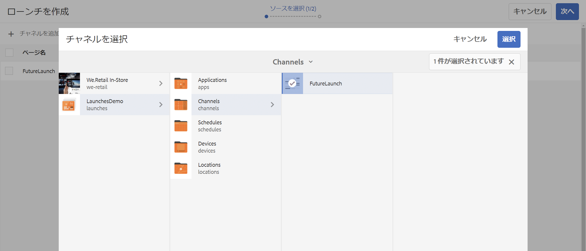

# ローンチ {#launches}

コンテンツ作成者は、「**ローンチ**」と呼ばれるチャネルの将来バージョンを作成でき、さらに、このローンチのライブ日付を設定することで、デバイスやプレーヤーでコンテンツをライブにすることができます。

ローンチを利用して、作成者はローンチの各チャネルをプレビューでき、レビュー要求も開始できます。承認者グループは通知を受け取り、要求を承認または拒否できます。ライブ日付に達すると、コンテンツがデバイスで再生されます。

例えば、作成者が c1 および c2（チャネル）という将来バージョンを作成する場合は、ローンチを作成し、ライブ日付を設定します（例：11 月 10 日午前 8 時 00 分）。コンテンツがさらに更新されると、更新されたコンテンツが、レビューを受けるために送信されます。要求が承認され、ライブ日付（例：11 月 10 日午前 8 時 00 分）になると、このローンチがデバイスまたはプレーヤーでコンテンツを再生します。

## 要件 {#requirements}

AEM Screens プロジェクトへのローンチの実装を開始する前に、「猶予時間」の概念とその関連性を理解しておく必要があります。

次の節では、猶予時間とそれをデフォルトとして設定する方法について説明します。また、サンプルのテスト設定をダウンロードして、その使用方法を理解することもできます。

### 猶予時間について {#understanding-grace-period}

以下のセットアップでは、ローンチで必要な&#x200B;***猶予時間&#x200B;***を管理者が設定できます。

**猶予時間**&#x200B;には以下が含まれます。

* ローンチの昇格に要する時間
* パブリッシュインスタンスへのリソースの公開に要する時間
* デバイスでコンテンツをパブリッシュインスタンスからダウンロードするのかかる時間、およびサーバーとプレーヤーの時間差

例えば、サーバーとデバイスのタイムゾーンがそれぞれ PST と EST であるとします（この場合、最大時差は 3 時間です）。また、プロモーションに 1 分、オーサーからパブリッシュへの公開に 10 分、プレーヤーがリソースをダウンロードするのには通常 10～15 分、それぞれかかるとしましょう。猶予時間は、時差（3 時間）+ ローンチの昇格に要する時間（1 分）+ ローンチの公開に要する時間（10 分）+ プレーヤーでのダウンロードに要する時間（10～15 分）+ バッファー（余裕を見て例えば 30 分）= 3 時間 56 分 = 14160 秒になります。したがって、ローンチのライブ日付をスケジュールした場合は、このオフセット分だけ早めに昇格が開始されます。上記の式では、ほとんどの項目に多くの時間はかかりません。サーバーとプレーヤーの間の最大時差がわかれば、このオフセットの妥当な推測をおこなえます。

### デフォルトの猶予時間の設定 {#configuring-out-of-the-box-grace-period}

デフォルトでは、ローンチの猶予時間は 24 時間に設定されています。つまり、*/content/screens* 下のリソースにローンチのライブ日付を設定した場合、このオフセット分だけ早めに昇格が開始されます。例えば、ライブ日付を 11 月 24 日午前 9 時 00 分に設定し、猶予時間を 24 時間に設定した場合、昇格ジョブは 11 月 23 日午前 9 時 00 分に開始されます。

### 設定のダウンロード {#downloading-configurations}

次のテスト設定をダウンロードできます。

[ファイルを入手](assets/launches_event_handlerconfig-10.zip)

>[!NOTE]
>
>このテスト設定では猶予時間は 600 秒に設定されています。

#### 設定の更新 {#updating-the-configurations}

上記の設定を変更する場合は、以下の手順に従います。

* /apps/system/config に、***com.adobe.cq.wcm.launches.impl.LaunchesEventHandler.config ***という名前の**sling:OsgiConfig/nt:file **を次の内容で作成します。

   *launches.eventhandler.updatelastmodification=B&quot;false&quot;
launches.eventhandler.launch.promotion.graceperiod=[&quot;/content/screens(/.*):600&quot;]launches.eventhandler.threadpool.maxsize=I&quot;5&quot;
launches.eventhandler.threadpool.priority=&quot;MIN&quot;*

* `launches.eventhandler.launch.promotion.graceperiod=["/content/screens(/.&#42;):600"` の指定により、パス */content/screens* に 600 秒の猶予時間を設定できます。

つまり、*/content/screens* の下のリソースにローンチのライブ日付を設定した場合、このオフセット分だけ早めに昇格が開始されます。例えば、ライブ日付を 11 月 24 日午前 9 時 00 分に設定し、猶予時間を 600 秒に設定した場合、昇格ジョブは 11 月 24 日午前 8 時 50 分に開始されます。

## ローンチの使用 {#using-launches}

この節では、AEM Screens プロジェクトにローンチを実装する方法について説明します。ここでは、以下のトピックについて説明します。

1. **ローンチの作成**
1. **ローンチの編集によるライブ日付と範囲の設定**

### ローンチの作成 {#creating-a-launch}

AEM Screens プロジェクトに将来バージョン公開機能を実装するには、以下の手順に従います。

1. AEM Screens プロジェクト内のチャネル（例：**LaunchesDemo**／**Channels**／**FutureLaunch**）に移動します（下図を参照）。

   >[!CAUTION]
   >
   >AEM Screens プロジェクト内の既存のチャネルからローンチを作成する必要があります。

   

1. チャネル **FutureLaunch** を選択し、「**作成**」をクリックします。ドロップダウンメニューから「**ローンチ**」を選択します。

   

1. **ローンチを作成**&#x200B;ウィザードが開きます。「**+ ページを追加**」をクリックして、ローンチを作成する AEM Screens チャネルを選択します。

   

1. そのチャネルに移動し、「**選択**」をクリックします。

   

1. ページを選択したら、「**次へ**」をクリックして、**ローンチを作成**&#x200B;ウィザードで手順を 1 つ進めます。

   

1. 「**ローンチタイトル**」に「**SummerPromotions**」と入力します。「**ローンチ日**」を設定する必要はありません（下図を参照）。「**作成**」をクリックします。

   >[!NOTE]
   >
   >「**ソースページのライブデータを継承**」オプションを&#x200B;*オンにする*&#x200B;と、チャネルをライブコピーとしてローンチに作成できます。元のチャネルで変更がおこなわれた場合、その変更はローンチチャネルに自動的に適用されます。
   >
   >
   >「**ソースページのライブデータを継承**」を&#x200B;*オフにする*&#x200B;と、チャネルをライブ関係なしにローンチにコピーできます。したがって、元のチャネルに変更が加えられた場合、その変更はローンチチャネルには適用されません。

   

   >[!NOTE]
   >
   >ライブローンチ日は、この手順で設定することもできますし、ローンチを作成してからプロパティの編集時にセットアップすることもできます。

1. ローンチが作成されたことがわかります。「**開く**」をクリックすると、ページがエディターに表示され、「**完了**」をクリックすると、プロジェクトに戻ります。

   

   「**完了**」をクリックすると、**LaunchesDemo** プロジェクトに戻ることができます。

   

### ローンチプロパティの編集によるライブ日付と範囲の設定 {#editing-the-launch-properties-to-set-the-live-date-and-scope}

ローンチを作成したら、ローンチプロパティを編集して、ローンチのライブ日付と範囲を設定する必要があります。

ローンチプロパティを編集するには、以下の手順に従います。

1. チャネル（**FutureLaunch**）に移動して選択します（下図を参照）。左側のサイドレールから&#x200B;**参照**&#x200B;レールを開きます。

   >[!NOTE]
   >
   >左側のレールから「**コンテンツツリー**」オプションを選択して、作成したローンチを開きます。

   

1. 「**ローンチ**」に移動し、作成したローンチ（**SummerPromotions**）を選択します。「**プロパティを編集**」をクリックします。

   

1. ローンチ **SummerPromotions** のダイアログボックスが開きます。次のフィールドの値を指定します。

   * 「**ローンチ日**」を選択します。
   * 「**実稼動準備完了**」をオンにします。
   * 「**範囲**」から「**承認したページを昇格**」を選択します。
   >[!NOTE]
   >
   >「**自動昇格**」の各ローンチエントリについては次のとおりです。

   >    * 「**ローンチ日**」：ライブ日付を指します。つまり、Screens プレーヤーのタイムゾーンに従ってコンテンツがプレーヤーで再生される日時のことです。
   >    * 「**実稼動準備完了**」：チャネルの昇格が可能になります。つまり、ローンチの使用準備ができています。
   >    * 「**範囲**」：ローンチ時に昇格可能なチャネルを指します。

   範囲をセットアップする場合は、次の 3 つのオプションがあります。
   1. **すべてのローンチを昇格**：設定したライブ日付でローンチのすべてのチャネルが昇格されます。
   1. **変更したページを昇格**：編集されたローンチリソースのみ昇格されます。ローンチのレビューが不要な場合は、このオプションを使用することをお勧めします。ローンチチャネルの変更内容を昇格させることができます。
   1. **承認したページを昇格**：設定したライブ日付で承認済みページのみ昇格されます。
   

   >[!CAUTION]
   >
   >ローンチの昇格では、サーバーのタイムゾーンではなくプレーヤーやデバイスのタイムゾーンに従います。

1. 「**保存して閉じる**」をクリックして、**FutureLaunch** チャネルに戻ります。

   

