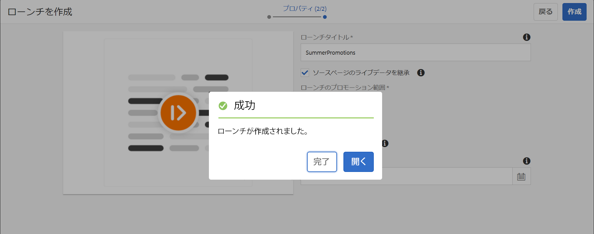

# 画面の起動を使用したコンテンツの更新 {#launches}

Content authors can create future version of the channel(s), known as **Screens Launch** and further setting live date for this launch allows content to be live in devices or players.

今後の発行の助けを借りて、作成者は起動の各チャネルをプレビューでき、レビューのリクエストを開始できるようになります。 承認者グループは通知を受け取り、要求を承認または拒否できます。ライブ日付に達すると、コンテンツがデバイスで再生されます。

例えば、作成者が c1 および c2（チャネル）という将来バージョンを作成する場合は、ローンチを作成し、ライブ日付を設定します（例：11 月 10 日午前 8 時 00 分）。コンテンツがさらに更新されると、更新されたコンテンツが、レビューを受けるために送信されます。要求が承認され、ライブ日付（例：11 月 10 日午前 8 時 00 分）になると、このローンチがデバイスまたはプレーヤーでコンテンツを再生します。

## 要件 {#requirements}

AEM Screensプロジェクトでの今後の公開の実装を開始する前に、猶予期間の概念とその関連性を理解しておく必要があります。

次の節では、猶予時間とそれをデフォルトとして設定する方法について説明します。また、サンプルのテスト設定をダウンロードして、その使用方法を理解することもできます。

### 猶予時間について {#understanding-grace-period}

The following setup allows the admin to configure the ***Grace Period***, required in future publish.

**猶予時間**&#x200B;には以下が含まれます。

* ローンチの昇格に要する時間
* パブリッシュインスタンスへのリソースの公開に要する時間
* デバイスでコンテンツをパブリッシュインスタンスからダウンロードするのかかる時間、およびサーバーとプレーヤーの時間差

例えば、サーバーとデバイスのタイムゾーンがそれぞれ PST と EST であるとします（この場合、最大時差は 3 時間です）。また、プロモーションに 1 分、オーサーからパブリッシュへの公開に 10 分、プレーヤーがリソースをダウンロードするのには通常 10～15 分、それぞれかかるとしましょう。猶予時間は、時差（3 時間）+ ローンチの昇格に要する時間（1 分）+ ローンチの公開に要する時間（10 分）+ プレーヤーでのダウンロードに要する時間（10～15 分）+ バッファー（余裕を見て例えば 30 分）= 3 時間 56 分 = 14160 秒になります。したがって、ローンチのライブ日付をスケジュールした場合は、このオフセット分だけ早めに昇格が開始されます。上記の式では、ほとんどの項目に多くの時間はかかりません。サーバーとプレーヤーの間の最大時差がわかれば、このオフセットの妥当な推測をおこなえます。

### デフォルトの猶予時間の設定 {#configuring-out-of-the-box-grace-period}

デフォルトでは、ローンチの猶予時間は 24 時間に設定されています。つまり、*/content/screens* 下のリソースにローンチのライブ日付を設定した場合、このオフセット分だけ早めに昇格が開始されます。例えば、ライブ日付を 11 月 24 日午前 9 時 00 分に設定し、猶予時間を 24 時間に設定した場合、昇格ジョブは 11 月 23 日午前 9 時 00 分に開始されます。

### 設定のダウンロード {#downloading-configurations}

次のテスト設定をダウンロードできます。

[ファイルを入手](assets/launches_event_handlerconfig-10.zip)

>[!NOTE]
>
>このテスト設定では猶予時間は 600 秒に設定されています。

#### 設定の更新 {#updating-the-configurations}

上記の設定を変更する場合は、以下の手順に従います。

* /apps/system/config に、***com.adobe.cq.wcm.launches.impl.LaunchesEventHandler.config*** という名前の **sling:OsgiConfig/nt:file** を次の内容で作成します。

   *launches.eventhandler.updatelastmodification=B&quot;false&quot;
launches.eventhandler.launch.promotion.graceperiod=[&quot;/content/screens(/.*):600&quot;]launches.eventhandler.threadpool.maxsize=I&quot;5&quot;
launches.eventhandler.threadpool.priority=&quot;MIN&quot;*

* `launches.eventhandler.launch.promotion.graceperiod=["/content/screens(/.&#42;):600"` の指定により、パス */content/screens* に 600 秒の猶予時間を設定できます。

つまり、*/content/screens* の下のリソースにローンチのライブ日付を設定した場合、このオフセット分だけ早めに昇格が開始されます。例えば、ライブ日付を 11 月 24 日午前 9 時 00 分に設定し、猶予時間を 600 秒に設定した場合、昇格ジョブは 11 月 24 日午前 8 時 50 分に開始されます。

## 画面起動の使用 {#using-launches}

以下の節に従って、AEM Screensプロジェクトに起動を実装します。 ここでは、以下のトピックについて説明します。

1. **画面起動の作成**
1. **画面の起動の編集によるライブの日付と範囲の設定**

### Creating a Screens Launch {#creating-a-launch}

次の手順に従って、AEM Screensプロジェクトに起動機能を実装します。

1. Create a sequence channel in your AEM Screens project, for example **LaunchesDemo** --> **Channels** --> **FutureLaunch**, as shown below.

   >[!CAUTION]
   >
   >AEM Screens プロジェクト内の既存のチャネルからローンチを作成する必要があります。

   

1. Select the channel **FutureLaunch** and click **Create Launch** from the action bar.

   

1. **ローンチを作成**&#x200B;ウィザードが開きます。ウィザードに既に表示されているチャネルを選択するか、[ **+ 追加チャネル** ]をクリックして起動を作成するチャネルを追加します。

#### 既存のチャネル {#existing-channel-launch}

1. 起動の作成チャネルに既に存在するウィザードを **選択し** 、「次へ」をクリッ **クします**。

   

1. Select the channel and click **Next** from the action bar.

   >[!NOTE]
   >**「サブページを含める** 」オプションはデフォルトで選択されています。

   

1. 「**ローンチタイトル**」に「**SummerPromotions**」と入力します。「**ローンチ日**」を設定する必要はありません（下図を参照）。「**作成**」をクリックします。

   >[!NOTE]
   >
   >「**ソースページのライブデータを継承**」オプションを&#x200B;*オンにする*&#x200B;と、チャネルをライブコピーとしてローンチに作成できます。元のチャネルで変更がおこなわれた場合、その変更はローンチチャネルに自動的に適用されます。
   >
   >
   >「**ソースページのライブデータを継承**」を&#x200B;*オフにする*&#x200B;と、チャネルをライブ関係なしにローンチにコピーできます。したがって、元のチャネルに変更が加えられた場合、その変更はローンチチャネルには適用されません。

   

   >[!NOTE]
   >
   >ライブローンチ日は、この手順で設定することもできますし、ローンチを作成してからプロパティの編集時にセットアップすることもできます。

1. ローンチが作成されたことがわかります。「**開く**」をクリックすると、ページがエディターに表示され、「**完了**」をクリックすると、プロジェクトに戻ります。

   

   Clicking **Done** allows you to navigate back to your **FutureLaunch** channel.

   

#### オプション追加の使用 {#add-channel-launch}

1. 「 **+チャネル** 」をクリックして、起動を作成するチャネルを追加します。

   

   >[!NOTE]
   >起動を **** 追加するために複数のチャネルまたはフォルダを選択しようとすると、「選択」オプションは無効になります。

1. 起動を作成するチャネルに移動し、「選択」をクリックし **ます**。

   

1. これで、追加したチャネルを選択して起動を作成し、「次へ」をクリックで **きます**。

   

1. 「**ローンチタイトル**」に「**SummerPromotions**」と入力します。「**ローンチ日**」を設定する必要はありません（下図を参照）。「**作成**」をクリックします。

   >[!NOTE]
   >
   >「**ソースページのライブデータを継承**」オプションを&#x200B;*オンにする*&#x200B;と、チャネルをライブコピーとしてローンチに作成できます。元のチャネルで変更がおこなわれた場合、その変更はローンチチャネルに自動的に適用されます。
   >
   >
   >「**ソースページのライブデータを継承**」を&#x200B;*オフにする*&#x200B;と、チャネルをライブ関係なしにローンチにコピーできます。したがって、元のチャネルに変更が加えられた場合、その変更はローンチチャネルには適用されません。

   

   >[!NOTE]
   >
   >ライブローンチ日は、この手順で設定することもできますし、ローンチを作成してからプロパティの編集時にセットアップすることもできます。

1. ローンチが作成されたことがわかります。「**開く**」をクリックすると、ページがエディターに表示され、「**完了**」をクリックすると、プロジェクトに戻ります。

   

   Clicking **Done** allows you to navigate back to your **FutureLaunch** channel.

   

### ローンチプロパティの編集によるライブ日付と範囲の設定 {#editing-the-launch-properties-to-set-the-live-date-and-scope}

ローンチを作成したら、ローンチプロパティを編集して、ローンチのライブ日付と範囲を設定する必要があります。

ローンチプロパティを編集するには、以下の手順に従います。

1. 次の図に示すように、 **チャネル** FutureLaunch *(* つまり保留中の起動)に移動し、チャネルを選択します。

   

1. アクションバ **ーで** ダッシュボード **をクリックすると、チャネルダッシュボードに「** PENDING LAUNCHES」パネルが表示されます。

   

1. 起動を選択し、「 **PENDING LAUNCHES」パネルから目的のアクションをク** リックします。

   

1. 例えば、「起動プロパティ」をク **リックして** 、「夏のプロモーション」の開始のプロパティを編 **集します**。

   

1. ランチタイトルを編集 **し、次のフィールド** に値を入力できます。

   * 「**ローンチ日**」を選択します。
   * 「**実稼動準備完了**」をオンにします。
   * 「**範囲**」から「**承認したページを昇格**」を選択します。
   **自動プロモーションの下の起動エントリについて：**

   * 「**ローンチ日**」：ライブ日付を指します。つまり、Screens プレーヤーのタイムゾーンに従ってコンテンツがプレーヤーで再生される日時のことです。
   * 「**実稼動準備完了**」：チャネルの昇格が可能になります。つまり、ローンチの使用準備ができています。
   * 「**範囲**」：ローンチ時に昇格可能なチャネルを指します。
   範囲をセットアップする場合は、次の 3 つのオプションがあります。

   * **すべてのローンチを昇格**：設定したライブ日付でローンチのすべてのチャネルが昇格されます。
   * **変更したページを昇格**：編集されたローンチリソースのみ昇格されます。ローンチのレビューが不要な場合は、このオプションを使用することをお勧めします。ローンチチャネルの変更内容を昇格させることができます。
   * **承認したページを昇格**：設定したライブ日付で承認済みページのみ昇格されます。

      >[!CAUTION]
      >
      >ローンチの昇格では、サーバーのタイムゾーンではなくプレーヤーやデバイスのタイムゾーンに従います。

1. 「**保存して閉じる**」をクリックして、**FutureLaunch** チャネルに戻ります。

