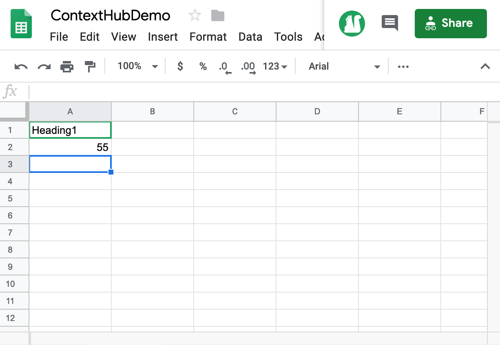
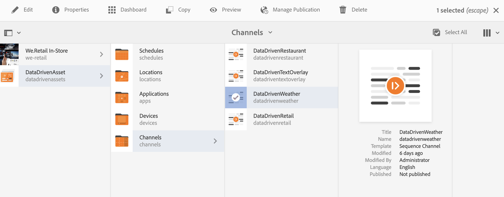
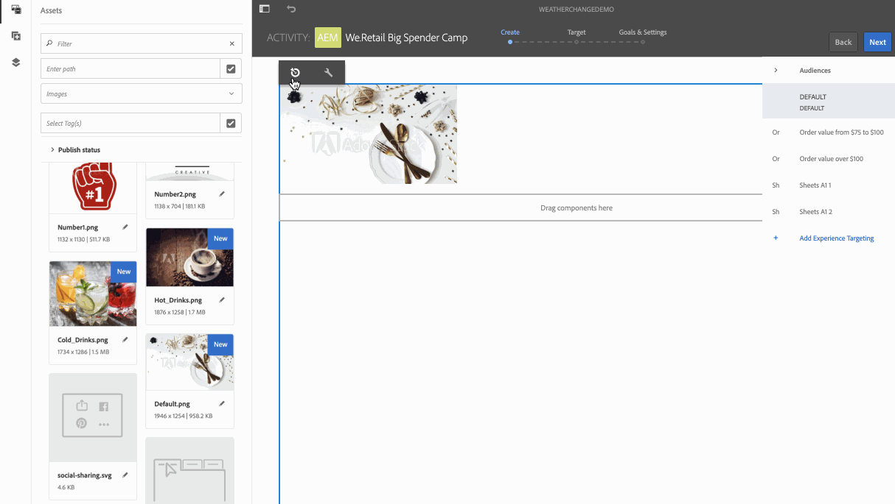
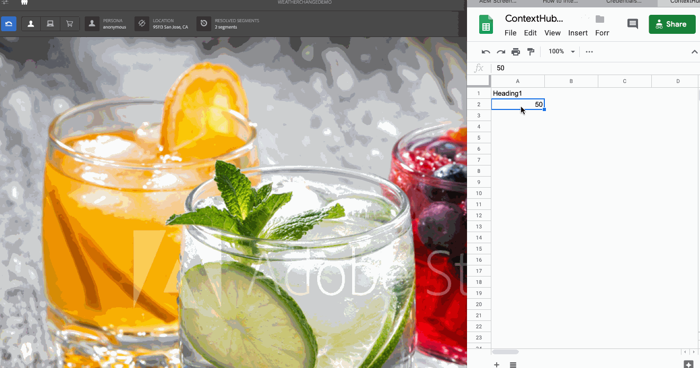

# 旅行センター向けの気温に応じたアクティベーション {#travel-center-temperature-activation}

>[!IMPORTANT]
>このコンテンツは、AEM オンプレミス/AMS （AEM 6.5LTSおよびAEM 6.5）に対して有効です。 AEM as a Cloud Service Screensの内容については、[AEM as a Cloud Service ガイド &#x200B;](https://experienceleague.adobe.com/ja/docs/experience-manager-cloud-service/content/screens-as-cloud-service/overview/introduction)を参照してください。

以下の使用例では、Google シートに入力された値に基づく、旅行センター向けの現地気温に応じたアクティベーションを示しています。

## 説明 {#description}

この使用例では、Google スプレッドシートの値が 50 未満の場合、温かい飲み物の画像が表示されます。 値が 50 以上の場合は、冷たい飲み物の画像が表示されます。 他の値がある場合や値がない場合、プレーヤーはデフォルトの画像を表示します。

## 前提条件 {#preconditions}

旅行センター向けの現地気温に応じたアクティベーションの実装を開始する前に、AEM Screens プロジェクトで&#x200B;***データストア***、***オーディエンスのセグメント化***、***チャネルのターゲティングの有効化***&#x200B;の設定方法を理解しておいてください。

詳しくは、[AEM Screens での ContextHub の設定](configuring-context-hub.md)を参照してください。

## 基本フロー {#basic-flow}

「旅行センター向けの現地気温に応じたアクティベーション」の使用例を実装するには、以下の手順に従います。

1. **Google シートにデータを入力する**

   1. ContextHubDemo Google シートに移動します。
   1. 気温に対応する値を格納する **`Heading1`** という列を追加します。

   

1. **要件に従ってオーディエンスのセグメントを設定する**

   1. オーディエンスのセグメントに移動します（詳しくは、**[AEM Screens での ContextHub の設定](configuring-context-hub.md)**&#x200B;ページの&#x200B;***手順 2：オーディエンスのセグメント化のセットアップ***&#x200B;を参照してください）。

   1. 「**Sheets A1 1**」をクリックし、「**編集**」をクリックします。

   1. 比較プロパティをクリックして、設定アイコンをクリックします。
   1. **プロパティ名**&#x200B;のドロップダウンから「**googlesheets/value/1/0**」をクリックします

   1. 「**演算子**」のドロップダウンメニューから「**次よりも大きいか等しい**」をクリックします

   1. 「**値**」に「**50**」を入力します。

   1. 同様に、「**Sheets A1 2**」を選択し、「**編集**」をクリックします。

   1. **比較プロパティ – 値**&#x200B;をクリックし、設定アイコンを選択します。
   1. **プロパティ名**&#x200B;のドロップダウンから「**googlesheets/value/1/0**」をクリックします

   1. 「**演算子**」のドロップダウンメニューから「**次よりも小さい**」を選択します

   1. 「**値**」に「**50**」を入力します。

1. チャネルに移動して選択し、アクションバーの「**編集**」をクリックします。 次の例では、**DataDrivenWeather** というシーケンスチャネルを使用して機能を紹介しています。

   >[!NOTE]
   >
   >チャネルには既にデフォルトの画像が存在し、[AEM Screens プロジェクトでの ContextHub の設定](configuring-context-hub.md)で説明しているとおりにオーディエンスが事前設定されています。

   

   >[!CAUTION]
   >
   >チャネル&#x200B;**プロパティ**／**パーソナライゼーション**&#x200B;タブを使用した **ContextHub** **設定**&#x200B;は既にセットアップされているはずです。

   

1. エディターから「**ターゲティング**」をクリックし、「**ブランド**」をクリックしてドロップダウンメニューから「**アクティビティ**」をクリックします。次に、「**ターゲティングを開始**」をクリックします。

   

1. **プレビューを確認する**

   1. 「**プレビュー」をクリックします。** また、Google シートを開き、その値を更新します。
   1. 値を 50 未満に変更します。 冷たい飲み物の画像をご覧いただけます。 Google Sheets の値が 50 以上の場合は、温かい飲み物の画像が表示されます。

   

