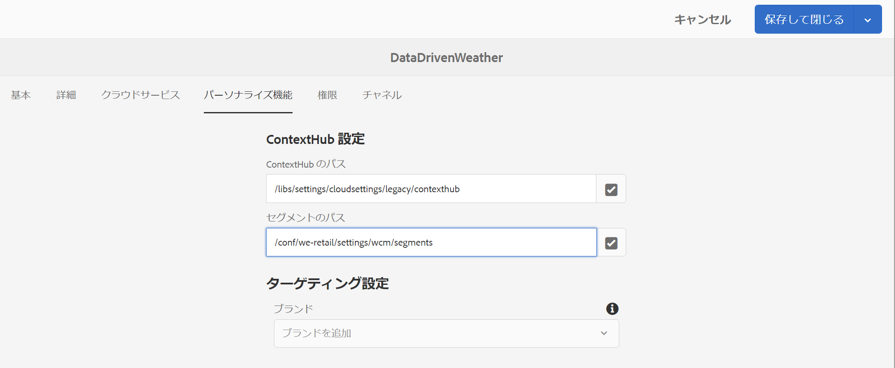

# 旅行センター向けの気温に応じたアクティベーション {#travel-center-temperature-activation}

以下の使用例では、Google シートに入力された値に基づく、旅行センター向けの現地気温に応じたアクティベーションを示しています。

## 説明 {#description}

このユースケースでは、Google シートの値が 50 未満の場合、ホットドリンクを含む画像が表示されます。 値が 50 以上の場合は、コールドドリンクを含む画像が表示されます。 他の値がある場合や、値がない場合、プレーヤーはデフォルトの画像を表示します。

## 前提条件 {#preconditions}

旅行センター向けの現地気温に応じたアクティベーションの実装を開始する前に、AEM Screens プロジェクトで&#x200B;***データストア***、***オーディエンスのセグメント化***、***チャネルのターゲティングの有効化***&#x200B;をセットアップする方法を理解しておく必要があります。

参照： [AEM Screensでの ContextHub の設定](configuring-context-hub.md) を参照してください。

## 基本フロー {#basic-flow}

「旅行センター向けの現地気温に応じたアクティベーション」の使用例を実装するには、以下の手順に従います。

1. **Google シートにデータを入力する**

   1. ContextHubDemo Google シートに移動します。
   1. を使用して列を追加 **`Heading1`** 温度に対応する値を持ちます。

   

1. **要件に従ってオーディエンスのセグメントを設定する**

   1. オーディエンスのセグメントに移動します（を参照）。 ***手順 2：オーディエンスセグメント化の設定*** 。対象： **[AEM Screensでの ContextHub の設定](configuring-context-hub.md)** 詳しくはこちらを参照してください）。

   1. 「**Sheets A1 1**」を選択し、「**編集**」をクリックします。

   1. 比較プロパティを選択し、設定アイコンをクリックします。
   1. 「**プロパティ名**」のドロップダウンから「**googlesheets/value/1/0**」を選択します。

   1. 「**演算子**」のドロップダウンメニューから「**次よりも大きいか等しい**」を選択します。

   1. 「**値**」に「**50**」を入力します。

   1. 同様に、「**Sheets A1 2**」を選択し、「**編集**」をクリックします。

   1. 「」を選択します **Comparison プロパティ – 値** 「設定」アイコンをクリックします。
   1. 「**プロパティ名**」のドロップダウンから「**googlesheets/value/1/0**」を選択します。

   1. 「**演算子**」のドロップダウンメニューから「**次よりも小さい**」を選択します

   1. 「**値**」に「**50**」を入力します。

1. チャネルに移動して選択し、アクションバーの「**編集**」をクリックします。次の例では、**DataDrivenWeather** というシーケンスチャネルを使用して機能を紹介しています。

   >[!NOTE]
   >
   >チャネルには既にデフォルトの画像が存在し、[AEM Screens プロジェクトでの ContextHub の設定](configuring-context-hub.md)で説明しているとおりにオーディエンスが事前設定されています。

   

   >[!CAUTION]
   >
   >を設定する必要があります **ContextHub** **設定** チャネルの使用 **プロパティ** > **Personalization** タブ。

   

1. エディターから「**ターゲット設定**」を選択し、「**ブランド**」を選択してドロップダウンメニューから「**アクティビティ**」を選択します。次に、「**ターゲット設定を開始**」をクリックします。

   

1. **プレビューを確認する**

   1. 「**プレビュー**」をクリックします。また、Google シートを開き、値を更新します。
   1. 値を 50 未満に変更します。 冷たい飲み物の画像を見ることができるはずです。 Google シートの値が 50 以上の場合は、ホットドリンクの画像が表示されます。

   
