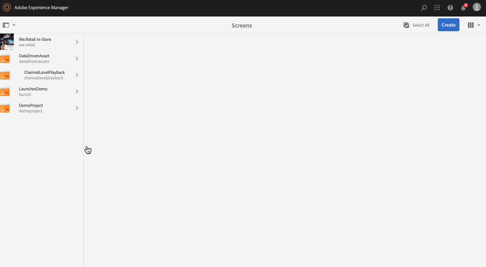

# チャネルの作成と管理 {#creating-and-managing-channels}

チャネルは、一連のコンテンツと表示画像とビデオを表示しますが、Webサイトや単一ページのアプリを表示することもできます。

このページではスクリーン用のチャネルの作成および管理を示します。

**前提条件**:

* [スクリーンの設定および展開](configuring-screens-introduction.md)
* [画面プロジェクトの作成と管理](creating-a-screens-project.md)

## 新しいチャネルの作成 {#creating-a-new-channel}

スクリーン用のプロジェクトを作成したら、下の手順に従ってスクリーンプロジェクト用の新しいチャネルを作成します。

1. Adobe Experience Manager リンク（左上）を選択し、「スクリーン」を選択します。Alternatively, you can go directly to: `https://localhost:4502/screens.html/content/screens`.
1. Navigate to Screens project and click **Channels**.
1. Click **Create** next to the plus icon in the action bar. ウィザードが開きます（*詳しくは、「チャネルタイプ」を参照してください*）。

1. Select the template from the wizard and click **Next**.
1. Enter the properties for **Title and Tags**, **More Titles and Description**, **On/Off Time**, and **Vanity URL**.

1. 「**作成**」をクリックすると、チャネルが作成されチャネルフォルダーに追加されます。

### チャネルタイプ {#channel-types}

ウィザードの作成中に以下のテンプレートオプションを使用できます。

| **テンプレートオプション** | **説明** |
|---|---|
| チャネルフォルダー | チャネルのコレクションを格納するためのフォルダーを作成できます。 |
| シーケンスチャネル | コンポーネントを連続的に（スライドショーで1つずつ）再生するチャネルを作成できます。 |
| アプリケーションチャネル | Screens Player でカスタム Web アプリケーションを紹介できます。 |
| 1 x 1 分割画面チャネル | 1つのゾーンでコンポーネントを表示できます。 |
| 1 x 2 分割画面チャネル | 2つのゾーンでアセットを表示できます（水平に分割）。 |
| 2X1分割画面チャネル | 2つのゾーン（垂直に分割）でアセットを表示できます。 |
| 2 x 2 分割画面チャネル | 4つのゾーンでアセットを表示できます（マトリックス内で水平方向と垂直方向に分割）。 |
| 2～3 分割画面チャネル | 2つのゾーン（水平に分割）でアセットを表示できます。一方のゾーンが他方のゾーンよりも大きくなります。 |
| 左右のLバー分割画面チャネル | コンテンツ作成者が適切なサイズのゾーンで異なるタイプのアセットを表示できるようにします。 |

>[!NOTE]
>
>画面を分割チャネルは、表示を複数のゾーンに分割し、複数のエクスペリエンスを並べて再生できるようにします。 エクスペリエンスは、静的アセット/テキストまたは埋め込みシーケンスのいずれかです。

The following example shows the creation of a Sequence Channel (C *hannelOne*) for a Screens project (*DemoProject*).

>[!NOTE]
>
>前述の 1 x 2、2 x 2 または 2～3 分割画面チャネルなどのテンプレートオプションを使用して、様々なゾーンを作成できます。

***重要***:

コンテンツを作成してチャネルに追加したら、次の手順では、場所を作成してからディスプレイを作成します。さらに、そのチャネルをディスプレイに割り当てる必要があります。詳しくは、この節の最後に記載されているリソースを参照してください。

## チャネルでの作業 {#working-with-channels}

プロパティおよびダッシュボードを編集および表示でき、またチャネルをコピー、プレビュー、削除できます。

>[!NOTE]
>
>左側のアイコンをクリックして、項目を選択します。例えば、下の図で示されているように、チャネルのアイコンをクリックし、次のアクションを実行します。

### チャネルへのコンテンツの追加／編集 {#adding-editing-content-to-a-channel}

チャネルにコンテンツを追加するには、下の手順に従います。

1. 編集するチャネルをクリックします（上の図を参照）。
1. Click **Edit** from the top left corner of the action bar to edit the channel properties. エディターが開いて、アセットやコンポーネントを公開するチャネルに追加できるようになります。

>[!NOTE]
>
>チャネルにコンポーネントを追加できます。 詳細は、 **[「チャネルへのコンポーネントの追加](adding-components-to-a-channel.md)** 」を参照してください。

**チャネルへのビデオのアップロード** 次の手順に従って、チャネルにビデオをアップロードします。

1. ビデオをアップロードするチャネルを選択します。
1. アクションバーから「**編集**」をクリックして、エディターを開きます。
1. アセットの下の「**ビデオ**」を選択し、必要なビデオをドラッグ&amp;ドロップします。

>[!NOTE]
>
>If you encounter issues uploading videos in your channel, see [Troubleshooting Videos](troubleshoot-videos.md).

### プロパティの表示 {#viewing-properties}

チャネルのプロパティを表示または編集するには、下の手順に従います。

1. 編集するチャネルをクリックします。
1. Click **Properties** from the action bar to view/edit the channel properties. 以下のタブでオプションを変更できます。

### ダッシュボードの表示 {#viewing-dashboard}

チャネルのダッシュボードを表示するには、次の手順に従います。

1. 編集するチャネルをクリックします。
1. Click **Dashboard** from the action bar to view the dashobard. The **CHANNEL INFORMATION**,**ASSIGNED DISPLAYS**, and **PENDING LAUNCHES** panel opens, as shown in the figure below:

### チャネル情報 {#channel-information}

チャンネル情報パネルでは、チャンネルのプロパティと、チャンネルのプレビューが表示されます。 また、チャネルがオフラインであるかオンラインであるかの情報も表示されます。

**チャネル情報**&#x200B;アクションバーの（**...**）をクリックすると、プロパティを表示、コンテンツを編集、またチャネルのキャッシュ（オフラインコンテンツ）を更新できます。

### オンラインチャネルとオフラインチャネル {#online-and-offline-channels}

>[!NOTE]
>
>デフォルトでは、チャネルを作成すると、そのチャネルは「オフライン」になります。

チャネルを作成するときは、オンラインまたはオフラインチャネルのいずれかとして定義できます。

An ***Online Channel***, will show the updated content in the real time environment whereas an ***Offline Channel***, shows the cached content.

チャネルをオンラインにするには、次の手順に従います。

1. **TestProject**／**Channels** ／**TestChannel**&#x200B;と選択して、チャネルに移動します。

   チャネルを選択します。

   

   Click **Dashboard** from the action bar to view the status of the player. **CHANNEL INFORMATION **パネルは、チャネルがオンラインかオフラインかに関する情報を提供します。

   

1. 下の図に示されているように、アクションバーの「**プロパティ**」をクリックして「**チャネル**」タブに移動します。

   

1. Developer **(Developer** )モード **をオンにして（チャネルを強制的にオンラインにする）** 、チャネルをオンラインにします。

   「**保存して閉じる**」をクリックしてオプションを保存します。

   

   Navigate back to the channel dashboard and now the **CHANNEL INFORMATION** panel shows the online status of the player.

   

>[!NOTE]
>
>チャネルをオフラインとして再設定する場合は、「 **Properties** 」タブ(手順(3)で示すように)の「Developer mode」オプションをオフにし、 **CHANNEL INFORMATION** （チャネル情報）パネルで、下の図に示すように「 **Update Offline Content**」をクリックします。

#### 自動アップデートとデバイスダッシュボードからの手動アップデート {#automatic-versus-manual-updates-from-the-device-dashboard}

次の表は、自動アップデートとデバイスダッシュボードからの手動アップデートに関連するイベントの要約です。

<table>
 <tbody>
  <tr>
   <td><strong>イベント</strong></td>
   <td><strong>デバイスの自動更新</strong></td>
   <td><strong>デバイス手動更新</strong></td>
  </tr>
  <tr>
   <td>オンラインチャネルの変更</td>
   <td>コンテンツが自動的に更新される</td>
   <td>
「デバイス：プッシュ設定"
 
または、
 
デバイスで更新され <strong><i>たコンテンツ：再開</i></strong>
 </td>
  </tr>
  <tr>
   <td>オフラインチャネルの変更がトリガーされない（オフラインパッケージの再作成が行われない）</td>
   <td>コンテンツの更新なし</td>
   <td>コンテンツの更新なし</td>
  </tr>
  <tr>
   <td>オフラインチャネルとチャネルの「プッシュコンテンツ」の変更がトリガーされる（新しいオフラインパッケージ）</td>
   <td>コンテンツが自動的に更新される</td>
   <td>
デバイスで更新され <strong><i>たコンテンツ：プッシュ設定</i></strong>
 
または、
 
デバイスで更新され <strong><i>たコンテンツ：再開</i></strong>
 </td>
  </tr>
  <tr>
   <td>
設定の変更

    <ul>
     <li>表示（強制チャネル）</li>
     <li>デバイス</li>
     <li>チャネルの割り当て（新しいチャネル、削除されたチャネル）</li>
     <li>チャネル割り当て（役割、イベント、スケジュール）</li>
    </ul> </td>
   <td>設定が自動的に更新されました</td>
   <td>
デバイスで設定が更新 <strong><i>されました：プッシュ設定</i></strong>
 
または、
 
デバイスで設定が更新 <strong><i>されました：再開</i></strong>
 </td>
  </tr>
 </tbody>
</table>

### 割り当てられたディスプレイ {#assigned-displays}

割り当てられたディスプレイパネルに、チャネルに関連する表示が示されます。割り当てられた表示のスナップショットを解像度とともに表示します。

下の図で示されているように、関連する表示は、**割り当てられたディスプレイ**&#x200B;パネルにリストされます。

>[!NOTE]
>
>場所でのディスプレイの作成については、次を参照してください。
>
>* [場所の作成と管理](managing-locations.md)
>* [ディスプレイの作成と管理](managing-displays.md)
>

さらに、下の図で示されているように、**割り当てられたディスプレイ**&#x200B;パネルで表示をクリックして、表示情報を表示します。

### 次の手順 {#the-next-steps}

チャネルを作成し、チャネルにコンテンツを追加または編集した後の次の手順は、場所およびディスプレイの作成方法を学ぶことです。さらに、そのディスプレイにチャネルを割り当てます。

次の手順については、次のリソースを参照してください。

* [チャネルの作成と管理](managing-channels.md)
* [場所の作成と管理](managing-locations.md)
* [ディスプレイの作成と管理](managing-displays.md)

