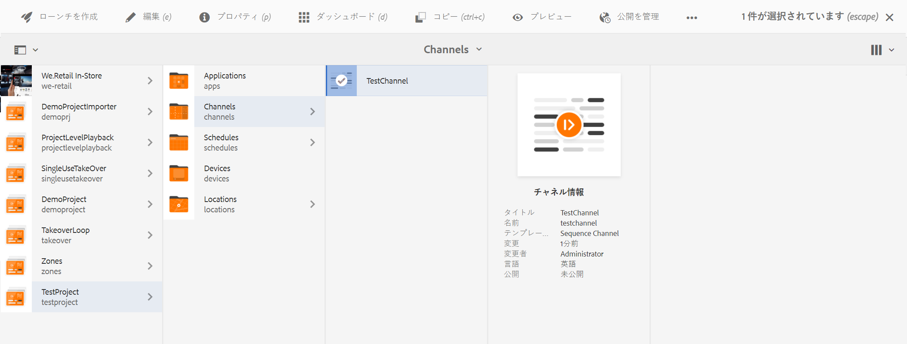

# チャネルの作成と管理 {#creating-and-managing-channels}

チャネルは、一連のコンテンツや表示画像、ビデオを表示しますが、Webサイトや単一ページのアプリも表示できます。

このページでは Screens 用のチャネルの作成および管理を示します。

**前提条件**：

* [Screens の設定とデプロイ](configuring-screens-introduction.md)
* [Screens プロジェクトの作成と管理](creating-a-screens-project.md)

## 新しいチャネルの作成 {#creating-a-new-channel}

AEM Screens向けのプロジェクトを作成したら、次の手順に従って、プロジェクト用の新しいチャネルを作成します。

1. Adobe Experience Manager リンク（左上）を選択し、「Screens」を選択します。または、`https://localhost:4502/screens.html/content/screens` から直接アクセスすることもできます。

1. Navigate to your Screens project and select **Channels** folder.

1. アクションバーの「**作成**」をクリックします。

   

1. Select the **Sequence Channel** template from the **Create** wizard and click **Next**.

   

1. Enter the Title as **ScreensChannel** and click **Create**.

   

1. これで、シーケンスチャネルが **チャネル** フォルダーに追加されます。

### チャネルタイプ {#channel-types}

ウィザードの作成中に以下のテンプレートオプションを使用できます。

| **テンプレートオプション** | **説明** |
|---|---|
| チャネルフォルダー | チャネルのコレクションを格納するためのフォルダーを作成できます。 |
| シーケンスチャネル | コンポーネントを連続して（スライドショーで 1 つずつ）再生するチャネルを作成できます。 |
| アプリケーションチャネル | Screens Player でカスタム Web アプリケーションを紹介できます。 |
| 1 x 1 分割画面チャネル | 1 個のゾーンにコンポーネントを表示できます。 |
| 1 x 2 分割画面チャネル | 2 個のゾーン（水平に分割）にアセットを表示できます。 |
| 2 x 1 分割画面チャネル | 2 個のゾーン（垂直に分割）にアセットを表示できます。 |
| 2 x 2 分割画面チャネル | 4 個のゾーン（マトリックス状に水平および垂直に分割）にアセットを表示できます。 |
| 2～3 分割画面チャネル | 2 個のゾーン（水平に分割）にアセットを表示できます（一方のゾーンが他方のものよりも大きくなります）。 |
| 左／右 L バー型分割画面チャネル | コンテンツ作成者が、様々な種類のアセットを適切なサイズのゾーンに表示できます。 |

>[!NOTE]
>
>分割画面チャネルでは、複数のエクスペリエンスを並べて同時に再生できるように、ディスプレイを複数のゾーンに分割します。エクスペリエンスは、静的アセット／テキストでも埋め込みシーケンスでも構いません。

>[!IMPORTANT]
>
> コンテンツを作成してチャネルに追加したら、次の手順では、ロケーションを作成してからディスプレイを作成します。さらに、そのチャネルをディスプレイに割り当てる必要があります。詳しくは、この節の最後に記載されているリソースを参照してください。

## チャネルでの作業 {#working-with-channels}

プロパティおよびダッシュボードを編集および表示でき、またチャネルをコピー、プレビュー、削除できます。

>[!NOTE]
>
>下の図に示すように、チャネルを選択します。

### チャネルへのコンテンツの追加／編集 {#adding-editing-content-to-a-channel}

チャネルにコンテンツを追加するには、下の手順に従います。

1. 編集するチャネルを選択します（上の図を参照）。
1. アクションバーの左上隅の「**編集**」をクリックして、チャネルプロパティを編集します。エディターが開いて、アセットやコンポーネントを公開するチャネルに追加できるようになります。

>[!NOTE]
>
>チャネルにコンポーネントを追加できます。詳しくは、**[チャネルへのコンポーネントの追加](adding-components-to-a-channel.md)**&#x200B;を参照してください。

**チャネルへのビデオのアップロード**

下の手順に従って、チャネルにビデオをアップロードします。

1. ビデオをアップロードするチャネルを選択します。
1. アクションバーの「**編集**」をクリックして、エディターを開きます。
1. アセットの下の「**ビデオ**」を選択し、必要なビデオをドラッグ&amp;ドロップします。

>[!NOTE]
>チャネルへのビデオのアップロードで問題が発生した場合は、[ビデオのトラブルシューティング](troubleshoot-videos.md)を参照してください。

### プロパティの表示 {#viewing-properties}

チャネルのプロパティを表示または編集するには、下の手順に従います。

1. 編集するチャネルをクリックします。
1. アクションバーの「**プロパティ**」をクリックして、チャネルプロパティを表示または編集します。以下のタブでオプションを変更できます。

### ダッシュボードの表示 {#viewing-dashboard}

チャネルのダッシュボードを表示するには、次の手順に従います。

1. 編集するチャネルを選択します。
1. アクションバーの「**ダッシュボード**」をクリックして、ダッシュボードを表示します。**チャネル情報**、**割り当てられたディスプレイ**、**保留中のローンチ**&#x200B;の各パネルが開きます（下図を参照）。

### チャネル情報 {#channel-information}

チャネル情報パネルでは、チャネルのプロパティを説明し、チャネルのプレビューを表示します。また、チャネルがオフラインであるかオンラインであるかの情報も表示されます。

**チャネル情報**&#x200B;アクションバーの（**...**）をクリックすると、プロパティを表示、コンテンツを編集、またチャネルのキャッシュ（オフラインコンテンツ）を更新できます。

#### マニフェストの表示 {#view-manifest}

マニフェストをチャネルダッシュボードから表示できます。

>[!IMPORTANT]
>
>このオプションは、AEM 6.4 機能パック 8 または AEM 6.5 機能パック 4 でのみ使用できます。

チャネルダッシュボードからこのオプションを有効にするには、次の手順に従います。

1. **チャネルをオフラインに設定**
   1. チャネルを選択し、アクションバーの「**プロパティ**」を選択します
   1. 「**チャネル**」タブに移動し、「**開発者モード（チャネルをオンラインにする）**」オプションのチェックを外します
   1. 「**保存して閉じる**」をクリックします
1. **オフラインコンテンツを更新**
   1. チャネルを選択し、アクションバーの「**ダッシュボード**」をクリックします
   1. **チャネル情報**&#x200B;パネルに移動し、「*...*」をクリックします。
   1. 「**オフラインコンテンツを更新」をクリックします。**

これで、「**マニフェストを表示**」オプションがチャネルダッシュボードの 「**チャネル情報**」パネルから表示されます。

### オンラインチャネルとオフラインチャネル {#online-and-offline-channels}

>[!NOTE]
>
>デフォルトでは、チャネルを作成すると、そのチャネルはオフラインになります。

チャネルを作成するときは、オンラインまたはオフラインチャネルのいずれかとして定義できます。

***オンラインチャネル***&#x200B;では、最新のコンテンツがリアルタイム環境で表示されるのに対して、***オフラインチャネル***&#x200B;では、キャッシュされたコンテンツが表示されます。

チャネルをオンラインにするには、次の手順に従います。

1. **TestProject**／**Channels** ／**TestChannel**&#x200B;と選択して、チャネルに移動します。

   チャネルを選択します。

   

   アクションバーの「**ダッシュボード**」をクリックして、プレーヤーのステータスを確認します。**チャネル情報**&#x200B;パネルに、チャネルがオンラインであるかオフラインであるかの情報が表示されます。

   

1. 下の図に示されているように、アクションバーの「**プロパティ**」をクリックして「**チャネル**」タブに移動します。

   

1. 「****&#x200B;開発者&#x200B;**モード（チャネルをオンラインに強制）**」をオンにして、チャネルをオンラインにします。

   「**保存して閉じる**」をクリックしてオプションを保存します。

   

   チャネルダッシュボードに戻ると、**チャネル情報**&#x200B;パネルにプレーヤーのオンラインステータスが表示されます。

   

>[!NOTE]
>
>チャネルをオフラインとして再設定する場合は、「**プロパティ**」タブで開発者モードオプションをオフにしたあと（前述の手順 3 を参照）、**チャネル情報**&#x200B;パネルで「**オフラインコンテンツを更新**」をクリックします（下図を参照）。

#### 自動アップデートとデバイスダッシュボードからの手動アップデート {#automatic-versus-manual-updates-from-the-device-dashboard}

次の表は、自動アップデートとデバイスダッシュボードからの手動アップデートに関連するイベントの要約です。

<table>
 <tbody>
  <tr>
   <td><strong>イベント</strong></td>
   <td><strong>デバイスの自動更新</strong></td>
   <td><strong>デバイスの手動更新</strong></td>
  </tr>
  <tr>
   <td>オンラインチャネルでの変更</td>
   <td>コンテンツを自動的に更新</td>
   <td>
コンテンツを「デバイス : プッシュ設定」で更新
 
または、
 
コンテンツを「<strong><i>デバイス : 再起動</i></strong>」で更新
 </td>
  </tr>
  <tr>
   <td>オフラインチャネルで変更があったが、チャネル「コンテンツのプッシュ」がトリガーされない（オフラインパッケージは再作成されない）</td>
   <td>コンテンツの更新なし</td>
   <td>コンテンツの更新なし</td>
  </tr>
  <tr>
   <td>オフラインチャネルで変更があり、チャネル「コンテンツのプッシュ」がトリガーされる（新しいオフラインパッケージ）</td>
   <td>コンテンツを自動的に更新</td>
   <td>
コンテンツを「<strong><i>デバイス : プッシュ設定</i></strong>」で更新
 
または、
 
コンテンツを「<strong><i>デバイス : 再起動</i></strong>」で更新
 </td>
  </tr>
  <tr>
   <td>
設定での変更

    <ul>
     <li>ディスプレイ（強制チャネル）</li>
     <li>デバイス</li>
     <li>チャネルの割り当て（新しいチャネル、削除されたチャネル）</li>
     <li>チャネルの割り当て（ロール、イベント、スケジュール設定）</li>
    </ul> </td>
   <td>設定を自動的に更新</td>
   <td>
設定を「<strong><i>デバイス : プッシュ設定</i></strong>」で更新
 
または、
 
設定を「<strong><i>デバイス : 再起動</i></strong>」で更新
 </td>
  </tr>
 </tbody>
</table>

### 割り当てられたディスプレイ {#assigned-displays}

割り当てられたディスプレイパネルに、チャネルに関連するディスプレイが示されます。割り当てられたディスプレイのスナップショットを解像度と共に表示します。

下の図で示されているように、関連するディスプレイは、**割り当てられたディスプレイ**&#x200B;パネルにリストされます。

>[!NOTE]
>
>ロケーションへのディスプレイの作成については、次を参照してください。
>
>* [ロケーションの作成と管理](managing-locations.md)
>* [ディスプレイの作成と管理](managing-displays.md)

>

さらに、**割り当てられたディスプレイ**&#x200B;パネルでディスプレイをクリックすると、ディスプレイの情報が表示されます（下図を参照）。

### 次の手順 {#the-next-steps}

チャネルを作成し、チャネルにコンテンツを追加または編集した後の次の手順は、ロケーションおよびディスプレイの作成方法を学ぶことです。さらに、そのディスプレイにチャネルを割り当てます。

次の手順については、次のリソースを参照してください。

* [チャネルの作成と管理](managing-channels.md)
* [ロケーションの作成と管理](managing-locations.md)
* [ディスプレイの作成と管理](managing-displays.md)

