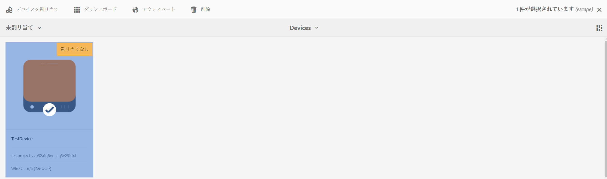
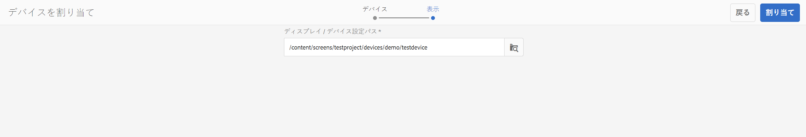
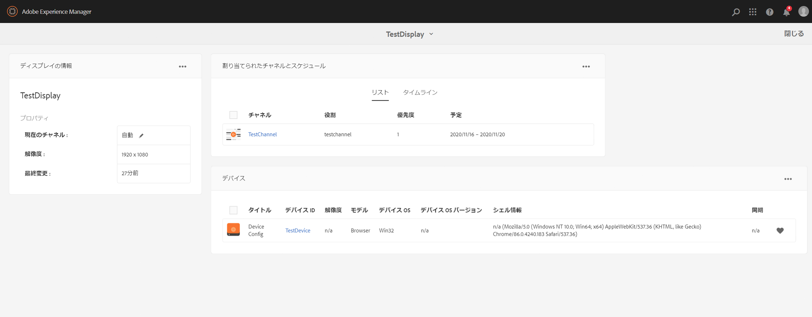
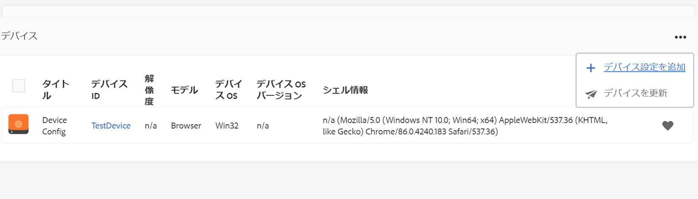
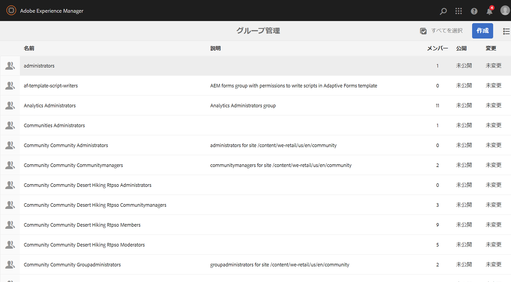

# デバイスの管理 {#managing-devices}

このページでデバイス割り当てを説明します。

デバイスコンソールでは、デバイスマネージャーにアクセスして、デバイスをディスプレイに割り当てることができます。

>[!CAUTION]
>
>デバイスを割り当てる前に、デバイスを登録する必要があります。詳しくは、[デバイスの登録](device-registration.md)を参照してください。

## デバイスの割り当て {#device-assignment}

以下の手順に従って、デバイスをディスプレイに割り当てます。

1. プロジェクト（例えば下記）のデバイスフォルダーに移動します。

   `http://localhost:4502/screens.html/content/screens/TestProject`

   

1. **デバイス**&#x200B;フォルダーを選択し、アクションバーの「**デバイスマネージャー**」をタップまたはクリックします。割り当て済みと未割り当てデバイスが表示されます。

   

1. リストから未割り当てデバイスを選択し、アクションバーの「**デバイスを割り当て**」をタップまたはクリックします。

   

1. デバイスを割り当てるディスプレイをリストから選択し、「**割り当て**」をタップまたはクリックします。

   

1. 「**完了**」をタップまたはクリックして、割り当てプロセスを完了します。

   ディスプレイダッシュボードの「**デバイス**」パネルに割り当て済みのデバイスが表示されます。

   

   **デバイス**&#x200B;パネルの右上隅の（**...**）をクリックして、デバイス設定を追加するかデバイスを更新します。

   

>[!NOTE]
>
>初めてのデバイスが新しい Screens プロジェクトに追加されるたびに、ユーザーグループが作成されます。
>例えば、プロジェクトノード名が *we-retail* である場合、ユーザーグループ名は *screens-we-retail-devices* になります。
>このグループは、下の図で示されているように、**寄稿者**&#x200B;グループのメンバーとして追加されます。

### 次の手順 {#the-next-steps}

チャネルのディスプレイへの割り当てに習熟したら、次のリソースを参照してください。

* [モニターおよびトラブルシューティング](monitoring-screens.md)

