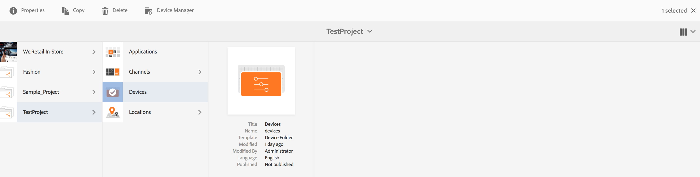
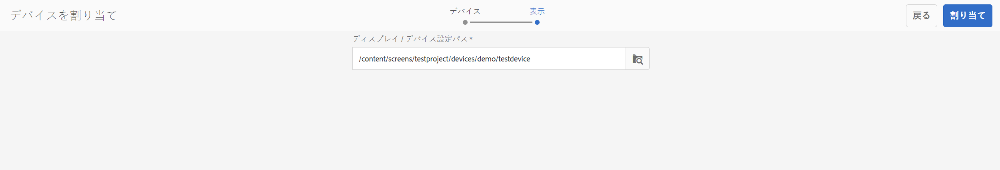
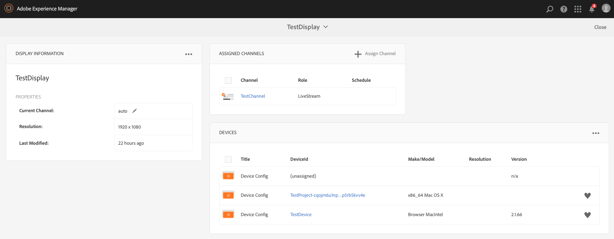
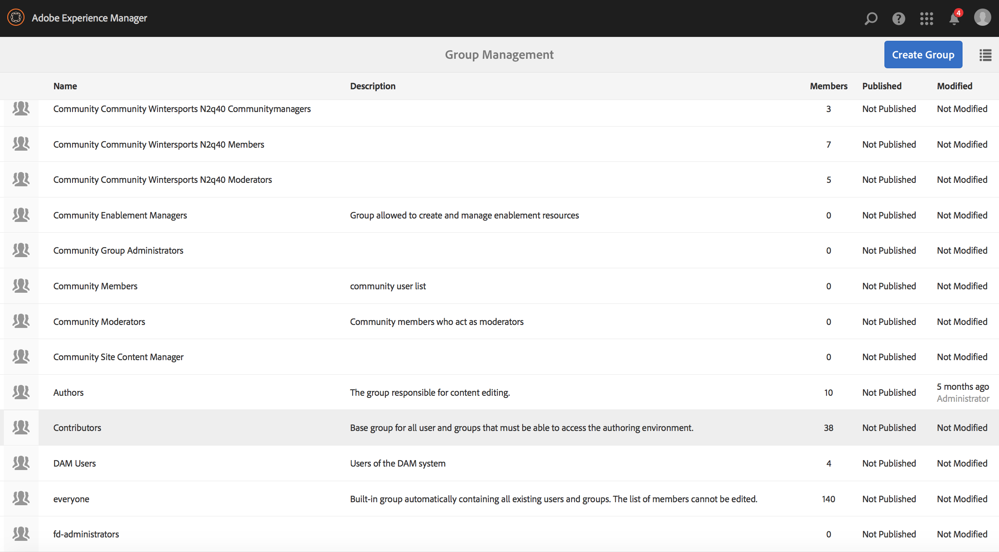

# デバイスの管理 {#managing-devices}

>[!IMPORTANT]
>このコンテンツは、AEM オンプレミス/AMS （AEM 6.5LTSおよびAEM 6.5）に対して有効です。 AEM as a Cloud Service Screensの内容については、[AEM as a Cloud Service ガイド &#x200B;](https://experienceleague.adobe.com/ja/docs/experience-manager-cloud-service/content/screens-as-cloud-service/overview/introduction)を参照してください。

このページでデバイス割り当てを説明します。

デバイスコンソールでは、デバイスマネージャーにアクセスして、デバイスをディスプレイに割り当てることができます。

>[!CAUTION]
>
>デバイスを割り当てる前に、デバイスを登録します。 [デバイスの登録](device-registration.md)を参照してください。

## デバイスの割り当て {#device-assignment}

以下の手順に従って、デバイスをディスプレイに割り当てます。

1. プロジェクト（例えば下記）のデバイスフォルダーに移動します。

   `http://localhost:4502/screens.html/content/screens/TestProject`

   

1. **デバイス**&#x200B;フォルダーをクリックし、アクションバーの「**デバイスマネージャー**」をクリックします。 割り当て済みと未割り当てデバイスが表示されます。

   

1. リストから未割り当てのデバイスをクリックし、アクションバーで「**デバイスを割り当て**」をクリックします。

   

1. デバイスを割り当てるディスプレイをリストからクリックし、「**割り当て**」をクリックします。

   

1. 「**完了**」をクリックして、割り当てプロセスを完了します。

   ディスプレイダッシュボードの「**デバイス**」パネルに割り当て済みのデバイスが表示されます。

   

   （**...**）をクリックします **DEVICES** パネルの右上隅にあるデバイス設定を追加するか、デバイスを更新します。

   

>[!NOTE]
>
>最初のデバイスが新しいScreens プロジェクトに追加されるたびに、ユーザーグループが作成されます。
>例えば、プロジェクトノード名が&#x200B;*we-retail*&#x200B;の場合、ユーザーグループ名は&#x200B;*screens-we-retail-devices*です。
>このグループは、次の図に示すように、**Contributors** グループのメンバーとして追加されます。

### 次の手順 {#the-next-steps}

チャネルのディスプレイへの割り当てに慣れたら、[監視とトラブルシューティング](monitoring-screens.md)を参照してください。
