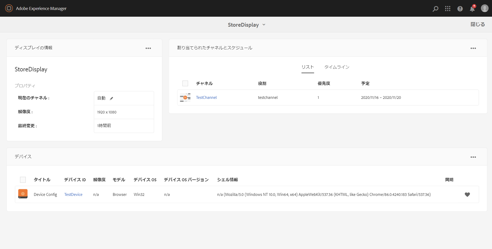
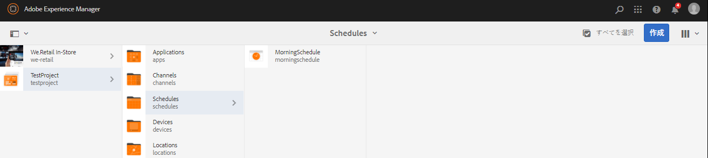

# ディスプレイの作成と管理 {#creating-and-managing-displays}

ディスプレイとはスクリーンの仮想グループで、通常は並んで配置されています。ディスプレイのインストールは通常、永続的です。オブジェクトコンテンツの作成者はこれを操作し、常に物理的なディスプレイの代わりに論理的なディスプレイとして参照します。

ロケーションを作成したら、ロケーションの新しいディスプレイを作成する必要があります。

ここでは、Screens プロジェクトのディスプレイの作成と管理について説明します。

**前提条件**：

* [Screens の設定とデプロイ](configuring-screens-introduction.md)
* [Screens プロジェクトの作成と管理](creating-a-screens-project.md)
* [チャネルの作成と管理](managing-channels.md)
* [ロケーションの作成と管理](managing-locations.md)

## 新しいディスプレイの作成 {#creating-a-new-display}

>[!NOTE]
>
>ディスプレイを作成する前に、ロケーションを作成する必要があります。ロケーションの作成方法について詳しくは、[ロケーションの作成と管理](managing-locations.md)を参照してください。

ロケーションに新しいディスプレイを作成するには、次の手順に従います。

1. 該当するロケーション（例：`http://localhost:4502/screens.html/content/screens/TestProject`）に移動します。
1. ロケーションフォルダーを選択し、アクションバーのプラス記号アイコンの横にある「**作成**」をタップまたはクリックします。ウィザードが開きます。
1. **作成**&#x200B;ウィザードから「**ディスプレイ**」を選択し、「**次へ**」をクリックします。

1. ディスプレイのロケーションの「**名前**」および「**タイトル**」を入力します。

1. 「**ディスプレイ**」タブで、レイアウトの詳細を選択します。目的の「**解像度**」（「**フル HD**」など）を選択します。さらに、水平および垂直のデバイスの数を選択できます。

1. 「**作成**」をクリックします。

ディスプレイ（*StoreDisplay*）が作成され、ロケーション（*SanJose*）に追加されます。

ディスプレイを配置したら、次の手順は、その特定のディスプレイのためにデバイス設定を作成することです。下のセクションに従って、新しいデバイス設定を作成します。

>[!NOTE]
>
>**次のステップ**:
>
>ロケーションにディスプレイを作成したら、コンテンツを利用するためにディスプレイにチャネルを割り当てる必要があります。
>
>ディスプレイにチャネルを割り当てる方法について詳しくは、[チャネルの割り当て](channel-assignment.md)を参照してください。

## 新しいデバイス設定の作成 {#creating-a-new-device-config}

デバイス設定は、まだインストールされていない実際のデジタルサイネージデバイスのプレースフォルダーとして機能します。

下の手順に従って、新しいデバイス設定を作成します。

1. 該当するディスプレイ（例：`http://localhost:4502/screens.html/content/screens/TestProject/locations/newlocation`）に移動します。
1. ディスプレイフォルダーを選択し、アクションバーの「**ダッシュボードを表示**」をタップまたはクリックします。
1. **デバイス**&#x200B;パネルの右上の「**+ デバイス設定を追加**」をタップまたはクリックします。

1. 「**デバイス設定**」として必要なテンプレートを選択し、「**次へ**」をタップまたはクリックします。

1. 必要に応じてプロパティを入力し、「**作成**」をタップまたはクリックします。

デバイス設定が作成され、現在のディスプレイに追加されます（以下のデモでは、この新しいデバイス設定は *DeviceConfig* です）。

デバイス設定がロケーションのディスプレイに設定されたら、次は、ディスプレイにチャネルを割り当てる必要があります。

>[!NOTE]
>
>デバイス設定がロケーションのディスプレイに設定されたら、次は、ディスプレイにチャネルを割り当てる必要があります。
>
>デバイス設定が&#x200B;**デバイス**&#x200B;パネルで未割り当てと表示される場合は、チャネルがその特定のデバイス設定に割り当てられていません（下図を参照）。
>
>チャネルの作成や管理について事前に理解しておく必要があります。詳しくは、[チャネルの作成と管理](managing-channels.md)を参照してください。

## ディスプレイダッシュボード {#display-dashboard}

ディスプレイダッシュボードには、ディスプレイデバイス管理デバイスおよびデバイスのデバイス設定用の様々なパネルがあります。

>[!NOTE]
>
>各アイテムを個別にトリガーする代わりに、ダッシュボードリストを選択して、アイテムのバルクアクションをトリガーできます。
>
>例えば、ディスプレイダッシュボードから複数のチャネルを選択する方法を次の図に示します。

### ディスプレイの情報パネル {#display-information-panel}

**ディスプレイ情報**&#x200B;パネルは、ディスプレイのプロパティを表示します。

**ディスプレイ情報**&#x200B;パネルの右上角の（**...**）をクリックして、プロパティを表示し、ディスプレイをプレビューします。

#### プロパティの表示 {#viewing-properties}

「**プロパティ**」をクリックして、ディスプレイのプロパティを表示または変更します。

Additionally, you can adjust the event timer value for your interactive channel in **Idle timeout** property under **Display** tab. デフォルト値は *300 秒*&#x200B;に設定されています。

**CRXDE Lite** を使用して、**idleTimeout** プロパティ（`http://localhost:4502/crx/de/index.jsp#/content/screens/we-retail/locations/demo/flagship/single/jcr%3Acontent/channels`）にアクセスします。

### 割り当て済みチャネルパネル {#assigned-channels-panel}

**チャネルの割り当て**&#x200B;パネルには、このデバイスに割り当てられたチャネルが表示されます。

### デバイスパネル {#devices-panel}

**デバイス**&#x200B;パネルには、デバイス設定の情報が表示されます。

Click on the (**...**) in the top right corner in the **DEVICES** panel to add device configs and update devices.

さらに、デバイス設定をクリックして、プロパティの表示、デバイスの割り当て、またはデバイスの完全削除をおこなうことができます。

#### 次の手順 {#the-next-steps}

ロケーションへのディスプレイの作成が完了したら、ディスプレイにチャネルを割り当てる必要があります。

詳しくは、[チャネルの割り当て](channel-assignment.md)を参照してください。
