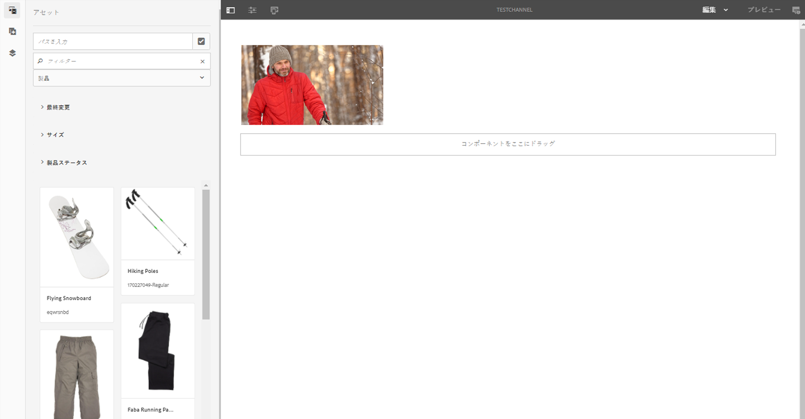

# ディスプレイの作成と管理 {#creating-and-managing-displays}

ディスプレイは、スクリーンの仮想グループで、隣り合って配置されます。 この表示は、インストールに関して永続的である。 これは、コンテンツ作成者が操作をおこない、物理的なカウンター部分ではなく論理表示として常に参照するオブジェクトです。

場所を作成する場合は、場所用のディスプレイを作成する必要があります。

ここでは、Screens プロジェクトのディスプレイの作成と管理について説明します。

**前提条件**：

* [Screens の設定とデプロイ](configuring-screens-introduction.md)
* [Screens プロジェクトの作成と管理](creating-a-screens-project.md)
* [チャネルの作成と管理](managing-channels.md)
* [ロケーションの作成と管理](managing-locations.md)

## 新しいディスプレイの作成 {#creating-a-new-display}

>[!NOTE]
>
>ディスプレイを作成する前に、ロケーションを作成します。 参照： [ロケーションの作成と管理](managing-locations.md) を参照してください。

1. 該当するロケーション（例：`http://localhost:4502/screens.html/content/screens/TestProject`）に移動します。
1. 場所フォルダーを選択し、 **作成** これは、アクションバーのプラスアイコンの横にあります。
1. を選択 **表示** から **作成** ウィザードで次を選択します **次**.
1. ディスプレイのロケーションの「**名前**」および「**タイトル**」を入力します。
1. 「**ディスプレイ**」タブで、レイアウトの詳細を選択します。目的のを選択 **解決策**（例：） **フル HD**. デバイスの数を水平方向および垂直方向に選択します。
1. 「**作成**」を選択します。

ディスプレイ（*StoreDisplay*）が作成され、ロケーション（*SanJose*）に追加されます。

ディスプレイを適切な位置に配置したら、次の手順でその特定のディスプレイのデバイス設定を作成します。

>[!NOTE]
>
>**次のステップ**:
>
>ロケーション用のディスプレイを作成する場合は、コンテンツを使用するためにディスプレイにチャネルを割り当てます。
>
>ディスプレイにチャネルを割り当てる方法について詳しくは、[チャネルの割り当て](channel-assignment.md)を参照してください。

## 新しいデバイス設定の作成 {#creating-a-new-device-config}

デバイス設定は、まだインストールされていない実際のデジタルサイネージデバイスのプレースフォルダーとして機能します。

1. 該当するディスプレイ（例：`http://localhost:4502/screens.html/content/screens/TestProject/locations/newlocation`）に移動します。
1. ディスプレイフォルダーを選択し、 **ダッシュボードの表示** アクションバーに表示されます。
1. を選択 **+ デバイス設定を追加** の右上に **デバイス** パネル。

1. 「」を選択します **デバイス設定** 必要なテンプレートとして、およびを選択します。 **次**.

1. 必要に応じてプロパティを入力し、を選択します。 **作成**.

デバイス設定が作成され、現在のディスプレイに追加されます（以下のデモでは、この新しいデバイス設定は *DeviceConfig* です）。

>[!NOTE]
>
>の場所でディスプレイにデバイス設定を設定したら、次にディスプレイにチャネルを割り当てます。
>
>次の図に示すように、でデバイス設定が未割り当てとして表示されている場合、 **デバイス** 特定のデバイス設定にチャネルが割り当てられていない場合は、パネル。
>
>チャネルの作成や管理について事前に理解しておく必要があります。詳しくは、[チャネルの作成と管理](managing-channels.md)を参照してください。

## ディスプレイダッシュボード {#display-dashboard}

ディスプレイダッシュボードには、ディスプレイデバイス管理デバイスおよびデバイスのデバイス設定用の様々なパネルがあります。

>[!NOTE]
>
>各項目を個別に確認する代わりに、項目に対してダッシュボードリストとトリガーの一括アクションを選択できます。
>
>例えば、次の画像は、表示ダッシュボードから複数のチャネルを選択する方法を示しています。

### ディスプレイの情報パネル {#display-information-panel}

**ディスプレイ情報**&#x200B;パネルは、ディスプレイのプロパティを表示します。

を選択（**...**）を選択します。 **情報を表示** パネルを使用すると、プロパティを表示し、表示をプレビューできます。

#### プロパティの表示 {#viewing-properties}

を選択 **プロパティ** そのため、ディスプレイのプロパティを表示または変更できます。

また、でインタラクティブチャネルのイベントタイマー値を調整することもできます **アイドル タイムアウト** 下のプロパティ **表示** タブ。 デフォルト値は *300 秒*&#x200B;に設定されています。

**CRXDE Lite** を使用して、**idleTimeout** プロパティ（`http://localhost:4502/crx/de/index.jsp#/content/screens/we-retail/locations/demo/flagship/single/jcr%3Acontent/channels`）にアクセスします。

### 割り当て済みチャネルパネル {#assigned-channels-panel}

**チャネルの割り当て**&#x200B;パネルには、このデバイスに割り当てられたチャネルが表示されます。

### デバイスパネル {#devices-panel}

**デバイス**&#x200B;パネルには、デバイス設定の情報が表示されます。

を選択（**...**）を選択します。 **デバイス** パネルを表示して、デバイス設定を追加し、デバイスを更新できます。

また、プロパティを表示したり、デバイスを割り当てたり、完全に削除したりするには、デバイス設定を選択します。

#### 次の手順 {#the-next-steps}

ロケーションのディスプレイの作成を完了したら、ディスプレイのチャネルを割り当てます。

詳しくは、[チャネルの割り当て](channel-assignment.md)を参照してください。
