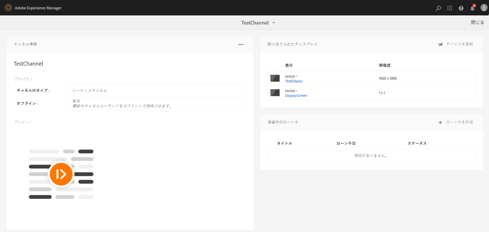

# ライブコピーの作成と管理 {#creating-and-managing-a-live-copy}

このページでは、チャネルのライブコピーの作成および管理を説明します。

***ライブコピー***&#x200B;は、特定のサイトコンテンツのコピーです。このコピーについては、元のソースとのライブ関係が維持されます。このライブ関係により、ライブコピーはソースからコンテンツおよびページプロパティを継承できます。

このページでは、チャネルのライブコピーの作成、プロパティの表示、ステータスのチェック、チャネルからライブコピーへの変更の反映について説明します。

## ライブコピーの作成 {#creating-a-live-copy}

以下の手順に従って、プロジェクトフォルダーの中のチャネルのライブコピーを作成します。

1. Adobe Experience Manager リンク（左上）を選択し、「**Screens**」を選択します。または、`http://localhost:4502/screens.html/content/screens` に直接アクセスすることもできます。

1. Screens プロジェクトに移動して「**チャネル**」をクリックします。
1. 「**作成**」をクリックし、「**ライブコピー**」を選択して、チャネルのライブコピーを作成します。

1. 宛先を選択して、「**次へ**」をクリックします。
1. ライブコピーの作成先を選択します。
1. **タイトル**&#x200B;および&#x200B;**名前を****ライブコピーの作成**&#x200B;ページに入力します。

1. 「**開く**」をクリックして、新しいライブコピーのコンテンツを表示するか、「**完了**」をクリックしてメインページに戻ります。

また、チャネルの新しいライブコピーを作成するためのビジュアル表現用の下の手順を参照してください。

次の例では、***チャネル***&#x200B;という宛先フォルダーのある ***Idle Channel*** のライブコピー（***IdleLiveCopy***）の作成を示しています。

## ライブコピーチャネルのコンテンツを表示 {#viewing-content-of-the-live-copy-channel}

ライブコピーは、既に存在するチャネルのコピーです。

ライブコピーのコンテンツを表示するには、次の手順を参照してください。

1. スクリーンプロジェクトに移動して、上のセクションで示されているように、最初にライブコピーを作成した場所をクリックします（ここでは、その場所として&#x200B;**チャネル**&#x200B;フォルダーが選択されました）。

   

1. アクションバーの「**編集**」をクリックして、チャネルのコンテンツを表示します。

   

   >[!NOTE]
   >
   >ライブコピーチャネルのコンテンツを表示するときは、**ライブコピーステータス**&#x200B;としてメニューの中に追加項目が表示されます。詳しくは、下のセクションを参照してください。

### ライブコピーのプロパティの表示  {#viewing-properties-of-a-live-copy}

さらに、ライブコピーチャネルのプロパティを表示できます。

1. ライブコピーチャネルに移動して、アクションバーの「**プロパティ**」をクリックします。

   

1. 「**ライブコピー**」タブを選択して、チャネルの詳細を表示します。

   

### ライブコピーステータス {#live-copy-status}

モード&#x200B;**ライブコピーステータス**&#x200B;は、下の図で示されており、チャネルの中のすべてのアセットの関係ステータスを表示できます。

1. 「**編集**」をクリックして、「**ライブコピーステータス**」を選択し、チャネルコンテンツと元のチャネル（ライブコピーの生成元）の関係を表示します。

   

1. 「**ライブコピーステータス**」を選択して、プレビューページを表示します。

   緑色の境界線のあるすべてのリソースは、コンテンツが元のチャネルから継承されたことを示します。

   

### 継承の切断 {#breaking-the-inheritance}

ライブコピーからの継承を取り消すこともでき、これによりコンテンツは元のブランチから独立できます。

以下の例で示されているように、編集モードで画像を選択し、右上の継承中止シンボルをクリックします。

### ライブコピーチャネルへの変更の反映 {#propagating-changes-to-the-live-copy-channel}

元のチャネルで変更または更新をおこなう場合は、それらの変更をライブコピーチャネルに反映する必要もあります。

下の手順に従って、変更を元のチャネルからライブコピーチャネルに反映します。

1. 元のチャネル（***Idle Channel***）を選択し、アクションバーの「**編集**」をクリックします。

   

1. このチャネルコンテンツを編集します。例えば、画像をこのチャネルから削除します。

   

1. チャネルのライブコピー（***IdleLiveCopy***）を選択し、アクションバーの「**編集**」をクリックします。削除した画像は、ライブコピーにまだ表示されています。

   変更を反映するには、チャネルを同期する必要があります。

   

1. 変更をライブコピーチャネルに反映するために、AEM ダッシュボードに移動して、ライブコピーチャネルを選択し、アクションバーから「**プロパティ**」をクリックします。

   

1. 「**ライブコピー**」タブを選択し、アクションバーの「**同期**」をクリックします。

   

1. 「**同期**」をクリックして、変更を確認します。「**保存して閉じる**」をクリックして、AEM ダッシュボードに戻ります。

   

   これで、画像もライブコピーチャネルから削除されました。

