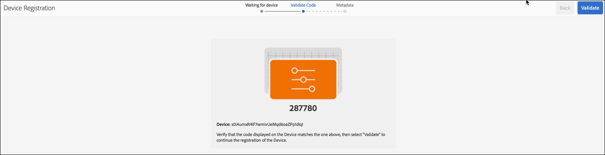
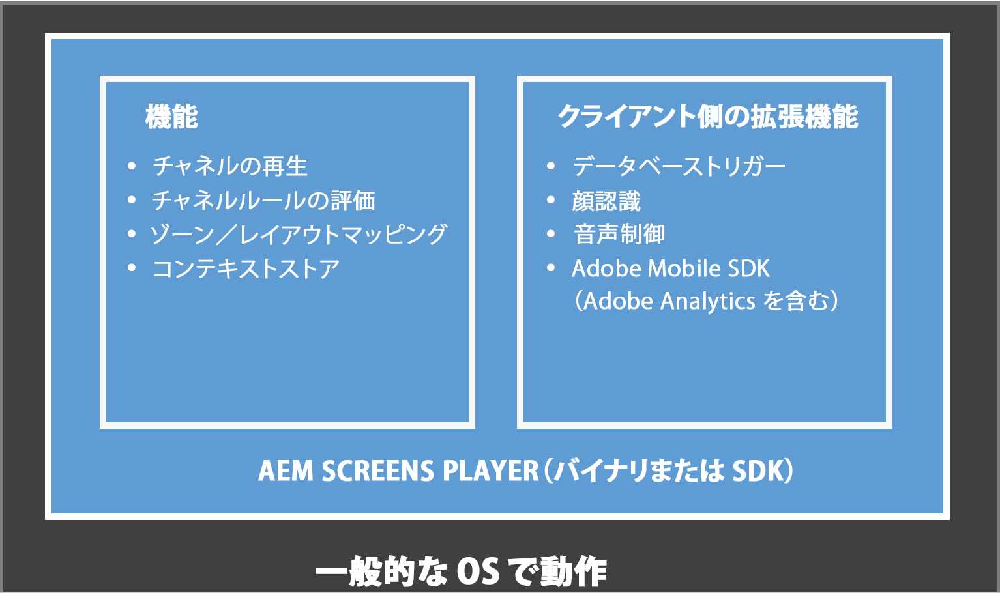

# ライブコピーの作成と管理 {#creating-and-managing-a-live-copy}

このページでは、チャネルのライブコピーの作成および管理を説明します。

***ライブコピー***&#x200B;は、特定のサイトコンテンツのコピーです。このコピーについては、元のソースとのライブ関係が維持されます。このライブ関係により、ライブコピーはソースからコンテンツおよびページプロパティを継承できます。

このページでは、チャネルのライブコピーの作成、プロパティの表示、ステータスのチェック、チャネルからライブコピーへの変更の反映について説明します。

## ライブコピーの作成 {#creating-a-live-copy}

以下の手順に従って、プロジェクトフォルダーの中のチャネルのライブコピーを作成します。

1. Adobe Experience Manager リンク（左上）を選択し、「**Screens**」を選択します。または、`http://localhost:4502/screens.html/content/screens` に直接アクセスすることもできます。

1. Screens プロジェクトに移動し、以下を選択します。 **チャネル**.
1. を選択 **作成** を選択して、 **ライブコピー** そのため、チャネルのライブコピーを作成できます。
1. 宛先を選択し、 **次**.
1. ライブコピーを格納できる場所を選択します。
1. **タイトル**&#x200B;および&#x200B;**名前を** **ライブコピーの作成**&#x200B;ページに入力します。

1. を選択 **開く** 新しいライブコピーのコンテンツを表示する **完了** をクリックしてメインページに戻ります。

または、チャネルの新しいライブコピーを作成する際の視覚的表現については、以下の手順を参照してください。

次の例では、***チャネル***&#x200B;という宛先フォルダーのある ***Idle Channel*** のライブコピー（***IdleLiveCopy***）の作成を示しています。

## ライブコピーチャネルのコンテンツを表示 {#viewing-content-of-the-live-copy-channel}

ライブコピーは、存在するチャネルのコピーです。

ライブコピーのコンテンツを表示するには、以下の手順を参照してください。

1. 上記の節に示すように、Screens プロジェクトに移動し、ライブコピーを最初に作成した場所を選択します。 （ここでは、その場所として&#x200B;**チャネル**&#x200B;フォルダーが選択されました）。

   

1. を選択 **編集** アクションバーから。

   

   >[!NOTE]
   >
   >ライブコピーチャネルのコンテンツを表示する場合は、メニューに次のような追加の項目が表示されます **ライブコピーステータス**. 詳しくは、以下の節を参照してください。

### ライブコピーのプロパティの表示 {#viewing-properties-of-a-live-copy}

また、ライブコピーチャネルのプロパティも表示できます。

1. ライブコピーチャネルに移動し、を選択します。 **プロパティ** アクションバーから。

   

1. 「」を選択します **ライブコピー** タブをクリックして、チャネルの詳細を表示します。

   

### ライブコピーステータス {#live-copy-status}

モード **ライブコピーステータス**&#x200B;を使用すると、次の図に示すように、チャネル内のすべてのアセットの関係ステータスを表示できます。

1. を選択 **編集** そのため、次の中から選択できます **ライブコピーステータス** （ライブコピーの生成元となる）元のチャネルに対するチャネルコンテンツの関連付けを確認します。

   

1. を選択 **ライブコピーステータス** そのため、プレビューページを表示できます。

   緑のボーダーが付いているすべてのリソースは、コンテンツが元のチャネルから継承されることを示しています。

   

### 継承の切断 {#breaking-the-inheritance}

ライブコピーの継承をキャンセルして、コンテンツが元のブランチから独立するようにすることもできます。

次の例では、編集モードで画像を選択し、右上の継承をキャンセル記号を選択します。

### ライブコピーチャネルへの変更の反映 {#propagating-changes-to-the-live-copy-channel}

元のチャネルで変更や更新を加えた場合は、その変更をライブコピーチャネルにも反映させます。

元のチャネルからライブコピーチャネルに変更が確実に反映されるようにするには、次の手順に従います。

1. オリジナルチャネルを選択（***アイドル チャネル***）に設定し、 **編集** アクションバーから。

   

1. このチャネルコンテンツを編集します。 例えば、このチャネルから画像を削除します。

   

1. チャネルのライブコピーを選択（***IdleLiveCopy***）に設定し、 **編集** アクションバーから。 削除した画像は、ライブコピーには表示されたままになります。

   変更を反映させるには、チャネルを同期します。

   

1. 変更内容をライブコピーチャネルに反映するには、AEM ダッシュボードに移動し、ライブコピーチャネルを選択して、以下を選択します。 **プロパティ** アクションバーから。

   

1. 「」を選択します **ライブコピー** tab キーを押して選択 **同期** アクションバーから。

   

1. を選択 **同期**&#x200B;を選択してから、 **保存して閉じる** をクリックして、AEM ダッシュボードに戻ります。

   

   これで、画像がライブコピーチャネルからも削除されます。
