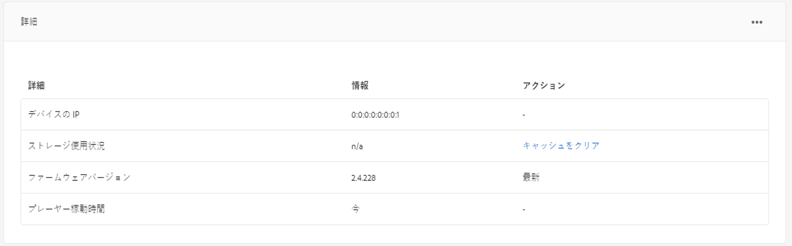

# スケジュールの作成と管理 {#creating-and-managing-schedules}

>[!IMPORTANT]
>このコンテンツは、AEM オンプレミス/AMS （AEM 6.5LTSおよびAEM 6.5）に対して有効です。 AEM as a Cloud Service Screensの内容については、[AEM as a Cloud Service ガイド &#x200B;](https://experienceleague.adobe.com/en/docs/experience-manager-cloud-service/content/screens-as-cloud-service/overview/introduction)を参照してください。

AEM Screen の&#x200B;**スケジュール**&#x200B;では、チャネルを再利用可能なグループに整理できます。 つまり、コンテンツを表示するディスプレイごとに割り当てを個別に繰り返す必要はありません。

スケジュールを&#x200B;***日分割***&#x200B;と組み合わせると、1 日の特定の時間に実行される複数のチャネルでグローバルスケジュールを設定でき、また一度にすべてのディスプレイでその設定を再使用できます。

>[!NOTE]
>
>この AEM Screens 機能は、AEM 6.3 Sites 機能パック 1 がインストールされている場合にのみ使用できます。 この機能パックにアクセスするには、アドビサポートに連絡してアクセス権をリクエストします。 必要な権限を取得したら、Package Share から機能パックをダウンロードできます。

## スケジュールの作成 {#creating-a-schedule}

ユースケースのすべてのアクティビティを管理する Screens プロジェクトのスケジュールを作成できます。

以下の手順に従って、チャネルのスケジュールを作成します。

1. Adobe Experience Manager リンク（左上）をクリックし、「Screens」をクリックします。 または、`http://localhost:4502/screens.html/content/screens` に直接アクセスすることもできます。
1. Screens プロジェクトに移動し、「**スケジュール**」をクリックします。
1. アクションバーの「**作成**」をクリックします。
1. **作成**&#x200B;ウィザードで「**スケジュール**」をクリックし、「**次へ**」をクリックします。

1. 「**名前**」と「**タイトル**」を入力し、「**作成**」をクリックします。

プロジェクトに指定した名前とタイトルのスケジュールフォルダーが表示されます。

## ダッシュボードを見る {#viewing-dashboard}

プロジェクトにスケジュールフォルダーを作成したら、スケジュールダッシュボードから詳細を表示できます。

下の手順に従って、スケジュールダッシュボードを表示します。 次の例では、`We.Retail` プロジェクトのダッシュボードが表示されています。

1. Screens（`We.Retail` など）プロジェクトの&#x200B;**スケジュール**&#x200B;フォルダーに移動します。

   

1. アクションバーで「**ダッシュボード**」をクリックします。

   **スケジュール情報**、**割り当てられたチャネル**、**割り当てられたディスプレイ** の 3 つのパネルが表示されます。

   

   **スケジュール情報パネル** - スケジュール情報パネルの右上隅にある「プロパティ」をクリックして、スケジュールのプロパティを表示または変更します。

   **割り当て済みチャンネルパネル** – 割り当て済みチャンネルパネルの右上隅にある「+チャネルを割り当て」をクリックして、チャネル割り当てダイアログボックスを開きます。

   **割り当て済みディスプレイ パネル** – 割り当て済みディスプレイ パネルの任意のディスプレイをクリックして、ディスプレイ ダッシュボードを開きます。

