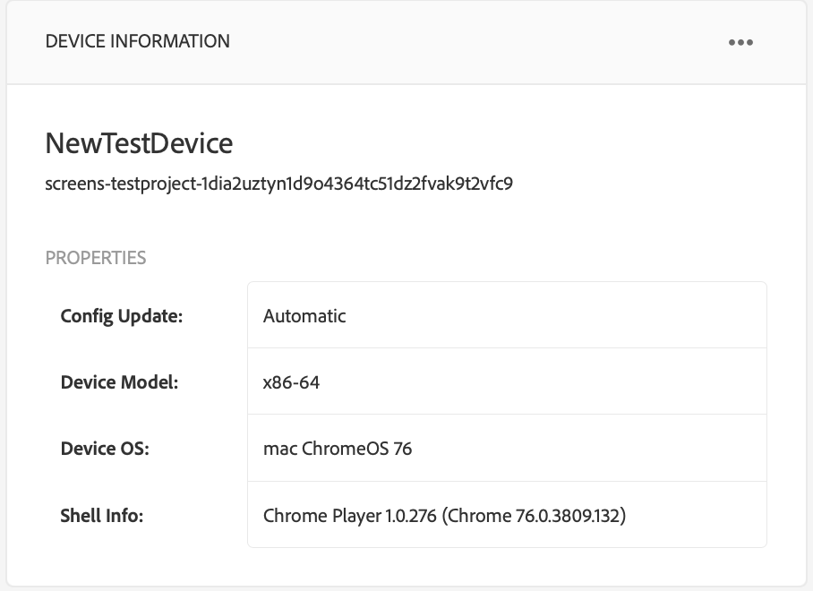

# デバイスコントロールセンターからのトラブルシューティング {#troubleshooting-device-control-center}

デバイスダッシュボードを使用すると、Screens Player のアクティビティやデバイスのパフォーマンスを監視およびトラブルシューティングできます。このページでは、Screens Player や割り当てられているデバイスを監視し、確認されたパフォーマンスの問題をトラブルシューティングする方法について説明します。

## デバイスコントロールセンターからの監視およびトラブルシューティング {#monitor-and-troubleshoot-from-device-control-center}

デバイスダッシュボードを使用すると、アクティビティを監視し、Screens Player をトラブルシューティングできます。

### デバイスダッシュボード {#device-dashboard}

デバイスダッシュボードに移動するには、次の手順を実行します。

1. プロジェクトからデバイスダッシュボードに移動します（例：***Test Project***／***デバイス***）。

   アクションバーから「**デバイス**」および「**デバイスマネージャー**」を選択します。

   

1. 割り当て済みデバイスと未割り当てデバイスがリストに表示されます（下図を参照）。

   

1. デバイス（**NewTestDevice**）を選択し、アクションバーの「**ダッシュボード**」をクリックします。

   

1. このページには、デバイスのアクティビティや機能を監視できるように、デバイス情報、アクティビティおよびデバイス詳細が表示されます。

   

### デバイスアクティビティの監視 {#monitor-device-activity}

**アクティビティ**&#x200B;パネルには、Screens Player の最後の ping とそのタイムスタンプが表示されます。最後の ping は、デバイスがサーバーに最後にアクセスした時間と一致します。

さらに、**アクティビティ**&#x200B;パネルの右上隅にある「**ログを収集**」をクリックすると、プレーヤーのログが表示されます。

### デバイス詳細の更新 {#update-device-details}

デバイスの IP、ストレージ使用状況、ファームウェアバージョンおよびプレーヤー稼動時間を確認するには、**デバイスの詳細**&#x200B;パネルをチェックします。

さらに、このパネルでは、「**キャッシュをクリア**」および「**更新**」をクリックして、デバイスのキャッシュをクリアしたり、[ファームウェア](screens-glossary.md)バージョンを更新したりすることもできます。

また、**デバイスの詳細**&#x200B;パネルの右上隅にある「**...**」をクリックして、プレーヤーを再起動したり、ステータスを更新したりすることもできます。

### デバイス情報の更新 {#update-device-information}

**デバイス情報**&#x200B;パネルで、設定の更新、デバイスモデル、デバイス OS、シェル情報などを確認します。

さらに、デバイス情報パネルの右上隅にある「**...**」をクリックして、プロパティを表示したり、デバイスを更新したりすることもできます。

「**プロパティ**」をクリックすると、**デバイスのプロパティ**&#x200B;ダイアログボックスが表示されます。デバイスのタイトルを編集したり、設定の更新オプションとして「**手動**」または「**自動**」を選択したりすることができます。

>[!NOTE]
>
>デバイスの自動更新または手動更新に関連するイベントについて詳しくは、***チャネルの管理***&#x200B;の[自動アップデートとデバイスダッシュボードからの手動アップデート](managing-channels.md)の節を参照してください。

### プレーヤーのスクリーンショットの表示 {#view-player-screenshot}

**プレーヤーのスクリーンショット**&#x200B;パネルを使用すると、デバイスからプレーヤーのスクリーンショットを表示できます。

プレーヤーのスクリーンショットパネルの右上隅にある「**...**」をクリックし、「**スクリーンショットを更新**」を選択すると、実行中のプレーヤーのスナップショットが表示されます。

### 環境設定の管理 {#manage-preferences}

**環境設定**&#x200B;パネルでは、デバイスの&#x200B;**管理 UI**、**チャネルスイッチャー**、**リモートデバッグ**&#x200B;の環境設定を変更できます。

>[!NOTE]
>これらのオプションについて詳しくは、[AEM Screens Player](working-with-screens-player.md) を参照してください。

また、右上隅の「**設定**」をクリックして、デバイスの環境設定を更新できます。更新できる環境設定は次のとおりです。

* **サーバー URL**
* **解像度**
* **スケジュールを再起動**
* **保持するログファイルの最大数**
* **ログレベル**

>[!NOTE]
>選択できるログレベルは次のいずれかです。
>* **無効**
>* **デバッグ**
>* **情報**
>* **警告**
>* **エラー**

## Troubleshoot OSGi Settings {#troubleshoot-osgi-settings}

デバイスからサーバーへのデータの投稿を許可するには、空のリファラーを有効にする必要があります。例えば、空のリファラーのプロパティが無効になっていると、デバイスからスクリーンショットを投稿できません。

Currently some of these features are only available if the *Apache Sling Referrer Filter Allow Empty* is enabled in the OSGi configuration. ダッシュボードには、セキュリティ設定がこれらの機能の一部の動作を妨げる可能性があることを示す警告が表示される場合があります。

Apache Sling Referrer Filter の Allow Empty 設定を有効にするには、次の手順を実行します。

1. **Adobe Experience Manager Web Console Configuration**（`https://localhost:4502/system/console/configMgr/org.apache.sling.security.impl.ReferrerFilter`）に移動します。
1. 「**allow.empty**」オプションをオンにします。
1. 「**保存**」をクリックします。

### 推奨事項 {#recommendations}

次の節では、ヘルスを把握したり、問題に対処したりするために、ネットワークリンク、サーバーおよびプレーヤーを監視することが推奨されています。

AEM の組み込みの監視では、次の点がチェックされます。

* 5 秒間隔の&#x200B;*ハートビート*。これは、AEM Screens Player が動作中であることを示します。
* プレーヤーの&#x200B;*スクリーンショット*。これは、プレーヤーに現在何が表示されているかを示します。
* AEM Screens Player *ファームウェア*&#x200B;バージョンがプレーヤーにインストールされていること。
* プレーヤー上に&#x200B;*空きストレージ領域*&#x200B;が存在すること。

サードパーティソフトウェアを使用してリモート監視をおこなう場合は、次の点をチェックすることが推奨されています。

* プレーヤー上の CPU 使用量。
* AEM Screens Player プロセスの動作状態。
* プレーヤーのリモート再起動。
* リアルタイム通知。

プレーヤーハードウェアおよび OS をデプロイする際には、リモートログインを許可して問題の診断やプレーヤーの再起動をおこなえるようにすることをお勧めします。

#### その他のリソース {#additional-resources}

チャネルで再生するビデオのデバッグとトラブルシューティングについては、[ビデオ再生の設定およびトラブルシューティング](troubleshoot-videos.md)を参照してください。
