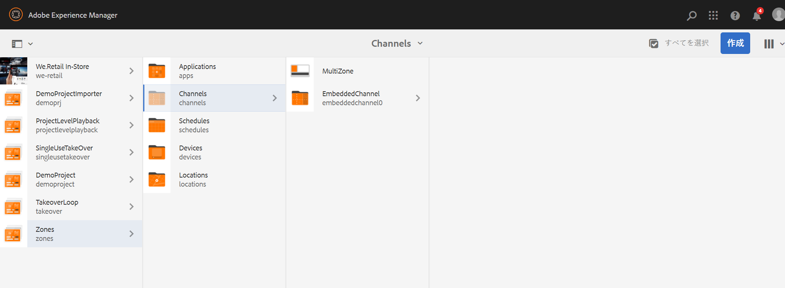
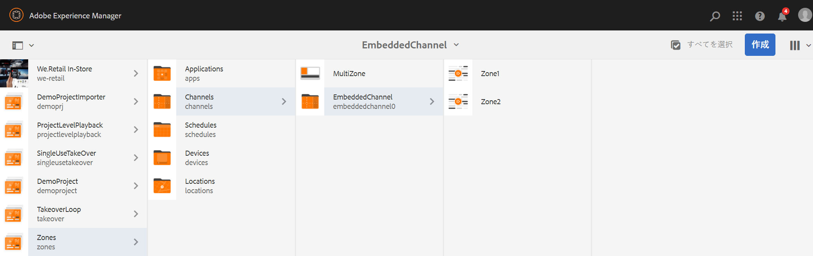

# マルチゾーンレイアウト {#multi-zone-layout}

以下では、マルチゾーンレイアウトの使用方法について説明します。取り上げるトピックは次のとおりです。

* 概要
* マルチゾーンレイアウトの作成
* 前提条件
* 1 つ以上のゾーンでの単一アセットの使用
* 1 つ以上のゾーンでのコンテンツシーケンスの使用

## 概要 {#overview}

***マルチゾーンレイアウト***&#x200B;を使用すると、マルチゾーンコンテンツを作成し、ビデオ、画像およびテキストなどの様々なアセットを使用して、単一のスクリーンに組み合わせることができます。画像、ビデオおよびテキスト取り込み、すべてを組み合わせて、直感的なデジタルエクスペリエンスを作成できます。

プロジェクト要件に応じて、1 つのチャネルに複数のゾーンが必要になり、1 つの包括的なユニットとして編集することがあります。例えば、単一チャネルの 3 つの異なるゾーンで動作する関連ソーシャルメディアフィードを含んだ製品シーケンスなどです。

### 前提条件 {#prerequisites}

この機能の実装を開始する前に、次のドキュメントを参照して概念を確実に理解しておいてください。

* [AEM Screens プロジェクトの作成](https://docs.adobe.com/content/help/ja-JP/experience-manager-screens/user-guide/authoring/setting-up-projects/creating-a-screens-project.html)
* [ディスプレイの作成](https://docs.adobe.com/content/help/ja-JP/experience-manager-screens/user-guide/authoring/setting-up-projects/managing-displays.html)
* [ディスプレイへのチャネルの割り当て](https://docs.adobe.com/content/help/ja-JP/experience-manager-screens/user-guide/authoring/setting-up-projects/channel-assignment.html)

## マルチゾーンレイアウトの作成 {#creating-multi-zone-layout}

チャネルを作成する際に、チャネルにゾーンを作成するために、様々なテンプレートを使用できます。1 つの画像、ビデオまたは埋め込みチャンネルを追加して、複数のアセットを 1 つのシーケンスとして表示できます。

**チャネルの作成**

1. Adobe Experience Manager リンク（左上）を選択し、「**Screens**」を選択します。または、`http://localhost:4502/screens.html/content/screens` に直接アクセスすることもできます。
1. **チャネル**&#x200B;フォルダーに移動し、アクションバーの「**作成**」をクリックします。

1. **作成**&#x200B;ウィザードで「**1 x 2 分割画面チャネル**」を選択します。

1. 「**次へ**」をクリックし、「**タイトル**」に「**MultiZone**」と入力します。

1. 「**作成**」をクリックして、チャネルの作成を完了します。

### 1 つ以上のゾーンでの単一アセットの使用 {#using-single-assets-in-one-or-more-zones}

画像やビデオなどの単一アセットをすべての個々のゾーンで使用できます。実装するには、以下の手順に従います。

1. **チャネルにコンテンツを追加する**

   1. **Zones**／**Channels**／**MultiZone** に移動します。
   1. **MultiZone** チャネルを選択し、アクションバーの「**編集**」をクリックして、エディターを開きます。

1. **チャネルに画像を追加する**

   2 つのゾーンで 1 つの画像またはビデオを再生するには、画像をチャネルエディターの各ゾーンにドラッグ＆ドロップするだけです（下図を参照）。

   

### 1 つ以上のゾーンでのコンテンツシーケンスの使用 {#using-sequenced-content-in-one-or-more-zones}

異なるゾーンに画像のシーケンスやビデオを表示する場合は、以下の手順に従ってください。

1. **チャネルフォルダーの作成**

   1. **Zones**／**Channels**／**MultiZone** に移動し、アクションバーの「**作成**」をクリックします。
   1. **作成**&#x200B;ウィザードから「**チャネルフォルダー**」を選択し、「**次へ**」をクリックします。
   1. 「タイトル」に「**EmbeddedChannels**」と入力し、「**作成**」をクリックします。

   

1. **チャネルフォルダーにさらに 2 つのチャネルを追加する**

   1. **Zones**／**Channels**／**EmbeddedChannels** に移動し、アクションバーの「**作成**」をクリックします。
   1. **作成**&#x200B;ウィザードで「**シーケンスチャネル**」を選択して、「**Zone1**」というタイトルのチャネルを作成します。
   1. **Zone1** を選択し、アクションバーの「**編集**」をクリックして、エディターを開きます。
   1. このチャネルに画像をいくつかドラッグ＆ドロップします。
   1. 同様に、**EmbeddedChannels** フォルダーに「**Zone2**」というタイトルの別のシーケンスチャネルを作成します。
   1. このチャネルにビデオをドラッグ＆ドロップします。

   **Zone1** と **Zone2** の 2 つのチャネルを次の図に示します。

   

   **Zone1** シーケンスチャネルのエディターに追加された画像を以下に示します。

   

   **Zone2** シーケンスチャネルのエディターに追加されたビデオを以下に示します。

   

1. **メインチャネル（MultiZone）に埋め込みシーケンス（コンポーネント）を追加する**

   1. **Zones**／**Channels**／**MultiZone** に移動します。
   1. アクションバーの「**編集**」をクリックして、エディターを開きます。
   1. **埋め込みシーケンス**&#x200B;コンポーネントを両方のゾーンにドラッグ＆ドロップします。
   1. いずれかのゾーンの埋め込みシーケンスを選択します。
   1. エディターで、埋め込みシーケンスの&#x200B;**設定**（レンチ）アイコンをクリックします。
   1. 「チャネルパス」として **Zones**／**Channels**／**EmbeddedChannels**／**Zone1** を選択します（下図を参照）。
   1. 同様に、**Zone2** をエディター内の別の埋め込みシーケンスコンポーネントに追加します。

      

### ロケーションとディスプレイの作成 {#creating-location}

Screens Player でコンテンツを表示するには、ロケーションとディスプレイを作成する必要があります。ロケーションとディスプレイを作成するには、次の手順に従います。

1. **ロケーションの作成**

   1. **ゾーン**／**ロケーション**&#x200B;フォルダーに移動します。
   1. **ロケーション**&#x200B;フォルダーを選択し、アクションバーの「**作成**」をクリックします。
   1. **作成**&#x200B;ウィザードから「**ロケーション**」を選択し、「**次へ**」をクリックします。
   1. 「**タイトル**」に「**SanJose**」と入力し、「**作成**」をクリックします。

1. **ディスプレイの作成**

   1. **ゾーン**／**ロケーション**&#x200B;フォルダーに移動します。
   1. 「**SanJose**」ロケーションを選択し、アクションバーの「**作成**」をクリックします。
   1. **作成**&#x200B;ウィザードから「**ディスプレイ**」を選択し、「**次へ**」をクリックします。
   1. 「**タイトル**」に「**Lobby**」と入力し、「**作成**」をクリックします。

### ディスプレイへのチャネルの割り当て {#channel-channel}

コンテンツを表示するには、ディスプレイにチャネルを割り当てる必要があります。ディスプレイにチャネルを割り当てるには、次の手順に従います。

1. **ディスプレイへのチャネルの割り当て**

   1. **ゾーン**／**ロケーション**／**SanJose**／**Lobby** に移動します。
   1. **Lobby** ディスプレイを選択し、アクションバーの「**チャネルを割り当て**」をクリックします。
   1. **MultiZone** チャネルのパスを「**チャネルパス**」に入力します。
   1. 「**サポートされているイベント**」として、「**最初の読み込み**」、「**待機中画面**」、「**タイマー**」を設定します。
   1. 「**保存**」をクリックします。

      
   1. 同様に、その他の 2 つの埋め込みチャネル（**Zone1** と **Zone2**）をこのディスプレイに割り当てる必要があります。
   1. 3 つのチャネルをすべて **Lobby** ディスプレイに割り当てたら、割り当てられたチャネルをディスプレイダッシュボードで表示できるようになります。

      

      >[!IMPORTANT]
      >
      > メインチャネル（この場合は **MultiZone**）をディスプレイに割り当てたら、その他の 2 つの埋め込みチャネル **Zone1** および **Zone2** も同じディスプレイに割り当てる必要があります。

### デバイスの登録 {#registering-device}

ロケーションとディスプレイを設定したら、次の手順に従ってデバイスを登録し、そのデバイスにディスプレイを割り当てます。

1. **デバイスの登録**

   1. **ゾーン**／**デバイス**&#x200B;フォルダーに移動します。
   1. **デバイス**&#x200B;フォルダーを選択し、アクションバーの「**デバイスマネージャー**」クリックします。
   1. 「**デバイスの登録**」をクリックし、リストから保留中のデバイスを選択します。

      >[!NOTE]
      > デバイスのタイトルは、「**デバイスの登録**」タブに表示されるデバイストークン（「**トークン**」フィールド）と一致する必要があります。
   1. タイトルがデバイストークンと一致する場合は、デバイスを選択し、アクションバーの「**デバイスを登録**」をクリックします。
   1. 登録コードが Screens Player の「**デバイスの登録**」タブのコードと一致する場合は、アクションバーの「**検証**」をクリックします。
      
   1. 「**タイトル**」に「**Chrome-Device1**」と入力し、「**登録**」をクリックします。
   1. 「**ディスプレイを割り当て**」を選択し、デバイス設定のパスを選択します。

   >[!NOTE]
   >Screens Player でコンテンツを表示しようとする場合は、ディスプレイに割り当てられているチャネルごとに、チャネルダッシュボードの「**オフラインコンテンツを更新**」を必ずクリックしてください。

### 結果の表示 {#viewing-the-result}

上記の手順を使用してマルチゾーンレイアウトを実装したら、次の出力が表示されます。

2 つの異なるゾーンにコンテンツを表示する出力を Screens Player で確認します。左ゾーンと右ゾーンです（どちらも埋め込みシーケンスをコンポーネントとして使用しています）。

左ゾーンはシーケンスチャネルで、右ゾーンにはビデオが含まれています。

