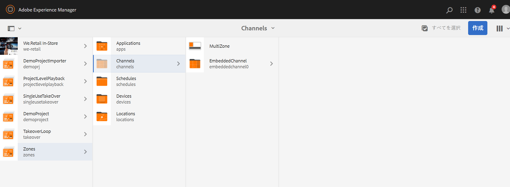
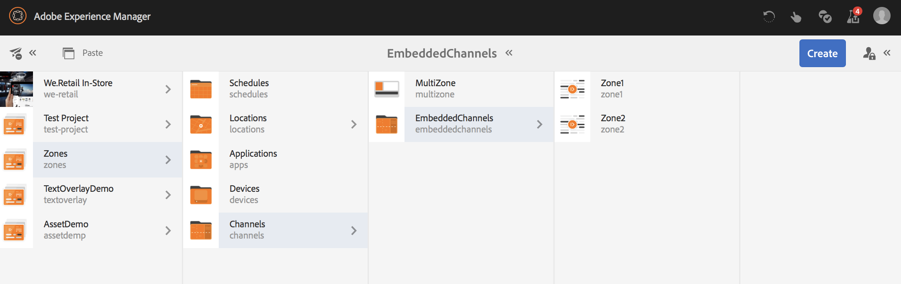

# マルチゾーンレイアウト {#multi-zone-layout}

>[!IMPORTANT]
>このコンテンツは、AEM オンプレミス/AMS （AEM 6.5LTSおよびAEM 6.5）に対して有効です。 AEM as a Cloud Service Screensの内容については、[AEM as a Cloud Service ガイド ](https://experienceleague.adobe.com/en/docs/experience-manager-cloud-service/content/screens-as-cloud-service/overview/introduction)を参照してください。

以下では、マルチゾーンレイアウトの使用方法について説明します。取り上げるトピックは次のとおりです。

* 概要
* マルチゾーンレイアウトの作成
* 前提条件
* 1 つ以上のゾーンでの単一アセットの使用
* 1 つ以上のゾーンでのコンテンツシーケンスの使用

## 概要 {#overview}

***マルチゾーンレイアウト***&#x200B;を使用すると、複数のゾーンコンテンツを作成し、ビデオ、画像およびテキストなどの様々なアセットを使用して、単一のスクリーンに組み合わせることができます。 画像、ビデオおよびテキスト取り込み、すべてを組み合わせて、直感的なデジタルエクスペリエンスを作成できます。

プロジェクト要件に応じて、1 つのチャネルに複数のゾーンが必要になり、1 つの包括的なユニットとして編集することがあります。 例えば、単一チャネルの 3 つの個別のゾーンで実行する、関連するソーシャルメディアフィードを含む製品シーケンスなどです。

>[!NOTE]
>マルチゾーンチャネルでは、競合の可能性や意図しない動作が原因で、アセットレベルのスケジュール設定は推奨されません。 アセットレベルのスケジューリングが必要な場合は、個別のシーケンスチャネルを作成し、そのチャネル内にスケジュールロジックを適用します。 次に、シーケンスチャネルをマルチゾーンチャネルに埋め込みます。

### 前提条件 {#prerequisites}

この機能の実装を開始する前に、次のドキュメントを参照して概念を確実に理解しておいてください。

* [AEM Screens プロジェクトの作成](https://experienceleague.adobe.com/ja/docs/experience-manager-screens/user-guide/authoring/setting-up-projects/creating-a-screens-project)
* [ディスプレイの作成](https://experienceleague.adobe.com/ja/docs/experience-manager-screens/user-guide/authoring/setting-up-projects/managing-displays)
* [ディスプレイへのチャネルの割り当て](/help/user-guide/channel-assignment.md)

## マルチゾーンレイアウトの作成 {#creating-multi-zone-layout}

チャネルを作成する際に、チャネルにゾーンを作成するために、様々なテンプレートを使用できます。 1 つの画像、ビデオまたは埋め込みチャネルを追加して、複数のアセットを 1 つのシーケンスで表示できます。

**チャネルの作成**

1. Adobe Experience Manager リンク（左上）をクリックし、「**Screens**」をクリックします。 または、`http://localhost:4502/screens.html/content/screens` に直接アクセスすることもできます。
1. **チャネル**&#x200B;フォルダーに移動し、アクションバーの「**作成**」をクリックします。

1. **作成**&#x200B;ウィザードで「**1 x 2 分割画面チャネル**」をクリックします。

1. 「**次へ**」をクリックし、「**タイトル**」に「**MultiZone**」と入力します。

1. 「**作成**」をクリックして、チャネルの作成を完了します。

### 1 つ以上のゾーンでの単一アセットの使用 {#using-single-assets-in-one-or-more-zones}

画像やビデオなどの単一アセットをすべての個々のゾーンで使用できます。 実装するには、以下の手順に従います。

1. **チャネルにコンテンツを追加する**

   1. **Zones**／**Channels**／**MultiZone** に移動します。
   1. 「**MultiZone**」チャネルをクリックし、アクションバーの「**編集**」をクリックします。

1. **チャネルに画像を追加する**

   2 つのゾーンで 1 つの画像またはビデオを再生するには、画像をチャネルエディターの各ゾーンにドラッグ＆ドロップするだけです（下図を参照）。

   

### 1 つ以上のゾーンでのコンテンツシーケンスの使用 {#using-sequenced-content-in-one-or-more-zones}

異なるゾーンに画像のシーケンスやビデオを表示する場合は、以下の手順に従ってください。

1. **Channel フォルダーの作成**

   1. **Zones**／**MultiZone**／**Channels** に移動し、アクションバーの「**作成**」をクリックします。
   1. **作成**&#x200B;ウィザードで 「**Channels フォルダー**」をクリックし、「**次へ**」をクリックします。
   1. 「タイトル」に「**EmbeddedChannels**」と入力し、「**作成**」をクリックします。

   

1. **チャネルフォルダーにさらに 2 つのチャネルを追加する**

   1. **Zones**／**Channels**／**EmbeddedChannels** に移動し、アクションバーの「**作成**」をクリックします。
   1. **作成**&#x200B;ウィザードで「**シーケンスチャネル**」をクリックして、**`Zone1`** というタイトルのチャネルを作成します。
   1. 「**`Zone1`**」をクリックし、アクションバーの「**編集**」をクリックします。
   1. このチャネルに画像をいくつかドラッグ＆ドロップします。
   1. 同様に、**EmbeddedChannels** フォルダーに **`Zone2`** というタイトルの別のシーケンスチャネルを作成します。
   1. このチャネルにビデオをドラッグ＆ドロップします。

   **`Zone1`** と **`Zone2`** の 2 つのチャネルを次の図に示します。

   

   **`Zone1`** シーケンスチャネルのエディターに追加された画像を以下に示します。

   

   **`Zone2`** シーケンスチャネルのエディターに追加されたビデオを以下に示します。

   

1. **メインチャネル（MultiZone）に埋め込みシーケンス（コンポーネント）を追加する**

   1. **Zones**／**Channels**／**MultiZone** に移動します。
   1. アクションバーの「**編集**」をクリックします。
   1. **埋め込みシーケンス**&#x200B;コンポーネントを両方のゾーンにドラッグ＆ドロップします。
   1. いずれかのゾーンの埋め込みシーケンスをクリックします。
   1. エディターで、埋め込みシーケンスの&#x200B;**設定**（レンチ）アイコンをクリックします。
   1. チャネルパスとして **Zones**／**Channels**／**EmbeddedChannels**／**`Zone1`** をクリックします（下図を参照）。
   1. 同様に、**`Zone2`** をエディター内の別の埋め込みシーケンスコンポーネントに追加します。

      

### ロケーションとディスプレイの作成 {#creating-location}

AEM Screens Player でコンテンツを表示するには、ロケーションとディスプレイを作成します。

1. **ロケーションの作成**

   1. **ゾーン**／**ロケーション**&#x200B;フォルダーに移動します。
   1. **Locations** フォルダーをクリックし、アクションバーの「**作成**」をクリックします。
   1. **作成**&#x200B;ウィザードで「**ロケーション**」をクリックし、「**次へ**」をクリックします。
   1. 「**タイトル**」に「**SanJose**」と入力し、「**作成**」をクリックします。

1. **ディスプレイの作成**

   1. **ゾーン**／**ロケーション**&#x200B;フォルダーに移動します。
   1. 「**SanJose**」ロケーションをクリックし、アクションバーの「**作成**」をクリックします。
   1. **作成**&#x200B;ウィザードで「**ディスプレイ**」をクリックし、「**次へ**」をクリックします。
   1. 「**タイトル**」に「**Lobby**」と入力し、「**作成**」をクリックします。

### ディスプレイへのチャネルの割り当て {#channel-channel}

コンテンツを表示するには、ディスプレイにチャネルを割り当てます。 ディスプレイにチャネルを割り当てるには、次の手順に従います。

1. **ディスプレイへのチャネルの割り当て**

   1. **Zones**／**Locations**／**SanJose**／**Lobby** に移動します。
   1. **Lobby** ディスプレイをクリックし、アクションバーの「**チャネルを割り当て**」をクリックします。
   1. **MultiZone** チャネルのパスを「**チャネルパス**」に入力します。
   1. 「**サポートされているイベント**」として、「**最初の読み込み**」、「**待機中画面**」、「**タイマー**」を設定します。
   1. 「**保存**」をクリックします。

      
   1. 同様に、その他の 2 つの埋め込みチャネル（**`Zone1`** と **`Zone2`**）をこのディスプレイに割り当てます。
   1. 3 つのチャネルをすべて **Lobby** ディスプレイに割り当てたら、割り当てられたチャネルをディスプレイダッシュボードで表示できるようになります。

      

      >[!IMPORTANT]
      >
      >メインチャネル（この場合は **MultiZone**）をディスプレイに割り当てたら、その他の 2 つの埋め込みチャネル **`Zone1`** および **`Zone2`** も同じディスプレイに割り当てる必要があります。

### デバイスの登録 {#registering-device}

ロケーションとディスプレイを設定したら、次の手順に従ってデバイスを登録し、そのデバイスにディスプレイを割り当てます。

1. **デバイスの登録**

   1. **ゾーン**／**デバイス**&#x200B;フォルダーに移動します。
   1. **デバイス**&#x200B;フォルダーをクリックし、アクションバーの「**デバイスマネージャー**」クリックします。
   1. 「**デバイスの登録**」をクリックし、リストから保留中のデバイスをクリックします。

      >[!NOTE]
      > デバイスのタイトルは、「**デバイスの登録**」タブに表示されるデバイストークン（「**トークン**」フィールド）と一致する必要があります。

   1. タイトルがデバイストークンと一致する場合は、デバイスをクリックし、アクションバーの「**デバイスを登録**」をクリックします。
   1. 登録コードが Screens Player の「**デバイスの登録**」タブのコードと一致する場合は、アクションバーの「**検証**」をクリックします。
      
   1. **タイトル**&#x200B;に **`Chrome-Device1`** と入力し、「**登録**」をクリックします。
   1. 「**ディスプレイを割り当て**」をクリックし、デバイス設定のパスをクリックします。

   >[!NOTE]
   >Screens Player でコンテンツを表示しようとする場合は、ディスプレイに割り当てられているチャネルごとに、チャネルダッシュボードの「**オフラインコンテンツを更新**」を必ずクリックしてください。

### 結果の表示 {#viewing-the-result}

上記の手順を使用してマルチゾーンレイアウトを実装したら、次の出力が表示されます。

2 つの異なるゾーンにコンテンツを表示する出力を Screens Player で確認できます。 左ゾーンと右ゾーン（どちらも埋め込みシーケンスをコンポーネントとして使用します）。

左ゾーンはシーケンスチャネルで、右ゾーンにはビデオが含まれています。

