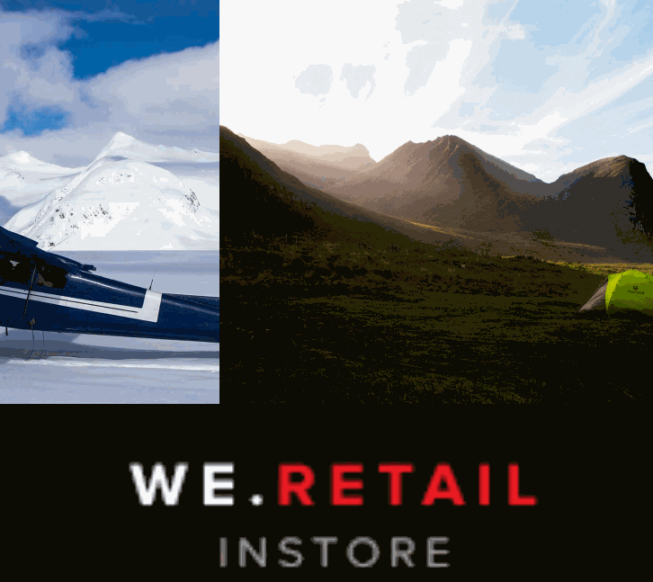

# マルチゾーンレイアウト {#multi-zone-layout}

次のページでは、マルチゾーンレイアウトの使用方法について説明し、次のトピックについて説明します。

* 概要
* マルチゾーンレイアウトの作成
* 前提条件
* 1つ以上のゾーンでの単一のアセットの使用
* 1つ以上のゾーンでのシーケンスコンテンツの使用

## 概要 {#overview}

***マルチゾーンレイアウト*** ：複数のゾーンコンテンツを作成し、1つの画面で組み合わせることができるビデオ、画像、テキストなどの様々なアセットを使用できます。 画像、ビデオ、テキストを取り込むと、すべてをブレンドし、直観的なデジタルエクスペリエンスを作り出すことができます。

プロジェクト要件に応じて、1 つのチャネルに複数のゾーンが必要になり、1 つの包括的なユニットとして編集することがあります。例えば、関連するソーシャルメディアフィードを持つ製品シーケンスが、1つのチャネルの3つの異なるゾーンで実行されているとします。

## マルチゾーンレイアウトの作成 {#creating-multi-zone-layout}

チャネルの作成時に、チャネルにゾーンを作成するために異なるテンプレートを使用できます。 1つの画像、ビデオまたは埋め込みチャンネルを追加して、複数のアセットを1つのシーケンスに表示できます。

### 前提条件 {#prerequisites}

この機能の実装を開始する前に、マルチゾーンレイアウトの実装を開始する前提条件としてプロジェクトが準備されていることを確認してください。 以下に例を挙げます。  

* 「ゾーン」というタイトルのAEM Screensプロジェクトを作成しま **す。**
* 「場所」の下に「MultiZoneDisplay」とい **う名**&#x200B;前のディスプレイ&#x200B;**を作成**

Zonesプロジェクトで、「 **MultiZone** 」という名前のチャネル **を作成します** 。 次の手順に従います。

**チャネルの作成**

1. Adobe Experience Manager リンク（左上）を選択し、**Screens** を選択します。Alternatively, you can go directly to: `http://localhost:4502/screens.html/content/screens`.
1. Channelsフォルダーに **移動し** 、アクションバ **ーで** 「作成」をクリックします。

1. 作成ウ **ィザードで「左L-bar分割画面チャネル** 」を **選択します** 。

1. 「 **Next** 」をクリックし、タイ **トルを** MultiZoneと入力し **ます**。

1. 「作成」 **をクリックし** 、チャネルの作成を完了します。

### 1つ以上のゾーンでの単一のアセットの使用 {#using-single-assets-in-one-or-more-zones}

画像やビデオなど、3つの異なるすべてのゾーンで単一のアセットを使用できます。 以下の手順に従って実装します。

1. **チャネルへのコンテンツの追加**

   1. 「 **Zones** 」 —&gt;「 **Channels**」**—&gt;「MultiZone**」に移動します。
   1. Select the **MultiZone** channel and click **Edit** from the action bar to open the editor.
   

1. **チャネルへの画像の追加**

   単一の画像またはビデオを3つすべてのゾーンで再生するには、次に示すように、チャンネルエディターで画像をドラッグ&amp;ドロップします。

   

### 1つ以上のゾーンでのシーケンスコンテンツの使用 {#using-sequenced-content-in-one-or-more-zones}

ゾーンに画像またはコンテンツのシーケンスと3つの異なるゾーンの静的な画像を表示する場合は、次の手順に従って詳細を確認してください。

1. **チャネルフォルダの作成**

   1. 「 **Zones** —&gt; **MultiZone** —&gt; Channels **」に移動し、「** Create **Create** From Action Bar」をクリックします。
   1. Select **Channels Folder** from the **Create** wizard and click **Next**.
   1. Enter the title as **EmbeddedChannels** and click **Create**.
   

1. **チャネルフォルダに2つのチャネルを追加する**

   1. 「 **Zones** —&gt; **Channels** —&gt; **EmbeddedChannels** 」に移動し、「 **Create** Create from action bar」をクリックします。
   1. 作成ウィ **ザードで「シーケン** スチャネル **** 」を選択し、「** Zone1**」という名前のチャネルを作成します。
   1. Select **Zone1** and click **Edit** from the action bar to open the editor.
   1. このチャネルに少数の画像をドラッグ&amp;ドロップします。
   同様に、EmbeddedChannelsフォルダーに **Zone2という名前の別のシーケンスチャネルを作成** します **** 。

   

1. **メインチャネルへの埋め込みシーケンス/コンポーネントの追加(MultiZone)**

   1. 「 **Zones** 」 —&gt;「 **Channels** 」 —&gt;「 **MultiZone**」に移動します。
   1. アクションバーから「**編集**」をクリックして、エディターを開きます。
   1. 次の図に示すように、 **Embedded Sequence** コンポーネントを2つのゾーンにドラッグ&amp;ドロップします。
   

1. **3つのゾーンすべてにコンテンツを追加**

   1. 「 **Zones** 」 —&gt;「 **Channels** 」 —&gt;「 **MultiZone**」に移動します。
   1. いずれかのゾーンに埋め込まれたシーケンスを選択します。
   1. エディター **に埋め込まれたシーケンスの1つに対して、設定** （レンチ）アイコンをクリックします。
   1. 次の図に示すように、チャネ **ルパスを** Zones **—&gt;** Channels **—&gt; EmbeddedChannels** —&gt; **Zone1** Zone1として選択します。
   同様に、 **Zone2をエディター内の別の埋め込みシーケンス** ・コンポーネントに追加します。 また、下図のように、下部の3番目のゾーンに画像を追加します。

   

#### 結果の表示 {#viewing-the-result}

前述の手順を使用してマルチゾーンレイアウトを実装すると、次の出力が表示されます。

Screens playerでの次の出力は、3つの異なるゾーンにコンテンツを表示します。 左と右のゾーン（両方ともコンポーネントとして埋め込みシーケンスを使用）の画像の表示シーケンスと下のゾーンは静的な画像を表示します。

