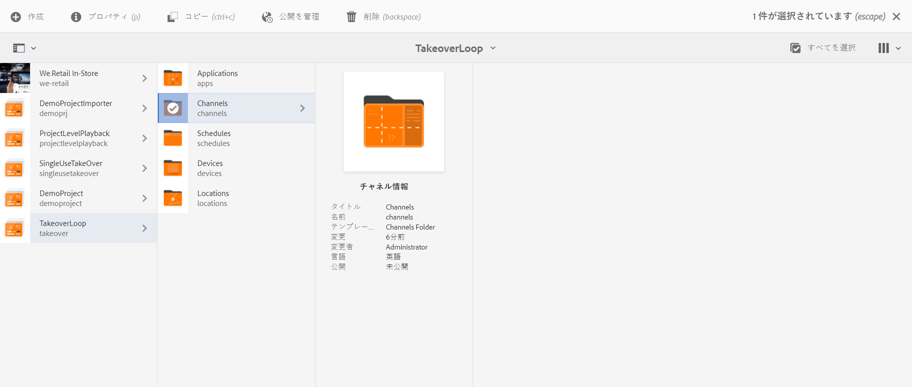
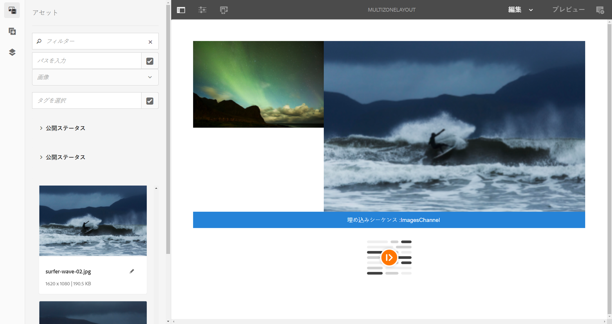
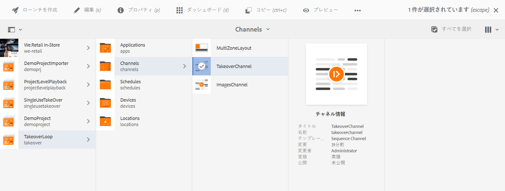
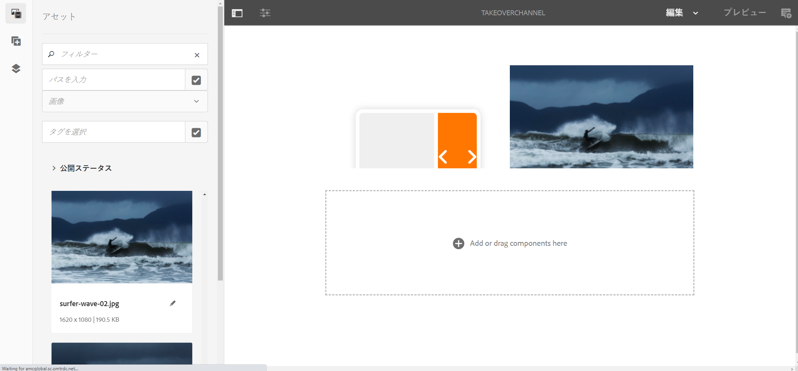
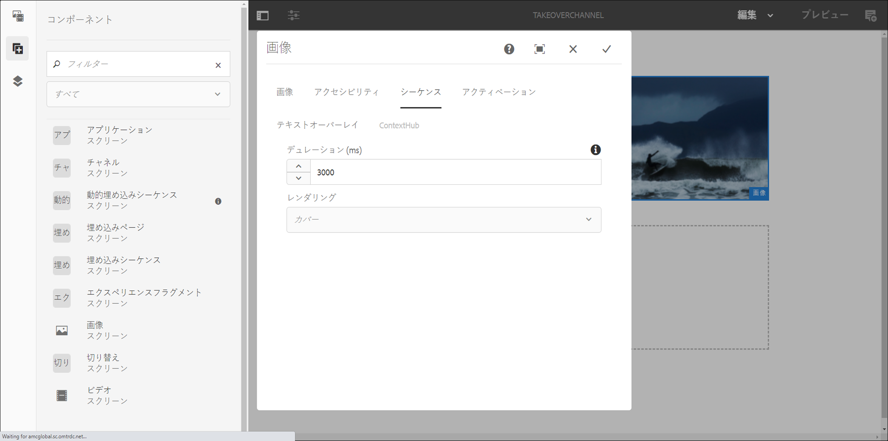

# マルチゾーンからシングルゾーンへの移行 {#multizone-to-singlezone-use-case}

## 使用例の説明 {#use-case-description}

この節では、単一ゾーンのレイアウトチャネルと切り替わるマルチゾーンのレイアウトチャネルを設定する方法を強調する使用例について説明します。 マルチゾーンチャネルは画像/ビデオアセットを順に並べ、マルチゾーンからシングルゾーンに、またはその逆に切り替わるプロジェクトを設定する方法を示します。

### 前提条件 {#preconditions}

この使用例を開始する前に、以下をおこなう方法を理解しておく必要があります。

* **[チャネルの作成と管理](managing-channels.md)**
* **[ロケーションの作成と管理](managing-locations.md)**
* **[スケジュールの作成と管理](managing-schedules.md)**
* **[デバイスの登録](device-registration.md)**

### 主要なアクター {#primary-actors}

コンテンツ作成者

## Setting up the Project {#setting-up-the-project}

次の手順に従って、プロジェクトを設定します。

1. Create an AEM Screens Project named as **TakeoverLoop**, as shown below.

   

1. **マルチゾーン画面チャネルの作成**

   1. Select the **Channels** folder and click **Create** from the action bar to open the wizard to create a channel.
   1. ウィザード **から「Left-L Bar Split Screen Channel** 」を選択し、「MultiZoneLayout」という名前のチャネルを作成 **します**。
   1. チャネルにコンテンツを追加します。 各ゾーンにアセットをドラッグ&amp;ドロップします。 次の例は、ビデオ、画像 **** 、および（埋め込みシーケンス内の）テキストバナーで構成されるMultiZoneLayoutチャネルを示しています。以下に例を示します。
   

   >[!NOTE]
   >
   >チャネルでのマルチゾーンレイアウトの作成について詳しくは、「マルチゾーンレイアウト」 [を参照してください](multi-zone-layout-aem-screens.md)。

1. TakeoverChannelという名前の別のチャネルを **Channels** フォルダに作 **成します** 。

   

1. アクショ **ンバーの** 「編集」をクリックして、このチャネルにコンテンツを追加します。 次の図に **示すように** 、このチャネルに、切り替え先のチャネルコンポーネントと画像アセットを追加します。

   

1. チャネルコンポーネントの設定を開き、手順2で作成した **MultiZoneLayout** チャネルを指し *示します*。

   

1. [シーケンス]フィールドの **期間を** 10000 ms **に設定します**。

   

1. 同様に、画像（追加したアセット）の設定を開き、「シーケンス」フィールドから **時間** 3000 msに **設定します**。

   

## プレビューを確認する {#checking-the-preview}

必要な出力は、プレーヤーから表示することも、エディターから「プレビュー」をクリ **ックする** こともできます。

この出力では、マルチゾーンレイアウトが *10000 msの間再生され、再生時間が* 3000 msのシングルゾーンレイアウトに切り替わり、その後マルチゾーンレイアウトに切り替わる方法を示します ** 。

>[!VIDEO](https://video.tv.adobe.com/v/30366)

>[!NOTE]
>
>必要に応じて、チャネルの移行を（マルチゾーンからシングルゾーンへのレイアウト、またはその逆のレイアウトに）カスタマイズできます。