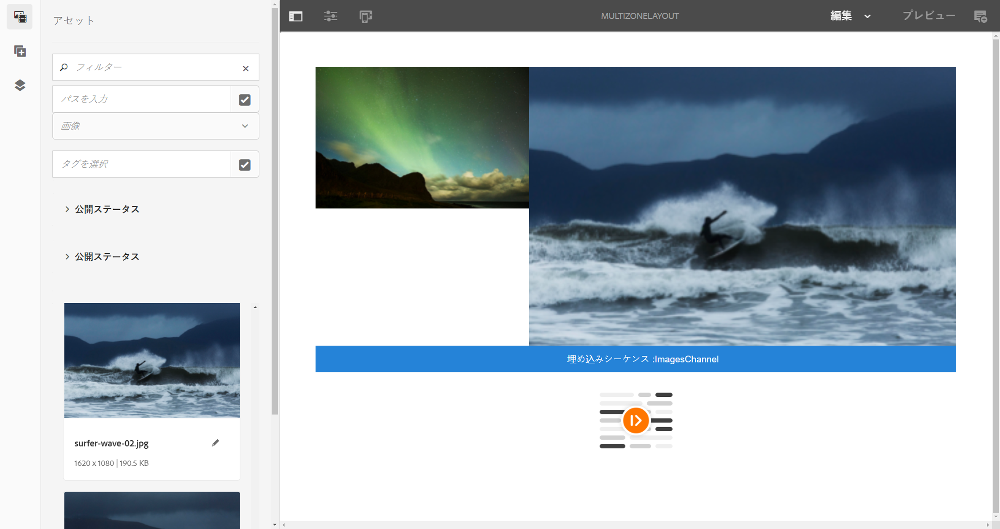
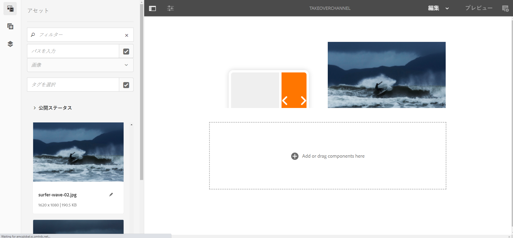
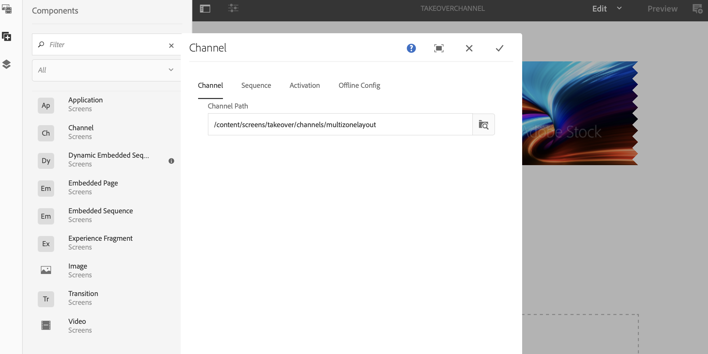
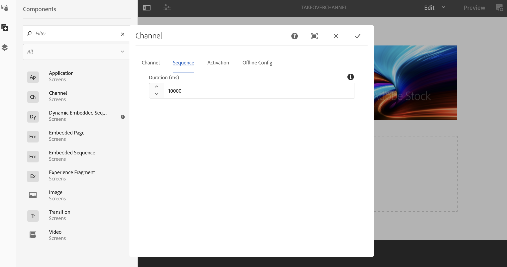
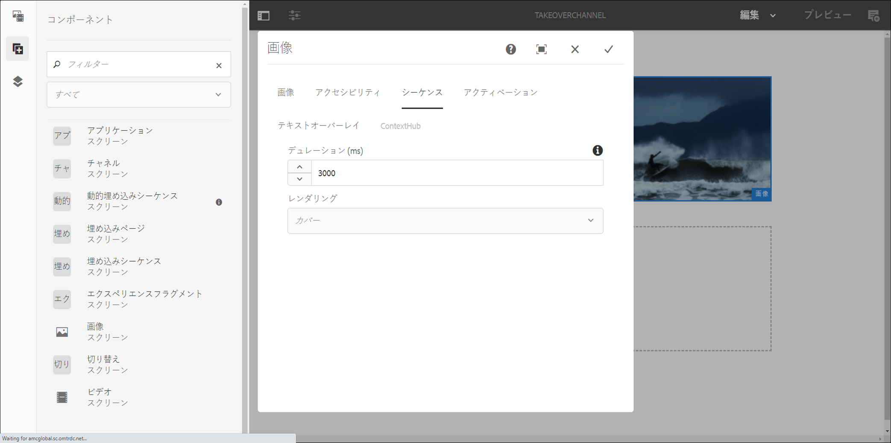

# マルチゾーンからシングルゾーンへのトランジション {#multizone-to-singlezone-use-case}

## ユースケースの説明 {#use-case-description}

>[!IMPORTANT]
>このコンテンツは、AEM オンプレミス/AMS （AEM 6.5LTSおよびAEM 6.5）に対して有効です。 AEM as a Cloud Service Screensの内容については、[AEM as a Cloud Service ガイド ](https://experienceleague.adobe.com/en/docs/experience-manager-cloud-service/content/screens-as-cloud-service/overview/introduction)を参照してください。

ここでは、シングルゾーンレイアウトのチャネルに切り替わるマルチゾーンレイアウトのチャネルをセットアップする方法に重点を置いた使用例について説明します。 このマルチゾーンチャネルには一連の画像／ビデオアセットがあり、マルチゾーンとシングルゾーンの間で切り替わるプロジェクトをセットアップする方法を示しています。

### 前提条件 {#preconditions}

この使用例を開始する前に、以下の方法を理解しておく必要があります。

* **[チャネルの作成と管理](managing-channels.md)**
* **[ロケーションの作成と管理](managing-locations.md)**
* **[スケジュールの作成と管理](managing-schedules.md)**
* **[デバイスの登録](device-registration.md)**

### 主要なアクター {#primary-actors}

コンテンツ作成者

## プロジェクトのセットアップ {#setting-up-the-project}

次の手順に従って、プロジェクトをセットアップします。

1. **TakeoverLoop** という名前の AEM Screens プロジェクトを作成します（下図を参照）。

   

1. **マルチゾーン Screens チャネルの作成**

   1. **Channels** フォルダーを選択し、アクションバーの「**作成**」をクリックして、ウィザードを開き、チャネルを作成します。
   1. ウィザードで「**左 L バー型分割画面チャネル**」をクリックし、**MultiZoneLayout** というタイトルのチャネルを作成します。
   1. このチャネルにコンテンツを追加します。 各ゾーンにアセットをドラッグ＆ドロップします。 次の例は、ビデオ、画像、（埋め込みシーケンス内の）テキストバナーで構成される **MultiZoneLayout** チャネルを示しています（下図を参照）。

   

   >[!NOTE]
   >
   >チャネルでのマルチゾーンレイアウトの作成について詳しくは、[マルチゾーンレイアウト](multi-zone-layout-aem-screens.md)を参照してください。

1. **TakeoverChannel** というタイトルの別のチャネルを&#x200B;**チャネル**&#x200B;フォルダーに作成します。

   

1. アクションバーの「**編集**」をクリックすると、このチャネルにコンテンツを追加できます。 このチャネルに&#x200B;**チャネル**&#x200B;コンポーネントと切り替え先の画像アセットを追加します（下図を参照）。

   

1. チャネルコンポーネントの設定を開き、*手順 2* で作成した **MultiZoneLayout** チャネルを指すように設定します。

   

1. **シーケンス**&#x200B;フィールドのデュレーションを **10000 ミリ秒**&#x200B;に設定します。

   

1. 同様に、画像（追加したアセット）の設定を開き、「**シーケンス**」フィールドのデュレーションを **3000 ミリ秒**&#x200B;に設定します。

   

## プレビューを確認する {#checking-the-preview}

目的の出力は、プレーヤーで表示するか、エディターで「**プレビュー**」を選択して表示することができます。

出力は、マルチゾーンレイアウトが *10000 ミリ秒*&#x200B;間どのように再生されるかを示しています。 次に、再生時間が *3000 ミリ秒*&#x200B;の単一のゾーンレイアウトに切り替わります。 最後に、マルチゾーンレイアウトに戻ります。

>[!VIDEO](https://video.tv.adobe.com/v/30366)

>[!NOTE]
>
>（マルチゾーンレイアウトとシングルゾーンレイアウトの間の）チャネルトランジションは、必要に応じてカスタマイズできます。
