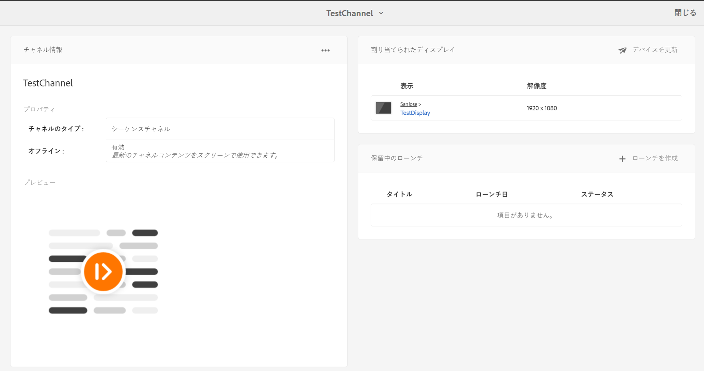

# オフラインチャネル {#offline-channels}

Screens Player では、以下を使用してチャネルをオフラインサポートします。 ***ContentSync*** 技術。

プレーヤーは、解凍したコンテンツを提供するためにローカルの HTTP サーバーを使用します。

チャネルが実行されるように設定されている場合 *オンライン*&#x200B;プレーヤーは、AEM サーバーにアクセスしてチャネルリソースを提供します。 ただし、チャネルが実行されるように設定されている場合は、 *オフライン*&#x200B;プレーヤーは、ローカル http サーバーからチャネルリソースを提供します。

プロセスのワークフローは次のとおりです。

1. 目的のページを解析します。
1. 関連するすべてのアセットを収集します。
1. すべてを zip ファイルにパッケージ化します。
1. zip ファイルをダウンロードし、ローカルで抽出します。
1. コンテンツのローカルコピーを表示します。

## 更新ハンドラー {#update-handlers}

***ContentSync*** は、更新ハンドラーを使用して、特定のプロジェクトに必要なすべてのページとアセットを解析および収集します。AEM Screens では、次の更新ハンドラーが使用されます。

### 共通オプション {#common-options}

* *type*：使用する更新ハンドラーのタイプ
* *path*：リソースのパス
* *[targetRootDirectory]*：zip ファイル内のターゲットフォルダー

<table>
 <tbody>
  <tr>
   <td><strong>タイプ</strong></td> 
   <td><strong>説明</strong></td> 
   <td><strong>Options</strong></td> 
  </tr>
  <tr>
   <td><code>channels</code></td> 
   <td>チャネルを収集します</td> 
   <td>extension：収集するリソースの拡張子 [pathSuffix='']：チャネルパスに追加するサフィックス  </td> 
  </tr>
  <tr>
   <td><code>clientlib</code></td> 
   <td>指定されたクライアントライブラリを収集します</td> 
   <td>[extension='']：css か js のどちらか（前者のみか後者のみを収集するために指定）</td> 
  </tr>
  <tr>
   <td><code>assetrenditions</code></td> 
   <td>アセットレンディションを収集します</td> 
   <td>[renditions=[]]：収集するレンディションのリスト。デフォルトで元のレンディションに設定</td> 
  </tr>
  <tr>
   <td><code>copy</code></td> 
   <td>指定された構造をパスからコピーします</td> 
   <td> </td> 
  </tr>
 </tbody>
</table>

### ContentSync 設定のテスト {#testing-contentsync-configuration}

ContentSync 設定をテストするには、以下の手順に従います。

1. `https://localhost:4502/libs/cq/contentsync/content/console.html` を開きます。
1. リストで設定をクリックします
1. 「キャッシュをクリア」をクリックします。
1. 「キャッシュを更新」をクリックします。
1. 「すべてダウンロード」をクリックします。
1. zip ファイルを解凍します。
1. 解凍したフォルダーでローカルサーバーを起動します。
1. 開始ページを開き、アプリのステータスを確認します。

## チャネルのオフライン設定の有効化 {#enabling-offline-config-for-a-channel}

チャネルのオフライン設定を有効にするには、次の手順に従います。

1. チャネルコンテンツを調べて、それが AEM インスタンスから要求されているかどうかを確認します（オンライン）。

   

1. チャネルダッシュボードに移動します。
1. クリック **...** が含まれる **チャネル情報** パネル。

   

1. チャネルプロパティに移動します。
1. 「（（チャネル））」タブで、チェックボックスが無効になっていることを確認し、クリックします **保存して閉じる**.

   

   コンテンツを適切にデバイスに実装する前に、「**オフラインコンテンツを更新**」をクリックします。

   

   これに合わせて「**プロパティ**」の「**オフライン**」ステータスも更新されます。

   

1. チャネルコンテンツを調べて、それがローカルの Player-Cache から要求されているかどうかを確認します。

   

>[!NOTE]
>
>カスタムオフラインリソースハンドラーのテンプレートの詳細と、そのプロジェクトの `pom.xml` の最小要件については、**AEM Screens 用カスタムコンポーネントの開発**&#x200B;の[カスタムハンドラーのテンプレート](/help/user-guide/developing-custom-component-tutorial-develop.md#custom-handlers)を参照してください。
