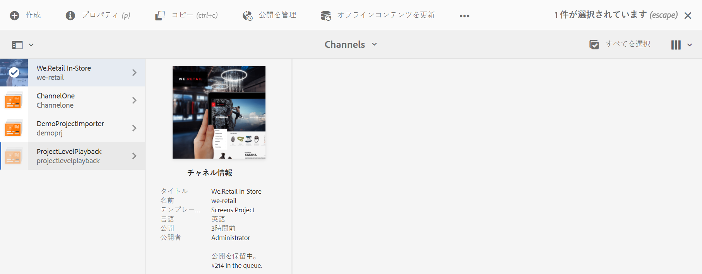
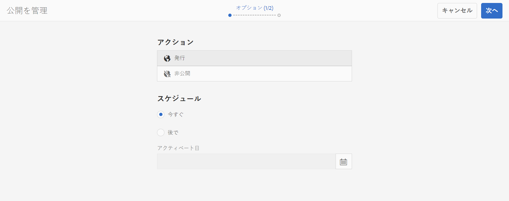
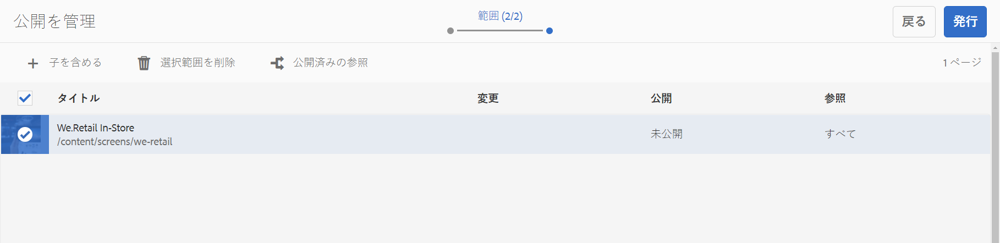
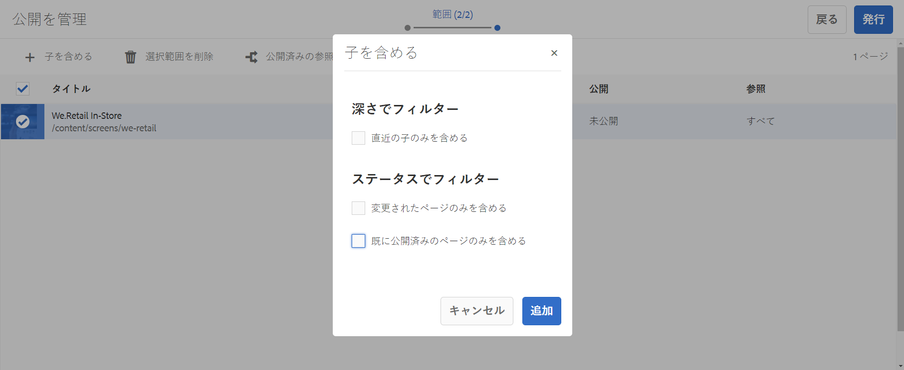
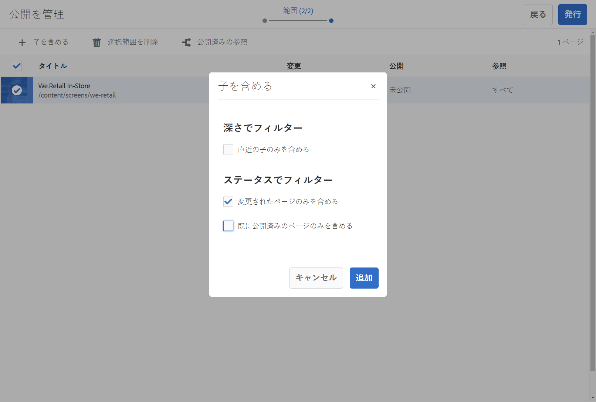
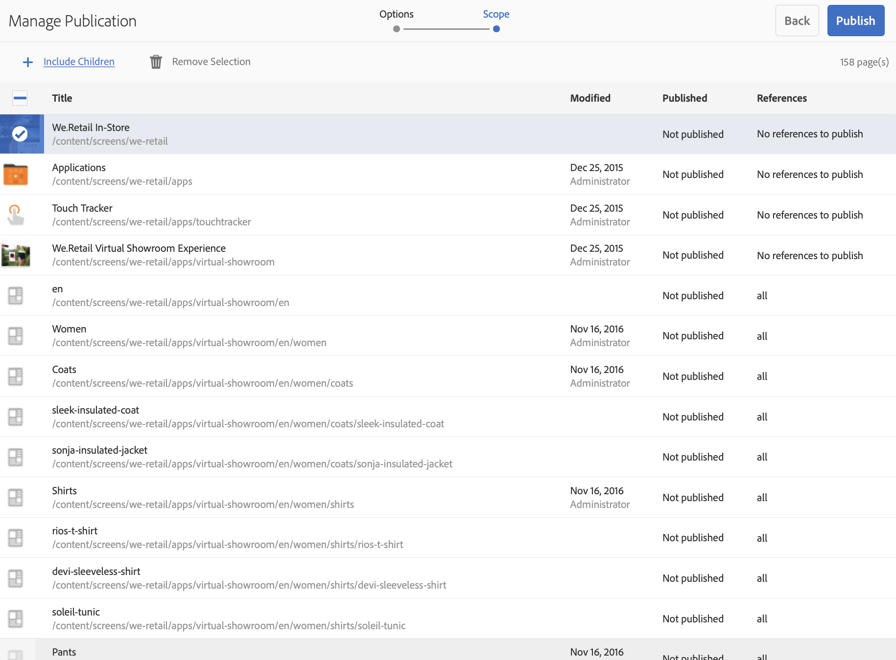
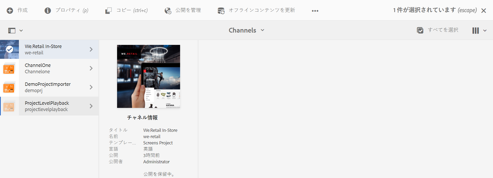
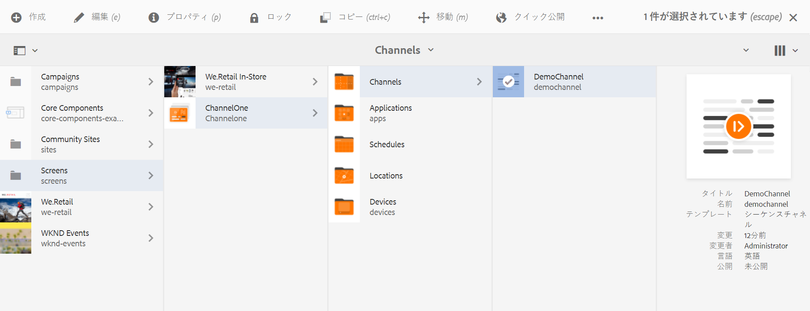
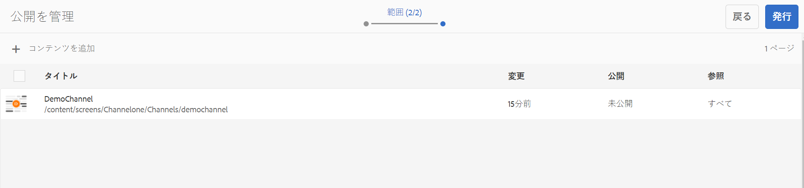
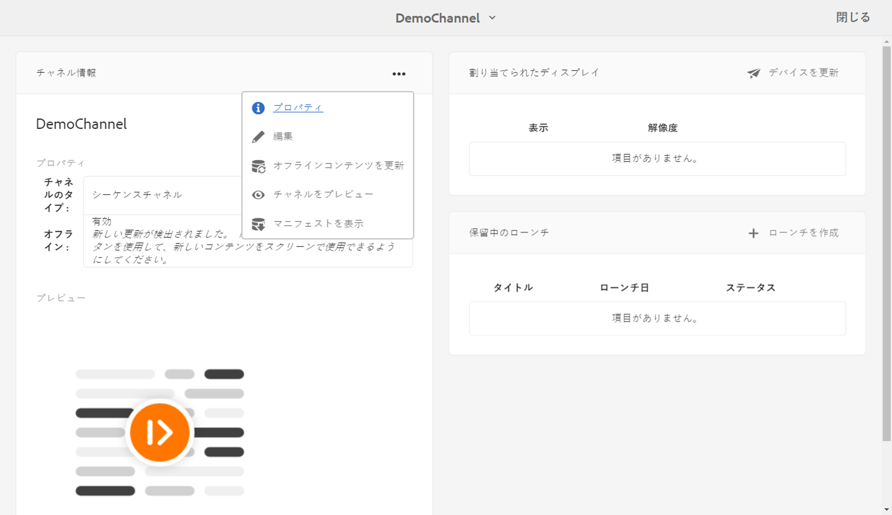

# オンデマンドのコンテンツ更新 {#on-demand}

ここでは、公開を管理するためのオンデマンドコンテンツについて説明します。

## 公開の管理：オーサーからパブリッシュ経由でデバイスにコンテンツの更新を配信 {#managing-publication-delivering-content-updates-from-author-to-publish-to-device}

AEM Screens からは、コンテンツの公開と非公開をおこなうことができます。「公開を管理」機能を使用すると、コンテンツの更新をオーサーからパブリッシュ経由でデバイスに配信できます。AEM Screens プロジェクト全体のコンテンツを公開／非公開にすることも、チャネル、ロケーション、デバイス、アプリケーション、スケジュールのいずれか 1 つのコンテンツを公開／非公開にすることもできます。

### AEM Screens プロジェクトの公開の管理 {#managing-publication-for-an-aem-screens-project}

AEM Screens プロジェクトのコンテンツの更新をオーサーからパブリッシュ経由でデバイスに配信するには、以下の手順に従います。

1. AEM Screens プロジェクトに移動します。
1. プロジェクトをパブリッシュインスタンスに公開するために、アクションバーの「**公開を管理**」をクリックします。

   

1. **公開を管理**&#x200B;ウィザードが開きます。「**アクション**」を選択できるほか、公開スケジュールとして「今すぐ」か「後で」のいずれかを選択できます。「**次へ**」をクリックします。

   

1. **公開を管理**&#x200B;ウィザードでプロジェクト全体を選択するには、チェックボックスをオンにします。

   

1. アクションバーの「**+ 子を含める**」をクリックし、プロジェクト内のすべてのモジュールを公開するためにすべてのオプションをオフにして、「**追加**」をクリックします。

   >[!NOTE]
   >
   >デフォルトでは、すべてのチェックボックスがオンになっているので、プロジェクト内のすべてのモジュールを公開するには、チェックボックスを手動でオフにする必要があります。

   

   **子を含めるダイアログボックスについて**

   上記の手順では、コンテンツ全体を公開する方法を示しています。それ以外の 3 つの選択肢のいずれかを使用する場合は、その特定のオプションをオンにする必要があります。
例えば、下図のようにオプションを選択すると、プロジェクト内の変更されたページのみを管理および更新できるようになります。
   

   使用可能なオプションについては、以下の説明を参照してください。

   1. **直近の子のみを含める**：プロジェクト構造内のサブノードの更新のみを管理できます。
   1. **変更されたページのみを含める**：プロジェクト構造内で変更が見つかったページの更新のみを管理できます。
   1. **既に公開済みのページのみを含める**：以前に公開されたページの更新のみを管理できます。

1. **公開を管理**&#x200B;ウィザードで「**公開**」をクリックします。

   

   >[!NOTE]
   >
   >コンテンツがパブリッシュインスタンスに届くまで、数秒または数分待ちます。
   >
   >
   >    1. プロジェクトに変更がなく、「**オフラインコンテンツを更新**」の実行対象がない場合、ワークフローは機能しません。
   >    1. 公開管理ワークフローで「**公開**」ボタンをクリックした後、作成者がレプリケーションプロセスを完了しない（コンテンツがまだパブリッシュインスタンスにアップロード中である）場合、ワークフローは機能しません。

   >[!CAUTION]
   >オーサーインスタンスに接続されているデバイスでの変更を作成者またはコンテンツ作成者が確認する場合は、チャネルダッシュボードで「**オフラインコンテンツを更新**」をクリックするか、プロジェクトを選択します。この場合、オフラインコンテンツの更新はオーサーインスタンスでのみ実行されます。

1. プロジェクトに移動し、アクションバーの「**オフラインコンテンツを更新**」をクリックします。このアクションは、同じコマンドをパブリッシュインスタンスに転送するので、パブリッシュインスタンスにもオフライン zip ファイルが作成されます。

   

   >[!NOTE]
   >
   >公開管理ワークフローを完了した後、オーサーインスタンスを参照するプレーヤーが存在する場合は、オーサー環境でオフラインコンテンツの更新をトリガーする必要があります。その結果、オーサーインスタンス上で更新がオフラインで作成されます。

   >[!CAUTION]
   >
   >オーサーサーバーに登録されているプレーヤーがある場合は、オーサーインスタンスでオフラインコンテンツの更新をトリガーする必要があります。パブリッシュインスタンスに登録されているプレーヤーについては、オフラインコンテンツの更新は必要ありません。

### チャネルの公開の管理 {#managing-publication-for-a-channel}

AEM Screens プロジェクトに含まれるチャネルのコンテンツの更新をオーサーからパブリッシュ経由でデバイスに配信するには、以下の手順に従います。

>[!NOTE]
>
>この節は、チャネルに変更がある場合にのみ参照してください。オフラインコンテンツを以前に更新してからチャネルに変更がない場合、個々のチャネルの公開管理ワークフローは機能しません。

1. Screens プロジェクトに移動し、チャネルを選択します。
1. チャネルをパブリッシュインスタンスに公開するために、アクションバーの「**公開を管理**」をクリックします。

   

1. **公開を管理**&#x200B;ウィザードが開きます。「**アクション**」を選択できるほか、公開スケジュールとして「今すぐ」か「後で」のいずれかを選択できます。「**次へ**」をクリックします。

   

1. **公開を管理**&#x200B;ウィザードで「**公開**」をクリックします。

   

   >[!NOTE]
   >
   >コンテンツがパブリッシュインスタンスに届くまで、数秒または数分待ちます。

1. チャネルダッシュボードで「**オフラインコンテンツを更新**」をトリガーすると、オフラインコンテンツがオーサーインスタンスに対してのみプッシュされ、パブリッシュインスタンスにはプッシュされません。手順 1～4 は、オフラインコンテンツをパブリッシュインスタンスにプッシュするためのものです。

   

   >[!CAUTION]
   >
   >前述の手順に従って、先に公開してから「オフラインコンテンツを更新」をトリガーする必要があります。

### チャネルとデバイスの再割り当て {#channel-and-device-re-assignment}

デバイスの再割り当てをおこなった場合は、デバイスを新しいディスプレイに再割り当てした後で、初期のディスプレイと新しいディスプレイの両方を公開する必要があります。

同様に、チャネルの再割り当てをおこなった場合は、チャネルを新しいディスプレイに再割り当てした後で、初期のディスプレイと新しいディスプレイの両方を公開する必要があります。