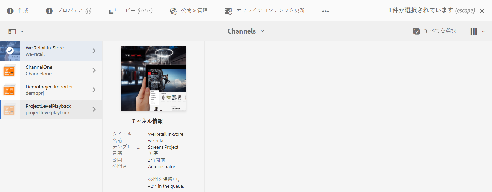
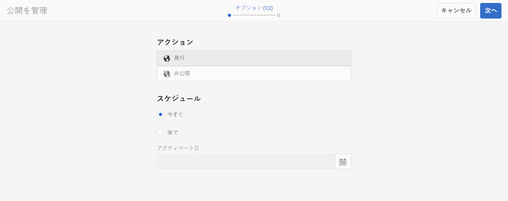
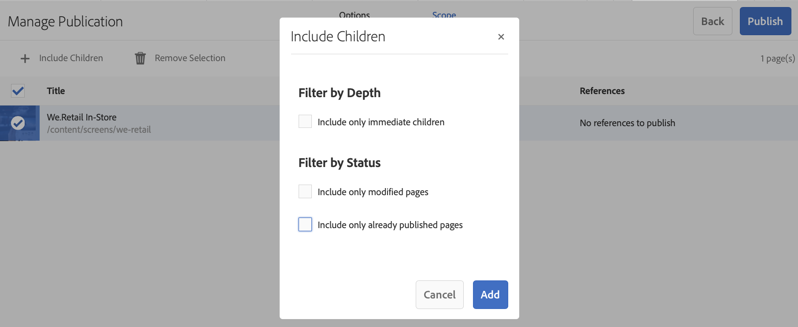
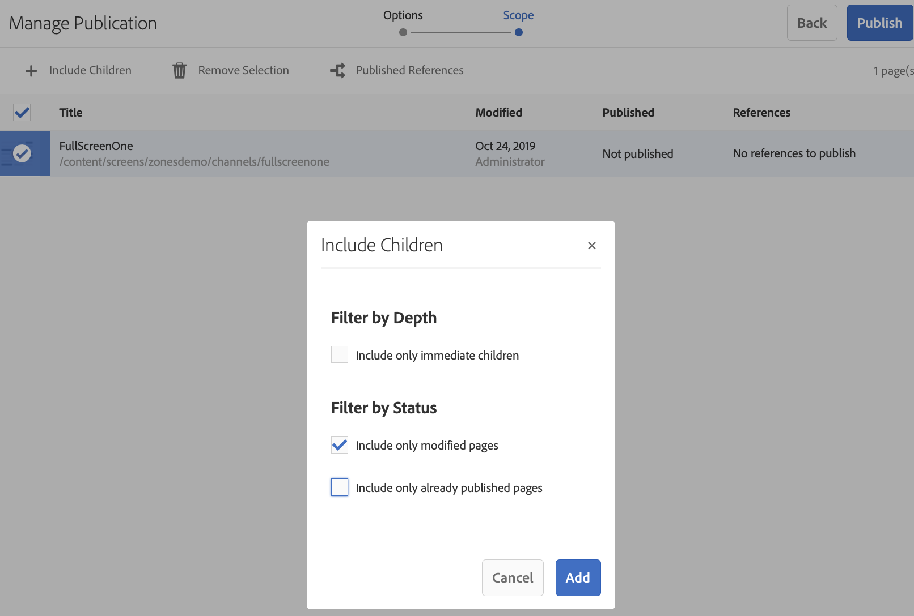
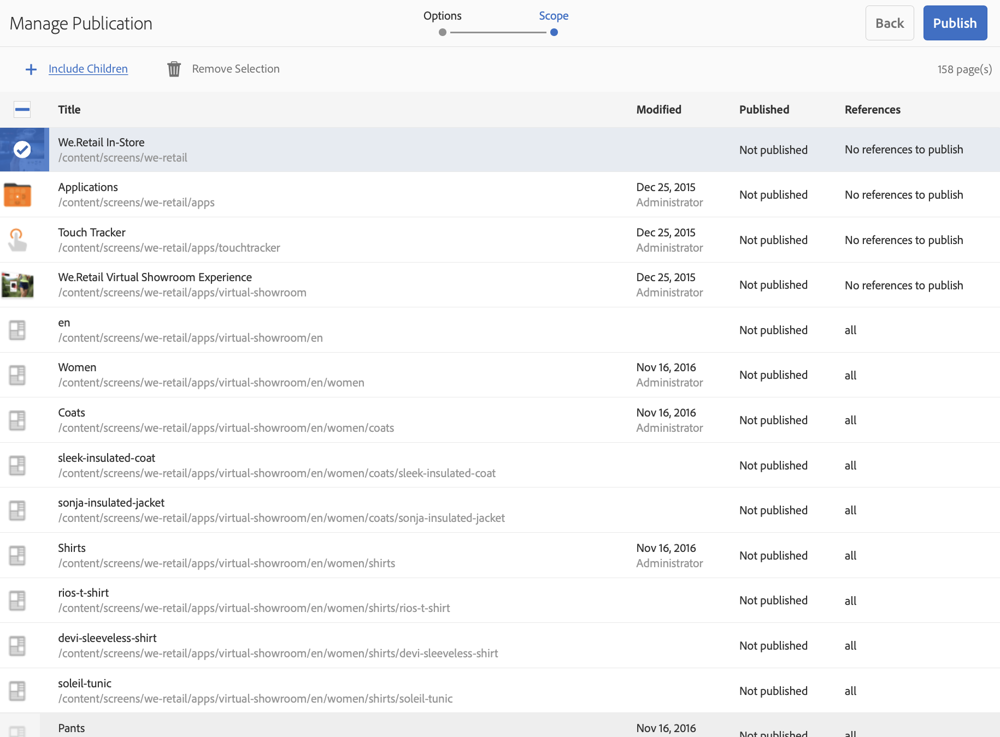
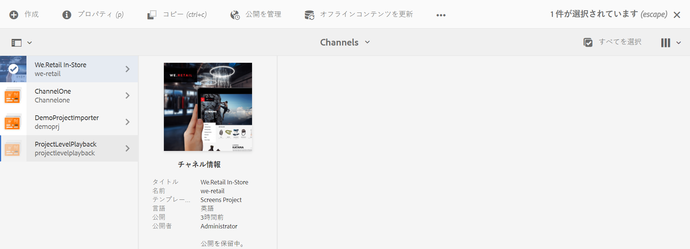
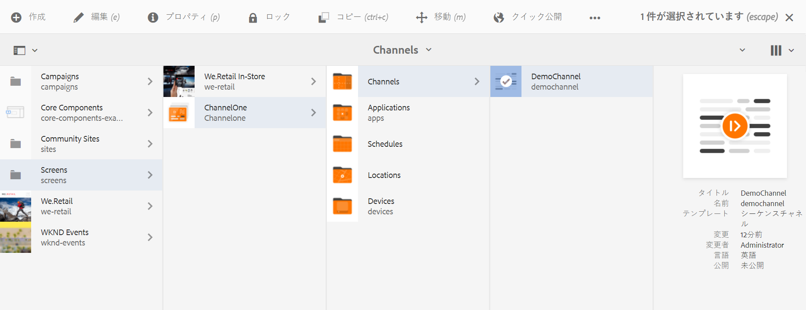
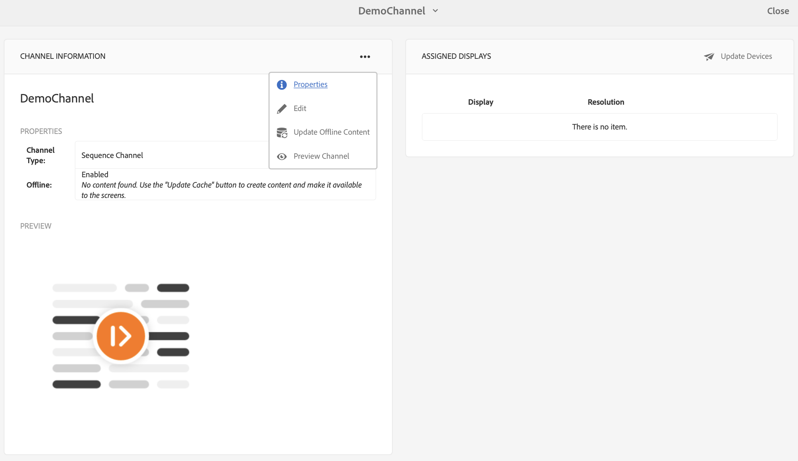

# オンデマンドコンテンツの更新 {#on-demand}

>[!IMPORTANT]
>このコンテンツは、AEM オンプレミス/AMS （AEM 6.5LTSおよびAEM 6.5）に対して有効です。 AEM as a Cloud Service Screensの内容については、[AEM as a Cloud Service ガイド ](https://experienceleague.adobe.com/en/docs/experience-manager-cloud-service/content/screens-as-cloud-service/overview/introduction)を参照してください。

ここでは、公開を管理するためのオンデマンドコンテンツについて説明します。

## 公開を管理：コンテンツの更新を作成者から公開にデバイスに配信します {#managing-publication-delivering-content-updates-from-author-to-publish-to-device}

AEM Screens からは、コンテンツの公開と非公開を行うことができます。 **公開を管理**&#x200B;すると、コンテンツの更新を作成者からパブリッシュにデバイスに配信できます。 AEM Screens プロジェクト全体のコンテンツを公開／非公開にすることも、チャネル、場所、デバイス、アプリケーション、スケジュールのいずれか 1 つのコンテンツを公開／非公開にすることもできます。

### AEM Screens プロジェクトの公開の管理 {#managing-publication-for-an-aem-screens-project}

AEM Screens プロジェクトのコンテンツの更新をオーサーからパブリッシュ経由でデバイスに配信するには、以下の手順に従います。

1. AEM Screens プロジェクトに移動します。
1. アクションバーの「**公開を管理**」をクリックして、プロジェクトをパブリッシュインスタンスに公開します。

   

1. **公開を管理**&#x200B;ウィザードが開きます。 「**アクション**」をクリックできるほか、公開スケジュールとして今か後でのいずれかを選択できます。 「**次へ**」をクリックします。

   

1. チェックボックスをオンにすると、**`Manage Publication`** ウィザードからプロジェクト全体をクリックできるようになります。

   

1. アクションバーの「**+ 子を含める**」をクリックし、すべてのオプションのチェックを外して、プロジェクト内のすべてのモジュールを公開し、「**追加**」をクリックして公開することができます。

   >[!NOTE]
   >
   >デフォルトでは、すべてのチェックボックスがオンになっているので、プロジェクト内のすべてのモジュールを公開するには、チェックボックスを手動でオフにする必要があります。

   

   **子を含めるダイアログボックスについて**

   上記の手順は、コンテンツ全体を公開する方法を示しています。利用可能な他の3つの選択肢を使用したい場合は、その特定のオプションをチェックする必要があります。
例えば、次の画像は、プロジェクト内の変更されたページのみを管理および更新する方法を示しています。
   

   以下の説明に従って、使用可能なオプションを理解します。

   1. **即時の子のみを含める**:
このオプションを使用すると、プロジェクト構造内のサブノードに対してのみ更新を管理できます。
   1. **変更されたページのみを含める**:
このオプションを使用すると、プロジェクト構造で変更が見つかったプロジェクトの変更されたページに対してのみ更新を管理できます。
   1. **既に公開されているページのみを含める**:
このオプションを使用すると、以前に公開されたページに対してのみ更新を管理できます。

1. **`Manage Publication wizard`** から、「**公開**」をクリックします。

   

   >[!NOTE]
   >
   >コンテンツがパブリッシュインスタンスに届くまで、数秒または数分待ちます。
   >
   >
   >    1. プロジェクトに変更がなく、「**オフラインコンテンツを更新**」の実行対象がない場合、ワークフローは機能しません。
   >    1. 作成者が、公開ワークフローの管理で「**公開**」ボタンを選択した後にレプリケーションプロセス（コンテンツが公開インスタンスにアップロードされている）を完了しない場合、ワークフローは機能しません。

   >[!CAUTION]
   >オーサーインスタンスに接続されているデバイスでの変更をコンテンツ作成者が確認する場合は、チャネルダッシュボードで「**オフラインコンテンツを更新**」をクリックするか、プロジェクトを選択します。 この場合、オフラインコンテンツの更新はオーサーインスタンスでのみ実行されます。

1. プロジェクトに移動し、アクションバーの「**オフラインコンテンツを更新**」をクリックします。 このアクションは、同じコマンドをパブリッシュインスタンスに転送するので、パブリッシュインスタンスでもオフライン zip ファイルが作成されます。

   

   >[!NOTE]
   >
   >公開を管理ワークフローを完了し、オーサーインスタンスを指すプレーヤーがある場合は、オーサーでオフラインコンテンツを更新がトリガーされます。 これにより、更新がオーサーインスタンスにオフラインで作成されます。

   >[!CAUTION]
   >
   >オーサーサーバーに登録されているプレーヤーがある場合は、オーサーインスタンスでオフラインコンテンツを更新がトリガーされます。 パブリッシュインスタンスに登録されているプレーヤーについては、オフラインコンテンツの更新は必要ありません。

### チャネルの公開を管理 {#managing-publication-for-a-channel}

AEM Screens プロジェクトのオーサー／パブリッシュ／チャネルのデバイスからコンテンツ更新を配信するには、以下の手順に従います。

>[!NOTE]
>
>この節は、チャネルに変更がある場合にのみ参照してください。 オフラインコンテンツを以前に更新してからチャネルに変更がない場合、個々のチャネルの公開管理ワークフローは機能しません。

1. AEM Screens プロジェクトに移動し、チャネルをクリックします。
1. アクションバーの「**公開を管理**」をクリックして、チャネルをパブリッシュインスタンスに公開します。

   

1. **公開を管理**&#x200B;ウィザードが開きます。 「**アクション**」をクリックできるほか、公開スケジュールとして今か後でのいずれかを選択できます。 「**次へ**」をクリックします。

   

1. **`Manage Publication`** ウィザードの「**公開**」をクリックします。

   

   >[!NOTE]
   >
   >コンテンツがパブリッシュインスタンスに届くまで、数秒または数分待ちます。

1. チャネルダッシュボードで「**オフラインコンテンツを更新**」がトリガーされると、オフラインコンテンツはオーサーインスタンスにのみプッシュされ、パブリッシュインスタンスにはプッシュされません。 手順 1～4 は、オフラインコンテンツをパブリッシュインスタンスにプッシュするためのものです。

   

   >[!CAUTION]
   >
   >前述の手順に従って、先に公開してから「オフラインコンテンツを更新」をトリガーします。

### チャネルとデバイスの再割り当て： {#channel-and-device-re-assignment}

デバイスの再割り当てを行った場合は、デバイスを新しいディスプレイに再割り当てした後で、初期のディスプレイと新しいディスプレイの両方を公開します。

同様に、チャネルの再割り当てを行った場合は、チャネルを新しいディスプレイに再割り当てした後で、初期のディスプレイと新しいディスプレイの両方を公開します。
