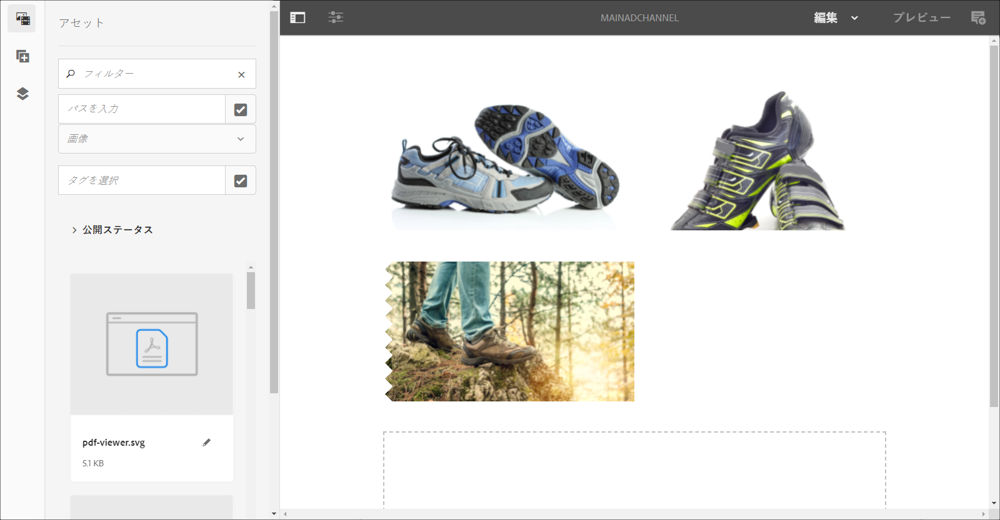
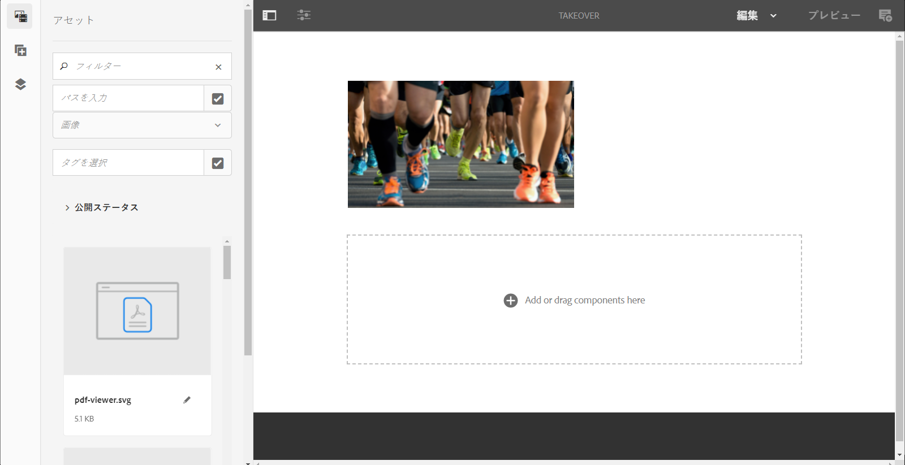
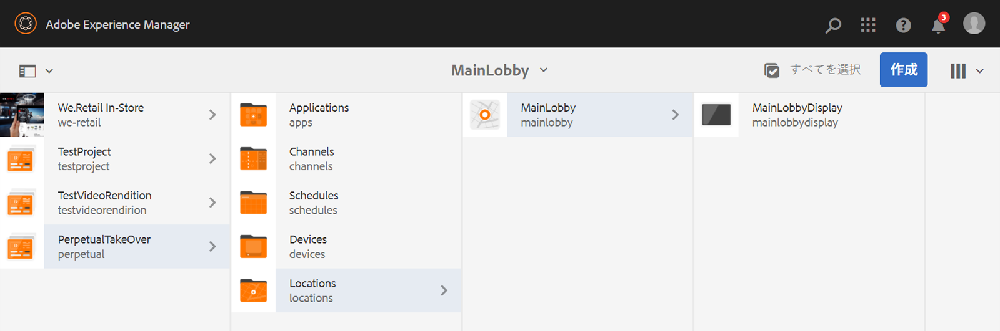
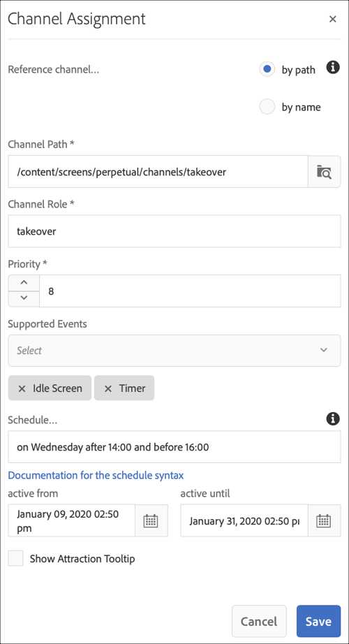
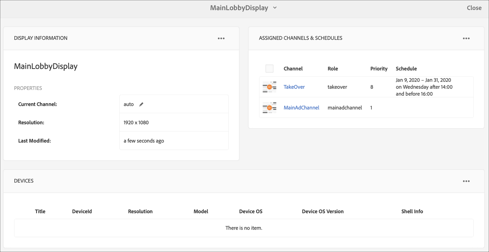

# 永続テイクオーバーチャネル {#perpetual-takeover-channel}

>[!IMPORTANT]
>このコンテンツは、AEM オンプレミス/AMS （AEM 6.5LTSおよびAEM 6.5）に対して有効です。 AEM as a Cloud Service Screensの内容については、[AEM as a Cloud Service ガイド ](https://experienceleague.adobe.com/en/docs/experience-manager-cloud-service/content/screens-as-cloud-service/overview/introduction)を参照してください。

以下では、特定の日時に継続的に再生される永続テイクオーバーチャネルを作成するプロジェクトのセットアップに重点を置いた使用例を示します。

## ユースケースの説明 {#use-case-description}

このユースケースでは、ディスプレイまたはディスプレイグループの通常再生チャネルの後を&#x200B;*引き継ぐ*&#x200B;チャネルを作成する方法を説明します。 引き継ぎ（テイクオーバー）は、特定の日時に永続的に行われます。例えば、毎週金曜日の午前9:00から午前10:00まで再生されるPerpetual TakeOver チャネルがあります。この間、他のチャンネルは再生できません。 次の例では、コンテンツを毎週水曜日の午後2:00から午後4:00まで2時間再生できる永続テイクオーバーチャネルの作成を示します。

### 前提条件 {#preconditions}

この使用例を開始する前に、以下の方法を理解しておく必要があります。

* **[チャネルの作成と管理](managing-channels.md)**
* **[ロケーションの作成と管理](managing-locations.md)**
* **[スケジュールの作成と管理](managing-schedules.md)**
* **[デバイスの登録](device-registration.md)**

### 主要なアクター {#primary-actors}

コンテンツ作成者

## プロジェクトのセットアップ {#setting-up-the-project}

次の手順に従って、プロジェクトをセットアップします。

**チャネルとディスプレイのセットアップ**

1. **PerpetualTakeOver** というタイトルの AEM Screens プロジェクトを作成します（下図を参照）。

   

1. **チャネル**&#x200B;フォルダーに **MainAdChannel** を作成します。

   

1. 「**MainAdChannel**」、アクションバーの「**編集**」の順にクリックします。 いくつかのアセット（画像、ビデオ、埋め込みシーケンス）をチャネルにドラッグ＆ドロップします。

   

   >[!NOTE]
   >この例の **MainAdChannel** は、コンテンツを連続再生するシーケンスチャネルを示します。

1. **MainAdChannel**&#x200B;でコンテンツを引き継ぎ、毎週水曜日の午後2:00から午後4:00まで再生する&#x200B;**TakeOver** チャネルを作成します。

1. 「**TakeOver**」、アクションバーの「**編集**」の順にクリックします。 アセットをいくつかチャネルにドラッグ＆ドロップします。 次の例は、このチャネルに追加されたシングルゾーン画像を示しています。

   

1. チャネルのロケーションとディスプレイをセットアップします。 例えば、次の場所 **MainLobby** とディスプレイ **MainLobbyDisplay** をこのプロジェクトにセットアップします。

   

**ディスプレイへのチャネルの割り当て**

1. **ロケーション**&#x200B;フォルダーのディスプレイ **MainLobbyDisplay** をクリックします。 アクションバーの「**チャネルの割り当て**」をクリックすると、**チャネル割り当て**&#x200B;ダイアログボックスが開きます。

   >[!NOTE]
   >ディスプレイにチャネルを割り当てる方法については、**[チャネルの割り当て](channel-assignment.md)**&#x200B;を参照してください。

1. **チャネル割り当て**&#x200B;ダイアログボックスでフィールド（「**チャネルパス**」、「**優先度**」、「**サポートされているイベント**」）に入力し、「**保存**」をクリックして、**MainAdChannel** をディスプレイに割り当てます。

   * **チャネルパス**：**MainAdChannel** チャネルへのパスをクリックします。
   * **優先度**：このチャネルの優先度を「1」に設定します。
   * **サポートされているイベント**：「**最初の読み込み**」と「**待機中画面**」をクリックします。

   

1. **ロケーション**&#x200B;フォルダーのディスプレイ **TakeOver** をクリックします。 アクションバーの「**チャネルの割り当て**」をクリックして、テイクオーバーチャネルを割り当てます。

1. スケジュールされた時刻にディスプレイに&#x200B;**テイクオーバー**&#x200B;チャネルを割り当てます。 次に、**チャネル割り当て**&#x200B;ダイアログボックスで次のフィールドに入力し「**保存**」を選択します。

   * **チャネルパス**：**TakeOver** チャネルへのパスをクリックします。
   * **優先度**：このチャネルの優先度を **MainAdChannel** よりも大きく設定します。 例えば、この例で設定される優先度は 8 です。
   * **サポートされているイベント**：「**待機中画面**」と「**タイマー**」をクリックします。
   * **スケジュール**：このチャネルでディスプレイを実行するスケジュールのテキストを入力します。 この例で言及されている&#x200B;**スケジュール**&#x200B;のテキストは、水曜日の14:00後16 :00*前の*&#x200B;です。

     >[!NOTE]
     >「**スケジュール**」に追加できる式について詳しくは、この後の[式の例](#example-expressions)の節を参照してください。
   * **次の日から有効**：開始日時。
   * **次の日まで有効**：終了日時。

     例えば、ここで&#x200B;**スケジュール**&#x200B;と&#x200B;**アクティブから**&#x200B;と&#x200B;**アクティブから**&#x200B;の日時までのテキストでは、コンテンツを毎週水曜日の午後2:00から午後4:00まで再生できます。

     

     **TakeOver**／**Locations**／**MainLobby**／**MainLobbyDisplay** のディスプレイに移動し、アクションバーの「**ダッシュボード**」をクリックすると、割り当てたチャネルとその優先度が表示されます（下図を参照）。

     >[!NOTE]
     >テイクオーバーチャネルの優先度を最も高く設定する必要があります。

     
現在、**TakeOver** チャネルは、毎週水曜日の午後2:00時から午後4:00時までの2時間、午後2時に&#x200B;**MainAdChannel**&#x200B;を引き継ぎ、2020年1月9日から2020年1月31日までのコンテンツを再生します。

## 式の例 {#example-expressions}

ディスプレイにチャネルを割り当てる際にスケジュールに追加できる式の例を次の表にまとめます。

| **式** | **解釈** |
|---|---|
| 午前8:00前。 | チャンネルは毎日午前8:00前に再生されます |
| 午後2:00時以降。 | チャンネルは毎日午後2時から再生されます:00 |
| 12:15以降12:45以前 | チャンネルは毎日12:15時間後に30分間再生されます |
| before 12:15 also after 12:45 | チャンネルは毎日午後12時:15分前に再生され、午後12時:45分後にも再生されます。 |
| 1月の午後2:00後の最初の日、1月の2日目、および午前3:00前の1月の3日目。 | チャンネルは1月1日の午後2時から再生を開始し、1月3日の午前3時1分まで1日2日の終日プレイを続けます:00:00 |
| 1月2～2日の午後2:00後。1月2～3日の午前3:00前。 | チャンネルは、1月1日の午後2時からプレーヤーを開始し、1月2日の午前3時1分まで再生を続け、1月2日の午後2時2分から再び再生し、1月3日の午前3時3分まで再生を続けます:00:00:00:00 |

>[!NOTE]
>
>*A.M./P.M.* （2:00 P.M.）の代わりに&#x200B;_軍時間_&#x200B;の表記法（14:00）を使用することもできます。

