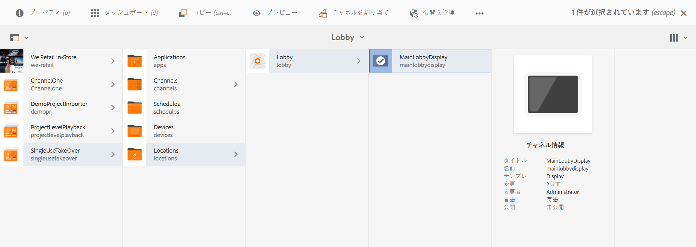

# 無期限の持ち越しチャネル {#perpetual-takeover-channel}

次のページでは、特定の日時を通じて継続的に再生する永続的なテイクオーバーチャネルの作成方法に関するプロジェクトの設定を重視する使用例を紹介します。

## 使用例の説明 {#use-case-description}

この使用例は、ディスプレイまたはディスプレイのグループに対し *て通常再生する* チャネルを引き継ぐチャネルを作成する方法を説明します。 買収は、特定の日と時間が絶え間なく行われます。
例えば、毎週金曜日の午前9時から午前10時まで再生する無期限のテイクオーバーチャネルがあります。 この間、他のチャネルは再生されません。 次の例は、継続的なテイクオーバーチャネルを作成して再生し、コンテンツを毎週水曜日の午後5時から午後7時まで2時間再生できるようにするものです。

### 前提条件 {#preconditions}

この使用例を開始する前に、以下をおこなう方法を理解しておく必要があります。

* **[チャネルの作成と管理](managing-channels.md)**
* **[ロケーションの作成と管理](managing-locations.md)**
* **[スケジュールの作成と管理](managing-schedules.md)**
* **[デバイスの登録](device-registration.md)**

### 主要なアクター {#primary-actors}

コンテンツ作成者

## Setting up the Project {#setting-up-the-project}

次の手順に従って、プロジェクトを設定します。

**チャネルと表示の設定**

1. Create an AEM Screens Project titled as **PerpetualTakeOver**, as shown below.

   

1. Channelsフォルダ **ーに** MainAdChannelを **作成します** 。

   

1. Select the **MainAdChannel** and click **Edit** from the action bar. 一部のアセット（画像、ビデオ、埋め込みシーケンス）をチャンネルにドラッグ&amp;ドロップします。

   

   >[!NOTE]
   >この例 **のMainAdChannelは** 、コンテンツを連続再生するシーケンスチャネルを示します。

   

1. MainAdChannel内のコン **テンツを引き継ぎ****** 、特定の日時のみ再生するTakeOverチャネルを作成します。

1. Select the the **TakeOver** and click **Edit** from the action bar. 一部のアセットをチャネルにドラッグ&amp;ドロップします。 次の例は、このチャネルに追加された1つのゾーンイメージを示しています。

   

1. チャネルの場所と表示を設定します。 例えば、次の場所Lobby **とdisplay mainLobbyDisplayがこのプロ** ジェクトに設定されます **** 。

   

**ディスプレイへのチャネルの割り当て**

1. 場所フォルダーか **ら表示MainLobbyDisplay** を選 **択します** 。 Click **Assign Channel** from the action bar.

   

   >[!NOTE]
   >ディスプレイにチャネルを割り当てる方法については、「チャネルの割り当て」を参 **[照してくださ](channel-assignment.md)**い。

1. 「チャネル割り当て」ダイアログボックスと「**Save** Save **Save** Save **Save** Path」フィールド（「チャネルパス」、「優先度」、「サポートされているイベント」）に、「チャネルパス」、「優先度」、「サポ ********&#x200B;ートされているイベント」の各フィールドを設定します。 これで、MainAdChannelがディスプレイに割り **当てられ** ました。

   

1. 場所フォルダーから **表示「TakeOver** 」を **選択します** 。 アクショ **ンバーで** [チャネルの割り当て]をクリックして、単一使用テイクオーバーチャネルを割り当てます。

1. スケジュールされ **た時刻にTakeOver** チャネルをディスプレイに割り当て、 **Channel Assignment** （チャネルの割り当て）ダイアログボックスから次のフィールドに入力し、「 **Save（保存）」をクリックします**。

   * **チャネルパス**:TakeOverチャネルへのパスを選択
   * **優先度**:このチャネルの優先順位をMainAdChannelよりも大きく設定 **します**。 例えば、この例で設定される優先順位は8です。
   * **サポートされるイベント**:「アイドル画 **面** 」と「タイマー」 **を選択します**。
   * **スケジュール**:このチャネルで表示を実行するスケジュールのテキストを入力します。 例えば、ここのテキストでは、12月31日の午前12時の2分前から午前12時1分までコンテンツを再生できます。
この例で示し **た** Scheduleのテキストは、12月31日の23:58の後、および1月1日の00.01の前の日付です **。

      

      SingleUseTakeOver **—>場所** —>場所 **—>ロビー** —>ロビー主ロビークリックロビー表示アクションバーアクションバーを優先順位順位順に割り当てたディスプレイに移動します ************ 。

      >[!NOTE]
      >テイクオーバーチャネルの優先順位を最も高く設定する必要があります。

      

