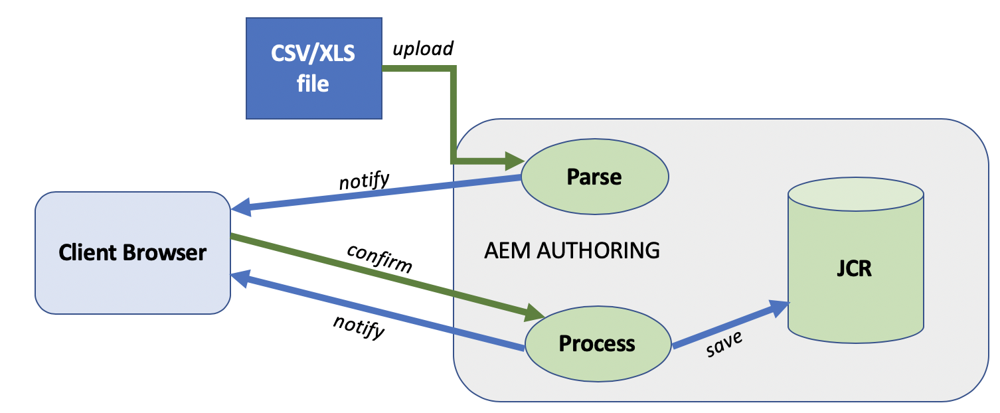
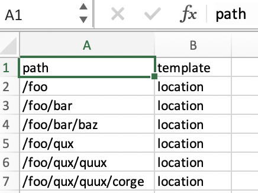
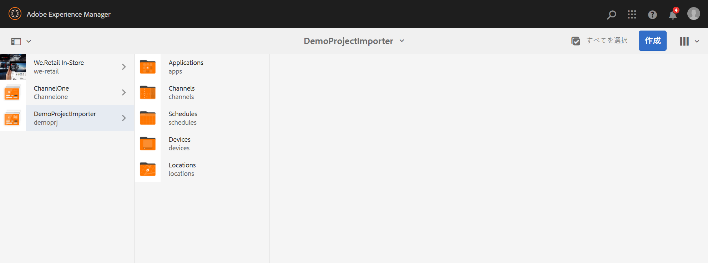
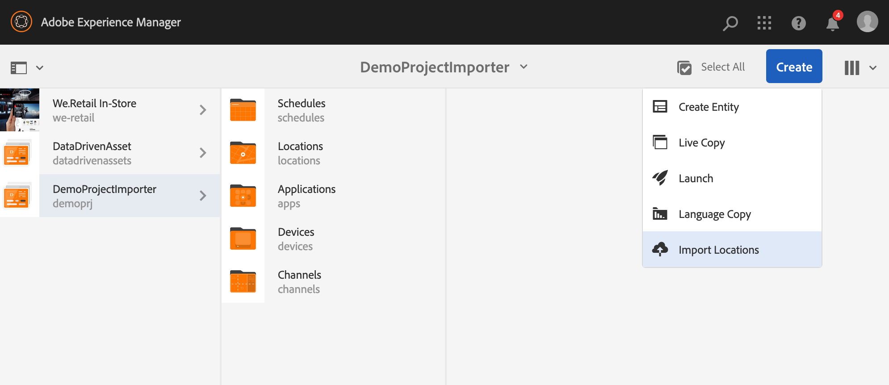
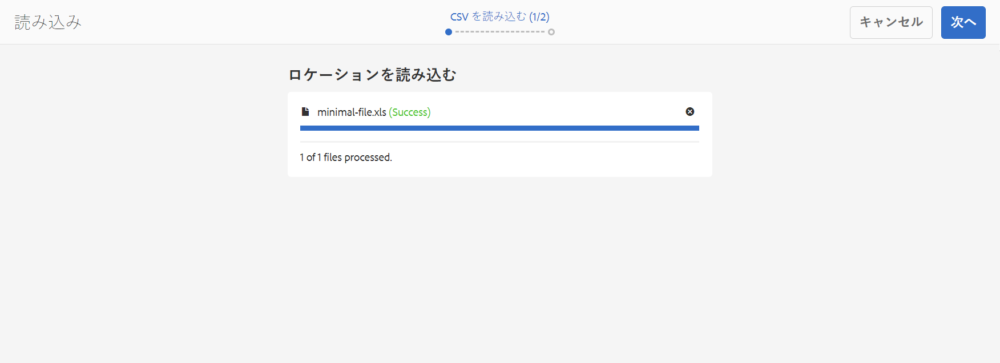
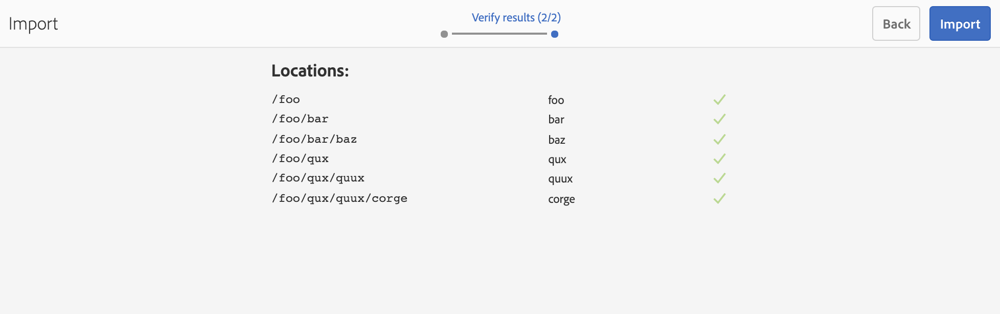
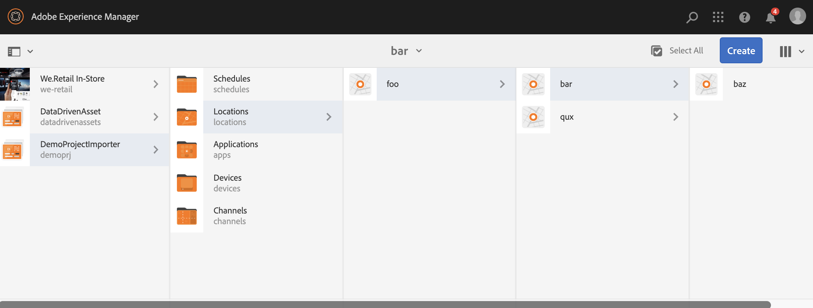

# ファイルをソースとする新しいプロジェクトインポーター {#new-project-importer-from-file}

ここでは、CSV／XLS スプレッドシートから AEM Screens プロジェクトに一連のロケーションを一括で読み込む機能について説明します。

## はじめに {#introduction}

>[!IMPORTANT]
>このコンテンツは、AEM オンプレミス/AMS （AEM 6.5LTSおよびAEM 6.5）に対して有効です。 AEM as a Cloud Service Screensの内容については、[AEM as a Cloud Service ガイド ](https://experienceleague.adobe.com/en/docs/experience-manager-cloud-service/content/screens-as-cloud-service/overview/introduction)を参照してください。

AEM Screens プロジェクトを組織で初めて設定する場合は、すべてのロケーションも作成します。 プロジェクトに多数のロケーションが含まれる場合は、UI で何回も選択したり待機したりする退屈なタスクが多く発生します。

この機能は、プロジェクトのセットアップに要する時間を短縮して、予算の問題を解決することを目的としています。

この機能では、作成者が入力ファイルとしてスプレッドシートを提供でき、システムがバックエンドにロケーションツリーを自動的に作成できるので、以下のメリットがあります。

* *UI を使用して手動で選択するよりも、はるかに優れたパフォーマンスを実現します*
* *顧客は既存のロケーションを独自のシステムから書き出して、直接 AEM に簡単に読み込むことができます*

このプロセスにより、初回のプロジェクトセットアップ時または既存の AEM Screens プロジェクトを新しいロケーションに拡張する際に、時間と費用の両方を節約できます。

## アーキテクチャの概要 {#architectural-overview}

プロジェクトインポーター機能のアーキテクチャの概要を次の図に示します。

### データモデル {#data-model}

プロジェクトインポーターのデータモデルを以下で説明します。

>[!NOTE]
>
>現在のリリースでは、ロケーションの読み込みのみサポートしています。

| **プロパティ** | **説明** |
|---|---|
| ***`path {string*}`*** | ロケーションのリソースパス |
| ***`[./jcr:title] {string*}`*** | 使用するテンプレートの名前（*screens/core/templates/location* の場合は location） |
| ***`template {string}`*** | ページに使用するタイトル（オプション） |
| ***`[./jcr:description] {string}`*** | ページに使用する説明（オプション） |

したがって、スプレッドシート（CSV/XLS）ファイルには次の列が必要です。

* **パス{string}** - インポートする場所のパス。パスのルートはプロジェクトの場所フォルダーです（つまり、*`/foo`*&#x200B;は&#x200B;*`/content/screens/<project>/locations/foo`*&#x200B;にインポートされます）
* **テンプレート{string}** – 新しい場所に使用するテンプレート。現在許可されている値は「location」のみですが、この値は今後のすべての`Screens` テンプレートに拡張されます（`display`、`sequencechannel`など）
* **[./*] {string}** – 場所に設定する任意のオプションのプロパティ （つまり、`./jcr:title`、`./jcr:description`、`./foo, ./bar`）。 現在のリリースではフィルタリングはできません。

>[!NOTE]
>
>上記の条件に一致しない列は無視されます。 例えば、シート（CSV/XLS）ファイルで&#x200B;**パス**、**テンプレート**、**タイトル**、および&#x200B;**説明**&#x200B;以外の列が定義されている場合、これらのフィールドは無視されます。 また、**プロジェクトインポーター**&#x200B;では、プロジェクトを AEM Screens プロジェクトに読み込むための追加フィールドを検証しません。

## プロジェクトインポーターの使用 {#using-project-importer}

この節では、AEM Screens プロジェクトでのプロジェクトインポーターの使用方法について説明します。

>[!CAUTION]
>
>制限事項：
>
>* CSV／XLS／XLSX 拡張子以外のファイルは、現在のリリースではサポートされていません。
>* 読み込んだファイルに対してプロパティのフィルタリングは存在せず、「。/」で始まるものは読み込まれます。
>

### 前提条件 {#prerequisites}

* **DemoProjectImport** というタイトルのプロジェクトを作成します。

* 読み込む必要があるサンプル CSV または Excel ファイルを使用します。

デモ用に次の Excel ファイルをダウンロードできます。

[ファイルの取得](assets/minimal-file.xls)

### 最低限必要なフィールドを含んだファイルの読み込み {#importing-the-file-with-minimum-required-fields}

最小限の必須フィールドを含むファイルをロケーションフォルダーに読み込むには、以下の手順に従います。

>[!NOTE]
>
>次の例は、プロジェクトへの読み込みに最低限必要な 4 つのフィールドを示しています。

1. AEM Screens プロジェクト（**DemoProjectImport**）に移動します。

   

1. サイドバーの **DemoProjectImporter**／**作成**／**ロケーションを読み込む**をクリックします。

   

1. **読み込み**&#x200B;ウィザードが表示されます。 ロケーションを含むプロジェクトのファイルをクリックするか、*前提条件*&#x200B;の節でダウンロードした ***minimal-file.xls*** ファイルをクリックします。

   ファイルを選択したら、「**次へ**」をクリックします。

   

1. 読み込みウィザードでファイル（ロケーション）の内容を確認し、「**読み込み**」をクリックします。

   

1. その結果、プロジェクトに読み込まれたすべての場所が表示されるようになります。

   
