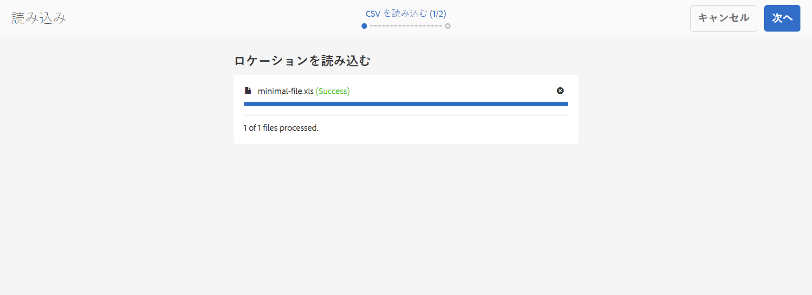

# ファイルをソースとする新しいプロジェクトインポーター {#new-project-importer-from-file}

ここでは、CSV／XLS スプレッドシートから AEM Screens プロジェクトに一連のロケーションを一括で読み込む機能について説明します。

## はじめに {#introduction}

AEM Screens プロジェクトを組織で初めてセットアップする場合は、すべてのロケーションも作成する必要があります。プロジェクトに多数のロケーションが含まれる場合は、UI で何回もクリックしたり待たされたりする退屈な作業になります。

この機能は、プロジェクトのセットアップに要する時間を短縮して、予算の問題を解決することを目的としています。

この機能では、作成者が入力ファイルとしてスプレッドシートを提供でき、システムがバックエンドにロケーションツリーを自動的に作成できるので、以下のメリットがあります。

* *UI を使用して手動でクリックするよりも、はるかにパフォーマンスが優れています。*
* *顧客が既存のロケーションを独自のシステムから書き出して、直接 AEM に簡単に読み込むことができます。*

これにより、初回のプロジェクトセットアップ時または既存の AEM Screens プロジェクトを新しいロケーションに拡張する際に、時間と費用の両方を節約できます。

## アーキテクチャの概要 {#architectural-overview}

プロジェクトインポーター機能のアーキテクチャの概要を次の図に示します。

### データモデル {#data-model}

プロジェクトインポーターのデータモデルを以下で説明します。

>[!NOTE]
>
>現在のリリースでは、ロケーションの読み込みのみサポートしています。

| **プロパティ** | **説明** |
|---|---|
| ***path {string*}** | ロケーションのリソースパス |
| ***[です。/jcr:title] {string*}** | 使用するテンプレートの名前（*screens/core/templates/location* の場合は location） |
| ***template {string}*** | ページに使用するタイトル（オプション） |
| ***[です。/jcr:description] {string}*** | ページに使用する説明（オプション） |

したがって、スプレッドシート（CSV／XLS）ファイルには次の列が必要です。

* **path {string}**：読み込むロケーションのパス。プロジェクトのロケーションフォルダーをルートとします。例えば、*/foo* の場合は */content/screens/&lt;project>/locations/foo* に読み込まれます。

* **template {string}**：新しいロケーションに使用するテンプレート。今のところ、使用可能な値は「location」だけですが、今後、すべての Screens テンプレート（「display」、「sequenchannel」など）に拡張される予定です。
* **[です。/*] {string}**：ロケーションに設定する任意のオプションプロパティ（例：./jcr:title、./jcr:description、./foo、./bar）。現在のリリースでは、今のところフィルタリングは使用できません。

>[!NOTE]
>
>上記の条件に一致しない列は無視されるだけです。例えば、シート（CSV／XLS）ファイルに **path**、**template**、**title**、**description** 以外の列を定義しても、AEM Screens プロジェクトに読み込む際に、それらの追加フィールドは&#x200B;**プロジェクトインポーター**&#x200B;で無視され、検証されません。

## プロジェクトインポーターの使用 {#using-project-importer}

この節では、AEM Screens プロジェクトでのプロジェクトインポーターの使用方法について説明します。

>[!CAUTION]
>
>制限事項：
>
>* CSV／XLS／XLSX 拡張子以外のファイルは、現在のリリースではサポートされていません。
>* 読み込まれるファイルに対してプロパティのフィルタリングはおこなわれず、「./」で始まるものはすべて読み込まれます。
>

### 前提条件 {#prerequisites}

* **DemoProjectImport** というタイトルの新しいプロジェクトを作成します。

* 読み込む必要があるサンプル CSV または Excel ファイルを使用します。

デモ用に次の Excel ファイルをダウンロードできます。

[ファイルを入手](assets/minimal-file.xls)

### 最低限必要なフィールドを含んだファイルの読み込み {#importing-the-file-with-minimum-required-fields}

最低限必要なフィールドを含んだファイルをロケーションフォルダーに読み込むには、以下の手順に従います。

>[!NOTE]
>
>次の例は、プロジェクトへの読み込みに最低限必要な 4 つのフィールドを示しています。

1. AEM Screens プロジェクト（**DemoProjectImport**）に移動します。

   

1. プロジェクト **DemoProjectImporter を選択し、サイドバーから&#x200B;**／**&#x200B;作成&#x200B;**／**&#x200B;ロケーションを読み込み** を選択します。

   

1. **読み込み**&#x200B;ウィザードが開きます。プロジェクトのロケーションを含んだ既存のファイルを選択するか、*前提条件*&#x200B;の節でダウンロードした ***minimal-file.xls*** ファイルを選択します。

   ファイルを選択したら、「**次へ**」をクリックします。

   

1. 読み込みウィザードでファイル（ロケーション）の内容を確認し、「**読み込み**」をクリックします。

   

1. その結果、プロジェクトに読み込まれたすべてのロケーションが表示されるようになります。

   
