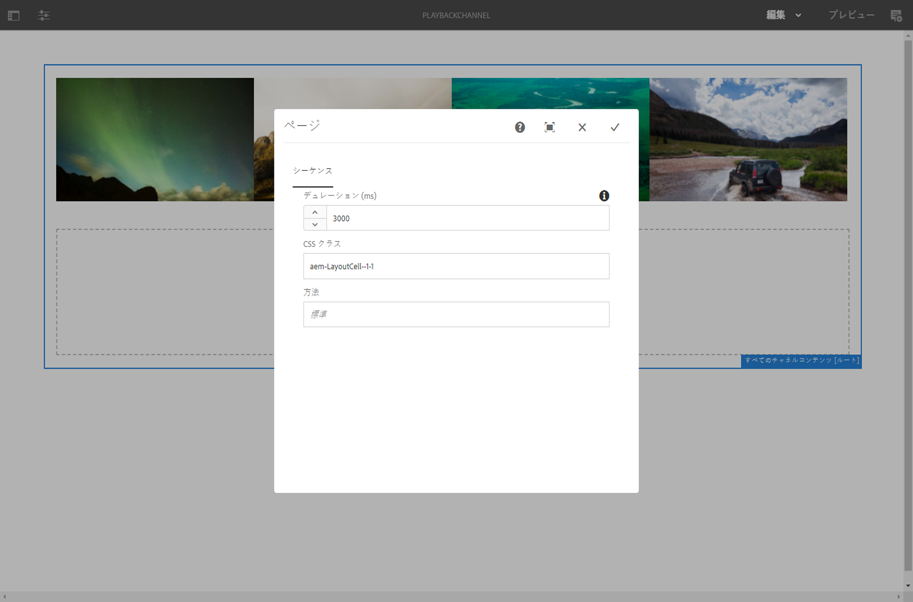

# プロジェクトレベルの画像再生時間 {#project-level-image-playback}

## 概要 {#overview}

この機能を使用すると、プロジェクトレベルで画像の再生時間を定義できます。デフォルトでは、すべての画像はこの再生時間を継承します。プロジェクトレベルで時間が定義されていない場合、デフォルトの再生は 8 秒間続きます。

### 前提条件 {#prerequisites}

この機能の使用を開始する前に、実装の前提条件として、プロジェクトをセットアップする必要があります。例：

1. AEM Screens プロジェクト（この例では **ProjectLevelPlayback**）を作成する

1. **チャネル**&#x200B;フォルダーの下に **PlaybackChannel** というシーケンスチャネルを作成する

1. **PlaybackChannel** にコンテンツを追加する

   

   例えば、次の画像は **PlayBackChannel** エディターに追加された画像を示します。

   

## プロジェクトレベル画像再生時間割り当ての編集 {#editing-project-level-image-playback-duration-assignment}

以下の節では、AEM Screens プロジェクトのコンテンツの再生時間を編集する方法について説明します。

### プロジェクトレベル画像再生時間の更新 {#updating-the-playback-duration-for-images-in-a-project}

>[!NOTE]
>
>画像レベルまたはチャネルレベルの再生時間を更新する場合は、[チャネルレベルの画像再生時間](channel-level-image-playback.md)を参照してください。

プロジェクトレベルの画像再生時間の割り当てを更新するには、以下の手順に従います。

1. プロジェクト **ProjectLevelPlayback** に移動し、アクションバーの「**プロパティ**」をクリックします。
   

1. チャネル内のすべての画像を選択し、左上のレンチアイコンをクリックして（下図を参照）、チャネルレベルの設定ダイアログボックスを開きます。

   

1. **ページ**&#x200B;ダイアログボックスが開きます。

   >[!NOTE]
   >
   >デフォルトでは、チャネル内の画像の再生時間は 8 秒に設定され、ビデオは 8 秒間再生されます。

   

   「**デュレーション (ms)**」を「8000」から「3000」（3 秒）へと編集します。**ページ**&#x200B;ダイアログボックスの右上にあるチェックマークをクリックして、変更を保存します。

   

### 結果の表示 {#viewing-the-result}

チャネルの再生時間（この例では 3 つの画像すべての再生時間）を更新すると、画像が 8 秒間（デフォルト値）ではなく 3 秒間再生されるようになります。

