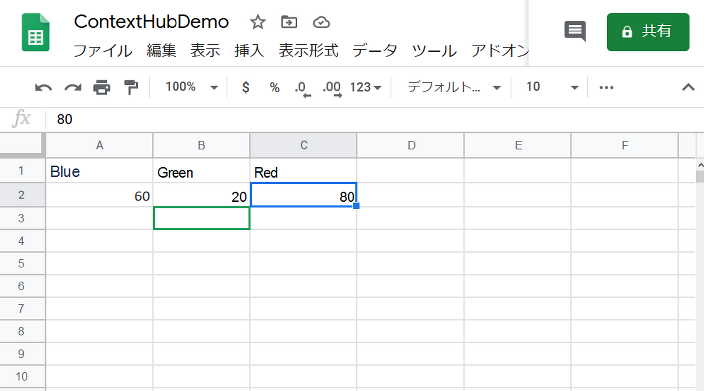
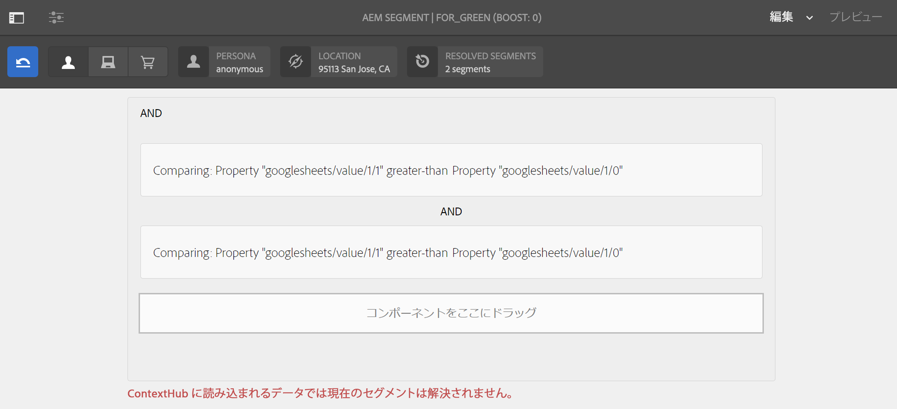
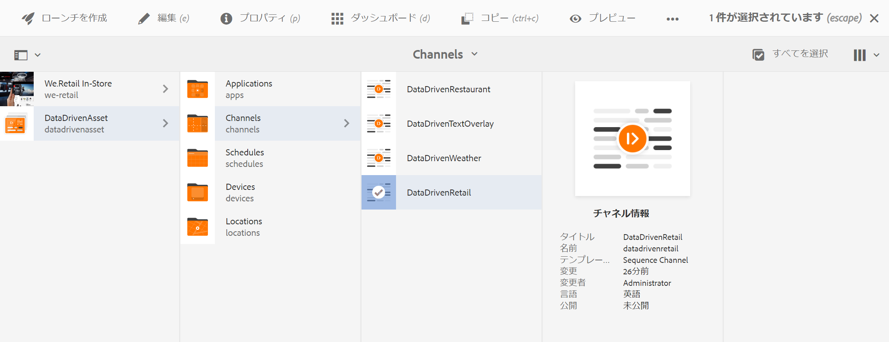
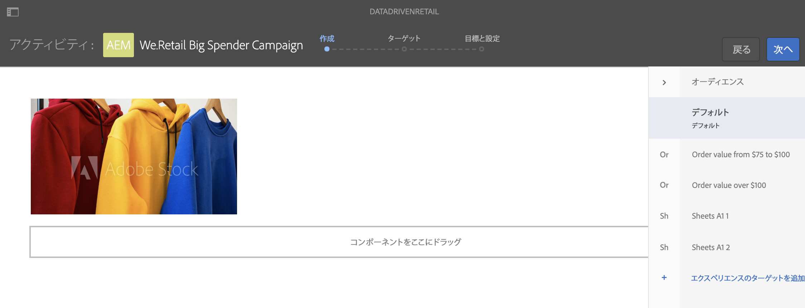
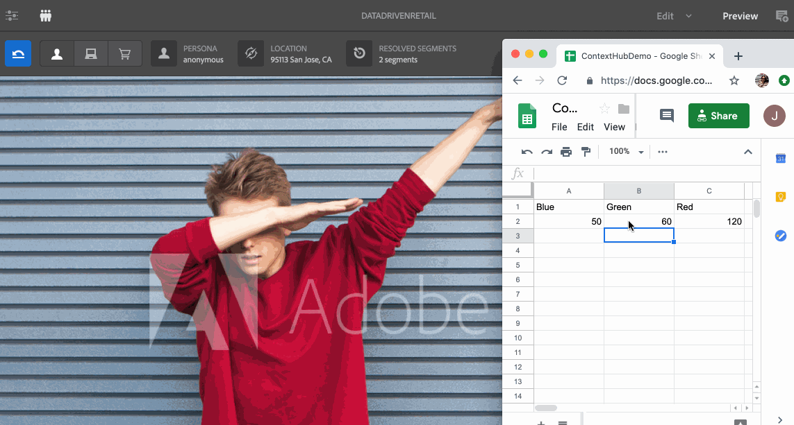

# 小売店向けの在庫に応じたアクティベーション {#retail-inventory-targeted-activation}

次の使用例では、Google シートの値に応じた 3 種類の画像の表示方法を示しています。

## 説明 {#description}

この使用例は、3 種類のカラートレーナーの小売在庫を表示します。Google シートに記録されているトレーナーの在庫数に応じて、最も数が多いトレーナー（赤、緑、青のいずれか）の画像がスクリーンに表示されます。

この使用例では、赤、緑、青の 3 色のうち、在庫数の最も多いトレーナーがスクリーンに表示されます。

## 前提条件 {#preconditions}

小売店向けの在庫に応じたアクティベーションの実装を開始する前に、AEM Screens プロジェクトで&#x200B;***データストア***、***オーディエンスのセグメント化***、***チャネルのターゲティングの有効化***&#x200B;をセットアップする方法を理解しておく必要があります。

詳しくは、[AEM Screens プロジェクトでの ContextHub の設定](configuring-context-hub.md)を参照してください。

## 基本フロー {#basic-flow}

「小売店向けの在庫に応じたアクティベーション」の使用例を実装するには、以下の手順に従います。

1. **Google シートにデータを入力する**

   1. ContextHubDemo Google シートに移動します。
   1. 3 種類のトレーナーに対応する値を格納する 3 つの列（Red、Green、Blue）を追加します。
   

1. **要件に従ってオーディエンスを設定する**

   1. オーディエンスのセグメントに移動します（詳しくは、***AEM Screens プロジェクトでの ContextHub の設定***&#x200B;の&#x200B;**[手順 2：オーディエンスのセグメント化のセットアップ](configuring-context-hub.md)**を参照してください）。

   1. 3 つの新しいセグメント **For_Red**、**For_Green**、**For_Blue** を追加します。

   1. 「**For_Red**」を選択し、アクションバーの「**編集**」をクリックします。

   1. **比較 : プロパティ - プロパティ**&#x200B;コンポーネントをエディターにドラッグ＆ドロップし、設定アイコンをクリックしてプロパティを編集します。
   1. 「**1 つめのプロパティの名前**」のドロップダウンから「**googlesheets/value/1/2**」を選択します。

   1. 「**演算子**」のドロップダウンメニューから「**次よりも大きい**」を選択します。

   1. 「**データタイプ**」として「**数値**」を選択します。

   1. 「**2 つめのプロパティの名前**」のドロップダウンから「**googlesheets/value/1/1**」を選択します。

   1. 別の「**比較 : プロパティ - プロパティ**」コンポーネントをエディターにドラッグ＆ドロップし、設定アイコンをクリックしてプロパティを編集します。
   1. 「**1 つめのプロパティの名前**」のドロップダウンから「**googlesheets/value/1/2**」を選択します。

   1. 「**演算子**」のドロップダウンメニューから「**次よりも大きい**」を選択します。

   1. 「**データタイプ**」として「**数値**」を選択します。

   1. 「**2 つめのプロパティの名前**」のドロップダウンから「**googlesheets/value/1/0**」を選択します。
   

   同様に、**For_Blue** セグメントにプロパティ比較ルールを追加し編集します（下図を参照）。

   

   同様に、For_Green セグメントにプロパティ比較ルールを追加し編集します（下図を参照）。

   

   >[!NOTE]
   >
   >Google シートの値どおり、現時点では最初の比較のみ有効なので、セグメント **For_Blue** および **For_Green** については、データをエディターで解決できません。

1. **DataDrivenRetail** チャネル（シーケンスチャネル）に移動して選択し、アクションバーの「**編集**」をクリックします。

   

   >[!CAUTION]
   >
   >チャネルの&#x200B;**プロパティ**&#x200B;を開き、「**パーソナライズ機能**」タブを使用して「**ContextHub** **設定**」をセットアップしておいてください。

   

   >[!NOTE]
   >
   >ターゲティングプロセスを開始したときにアクティビティが正しく一覧表示されるように、「**ブランド**」と「**領域**」の両方を選択する必要があります。

1. **デフォルト画像を追加する**

   1. チャネルにデフォルト画像を追加し、「**ターゲティング**」をクリックします。
   1. 「**ブランド**」と「**アクティビティ**」のドロップダウンメニューから選択し、「**ターゲティングを開始**」をクリックします。

   1. 「**ターゲティングを開始**」をクリックします。
   

   >[!NOTE]
   >
   >ターゲティングを開始する前に、サイドレールの「**+ エクスペリエンスのターゲットを追加**」をクリックして、セグメント（**For_Green**、**For_Red**、**For_Blue**）を追加する必要があります（下図を参照）。

   

1. 以下に示すように、3 つの異なるシナリオすべてに画像を追加します。

   

1. **プレビューを確認する**

   1. 「**プレビュー**」をクリックします。また、Google シートを開き、値を更新します。
   1. 3 つの異なる列の値をすべて変更すると、在庫の最大数に応じてディスプレイ画像が更新されます。
   

