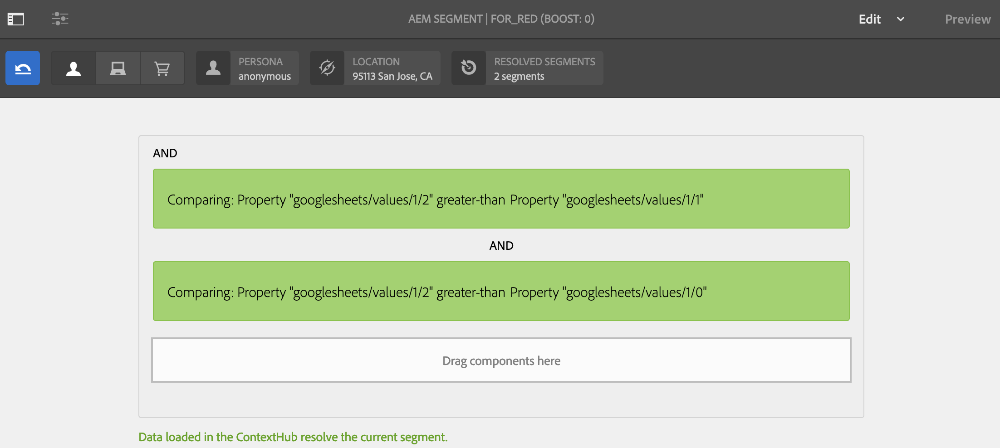

# 小売店向けの在庫に応じたアクティベーション {#retail-inventory-targeted-activation}

次の使用例では、Google シートの値に応じた 3 種類の画像の表示方法を示しています。

## 説明 {#description}

この使用例は、3 種類のカラートレーナーの小売在庫を表示します。Google シートに記録されているトレーナーの在庫数に応じて、最も数が多いトレーナー（赤、緑、青のいずれか）の画像がスクリーンに表示されます。

このユースケースでは、使用可能なセーターの最大数に基づいて、赤、緑、青のセーターが画面に表示されます。

## 前提条件 {#preconditions}

小売在庫のターゲット設定アクティブ化の実装を開始する前に、の設定方法を学びます ***データストア***, ***オーディエンスのセグメント化*** および ***チャネルのターゲティングを有効にする*** （AEM Screens プロジェクト内）。

参照： [AEM Screensでの ContextHub の設定](configuring-context-hub.md) を参照してください。

## 基本フロー {#basic-flow}

「小売店向けの在庫に応じたアクティベーション」の使用例を実装するには、以下の手順に従います。

1. **Google シートにデータを入力する**

   1. ContextHubDemo Google シートに移動します。
   1. 3 種類のトレーナーに対応する値を格納する 3 つの列（Red、Green、Blue）を追加します。

   

1. **要件に従ってオーディエンスを設定する**

   1. オーディエンスのセグメントに移動します（を参照）。 ***手順 2：オーディエンスセグメント化の設定*** 。対象： **[AEM Screensでの ContextHub の設定](configuring-context-hub.md)** 詳しくはこちらを参照してください）。

   1. 3 つの新しいセグメント **For_Red**、**For_Green**、**For_Blue** を追加します。

   1. 「**For_Red**」を選択し、アクションバーの「**編集**」をクリックします。

   1. をドラッグ&amp;ドロップします **Comparison : プロパティ – プロパティ** をエディターに送信します。
   1. 「」をクリックします **設定** アイコン。
   1. 「**1 つめのプロパティの名前**」のドロップダウンから「**googlesheets/value/1/2**」を選択します。
   1. 「**演算子**」のドロップダウンメニューから「**次よりも大きい**」を選択します。
   1. を選択 **データタイプ** as **数値**.
   1. を選択 **googlesheets/value/1/1** のドロップダウンから **2 番目のプロパティ名**.
   1. ドラッグ&amp;ドロップ **もう 1 つの比較：プロパティ – プロパティ** エディターに移動し、 **設定** アイコン。
   1. 「**1 つめのプロパティの名前**」のドロップダウンから「**googlesheets/value/1/2**」を選択します。
   1. 「**演算子**」のドロップダウンメニューから「**次よりも大きい**」を選択します。
   1. を選択 **データタイプ** as **数値**.
   1. を選択 **google シート/値/1/0** のドロップダウンから **2 番目のプロパティ名**.

   

   同様に、**For_Blue** セグメントにプロパティ比較ルールを追加し編集します（下図を参照）。

   

   同様に、比較プロパティルールを編集して次に追加します **For_Green** 次の図に示すセグメント。

   

   >[!NOTE]
   >
   >セグメント用であることに注意してください **For_Green** および **For_Green**&#x200B;最初の比較のみがGoogle シートの値に従って有効になるので、エディターでデータを解決することはできません。

1. に移動して **DataDrivenRetail** channel （シーケンスチャネル）。
1. クリック **編集** アクションバーから。

   

   >[!CAUTION]
   >
   >を設定する必要があります **ContextHub** **設定** チャネルの使用 **プロパティ** > **Personalization** タブ。

   

   >[!NOTE]
   >
   >「両方」を選択します **ブランド** および **領域** （ターゲティングプロセスを開始したときに、アクティビティが適切にリストされるようにするには）。

1. **デフォルト画像を追加する**

   1. チャネルにデフォルト画像を追加し、「**ターゲティング**」をクリックします。
   1. 「**ブランド**」と「**アクティビティ**」のドロップダウンメニューから選択し、「**ターゲティングを開始**」をクリックします。
   1. 「**ターゲティングを開始**」をクリックします。

   

   >[!NOTE]
   >
   >ターゲティングを開始する前に、セグメント（**For_Green**, **For_Red**、および **For_Blue**）をクリックします。 **+ エクスペリエンスのターゲット設定を追加** 次の図に示すように、サイドレールから。

   

1. 次に示すように、3 つの異なるシナリオすべてに画像を追加します。

   

1. **プレビューを確認する**

   1. 「**プレビュー**」をクリックします。また、Google シートを開き、値を更新します。
   1. 3 つの異なる列の値をすべて変更します。 在庫の最高値に従ってディスプレイ画像が更新されることに注意してください。

   
