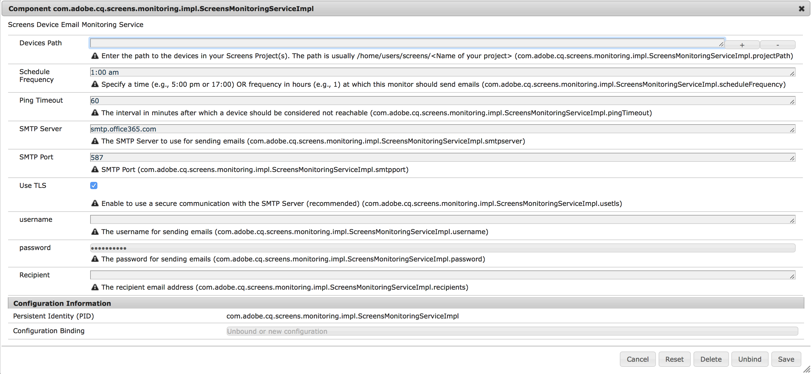

# AEM Screens 通知サービス{#aem-screens-notifications-service}

>[!IMPORTANT]
>このコンテンツは、AEM オンプレミス/AMS （AEM 6.5LTSおよびAEM 6.5）に対して有効です。 AEM as a Cloud Service Screensの内容については、[AEM as a Cloud Service ガイド ](https://experienceleague.adobe.com/en/docs/experience-manager-cloud-service/content/screens-as-cloud-service/overview/introduction)を参照してください。

<!--removed from metadata: admitteddomains: @adobe.com;@caesars.com-->

***AEM Screens 通知サービス***&#x200B;は、デバイスアクティビティの監視について説明します。

ここでは、以下のトピックについて説明します。

* **概要**
* **メールの設定**
* **メール通知**
* **ユースケース**

<!-- 
OBSOLETE NOTE>
>[!CAUTION]
>
>This AEM Screens functionality is only available, if you have installed AEM 6.3.2 Feature Pack 3 or AEM 6.4.1 Screens Feature Pack 1.
>
>To get access to this Feature Pack, contact Adobe Support and request access. After you have permissions you can download it from Package Share. 
-->

## 概要 {#overview}

***AEM Screens 通知サービス***&#x200B;を使用すると、設定可能な期間 AEM Screens Player が ping を送信しなかった場合、それを知らせるメールを管理者が受信できます。

このサービスは OSGi Web コンソールで設定できます。

## メールの設定 {#configuring-email-settings}

メール通知を設定するには、以下の手順に従います。

1. **Adobe Experience Manager Web コンソール設定**&#x200B;が開きます。
1. **Screens Device Email Monitoring Service** を開きます。

   

1. 以下のフィールドを定義して、メールの設定を指定します。

   **Devices Path** - モニターするScreens プロジェクトへのパスを入力します。 パスは通常、`/home/users/screens/<Name of your project>` です。

   例えば、プロジェクトが **`We.Retail`** の場合、プロジェクトのパスは ***/home/users/screens/we-retail*** になります。

   >[!NOTE]
   >
   >デバイスユーザーがアクセスするプロジェクトパスを指定します。

   **頻度をスケジュール** – 時間（午後5:00または午後17:00など）または時間（例：1）で、このモニターがメールを送信する頻度を指定します。

   **ping タイムアウト**：このフィールドは、デバイスが到達不能と見なされるまでの経過時間を分単位で指定します。

   **SMTP サーバー**：メールの送信に使用する SMTP サーバーを指定します。

   **SMTP ポート**：SMTP ポートを入力します。

   **TLS を使用**：TLS（Transport Layer Security）を使用すると、SMTP サーバーとの安全な通信を行えます。

   会社のメールサーバーとの安全な接続には、TLS を使用することをお勧めします。 適切な値については、メール管理者に確認してください。

   **ユーザー名**：メールを送信する際のユーザー名を指定します。

   **パスワード**：メールを送信する際のパスワードを指定します。

   **受信者**：受信者のメールアドレスを指定します。

   >[!NOTE]
   >
   >入力できるメールアドレスは 1 つだけです。 一括メールを送信するには、該当するユーザーのグループつまり配布リストを作成します。

1. 「**保存**」をクリックして、AEM Screens デバイスのメールを使用した監視アクティビティを設定します。

## メール通知 {#email-notification}

メール通知の設定を行うと、無操作状態が報告された実際のデバイスへのリンクを記載したメール通知が届きます。

このリンクにアクセスすると、デバイスのダッシュボードに直接移動します。

メールは、次の場合にのみ送信されます。

* 指定した ping タイムアウトの間に ping を実行していないデバイスが 1 つ以上ある
* メールの生成時にまだ ping を送信していない。

### 使用例 {#example-use-cases}

次の例では、Screens Device Email Monitoring Service のプロパティを設定するシナリオを参考までにいくつか示します。

**シナリオ 1**

スケジュールの頻度は午前1:00、ping タイムアウトは60に設定します。 次に、AEM Screens デバイスが午後12:00時から午後1:00時までpingを送信しない場合、デバイスの非アクティブを確認するメール通知が届きます。

**シナリオ 2**

スケジュールの頻度を 1 に、ping タイムアウトを 60 に設定します。 次に、AEM Screens デバイスが 1 日の間の特定の時間に 1 回も ping を送信しなかった場合は、デバイスが無操作状態であることを確認するメール通知が届きます。

