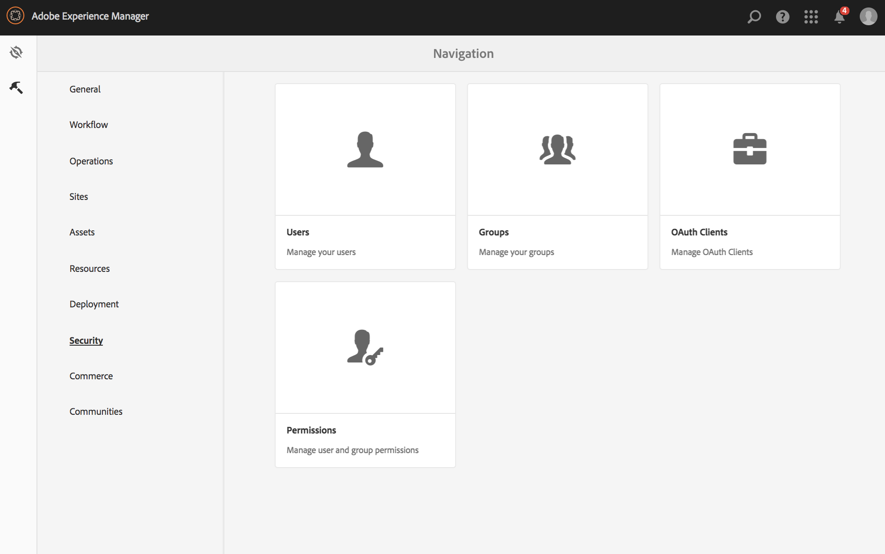
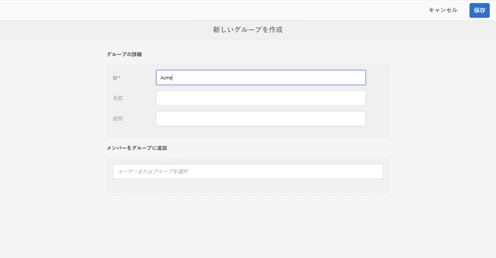
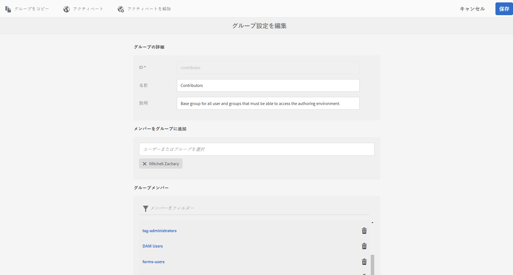
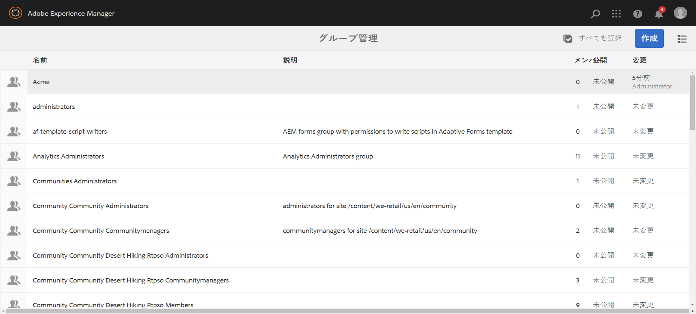
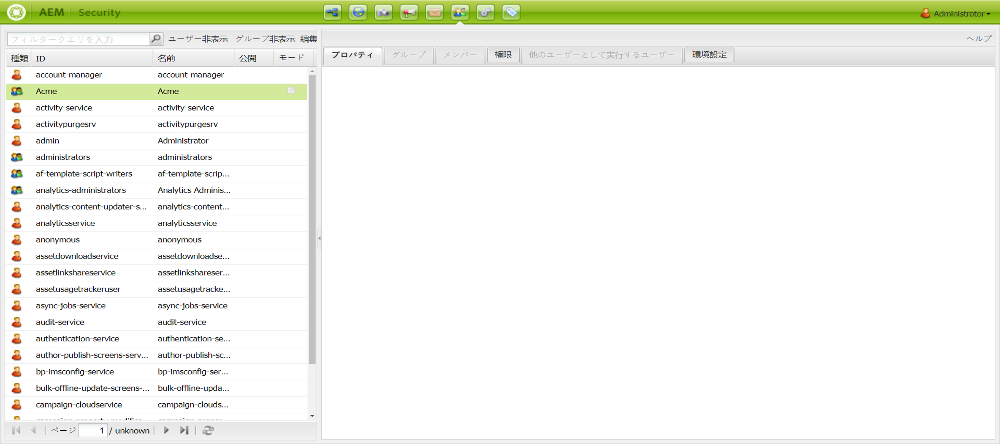

# ACL の設定 {#setting-up-acls}

ここでは、各個人またはチームが独自のプロジェクトを処理できるように、ACL を使用してプロジェクトを区別する方法について説明します。

AEM 管理者は、プロジェクトのチームメンバーが他のプロジェクトに干渉するのを防ぎ、プロジェクト要件に応じて各ユーザーが特定の役割を割り当てられるようにします。

## 権限の設定 {#setting-up-permissions}

次に、プロジェクト用の ACL の設定手順の概要を示します。

1. AEM にログインして、**ツール**／**セキュリティ**&#x200B;に移動します。

   

1. 「**グループ**」をクリックして、ID（例：Acme）を入力します。

   または、このリンク（`http://localhost:4502/libs/granite/security/content/groupadmin.html`）を使用します。

   次に、「**保存**」をクリックします。

   

1. リストから「**寄稿者**」を選択して、ダブルクリックします。

   

1. **Acme**（作成したプロジェクト）を「**メンバーをグループに追加**」に追加します。「**保存**」をクリックします。

   

   >[!NOTE]
   >
   >プロジェクトチームメンバーにプレーヤーを登録させる場合（各プレーヤー用のユーザーの作成を伴う）、グループのユーザー管理者を見つけて、ACME グループをユーザー管理者に追加します。

1. **Acme** プロジェクトで作業するすべてのユーザーを **Acme** グループに追加します。

   

1. この `(http://localhost:4502/useradmin)` を使用して、**Acme** グループの権限を設定します。

   **Acme** グループを選択して、「**権限**」をクリックします。

   

### 権限 {#permissions}

次の表に、プロジェクトレベルの権限のパスを示します。

| **パス** | **権限** | **説明** |
|---|---|---|
| `/apps/<project>` | READ | プロジェクトファイルへのアクセス権を付与します（該当する場合） |
| `/content/dam/<project>` | ALL | DAM の画像やビデオなど、プロジェクトアセットへのアクセス権を付与します |
| `/content/screens/<project>` | すべて | /content/screens 以下にある他のすべてのプロジェクトへのアクセス権を削除します |
| `/content/screens/svc` | 読み取り | 登録サービスへのアクセス権を付与します |
| `/libs/screens` | 読み取り | DCC へのアクセス権を付与します |
| `/var/contentsync/content/screens/` | すべて | プロジェクトのオフラインコンテンツの更新を許可します |

>[!NOTE]
>
>場合によっては、作成者機能（アセットの管理やチャネルの作成など）を管理者機能（プレーヤーの登録など）から分離することができます。その場合、2 つのグループを作成して、作成者グループを寄稿者に追加し、管理者グループを寄稿者とユーザー管理者の両方に追加します。

### グループの作成  {#creating-groups}

新規プロジェクトを作成する場合、基本的な権限が割り当てられたデフォルトのユーザーグループも作成します。権限を拡張して、AEM Screens 用の標準の役割を含める必要があります。

例えば、次のプロジェクト専用グループを作成できます。

* Screens プロジェクト管理者
* Screens プロジェクトオペレーター（プレーヤーの登録、場所およびデバイスの管理）
* Screens プロジェクトユーザー（チャネル、スケジュールおよびチャネル割り当ての作業）

次の表に、AEM Screens プロジェクト用のグループの説明および権限を示します。

<table>
 <tbody>
  <tr>
   <td><strong>グループ名</strong></td>
   <td><strong>説明</strong></td>
   <td><strong>権限</strong></td>
  </tr>
  <tr>
   <td>Screens 管理者  <em>screens-admins</em></td>
   <td>AEM Screens 機能に対する管理者レベルのアクセス</td>
   <td>
    <ul>
     <li>寄稿者のメンバー</li>
     <li>ユーザー管理者のメンバー</li>
     <li>ALL /content/screens</li>
     <li>ALL /content/dam</li>
     <li>ALL /content/experience-fragments</li>
     <li>ALL /etc/design/screens</li>
    </ul> </td>
  </tr>
  <tr>
   <td>Screens ユーザー  <em>screens-users</em></td>
   <td>AEM Screens でチャネルおよびスケジュールを作成および更新し、場所に割り当てる</td>
   <td>
    <ul>
     <li>寄稿者のメンバー</li>
     <li>&lt;project&gt; /content/screens</li>
     <li>&lt;project&gt; /content/dam</li>
     <li>&lt;project&gt; /content/experience-fragments</li>
    </ul> </td>
  </tr>
  <tr>
   <td>Screens オペレーター  <em>screens-operators</em></td>
   <td>AEM Screens で場所の構造を作成および更新し、プレーヤーを登録する</td>
   <td>
    <ul>
     <li>寄稿者のメンバー</li>
     <li>jcr:all /home/users/screens</li>
     <li>jcr:all /home/groups/screens</li>
     <li>&lt;project&gt; /content/screens</li>
    </ul> </td>
  </tr>
  <tr>
   <td>Screens プレーヤー  <em>screens-&lt;project&gt;-devices</em></td>
   <td>すべてのプレーヤーをグループ化し、すべてのプレーヤー／デバイスが自動的に寄稿者のメンバーになる</td>
   <td>
 寄稿者のメンバー
 </td>
  </tr>
 </tbody>
</table>

