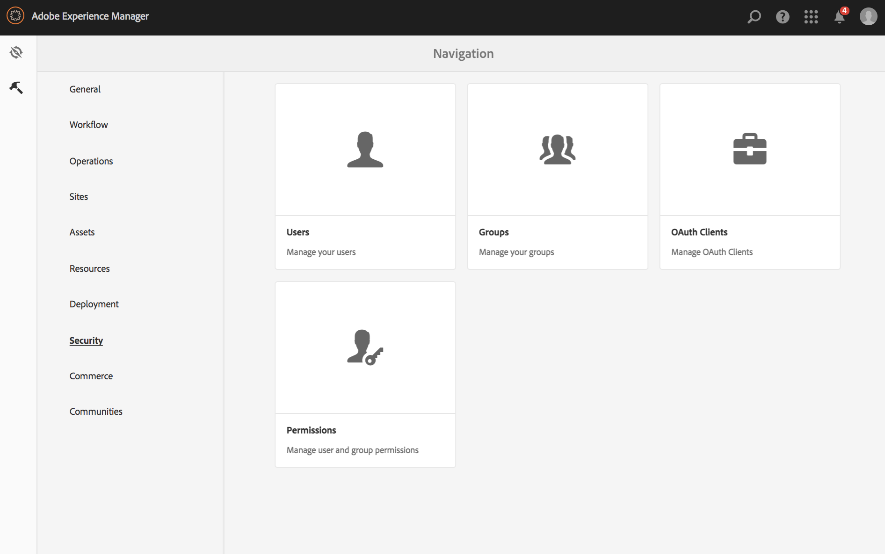
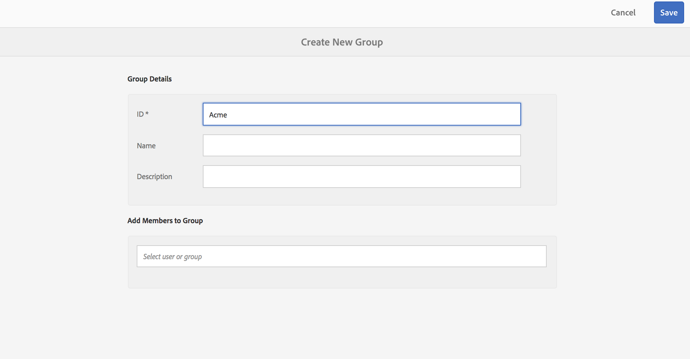
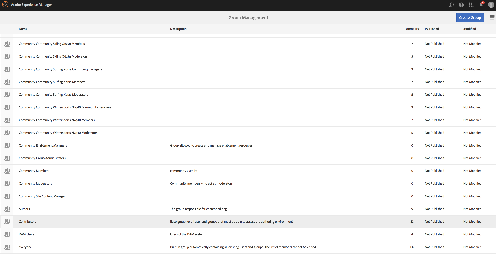
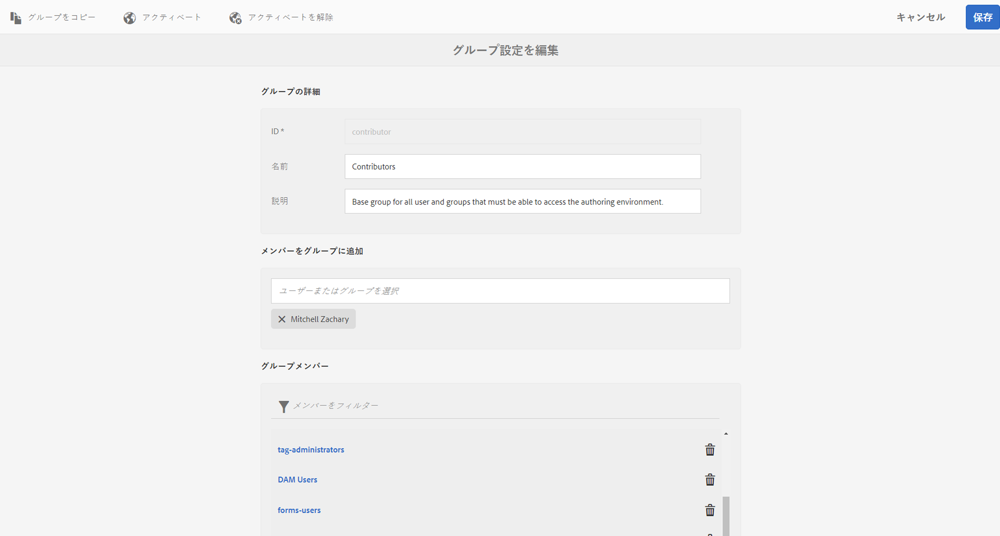
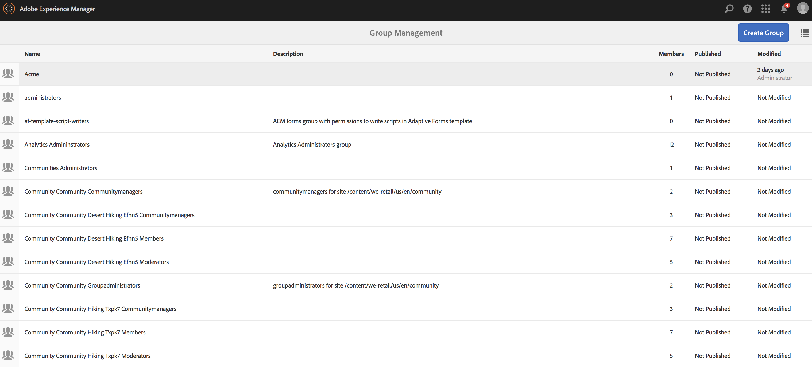
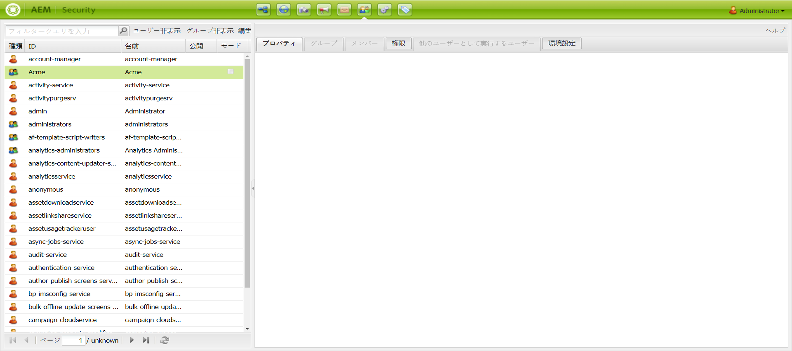

# アクセス制御リスト（ACL）の設定 {#setting-up-acls}

>[!IMPORTANT]
>このコンテンツは、AEM オンプレミス/AMS （AEM 6.5LTSおよびAEM 6.5）に対して有効です。 AEM as a Cloud Service Screensの内容については、[AEM as a Cloud Service ガイド ](https://experienceleague.adobe.com/en/docs/experience-manager-cloud-service/content/screens-as-cloud-service/overview/introduction)を参照してください。

次の節では、アクセス制御リスト（ACL）を使用してプロジェクトを分離し、各ユーザーまたはチームが独自のプロジェクトを処理できるようにする方法について説明します。

AEM 管理者は、プロジェクトのチームメンバーが他のプロジェクトに干渉しないようにする必要があります。 各ユーザーには、プロジェクト要件に応じて特定の役割が割り当てられます。

## 権限の設定 {#setting-up-permissions}

次に、プロジェクト用の ACL の設定手順の概要を示します。

1. AEM にログインして、**ツール**／**セキュリティ**&#x200B;に移動します。

   

1. 「**グループ**」をクリックして、ID（例：Acme）を入力します。

   または、このリンク（`http://localhost:4502/libs/granite/security/content/groupadmin.html`）を使用します。

   次に、「**保存**」をクリックします。

   

1. リストの「**寄稿者**」をクリックし、さらにダブルクリックします。

   

1. **Acme**（作成したプロジェクト）を「**メンバーをグループに追加**」に追加します。 「**保存**」をクリックします。

   

   >[!NOTE]
   >
   >プロジェクトチームメンバーにプレーヤーを登録させる場合（各プレーヤー用のユーザーの作成を伴う）、グループのユーザー管理者を見つけて、ACME グループをユーザー管理者に追加します。

1. **Acme** プロジェクトで作業するすべてのユーザーを **Acme** グループに追加します。

   

1. この `(http://localhost:4502/useradmin)` を使用して、**Acme** グループの権限を設定します。

   **Acme** グループをクリックして、「**権限**」をクリックします。

   

### 権限 {#permissions}

次の表に、プロジェクトレベルの権限のパスを示します。

| **パス** | **権限** | **説明** |
|---|---|---|
| `/apps/<project>` | 読み取り | プロジェクトファイルへのアクセス権を付与します（該当する場合）。 |
| `/content/dam/<project>` | すべて | 画像やビデオなどのプロジェクトアセットを DAM に保存するためのアクセス権を付与します。 |
| `/content/screens/<project>` | すべて | /content/screens の下にある他のすべてのプロジェクトへのアクセス権を削除します。 |
| `/content/screens/svc` | 読み取り | 登録サービスへのアクセス権を付与します。 |
| `/libs/screens` | 読み取り | DCC へのアクセス権を付与します。 |
| `/var/contentsync/content/screens/` | すべて | プロジェクトのオフラインコンテンツを更新できます。 |

>[!NOTE]
>
>場合によっては、作成者機能（アセットの管理やチャネルの作成など）を管理者機能（プレーヤーの登録など）から分離することができます。 このようなシナリオでは、2つのグループを作成し、作成者のグループをコントリビューターに追加し、管理者グループをコントリビューターとユーザー管理者の両方に追加します。

### グループの作成 {#creating-groups}

プロジェクトを作成する場合、基本的な権限が割り当てられたデフォルトのユーザーグループも作成します。 AEM Screens で定義された一般的な役割に権限を拡張します。

例えば、次のプロジェクト専用グループを作成できます。

* Screens プロジェクト管理者
* Screens プロジェクトオペレーター（プレーヤーの登録、場所およびデバイスの管理）
* Screens プロジェクトユーザー（チャネル、スケジュールおよびチャネル割り当ての作業）

次の表に、AEM Screens プロジェクト用のグループの説明および権限を示します。

<table>
 <tbody>
  <tr>
   <td><strong>グループ名</strong></td>
   <td><strong>説明</strong></td>
   <td><strong>権限</strong></td>
  </tr>
  <tr>
   <td>Screens 管理者  <em><code>screens-admins</code></em></td>
   <td>AEM Screens 機能に対する管理者レベルのアクセス</td>
   <td>
    <ul>
     <li>寄稿者のメンバー</li>
     <li>ユーザー管理者のメンバー</li>
     <li>ALL /content/screens</li>
     <li>ALL /content/dam</li>
     <li>ALL /content/experience-fragments</li>
     <li>ALL /etc/design/screens</li>
    </ul> </td>
  </tr>
  <tr>
   <td>Screens ユーザー  <em><code>screens-users</code></em></td>
   <td>AEM Screens でチャネルおよびスケジュールを作成および更新し、場所に割り当てる</td>
   <td>
    <ul>
     <li>寄稿者のメンバー</li>
     <li><code>&lt;project&gt; /content/screens</code></li>
     <li><code>&lt;project&gt; /content/dam</code></li>
     <li><code>&lt;project&gt; /content/experience-fragments</code></li>
    </ul> </td>
  </tr>
  <tr>
   <td>Screens オペレーター  <em><code>screens-operators</code></em></td>
   <td>AEM Screens で場所の構造を作成および更新し、プレーヤーを登録する</td>
   <td>
    <ul>
     <li>寄稿者のメンバー</li>
     <li><code>jcr:all /home/users/screens</code></li>
     <li><code>jcr:all /home/groups/screens</code></li>
     <li><code>&lt;project&gt; /content/screens</code></li>
    </ul> </td>
  </tr>
  <tr>
   <td>Screens Player  <em><code>screens-&lt;project&gt;-devices</code></em></td>
   <td>すべてのプレーヤーとすべてのプレーヤー／デバイスは自動的に寄稿者のメンバーになります。</td>
   <td>
 寄稿者のメンバー
 </td>
  </tr>
 </tbody>
</table>
