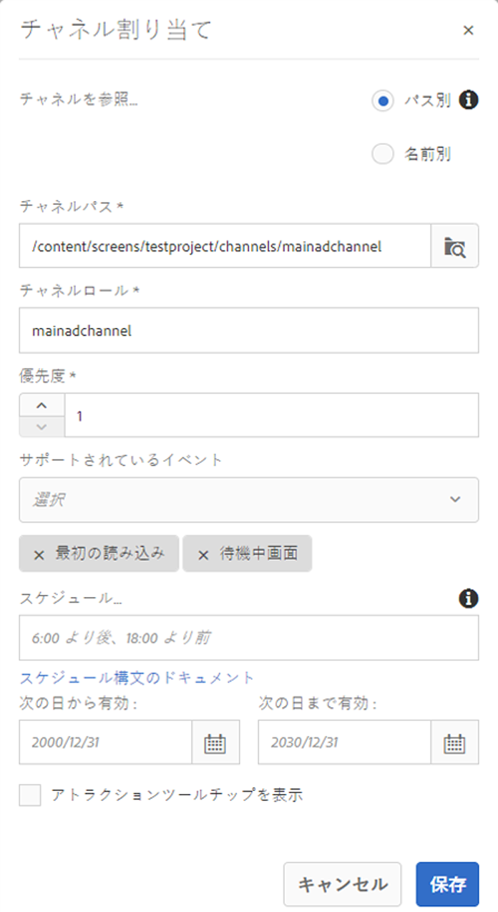
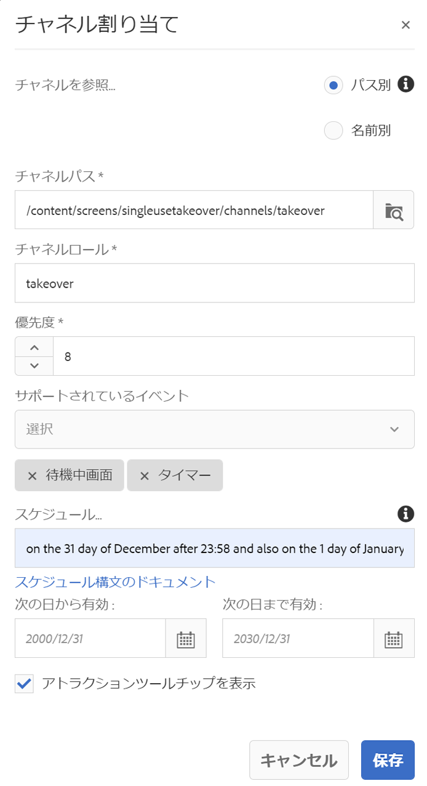
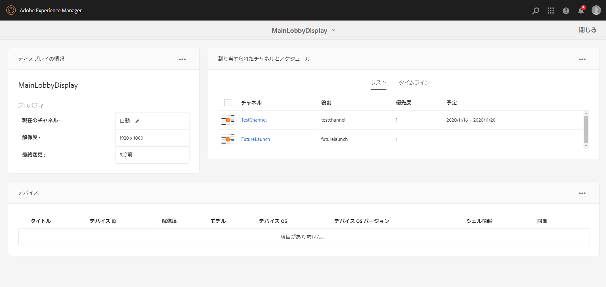

# 単一使用テイクオーバーチャネル {#single-use-takeover-channel}

以下では、特定の時間帯に 1 回だけ再生される単一使用テイクオーバーチャネルを作成するプロジェクトのセットアップに重点を置いた使用例を示します。

## 使用例の説明 {#use-case-description}

この使用例では、ディスプレイまたはディスプレイグループの通常再生チャネルの後を&#x200B;*引き継ぐ*&#x200B;チャネルを作成する方法を説明します。引き継ぎ（テイクオーバー）は、特定の時間帯に 1 回だけおこなわれます。例えば、金曜日の午前 9 時から午前 10 時まで再生される単一使用テイクオーバーチャネルがあるとしましょう。この時間帯に他のチャネルは再生されません。この時間帯の前後で、単一使用テイクオーバーチャネルは再生されません。以下では、12 月 31 日の午前 0 時 00 分の 2 分前から午前 0 時 01 分までコンテンツを再生できる単一使用テイクオーバーチャネルを作成する例を示します。

### 前提条件 {#preconditions}

この使用例を開始する前に、以下の方法を理解しておく必要があります。

* **[チャネルの作成と管理](managing-channels.md)**
* **[ロケーションの作成と管理](managing-locations.md)**
* **[スケジュールの作成と管理](managing-schedules.md)**
* **[デバイスの登録](device-registration.md)**

### 主要なアクター {#primary-actors}

コンテンツ作成者

## プロジェクトのセットアップ {#setting-up-the-project}

次の手順に従って、プロジェクトをセットアップします。

**チャネルとディスプレイのセットアップ**

1. **SingleUseTakeOver** というタイトルの AEM Screens プロジェクトを作成します（下図を参照）。

   

1. **チャネル**&#x200B;フォルダーに **MainAdChannel** を作成します。

   

1. 「**MainAdChannel**」を選択し、アクションバーの「**編集**」をクリックします。いくつかのアセット（画像、ビデオ、埋め込みシーケンス）をチャネルにドラッグ＆ドロップします。

   

   >[!NOTE]
   >この例の **MainAdChannel** は、コンテンツを連続再生するシーケンスチャネルを示します。

   

1. **MainAdChannel** のコンテンツを引き継いで特定の日時にのみ再生する **TakeOver** チャネルを作成します。

1. 「**TakeOver**」を選択し、アクションバーの「**編集**」をクリックします。アセットをいくつかチャネルにドラッグ＆ドロップします。次の例は、このチャネルに追加されたシングルゾーン画像を示しています。

   

1. チャネルのロケーションとディスプレイをセットアップします。例えば、次のロケーション **Lobby** とディスプレイ **MainLobbyDisplay** をこのプロジェクトにセットアップします。

   

**ディスプレイへのチャネルの割り当て**

1. **ロケーション**&#x200B;フォルダーからディスプレイ **MainLobbyDisplay** を選択します。アクションバーの「**チャネルを割り当て**」をクリックします。

   

   >[!NOTE]
   >ディスプレイにチャネルを割り当てる方法については、**[チャネル割り当て](channel-assignment.md)**&#x200B;を参照してください。

1. **チャネル割り当て**&#x200B;ダイアログボックスでフィールド（「**チャネルパス**」、「**優先度**」、「**サポートされているイベント**」）に入力し、「**保存**」をクリックします。これで、**MainAdChannel** がディスプレイに割り当てられました。

   

1. **ロケーション**&#x200B;フォルダーからディスプレイ **TakeOver** を選択します。アクションバーの「**チャネルを割り当て**」をクリックして、単一使用テイクオーバーチャネルを割り当てます。

1. スケジュールを指定して **TakeOver** チャネルをディスプレイに割り当てるには、**チャネル割り当て**&#x200B;ダイアログボックスで以下のフィールドに入力し、「**保存**」をクリックします。

   * **チャネルパス**：TakeOver チャネルへのパスを選択します。
   * **優先度**：このチャネルの優先度を **MainAdChannel** よりも大きく設定します。例えば、この例で設定される優先度は 8 です。

      >[!NOTE]
      >通常再生チャネルの優先度よりも高い値であれば、何でも優先度に設定できます。
   * **サポートされているイベント**：「**待機中画面**」と「**タイマー**」を選択します。
   * **スケジュール**：このチャネルでディスプレイを実行するスケジュールのテキストを入力します。例えば、この例で指定したテキストでは、12 月 31 日の午前 0 時 00 分の 2 分前から午前 0 時 01 分までコンテンツを再生できます。
この例では、「**スケジュール**」に「*12 月 31 日の 23:58 より後、1 月 1 日の 00:01 より前*」というテキストを入力します。

      

      **SingleUseTakeOver**／**Locations**／**Lobby**／**MainLobbyDisplay** でディスプレイに移動し、アクションバーの「**ダッシュボード**」をクリックすると、割り当てたチャネルとその優先度が表示されます（下図を参照）。

      >[!NOTE]
      >テイクオーバーチャネルの優先度を最も高く設定する必要があります。

      

>[!NOTE]
>
>単一使用テイクオーバーチャネルは、再生後に削除することをお勧めします。
