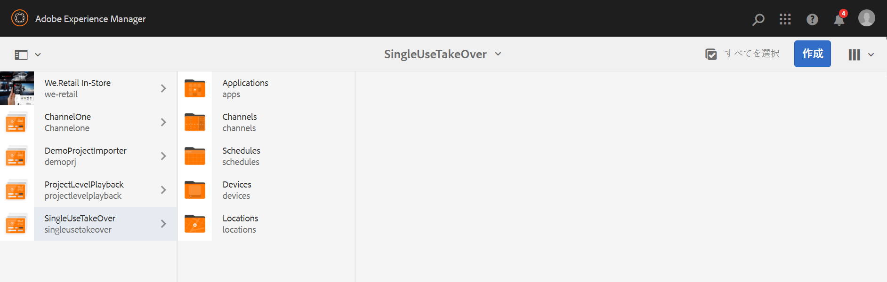

# 単一使用テイクオーバーチャネル {#single-use-takeover-channel}

以下では、特定の時間に 1 回再生される単一のテイクオーバーチャネルを作成するプロジェクトのセットアップに重点を置いた使用例を示します。

## 使用例の説明 {#use-case-description}

このユースケースでは、次の条件を満たすチャネルの作成方法を説明します *引き継ぐ* ディスプレイまたはディスプレイのグループの通常再生チャネルから。 テイクオーバーは、特定の時間に 1 回だけ発生します。

例えば、金曜日の午前 9:00～午前 10:00 に再生される単一のテイクオーバーチャネルがあります。この間、他のチャネルは再生されません。 この前後で、単一使用テイクオーバーチャネルは再生されません。 次の例では、12 月 31 日午前 12 時 00 分より前の 2 分間、午前 12 時 1 分までコンテンツを再生できる単一のテイクオーバーチャネルを作成する方法を示します。

### 前提条件 {#preconditions}

この使用例を開始する前に、以下の方法を理解しておく必要があります。

* **[チャネルの作成と管理](managing-channels.md)**
* **[ロケーションの作成と管理](managing-locations.md)**
* **[スケジュールの作成と管理](managing-schedules.md)**
* **[デバイスの登録](device-registration.md)**

### 主要なアクター {#primary-actors}

コンテンツ作成者

## プロジェクトのセットアップ {#setting-up-the-project}

次の手順に従って、プロジェクトをセットアップします。

**チャネルとディスプレイのセットアップ**

1. **SingleUseTakeOver** というタイトルの AEM Screens プロジェクトを作成します（下図を参照）。

   

1. **チャネル**&#x200B;フォルダーに **MainAdChannel** を作成します。

   

1. 「」を選択します **MainAdChannel** を選択して、 **編集** アクションバーから。 いくつかのアセット（画像、ビデオ、埋め込みシーケンス）をチャネルにドラッグ＆ドロップします。

   

   >[!NOTE]
   >この例の **MainAdChannel** は、コンテンツを連続再生するシーケンスチャネルを示します。

   

1. を作成 **引き継ぐ** のコンテンツを引き継ぐチャネル **MainAdChannel** 特定の日時にのみ再生されます。

1. 「」を選択します **引き継ぐ** を選択して、 **編集** アクションバーから。 アセットをいくつかチャネルにドラッグ＆ドロップします。次の例は、このチャネルに追加されたシングルゾーン画像を示しています。

   

1. チャネルのロケーションとディスプレイをセットアップします。例えば、次のようになります。 **ロビー** 場所と  **MainLobbyDisplay** このプロジェクトの表示が設定されています。

   

**ディスプレイへのチャネルの割り当て**

1. **ロケーション**&#x200B;フォルダーからディスプレイ **MainLobbyDisplay** を選択します。を選択 **チャネルを割り当て** アクションバーから。

   

   >[!NOTE]
   >ディスプレイにチャネルを割り当てる方法については、を参照してください **[チャネル割り当て](channel-assignment.md)**.

1. フィールドに値を入力します（**チャネルパス**, **優先度**、および **サポートされるイベント**）から **チャネル割り当て** ダイアログボックスで「」を選択します。 **保存**. これで、**MainAdChannel** がディスプレイに割り当てられました。

   

1. **ロケーション**&#x200B;フォルダーからディスプレイ **TakeOver** を選択します。を選択 **チャネルを割り当て** アクションバーから、単一使用テイクオーバーチャネルを割り当てることができます。

1. を割り当てる **引き継ぐ** スケジュールされた時刻にディスプレイにチャネルして、から次のフィールドに入力します **チャネル割り当て** ダイアログボックスで「」を選択します。 **保存**:

   * **チャネルパス**：TakeOver チャネルへのパスを選択します。
   * **優先度**：このチャネルの優先度を **MainAdChannel** よりも大きく設定します。例えば、この例で設定される優先度は 8 です。

     >[!NOTE]
     >優先度は、通常再生チャネルの優先度値より大きい任意の値にすることができます。
   * **サポートされているイベント**：「**待機中画面**」と「**タイマー**」を選択します。
   * **スケジュール**：このチャネルでディスプレイを実行するスケジュールのテキストを入力します。例えば、このテキストでは、12 月 31 日午前 12 時 00 分より 2 分前の午前 12 時 01 分までコンテンツを再生できます。内のテキスト **スケジュール** この例で取り上げる内容は次のとおりです。 *12 月 31 日 23:58 以降、1 月 1 日 00.01 前*.

     

     からディスプレイに移動します **SingleUseTakeOver** > **場所** > **ロビー** > **MainLobbyDisplay** を選択して、 **Dashboard** アクションバーの「」をクリックして、割り当てられたチャネルを優先度と共に表示します（下図を参照）。

     >[!NOTE]
     >テイクオーバーチャネルの優先度を最も高く設定する必要があります。

     

>[!NOTE]
>
>単一使用テイクオーバーチャネルは、再生後に削除することをお勧めします。
