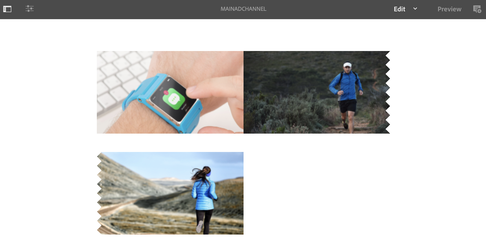

# 単一使用のテイクオーバーチャネル {#single-use-takeover-channel}

次のページでは、特定の時間に1回だけ再生される単一のテイクオーバーチャネルの作成方法に関するプロジェクトの設定を強調する使用例を示します。

## 使用例の説明 {#use-case-description}

この使用例は、ディスプレイまたはディスプレイのグループに対し *て通常再生する* チャネルを引き継ぐチャネルを作成する方法を説明します。 テイクオーバーは、特定の時間に1回だけ発生します。
例えば、金曜日の午前9時から午前10時に再生される単一のテイクオーバーチャネルがあります。 この間、他のチャネルは再生されません。 この時間の前後で、Single Use Takeoverチャネルは再生されません。 次の例は、12月31日午前12時1分まで、コンテンツを2分間再生できるようにするテイクオーバーチャネルを1つ作成した例です。

### 前提条件 {#preconditions}

この使用例を開始する前に、以下をおこなう方法を理解しておく必要があります。

* **[チャネルの作成と管理](managing-channels.md)**
* **[ロケーションの作成と管理](managing-locations.md)**
* **[スケジュールの作成と管理](managing-schedules.md)**
* **[デバイスの登録](device-registration.md)**

### 主要なアクター {#primary-actors}

コンテンツ作成者

## Setting up the Project {#setting-up-the-project}

次の手順に従って、プロジェクトを設定します。

**チャネルと表示の設定**

1. Create an AEM Screens Project titled as **SingleUseTakeOver**, as shown below.

   

1. Channelsフォルダ **ーに** MainAdChannelを **作成します** 。

   

1. Select the **MainAdChannel** and click **Edit** from the action bar. 一部のアセット（画像、ビデオ、埋め込みシーケンス）をチャンネルにドラッグ&amp;ドロップします。

   

   >[!NOTE]
   >この例 **のMainAdChannelは** 、コンテンツを連続再生するシーケンスチャネルを示します。

   

1. MainAdChannel内のコン **テンツを引き継ぎ****** 、特定の日時のみ再生するTakeOverチャネルを作成します。

1. Select the the **TakeOver** and click **Edit** from the action bar. 一部のアセットをチャネルにドラッグ&amp;ドロップします。 次の例は、このチャネルに追加された1つのゾーンイメージを示しています。

   

1. チャネルの場所と表示を設定します。 例えば、次の場所Lobby **とdisplay mainLobbyDisplayがこのプロ** ジェクトに設定されます **** 。

   

**ディスプレイへのチャネルの割り当て**

1. 場所フォルダーか **ら表示MainLobbyDisplay** を選 **択します** 。 Click **Assign Channel** from the action bar.

   

   >[!NOTE]
   >ディスプレイにチャネルを割り当てる方法については、「チャネルの割り当て」を参 **[照してくださ](channel-assignment.md)**い。

1. 「チャネル割り当て」ダイアログボックスと「保存」「保存」「保存」「保存」「イベ&#x200B;**ント」の各フィールド(** Channel Path ****、Priority **、** Supported Events ********)に、「チャネルパス」、「優先度」、「サポートされているイベント」の各フィールドを設定します。 これで、MainAdChannelがディスプレイに割り当 **てられ** ました。

   

1. 場所フォルダーから **表示「TakeOver** 」を **選択します** 。 アクショ **ンバーで** [チャネルの割り当て]をクリックして、単一使用テイクオーバーチャネルを割り当てます。

1. スケジュールされ **た時刻にTakeOver** チャネルをディスプレイに割り当て、 **Channel Assignment** （チャネルの割り当て）ダイアログボックスから次のフィールドに入力し、「 **Save（保存）」をクリックします**。

   * **チャネルパス**:TakeOverチャネルへのパスを選択
   * **優先度**:このチャネルの優先順位をMainAdChannelよりも大きく設定 **します**。 例えば、この例で設定される優先順位は8です。
   * **サポートされるイベント**:「アイドル画 **面** 」と「タイマー」 **を選択します**。
   * **スケジュール**:このチャネルで表示を実行するスケジュールのテキストを入力します。 例えば、ここのテキストでは、12月31日の午前12時の2分前から午前12時1分までコンテンツを再生できます。
この例で示し **た** Scheduleのテキストは、12月31日の23:58の後、および1月1日の00.01の前の日付です **。

      

      >[!NOTE]
      >様々な使用例のスケジュールを指定できます。 詳細は、「永続的な使用例」を参照してください。