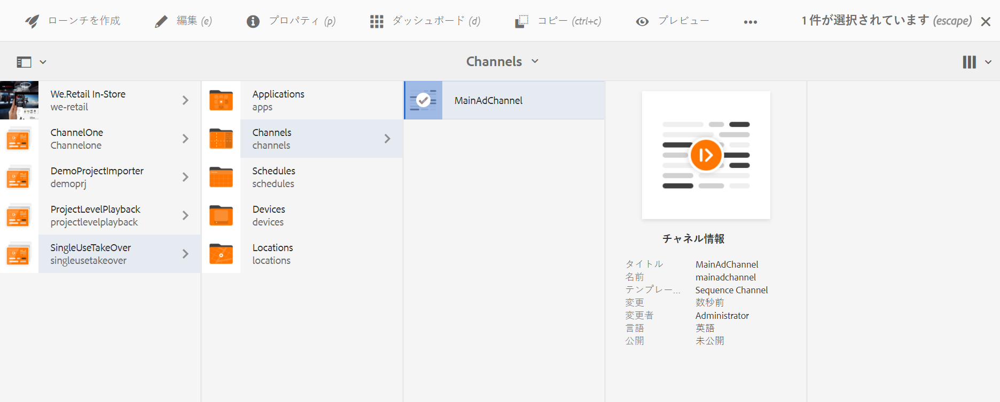

# 単一使用テイクオーバーチャネル {#single-use-takeover-channel}

以下では、特定の時間に 1 回再生される単一使用テイクオーバーチャネルを作成するプロジェクトのセットアップに重点を置いた使用例を示します。

## 使用例の説明 {#use-case-description}

この使用例では、 *引き継ぐ* ディスプレイまたはディスプレイのグループの通常の再生チャネルから。 引き継ぎ（テイクオーバー）は、特定の時間に 1 回だけおこなわれます。

例えば、金曜日の午前 9 時から午前 10 時まで再生される単一使用テイクオーバーチャネルがあるとします。この間、他のチャネルは再生されません。 この時間の前後で、単一使用テイクオーバーチャネルは再生されません。 次の例では、12 月 31 日の午前 0 時 00 分の 2 分前から午前 0 時 01 分までコンテンツを再生できる単一テイクオーバーチャネルを作成します。

### 前提条件 {#preconditions}

この使用例を開始する前に、以下の方法を理解しておく必要があります。

* **[チャネルの作成と管理](managing-channels.md)**
* **[ロケーションの作成と管理](managing-locations.md)**
* **[スケジュールの作成と管理](managing-schedules.md)**
* **[デバイスの登録](device-registration.md)**

### 主要なアクター {#primary-actors}

コンテンツ作成者

## プロジェクトのセットアップ {#setting-up-the-project}

次の手順に従って、プロジェクトをセットアップします。

**チャネルとディスプレイのセットアップ**

1. **SingleUseTakeOver** というタイトルの AEM Screens プロジェクトを作成します（下図を参照）。

   

1. **チャネル**&#x200B;フォルダーに **MainAdChannel** を作成します。

   

1. 「**MainAdChannel**」を選択し、アクションバーの「**編集**」をクリックします。いくつかのアセット（画像、ビデオ、埋め込みシーケンス）をチャネルにドラッグ＆ドロップします。

   

   >[!NOTE]
   >この例の **MainAdChannel** は、コンテンツを連続再生するシーケンスチャネルを示します。

   

1. の作成 **TakeOver** 内のコンテンツを引き継ぐチャネル **MainAdChannel** とは、特定の日時にのみ再生します。

1. を選択します。 **TakeOver** をクリックします。 **編集** をクリックします。 アセットをいくつかチャネルにドラッグ＆ドロップします。次の例は、このチャネルに追加されたシングルゾーン画像を示しています。

   

1. チャネルのロケーションとディスプレイをセットアップします。例えば、次のような場合です。 **ロビー** 場所と  **MainLobbyDisplay** このプロジェクトには表示が設定されています。

   

**ディスプレイへのチャネルの割り当て**

1. **ロケーション**&#x200B;フォルダーからディスプレイ **MainLobbyDisplay** を選択します。アクションバーの「**チャネルを割り当て**」をクリックします。

   

   >[!NOTE]
   >ディスプレイにチャネルを割り当てる方法については、**[チャネル割り当て](channel-assignment.md)**&#x200B;を参照してください。

1. **チャネル割り当て**&#x200B;ダイアログボックスでフィールド（「**チャネルパス**」、「**優先度**」、「**サポートされているイベント**」）に入力し、「**保存**」をクリックします。これで、**MainAdChannel** がディスプレイに割り当てられました。

   

1. **ロケーション**&#x200B;フォルダーからディスプレイ **TakeOver** を選択します。クリック **チャネルを割り当て** アクションバーから、単一使用テイクオーバーチャネルを割り当てることができます。

1. 割り当て **TakeOver** スケジュールされた時刻にディスプレイにチャネルを追加し、 **チャネル割り当て** ダイアログボックスを開き、 **保存**:

   * **チャネルパス**：TakeOver チャネルへのパスを選択します。
   * **優先度**：このチャネルの優先度を **MainAdChannel** よりも大きく設定します。例えば、この例で設定される優先度は 8 です。

     >[!NOTE]
     >優先度は、通常の再生チャネルの優先度の値より高い任意の値に設定できます。
   * **サポートされているイベント**：「**待機中画面**」と「**タイマー**」を選択します。
   * **スケジュール**：このチャネルでディスプレイを実行するスケジュールのテキストを入力します。例えば、この例のテキストでは、12 月 31 日の午前 0 時 00 分の 2 分前から午前 0 時 01 分までコンテンツを再生できます。 **スケジュール** この例では、 *12 月 31 日の 23:58 より後、1 月 1 日の 00:01 より前*.

     

     次の場所からディスプレイに移動します。 **SingleUseTakeOver** > **場所** > **ロビー** > **MainLobbyDisplay** をクリックします。 **ダッシュボード** をアクションバーから開き、割り当てられたチャネルとその優先度を表示できます（下図を参照）。

     >[!NOTE]
     >テイクオーバーチャネルの優先度を最も高く設定する必要があります。

     

>[!NOTE]
>
>単一使用テイクオーバーチャネルは、再生後に削除することをお勧めします。
