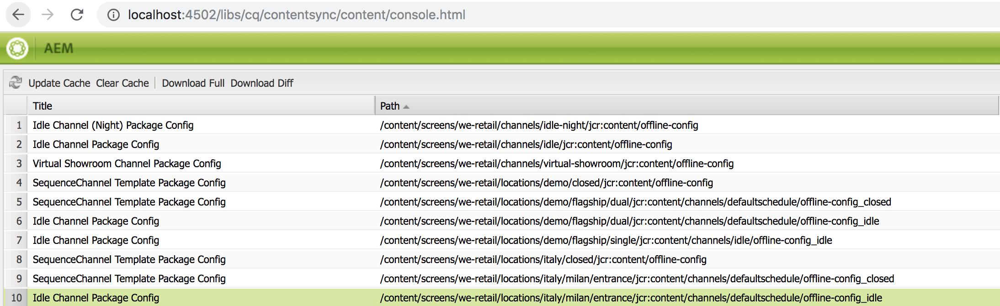
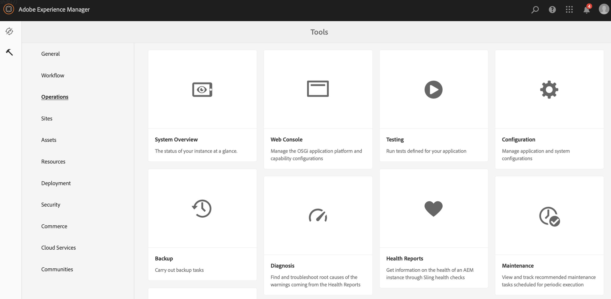

# コンテンツ同期からスマート同期への移行 {#transitioning-from-contentsync-to-smartsync}

この節では、スマート同期機能の概要と、スマート同期でサーバー負荷／ストレージとネットワークトラフィックを最小限に抑えてコストを削減する方法について説明します。

## 概要 {#overview}

スマート同期は、AEM Screens で使用される最新のメカニズムです。 これは、オフラインチャネルのキャッシングとプレイヤーへの配信に現在使用されている方法の代わりになります。

サーバー側とクライアント側の両方で実行されます。

**サーバー側の場合**

* チャネルのコンテンツ（アセットなど）は、*`/var/contentsync`* にキャッシュされます。
* キャッシュは、ディスプレイに使用可能なコンテンツを記述するマニフェストにより、プレーヤーに公開されます。

**クライアントサイドの場合**

* プレーヤーは、上記で生成されたマニフェストに基づいてコンテンツを更新します。

### スマート同期を使用するメリット {#benefits-of-using-smartsync}

スマート同期機能は、AEM Screens プロジェクトに次のようないくつかのメリットをもたらします。

* ネットワークトラフィックとサーバー側のストレージ要件が大幅に削減されます。
* アセットが見つからないか変更された場合にのみ、プレーヤーがアセットをインテリジェントにダウンロードします。
* サーバー側およびクライアント側のストレージが最適化されます。

>[!NOTE]
>
>Adobeでは、AEM Screens プロジェクトにSmartSyncを使用することをお勧めします。

## コンテンツ同期からスマート同期への移行 {#migrating-from-contentsync-to-smartsync}

>[!NOTE]
>
>AEM 6.3 機能パック 5 や AEM 6.4 機能パック 3 を既にインストールしてある場合は、アセットのスマート同期を有効にして、ディスク領域の使用量を削減することができます。 スマート同期を有効にするには、以下の手順に従ってコンテンツ同期からスマート同期に移行し、スマート同期を有効にします。
>
>スマート同期は、AEM 6.4.3 機能パック 3 に対応するサーバーの場合に、Screens Player で使用できます。
>
>最新のプレーヤーをダウンロードするには、[AEM Screens Player のダウンロード](https://download.macromedia.com/screens/)を参照してください。 各プラットフォームに最低限必要なプレーヤーバージョンを次の表に示します。

| **プラットフォーム** | **サポートされているプレーヤーの最小バージョン** |
|---|---|
| Android™ | 3.3.72 |
| Chrome OS | 1.0.136 |
| Windows | 1.0.136 |

コンテンツ同期からスマート同期に移行するには、以下の手順に従います。

1. コンテンツ同期からスマート同期に移行する場合は、スマート同期を有効にする前にコンテンツ同期キャッシュをクリアする必要があります。

   次の図に示すように、リンク ***https://localhost:4502/libs/cq/contentsync/content/console.html***&#x200B;を使用してインスタンスからContentSync コンソールに移動し、**キャッシュをクリア**&#x200B;をクリックします。

   

   >[!CAUTION]
   >
   >スマート同期の使用を開始する前に、コンテンツキャッシュをすべてクリアする必要があります。

1. AEM インスタンス／ハンマーアイコン／**操作**／**Web コンソール**&#x200B;を使用して、**Adobe Experience Manager web コンソール設定**&#x200B;に移動します。

   

1. **Adobe Experience Manager Web コンソール設定**&#x200B;が開きます。 「*offlinecontentservice*」を検索します。

   「**Screens Offline コンテンツサービス**」プロパティを検索するには、**Command + F** キー（**Mac**）または **Ctrl + F** キー（**Windows**）を押します。

   

1. 「**保存**」をクリックして、「**Screens Offline コンテンツサービス**」プロパティを有効にします。こうして、AEM Screens でスマート同期を使用します。
1. スマート同期を有効にしたら、プロジェクトに移動し、*（アクションバーの）*「**オフラインコンテンツを更新**」をクリックします（下図を参照）。

   
