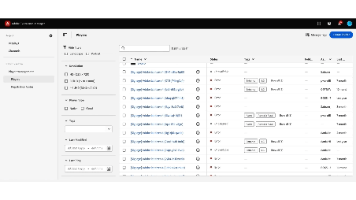

# Screens Cloud でのタグ付け {#tagging-on-Screens-Cloud}

>[!CAUTION]
>
>**タグ付け**&#x200B;機能は、テナントに対して有効になっている場合にのみ使用できます。有効にするには、AEM Screens エンジニアリングにお問い合わせください。

## はじめに {#introduction}

ユーザーは Screens Cloud でタグを作成し、これを使用してディスプレイとプレーヤーを分類できます。

## ポリシーの作成と管理 {#create-and-manage-tags}

。

同じアクションメニューを使用して、タグの名前を変更したり、タグを削除したりします。

>[!NOTE]
> 
> 1 つのテナントに対して合計 500 個のタグを使用できます

## タグ割り当ての管理 {#manage-tags-assignments}

作成したタグをディスプレイとプレーヤーで使用します。

。

>[!NOTE]
> 
> ディスプレイまたはプレーヤーは、最大 100 個のタグを持つことができます。
> 1 回の操作でタグ付けできる項目は最大 30 個です。

## タグによるフィルタリング {#filter-by-tags}

タグを選択して、ディスプレイまたはプレーヤーのリストをフィルタリングします。

。

>[!NOTE]
> 
> Screens Cloud で定義されたタグは、AEM で定義されたタグと関連付けられず、同期されません。
> 
