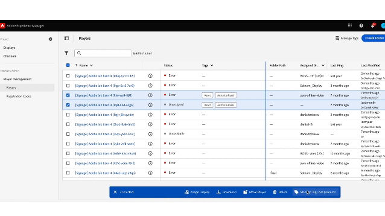
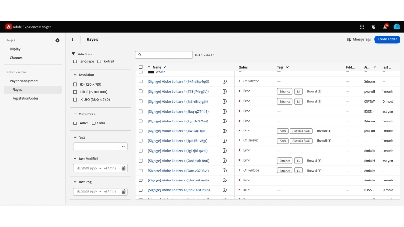

# Screens Cloud でのタグ付け {#tagging-on-Screens-Cloud}

>[!IMPORTANT]
>このコンテンツは、AEM オンプレミス/AMS （AEM 6.5LTSおよびAEM 6.5）に対して有効です。 AEM as a Cloud Service Screensの内容については、[AEM as a Cloud Service ガイド &#x200B;](https://experienceleague.adobe.com/en/docs/experience-manager-cloud-service/content/screens-as-cloud-service/overview/introduction)を参照してください。

>[!CAUTION]
>
>**タグ付け**&#x200B;機能は、テナントに対して有効になっている場合にのみ使用できます。 AEM Screens Engineeringに連絡して有効にします。

## はじめに {#introduction}

ユーザーは Screens Cloud でタグを作成し、これを使用してディスプレイとプレーヤーを分類できます。

## ポリシーの作成と管理 {#create-and-manage-tags}

。

同じアクションメニューを使用して、タグの名前を変更したり、タグを削除したりします。

>[!NOTE]
> 
> 1 つのテナントに対して合計 500 個のタグを使用できます

## タグ割り当ての管理 {#manage-tags-assignments}

ディスプレイとプレーヤーで作成したタグを使用します。

。

>[!NOTE]
>
> ディスプレイまたはプレーヤーには、最大30個のタグを割り当てることができます。一度にタグ付けできるアイテムは最大30個です。

## タグによるフィルタリング {#filter-by-tags}

タグを選択して、ディスプレイまたはプレーヤーのリストをフィルタリングします。

。

>[!NOTE]
> 
> Screens Cloud で定義されたタグは、AEM で定義されたタグと関連付けられず、同期されません。
> 

